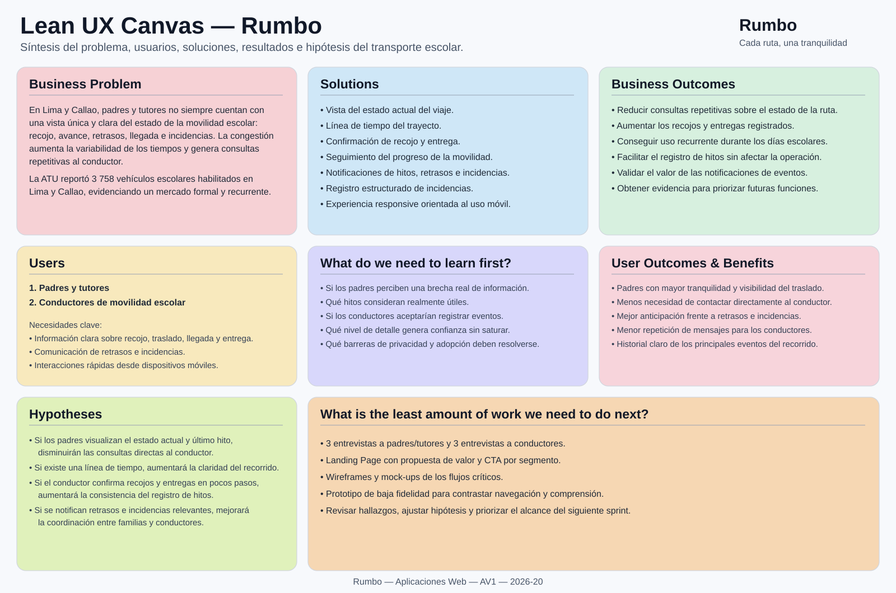

# UNIVERSIDAD PERUANA DE CIENCIAS APLICADAS

### Ingeniería de Software

### Ciclo Académico: 2026-20

### Código: 1ASI0730

### Curso: Aplicaciones Web

### NRC: 8137

### Docente: Hugo Allan Mori Paiva

# Informe de Trabajo Final

### Startup: Rumbo

### Producto: Rumbo

### Integrantes

| Apellidos y Nombres | Código de Alumno |
|---|---|
| Barrientos Quispe, Marcelo | U20221e646 |
| Díaz Ramírez, Alejandro | U202423084 |
| Geronimo Puma, Kevin Joel | U202423163 |
| Lino Quispe, Leonardo Miguel | U202422298 |
| Meza Soza, Alexandra Yamile | U20241b451 |

### SEPTIEMBRE - 2026

---

## Registro de Versiones del Informe

| Versión | Fecha | Autor(es) | Descripción de cambios |
|---|---|---|---|
| 0.1 | 07/09/2026 | Lino Quispe, Leonardo Miguel | Creación de la estructura base del informe de Rumbo. |
| 0.2 | 11/09/2026 | Equipo Rumbo | Actualización de integrantes y refinamiento del Capítulo I para AV1. |

---

## Project Report Collaboration Insights

**Organización:** https://github.com/AIpaca-UPC  
**Project Report:** https://github.com/AIpaca-UPC/web-applications-project-report  
**Landing Page:** https://github.com/AIpaca-UPC/landing-page  
**Frontend Web Application:** https://github.com/AIpaca-UPC/web-applications-web-app  
**Web Service:** https://github.com/AIpaca-UPC/web-applications-web-service

### AV1

**Team Collaboration Commits**  
[Insertar captura]

**Team Collaboration Network**  
[Insertar captura]

**Contributors / Pull Requests**  
[Insertar capturas]

---

# Contenido

## Tabla de Contenidos

- [Student Outcome](#student-outcome)
- [Capítulo I: Introducción](#capítulo-i-introducción)
  - [1.1. Startup Profile](#11-startup-profile)
    - [1.1.1. Descripción de la Startup](#111-descripción-de-la-startup)
    - [1.1.2. Perfiles de integrantes del equipo](#112-perfiles-de-integrantes-del-equipo)
  - [1.2. Solution Profile](#12-solution-profile)
    - [1.2.1. Antecedentes y problemática](#121-antecedentes-y-problemática)
    - [1.2.2. Lean UX Process](#122-lean-ux-process)
      - [1.2.2.1. Lean UX Problem Statement](#1221-lean-ux-problem-statement)
      - [1.2.2.2. Lean UX Assumptions](#1222-lean-ux-assumptions)
      - [1.2.2.3. Lean UX Hypothesis Statements](#1223-lean-ux-hypothesis-statements)
      - [1.2.2.4. Lean UX Canvas](#1224-lean-ux-canvas)
  - [1.3. Segmentos objetivo](#13-segmentos-objetivo)
- [Capítulo II: Requirements Elicitation & Analysis](#capítulo-ii-requirements-elicitation--analysis)
  - [2.1. Competidores](#21-competidores)
    - [2.1.1. Análisis competitivo](#211-análisis-competitivo)
    - [2.1.2. Estrategias y tácticas frente a competidores](#212-estrategias-y-tácticas-frente-a-competidores)
  - [2.2. Entrevistas](#22-entrevistas)
    - [2.2.1. Diseño de entrevistas](#221-diseño-de-entrevistas)
    - [2.2.2. Registro de entrevistas](#222-registro-de-entrevistas)
    - [2.2.3. Análisis de entrevistas](#223-análisis-de-entrevistas)
  - [2.3. Needfinding](#23-needfinding)
    - [2.3.1. User Personas](#231-user-personas)
    - [2.3.2. User Task Matrix](#232-user-task-matrix)
    - [2.3.3. User Journey Mapping](#233-user-journey-mapping)
    - [2.3.4. Empathy Mapping](#234-empathy-mapping)
  - [2.4. Big Picture Event Storming](#24-big-picture-event-storming)
  - [2.5. Ubiquitous Language](#25-ubiquitous-language)
- [Capítulo III: Requirements Specification](#capítulo-iii-requirements-specification)
  - [3.1. User Stories](#31-user-stories)
  - [3.2. Impact Mapping](#32-impact-mapping)
  - [3.3. Product Backlog](#33-product-backlog)
- [Capítulo IV: Product Design](#capítulo-iv-product-design)
  - [4.1. Style Guidelines](#41-style-guidelines)
  - [4.2. Information Architecture](#42-information-architecture)
  - [4.3. Landing Page UI Design](#43-landing-page-ui-design)
  - [4.4. Web Applications UX/UI Design](#44-web-applications-uxui-design)
  - [4.5. Web Applications Prototyping](#45-web-applications-prototyping)
  - [4.6. Domain-Driven Software Architecture](#46-domain-driven-software-architecture)
  - [4.7. Software Object-Oriented Design](#47-software-object-oriented-design)
  - [4.8. Database Design](#48-database-design)
- [Capítulo V: Product Implementation, Validation & Deployment](#capítulo-v-product-implementation-validation--deployment)
  - [5.1. Software Configuration Management](#51-software-configuration-management)
  - [5.2. Landing Page, Services & Applications Implementation](#52-landing-page-services--applications-implementation)
- [Conclusiones](#conclusiones)
- [Bibliografía](#bibliografía)
- [Anexos](#anexos)

---

# Student Outcome

El curso contribuye al cumplimiento del **ABET – EAC – Student Outcome 5**: la capacidad de funcionar efectivamente en un equipo cuyos miembros proporcionan liderazgo de manera conjunta, crean un entorno colaborativo e inclusivo, establecen objetivos, planifican tareas y cumplen objetivos.

| Criterio específico | Acciones realizadas | Conclusiones |
|---|---|---|
| Trabaja en equipo para proporcionar liderazgo en forma conjunta. | **[Integrante 1]** — AV1: [acción].   **[Integrante 2]** — AV1: [acción].   **[Integrante 3]** — AV1: [acción].   **[Integrante 4]** — AV1: [acción].   **[Integrante 5]** — AV1: [acción]. | [Conclusión grupal]. |
| Crea un entorno colaborativo e inclusivo, establece metas, planifica tareas y cumple objetivos. | **[Integrante 1]** — AV1: [acción].   **[Integrante 2]** — AV1: [acción].   **[Integrante 3]** — AV1: [acción].   **[Integrante 4]** — AV1: [acción].   **[Integrante 5]** — AV1: [acción]. | [Conclusión grupal]. |

---

# Capítulo I: Introducción

## 1.1. Startup Profile

### 1.1.1. Descripción de la Startup

**Rumbo** es una startup peruana enfocada en mejorar la seguridad, visibilidad y coordinación durante el transporte escolar. La propuesta surge a partir de una situación cotidiana para muchas familias: durante los recorridos pueden presentarse variaciones de horario, congestión, retrasos, cambios en la ruta o incidencias que obligan a padres y conductores a intercambiar información de forma constante.

Rumbo plantea una plataforma web responsive que centraliza los principales eventos del traslado y permite que los padres comprendan rápidamente qué está ocurriendo durante el recorrido. Para los conductores, la plataforma busca reducir la repetición de mensajes individuales y facilitar el registro de hitos como recojos, llegadas, entregas, retrasos e incidencias.

La startup inicia su propuesta en Lima y Callao, donde existe un mercado formal de transporte escolar y una alta disponibilidad de conectividad móvil. Rumbo no reemplaza los mecanismos oficiales de autorización ni las responsabilidades de seguridad del prestador del servicio; busca complementar la experiencia con información estructurada, oportuna y accesible.

### 1.1.2. Perfiles de integrantes del equipo

<table>
  <thead>
    <tr><th>Foto</th><th>Apellidos y nombres</th><th>Código</th><th>Carrera</th><th>Habilidades</th></tr>
  </thead>
  <tbody>
    <tr><td align="center">[Insertar foto]</td><td>Barrientos Quispe, Marcelo</td><td>U20221e646</td><td>Ingeniería de Software</td><td>[Completar perfil]</td></tr>
    <tr><td align="center">[Insertar foto]</td><td>Díaz Ramírez, Alejandro</td><td>U202423084</td><td>Ingeniería de Software</td><td>[Completar perfil]</td></tr>
    <tr><td align="center">[Insertar foto]</td><td>Geronimo Puma, Kevin Joel</td><td>U202423163</td><td>Ingeniería de Software</td><td>[Completar perfil]</td></tr>
    <tr><td align="center"></td><td>Lino Quispe, Leonardo Miguel</td><td>U202422298</td><td>Ingeniería de Software</td><td>Soy estudiante de Ingeniería de Software del 4to ciclo en la UPC. Tengo conocimientos en programación en C++ y Python, y experiencia desarrollando proyectos académicos donde analizo y organizo soluciones tecnológicas. Me gusta enfocarme en aprender de forma práctica y en construir soluciones que sean claras, funcionales y aplicadas a problemas reales.</td></tr>
    <tr><td align="center">[Insertar foto]</td><td>Meza Soza, Alexandra Yamile</td><td>U20241b451</td><td>Ingeniería de Software</td><td>[Completar perfil]</td></tr>
  </tbody>
</table>

## 1.2. Solution Profile

El **Solution Profile** presenta una visión general de la solución propuesta y relaciona el contexto del problema con las necesidades de los segmentos objetivo. Para Rumbo, esta sección permite justificar por qué una solución digital puede aportar valor en el transporte escolar y establece las bases para el proceso Lean UX, la validación con usuarios y el posterior diseño del producto.

### 1.2.1. Antecedentes y problemática

El transporte escolar constituye un servicio formal y regulado en Lima y Callao. En enero de 2026, la Autoridad de Transporte Urbano para Lima y Callao (ATU) informó que **3758 vehículos se encontraban habilitados para prestar el servicio de transporte de estudiantes** y recordó que los padres pueden verificar digitalmente si el vehículo y el conductor están autorizados [1]. Esta cifra confirma que existe un ecosistema amplio de familias, conductores y operadores que realizan traslados escolares de manera recurrente.

El servicio se desarrolla además en una ciudad con altos niveles de congestión. Según el **TomTom Traffic Index 2025**, Lima registró un nivel promedio de congestión de **69,3 %**. Un recorrido de 10 km tomó en promedio **43 min 10 s en la hora punta de la mañana** y **51 min 17 s en la hora punta de la tarde**, mientras que el tiempo perdido por tráfico en horas punta se estimó en **195 horas al año** [2]. Estas condiciones generan variaciones en los horarios de recojo y llegada y hacen más relevante contar con información actualizada sobre el estado de una ruta.

La seguridad vial también forma parte del contexto. El Observatorio Nacional de Seguridad Vial reportó para 2025 **88 243 siniestros de tránsito, 55 329 personas lesionadas y 3428 fallecidas** a nivel nacional [3]. Estas cifras no corresponden exclusivamente a movilidad escolar; se utilizan como contexto para mostrar que cualquier servicio de traslado de personas opera en un entorno donde la prevención, la comunicación y la capacidad de respuesta ante incidencias son importantes.

Desde el punto de vista tecnológico, una experiencia web responsive resulta viable para el mercado objetivo. Durante el cuarto trimestre de 2025, el INEI reportó que **98,4 % de los hogares de Lima Metropolitana contaba con telefonía móvil**, **90,3 % de la población de 6 años a más utilizaba Internet** y **91,0 % de los usuarios de Internet de Lima Metropolitana accedía mediante teléfono celular** [4]. Esto respalda la decisión de diseñar Rumbo con una experiencia priorizada para dispositivos móviles.

A partir de este contexto, Rumbo aborda una necesidad que será contrastada mediante las entrevistas de AV1: **la falta de una vista única, clara y oportuna sobre el estado de la movilidad escolar, sus principales hitos, retrasos e incidencias**. Actualmente, gran parte de esa coordinación puede depender de llamadas o mensajes directos entre padres y conductores.

#### Técnica de las 5 W's + 2 H's

**What (¿Qué?) — ¿Cuál es el problema?**  
Los padres y tutores no siempre cuentan con información centralizada sobre el estado del traslado escolar: si el menor ya fue recogido, si la movilidad está en ruta, si existe un retraso o si ocurrió una incidencia. A su vez, los conductores pueden verse obligados a repetir la misma información a distintas familias.

**When (¿Cuándo?) — ¿Cuándo ocurre?**  
El problema aparece antes del recojo, durante el recorrido y al momento de la llegada o entrega. Se intensifica cuando la congestión altera el horario previsto o cuando ocurre una situación inesperada que necesita ser comunicada con rapidez.

**Where (¿Dónde?) — ¿Dónde surge?**  
Rumbo se plantea inicialmente para Lima y Callao, donde la ATU reportó 3758 vehículos habilitados para transporte escolar [1] y donde las condiciones de congestión generan variabilidad en los tiempos de viaje [2].

**Who (¿Quiénes?) — ¿Quiénes son los afectados?**  
- **Padres y tutores**, que necesitan conocer el estado del traslado de sus hijos o menores a cargo.
- **Conductores de movilidad escolar**, que necesitan gestionar la ruta y comunicar hitos, retrasos e incidencias de forma eficiente.

**Why (¿Por qué?) — ¿Por qué ocurre y por qué importa?**  
- La congestión provoca variaciones entre los horarios programados y los tiempos reales de viaje.
- La comunicación puede depender de mensajes individuales y repetitivos.
- Los padres requieren información clara sin necesidad de contactar continuamente al conductor.
- El conductor necesita registrar eventos de forma rápida y con baja carga operativa.

**How (¿Cómo?) — ¿Cómo se abordará?**  
Rumbo propone una plataforma web responsive con una vista del estado actual del traslado, línea de tiempo del recorrido, confirmaciones de recojo y entrega, registro de retrasos e incidencias y notificaciones de eventos relevantes.

**How much (¿Qué magnitud tiene?)**  
La ATU reportó **3758 vehículos escolares habilitados en Lima y Callao** [1]. Además, Lima registró una congestión promedio de **69,3 % durante 2025**, con aproximadamente **195 horas anuales perdidas en tráfico de hora punta** [2]. Estas cifras permiten dimensionar un mercado concreto y un contexto operativo donde los tiempos de viaje varían de manera significativa.

### 1.2.2. Lean UX Process

El proceso **Lean UX** de Rumbo parte de la definición del problema, continúa con la formulación de supuestos sobre el negocio y los usuarios, y transforma esos supuestos en hipótesis que podrán contrastarse mediante entrevistas y posteriores iteraciones del producto. El objetivo es evitar desarrollar características basadas únicamente en percepciones del equipo y priorizar aquellas que tengan relación directa con necesidades reales de los segmentos.

#### 1.2.2.1. Lean UX Problem Statement

El servicio de movilidad escolar en Lima y Callao opera en un contexto de alta congestión y tiempos variables. Aunque existen mecanismos oficiales para verificar la formalidad de vehículos y conductores, los padres no necesariamente disponen de una experiencia centralizada donde puedan consultar los principales eventos del recorrido.

Hemos observado que esta situación puede generar incertidumbre en padres y tutores y una carga de comunicación repetitiva para los conductores, especialmente cuando existen retrasos, cambios de horario o incidencias. Rumbo busca reducir esa brecha ofreciendo una plataforma donde ambos segmentos puedan acceder a información estructurada sobre el traslado.

**¿Cómo podríamos mejorar la visibilidad y coordinación del transporte escolar para que los padres puedan conocer el estado del traslado y los conductores puedan comunicar los principales eventos de la ruta de forma rápida y ordenada?**

**Domain:** Transporte escolar, seguimiento de recorridos y coordinación digital.  
**Customer Segments:** Padres/tutores y conductores de movilidad escolar.  
**Pain Points:** incertidumbre sobre el estado de la ruta, mensajes repetitivos, retrasos, falta de un historial simple de eventos e incidencias.  
**Gap:** la información relevante del traslado puede estar fragmentada en llamadas, chats y comunicaciones individuales.  
**Vision/Strategy:** convertir a Rumbo en una plataforma de referencia para la coordinación y visibilidad del transporte escolar en Lima y Callao, priorizando simplicidad, confianza y uso móvil.

#### 1.2.2.2. Lean UX Assumptions

##### Business Assumptions
1. Creemos que existe una oportunidad de valor al complementar el servicio de movilidad escolar con información digital estructurada sobre cada ruta.
2. Creemos que los padres utilizarán con mayor frecuencia Rumbo si pueden consultar información relevante sin depender de mensajes individuales.
3. Creemos que los conductores adoptarán la solución si registrar los principales eventos requiere pocos pasos y no interfiere con su trabajo.
4. Creemos que la confianza en Rumbo dependerá de una adecuada gestión de privacidad, permisos y acceso a información del menor.
5. Creemos que Lima y Callao representan un mercado inicial adecuado debido a la existencia de 3758 unidades escolares habilitadas y al alto nivel de conectividad móvil [1][4].

##### User Assumptions
**¿Quién es el usuario?**
- Padres y tutores responsables de menores que utilizan movilidad escolar.
- Conductores que realizan rutas recurrentes de transporte de estudiantes.

**¿Dónde encaja Rumbo en su rutina?**
- Para los padres, como una herramienta de consulta durante el recojo, traslado y llegada.
- Para los conductores, como apoyo para registrar hitos y comunicar eventos relevantes a varias familias.

**¿Qué problemas busca resolver?**
- Incertidumbre sobre el estado actual del traslado.
- Comunicación repetitiva de retrasos y novedades.
- Falta de una secuencia clara de hitos del recorrido.
- Ausencia de un registro simple de incidencias.

**¿Qué características resultan importantes?**
- Estado actual del traslado.
- Línea de tiempo del trayecto.
- Confirmaciones de recojo y entrega.
- Notificaciones de retrasos e incidencias.
- Experiencia responsive, rápida y de fácil lectura.

##### Feature Assumptions
1. Creemos que una **vista del estado actual del viaje** permitirá que los padres comprendan rápidamente en qué etapa se encuentra la ruta.
2. Creemos que una **línea de tiempo del trayecto** permitirá revisar los principales eventos ocurridos durante el servicio.
3. Creemos que la **confirmación de recojo y entrega** permitirá dejar constancia de los hitos más importantes de cada estudiante.
4. Creemos que el **seguimiento del progreso de la movilidad** aumentará la visibilidad general del recorrido.
5. Creemos que un **centro de notificaciones** facilitará comunicar recojos, llegadas, retrasos e incidencias sin saturar a los usuarios.
6. Creemos que un **registro de incidencias** permitirá comunicar situaciones imprevistas con contexto suficiente.

##### User Outcome and Benefit Assumptions
- Los padres podrán conocer en pocos segundos el estado actual del traslado.
- Los padres reducirán la necesidad de contactar al conductor para consultas rutinarias.
- Los padres podrán anticiparse a retrasos y comprender mejor lo ocurrido durante la ruta.
- Los conductores podrán informar a varias familias mediante un único registro de evento.
- Los conductores podrán dejar constancia de recojos, entregas e incidencias de manera ordenada.

##### Business Outcome Assumptions
- Reducir las consultas manuales relacionadas con el estado del traslado.
- Aumentar la proporción de recojos y entregas registrados dentro de Rumbo.
- Conseguir uso recurrente de la plataforma durante los días de servicio escolar.
- Lograr que los conductores registren los principales hitos sin afectar su flujo operativo.
- Obtener evidencia de que los padres consideran útiles las notificaciones relacionadas con el recorrido.

#### 1.2.2.3. Lean UX Hypothesis Statements

**Hipótesis 1 — Estado actual del viaje**  
Creemos que una vista del estado actual reducirá la necesidad de consultas directas al conductor. Sabremos que hemos tenido éxito cuando, durante las validaciones, la mayoría de padres pueda identificar correctamente la etapa del traslado y considere innecesario solicitar esa misma información por otro canal.

**Hipótesis 2 — Línea de tiempo del trayecto**  
Creemos que una línea de tiempo mejorará la comprensión de los eventos ocurridos durante el recorrido. Sabremos que hemos tenido éxito cuando los padres puedan reconstruir los principales hitos sin ayuda adicional.

**Hipótesis 3 — Confirmación de recojo y entrega**  
Creemos que permitir confirmaciones rápidas aumentará la consistencia con la que los conductores registran los hitos principales. Sabremos que hemos tenido éxito cuando los conductores puedan completar la acción en pocos pasos y la consideren compatible con su rutina.

**Hipótesis 4 — Seguimiento del progreso**  
Creemos que mostrar el progreso de la movilidad aumentará la visibilidad del recorrido para los padres. Sabremos que hemos tenido éxito cuando los usuarios puedan interpretar el avance general de la ruta sin depender de mensajes externos.

**Hipótesis 5 — Notificaciones**  
Creemos que las notificaciones de eventos relevantes mejorarán la coordinación. Sabremos que hemos tenido éxito cuando los padres indiquen que los avisos de recojo, llegada, retraso e incidencia les resultan útiles y no excesivos.

**Hipótesis 6 — Registro de incidencias**  
Creemos que un registro estructurado de incidencias permitirá comunicar situaciones inesperadas con mayor claridad. Sabremos que hemos tenido éxito cuando los conductores puedan registrar un evento y los padres comprendan qué ocurrió sin requerir información adicional inmediata.

#### 1.2.2.4. Lean UX Canvas

El **Lean UX Canvas** sintetiza el problema de negocio, los segmentos objetivo, las soluciones preliminares, los resultados esperados y los principales aprendizajes que Rumbo necesita validar antes de ampliar el alcance del producto.

## 1.3. Segmentos objetivo

En esta sección se identifican y describen los **segmentos de usuarios** hacia los cuales se dirige Rumbo. Estos segmentos servirán como referencia para el diseño de funcionalidades, la experiencia de usuario, las entrevistas de Needfinding y la comunicación del producto.

### Padres y tutores

**Descripción:**  
Padres, madres o tutores responsables de menores que utilizan servicios de movilidad escolar en Lima y Callao. Este segmento busca disminuir la incertidumbre durante los recorridos y acceder a información clara sobre recojo, traslado, retrasos, llegada e incidencias.

**Características demográficas y comportamiento:**
- Adultos responsables de menores en edad escolar que contratan o utilizan servicios de movilidad escolar.
- Utilizan principalmente el teléfono móvil para comunicarse y consultar información cotidiana.
- Valoran la inmediatez, claridad y facilidad de uso por encima de interfaces complejas.
- Requieren información relevante, pero no necesariamente una secuencia continua de mensajes.
- La confianza en la plataforma depende de la privacidad y del control sobre quién puede consultar información del menor.

**Sustento estadístico:**
- La ATU reportó **3758 vehículos habilitados para transporte escolar en Lima y Callao** en enero de 2026, evidenciando un mercado formal y recurrente de familias usuarias del servicio [1].
- El INEI informó que **98,4 % de los hogares de Lima Metropolitana contaba con telefonía móvil**, **90,3 % de la población de 6 años a más utilizaba Internet** y **91,0 % de los usuarios de Internet accedía mediante celular** durante el cuarto trimestre de 2025 [4]. Esto respalda una experiencia web orientada principalmente al uso móvil.

### Conductores de movilidad escolar

**Descripción:**  
Conductores que realizan rutas programadas para el traslado de estudiantes entre hogares, puntos de recojo y centros educativos. Este segmento necesita organizar el recorrido y comunicar a las familias los principales eventos de la ruta de forma rápida y consistente.

**Características demográficas y comportamiento:**
- Prestadores de un servicio regulado que operan vehículos autorizados para transporte de estudiantes.
- Trabajan con rutas, horarios, puntos de recojo y varios estudiantes durante una misma jornada.
- Necesitan reducir acciones digitales mientras conducen, por lo que las interacciones deben ser breves y ejecutarse únicamente cuando sea seguro hacerlo.
- Requieren comunicar retrasos, incidencias, recojos y entregas sin repetir la misma información individualmente.
- Valoran herramientas que simplifiquen la coordinación sin reemplazar sus responsabilidades operativas y de seguridad.

**Sustento estadístico:**
- La ATU reportó **3758 vehículos escolares habilitados en Lima y Callao** [1], lo que permite identificar un grupo concreto de operadores y conductores dentro del mercado formal.
- Lima registró **69,3 % de congestión promedio durante 2025**, con recorridos de 10 km de hasta **51 min 17 s en la hora punta de la tarde** y aproximadamente **195 horas anuales perdidas en tráfico de hora punta** [2]. Este contexto sustenta la necesidad de gestionar retrasos y comunicar variaciones de tiempo de manera ordenada.

---

# Capítulo II: Requirements Elicitation & Analysis

## 2.1. Competidores

### 2.1.1. Análisis competitivo

| Criterio | Competidor 1 | Competidor 2 | Competidor 3 | Rumbo |
|---|---|---|---|---|
| Segmento principal | [Completar] | [Completar] | [Completar] | Padres/tutores y conductores de movilidad escolar |
| Propuesta de valor | [Completar] | [Completar] | [Completar] | Visibilidad de la ruta mediante estados, hitos, avisos e incidencias |
| Seguimiento de ruta | [Completar] | [Completar] | [Completar] | Sí |
| Confirmación de recojo / entrega | [Completar] | [Completar] | [Completar] | Sí |
| Línea de tiempo | [Completar] | [Completar] | [Completar] | Sí |
| Registro de incidencias | [Completar] | [Completar] | [Completar] | Sí |
| Modelo de negocio | [Completar] | [Completar] | [Completar] | SaaS |

**Competitive Analysis Landscape:** [Insertar artefacto]

### 2.1.2. Estrategias y tácticas frente a competidores

| Hallazgo | Estrategia de Rumbo | Táctica |
|---|---|---|
| [Completar] | [Completar] | [Completar] |
| [Completar] | [Completar] | [Completar] |
| [Completar] | [Completar] | [Completar] |

## 2.2. Entrevistas

Para este bloque se realizarán **entrevistas semiestructuradas** con el objetivo de comprender las necesidades, hábitos, dificultades y expectativas de los dos segmentos objetivo de Rumbo: **padres o tutores** y **conductores de movilidad escolar**. Las entrevistas buscan conocer cómo se coordina actualmente el traslado escolar, qué información se intercambia, qué situaciones generan mayor incertidumbre y cuáles son las barreras que podrían influir en la adopción de una solución digital.

Se realizarán **seis entrevistas en total: tres por cada segmento**, de acuerdo con el alcance definido para AV1. La información obtenida servirá como evidencia para construir los User Personas, User Task Matrix, User Journey Maps, Empathy Maps y los demás artefactos de Needfinding.

### 2.2.1. Diseño de entrevistas

Las preguntas combinan información demográfica y contextual con preguntas abiertas sobre comportamientos reales. Durante la entrevista se priorizará que el participante describa experiencias concretas antes de presentar posibles funcionalidades de Rumbo, con el fin de reducir el sesgo de confirmación y detectar necesidades que el equipo todavía no haya considerado.

### Preguntas dirigidas al primer segmento — Padres y tutores

1. ¿Cuál es tu nombre completo, edad, ocupación y distrito de residencia?
2. ¿Qué relación tienes con el menor que utiliza movilidad escolar, qué edad tiene y con qué frecuencia utiliza este servicio?
3. ¿Qué dispositivo, navegador y aplicaciones utilizas con mayor frecuencia para comunicarte o consultar información durante el día?
4. Cuéntame cómo coordinas actualmente el recojo, traslado y regreso del menor con el conductor.
5. ¿Cómo sabes actualmente que la movilidad está próxima, que el menor fue recogido o que llegó a su destino?
6. ¿Qué situaciones inesperadas o retrasos has vivido durante un traslado escolar y cómo actuaste cuando ocurrieron?
7. ¿En qué momentos del recorrido sientes mayor incertidumbre o falta de información?
8. ¿Con qué frecuencia contactas al conductor durante una ruta, por qué motivos y qué consultas se repiten más?
9. ¿Qué información o notificaciones te resultarían realmente útiles durante el recorrido y cuáles considerarías innecesarias?
10. ¿Qué aspectos de privacidad o seguridad te preocuparían al utilizar una plataforma relacionada con la ubicación y el traslado de un menor?
11. ¿Qué tendría que ofrecer una herramienta digital para que confíes en ella y la utilices con frecuencia, y qué dificultades podrían hacer que dejaras de usarla?
12. Si pudieras cambiar una sola cosa de la forma en que hoy se coordina la movilidad escolar, ¿qué cambiarías y por qué?

### Preguntas dirigidas al segundo segmento — Conductores de movilidad escolar

1. ¿Cuál es tu nombre completo, edad, ocupación, distrito de residencia y cuántos años de experiencia tienes realizando transporte escolar?
2. ¿Cuántos estudiantes y rutas manejas normalmente durante una jornada de trabajo?
3. ¿Qué dispositivo, navegador y aplicaciones o canales digitales utilizas con mayor frecuencia para organizar tu trabajo y comunicarte con las familias?
4. Cuéntame cómo organizas actualmente los estudiantes, horarios, puntos de recojo y cambios que pueden surgir antes de una ruta.
5. ¿Cómo confirmas actualmente que un estudiante fue recogido o entregado y cómo comunicas esos eventos a sus familiares?
6. ¿Qué situaciones imprevistas o retrasos ocurren con mayor frecuencia durante una ruta y cómo los comunicas a las familias?
7. ¿Qué información te piden los padres con mayor frecuencia y qué parte de esa comunicación te quita más tiempo o se vuelve repetitiva?
8. ¿En qué momentos sería seguro y realista registrar información en un sistema sin distraerte de la conducción, y qué acciones digitales serían poco prácticas durante tu jornada?
9. ¿Qué información te sería útil conservar como historial de una ruta para resolver posteriormente dudas o reclamos?
10. ¿Qué datos consideras privados o que no deberían mostrarse libremente dentro de una plataforma de movilidad escolar?
11. ¿Qué tendría que ofrecer una herramienta digital para que la utilices de manera recurrente y qué barreras podrían impedir que la adoptes?
12. Si pudieras mejorar una sola parte de la coordinación con padres y tutores, ¿cuál sería y por qué?

### 2.2.2. Registro de entrevistas

Para cada entrevista se registrará el nombre y apellido del participante, edad, distrito, segmento, una captura de la videollamada o entrevista, el URL del video, el timing donde inicia y la duración. Asimismo, se redactará un resumen descriptivo con las principales apreciaciones del entrevistado. Hasta el momento se han registrado dos entrevistas del segmento **Conductores de movilidad escolar**.

| # | Entrevistado | Edad | Distrito | Segmento | Screenshot | URL / Timing | Duración | Resumen |
|---:|---|---:|---|---|---|---|---|---|
| 1 | [Completar] | [ ] | [ ] | Padre/Tutor | [ ] | [ ] | [ ] | [ ] |
| 2 | [Completar] | [ ] | [ ] | Padre/Tutor | [ ] | [ ] | [ ] | [ ] |
| 3 | [Completar] | [ ] | [ ] | Padre/Tutor | [ ] | [ ] | [ ] | [ ] |
| 4 | Gabriel Alexandro Sosa Guevara | 20 | [Completar distrito] | Conductor | [Captura proporcionada; pendiente de cargar a `assets/`] | [Conductor 1.mp4](https://upcedupe-my.sharepoint.com/:v:/g/personal/u202422298_upc_edu_pe/IQC8MugJp8RuRYBv6-JB1JqxAa7zKfdSDfWOW6lMscwFzxg?nav=eyJyZWZlcnJhbEluZm8iOnsicmVmZXJyYWxBcHAiOiJPbmVEcml2ZUZvckJ1c2luZXNzIiwicmVmZXJyYWxBcHBQbGF0Zm9ybSI6IldlYiIsInJlZmVycmFsTW9kZSI6InZpZXciLCJyZWZlcnJhbFZpZXciOiJNeUZpbGVzTGlua0NvcHkifX0&e=MUf4ft) — 00:00 | 09:51 | Conductor de movilidad escolar con 2 años de experiencia. La entrevista siguió el guion de 12 preguntas definido para el segmento y abordó organización de rutas, comunicación con familias, uso de tecnología, retrasos, confirmaciones, privacidad, historial y barreras de adopción. El detalle de hallazgos se completará con la revisión de sus respuestas reales. |
| 5 | Brayan Solorzano Pineda | 25 | [Completar distrito] | Conductor | [Captura proporcionada; pendiente de cargar a `assets/`] | [Conductor 2.mp4](https://upcedupe-my.sharepoint.com/:v:/g/personal/u202422298_upc_edu_pe/IQDViGOQ_7GOQYDKI1MqVAXNAacWQv3o8bRMqBJbKkhsKp8?nav=eyJyZWZlcnJhbEluZm8iOnsicmVmZXJyYWxBcHAiOiJPbmVEcml2ZUZvckJ1c2luZXNzIiwicmVmZXJyYWxBcHBQbGF0Zm9ybSI6IldlYiIsInJlZmVycmFsTW9kZSI6InZpZXciLCJyZWZlcnJhbFZpZXciOiJNeUZpbGVzTGlua0NvcHkifX0&e=6tRx0m) — 00:00 | 09:05 | Conductor de movilidad escolar con 5 años de experiencia. La entrevista utilizó el mismo guion semiestructurado de 12 preguntas y cubrió organización de la jornada, canales digitales, incidencias, comunicación repetitiva, seguridad de uso durante la conducción, privacidad y necesidades de una posible solución digital. El detalle de hallazgos se completará con la revisión de sus respuestas reales. |
| 6 | [Completar] | [ ] | [ ] | Conductor | [ ] | [ ] | [ ] | [ ] |

#### Entrevista — Gabriel Alexandro Sosa Guevara

- **Edad:** 20 años.
- **Ocupación / segmento:** Conductor de movilidad escolar.
- **Experiencia en el rubro:** 2 años.
- **Distrito:** [Completar].
- **Duración:** 09:51.
- **Timing de inicio:** 00:00.
- **Video:** [Conductor 1.mp4](https://upcedupe-my.sharepoint.com/:v:/g/personal/u202422298_upc_edu_pe/IQC8MugJp8RuRYBv6-JB1JqxAa7zKfdSDfWOW6lMscwFzxg?nav=eyJyZWZlcnJhbEluZm8iOnsicmVmZXJyYWxBcHAiOiJPbmVEcml2ZUZvckJ1c2luZXNzIiwicmVmZXJyYWxBcHBQbGF0Zm9ybSI6IldlYiIsInJlZmVycmFsTW9kZSI6InZpZXciLCJyZWZlcnJhbFZpZXciOiJNeUZpbGVzTGlua0NvcHkifX0&e=MUf4ft).
- **Screenshot:** captura de Google Meet proporcionada por el equipo; pendiente de carga al directorio `assets/`.

**Resumen preliminar:** Gabriel cuenta con 2 años de experiencia realizando transporte escolar. Durante la entrevista se aplicó el guion semiestructurado del segundo segmento, orientado a conocer su forma de organizar rutas y estudiantes, las herramientas digitales utilizadas, el proceso de recojo y entrega, el manejo de retrasos e incidencias, la comunicación con padres, las restricciones de uso de tecnología durante la conducción, el valor de conservar un historial, las consideraciones de privacidad y las condiciones de adopción de una herramienta digital. Para no atribuirle respuestas que todavía no han sido transcritas, los hallazgos específicos se incorporarán al análisis una vez revisado el contenido de la grabación.

#### Entrevista — Brayan Solorzano Pineda

- **Edad:** 25 años.
- **Ocupación / segmento:** Conductor de movilidad escolar.
- **Experiencia en el rubro:** 5 años.
- **Distrito:** [Completar].
- **Duración:** 09:05.
- **Timing de inicio:** 00:00.
- **Video:** [Conductor 2.mp4](https://upcedupe-my.sharepoint.com/:v:/g/personal/u202422298_upc_edu_pe/IQDViGOQ_7GOQYDKI1MqVAXNAacWQv3o8bRMqBJbKkhsKp8?nav=eyJyZWZlcnJhbEluZm8iOnsicmVmZXJyYWxBcHAiOiJPbmVEcml2ZUZvckJ1c2luZXNzIiwicmVmZXJyYWxBcHBQbGF0Zm9ybSI6IldlYiIsInJlZmVycmFsTW9kZSI6InZpZXciLCJyZWZlcnJhbFZpZXciOiJNeUZpbGVzTGlua0NvcHkifX0&e=6tRx0m).
- **Screenshot:** captura de Google Meet proporcionada por el equipo; pendiente de carga al directorio `assets/`.

**Resumen preliminar:** Brayan cuenta con 5 años de experiencia en el rubro. La sesión siguió las mismas 12 preguntas del diseño de entrevistas para conductores, permitiendo recopilar información comparable con la primera entrevista sobre operación cotidiana, canales de comunicación, retrasos, confirmaciones de recojo y entrega, acciones seguras durante la ruta, información que conviene conservar, privacidad y barreras de adopción. Los hallazgos concretos deben completarse a partir de las respuestas registradas en video, evitando inferir información que el entrevistado no haya expresado.

### 2.2.3. Análisis de entrevistas

Una vez finalizadas las entrevistas, se compararán las respuestas entre ambos segmentos para identificar patrones, diferencias y necesidades recurrentes. Los porcentajes se completarán únicamente con los resultados reales obtenidos durante el trabajo de campo.

Con las dos entrevistas de conductores registradas hasta el momento se cuenta con un primer perfil objetivo del segmento: las edades son **20 y 25 años**, con un promedio de **22,5 años**, mientras que la experiencia declarada en transporte escolar es de **2 y 5 años**, con un promedio de **3,5 años**. Estos datos son preliminares y deberán complementarse con la tercera entrevista del segmento antes de cerrar el análisis comparativo.

| Variable de análisis | Padres y tutores | Conductores de movilidad escolar |
|---|---:|---:|
| Canal principal de comunicación utilizado actualmente | [ ]% | [ ]% |
| Necesidad de conocer o comunicar el estado de la ruta | [ ]% | [ ]% |
| Necesidad de confirmación de recojo y entrega | [ ]% | [ ]% |
| Experiencia con retrasos o cambios de horario | [ ]% | [ ]% |
| Interés en notificaciones de eventos relevantes | [ ]% | [ ]% |
| Preocupación por privacidad y seguridad de la información | [ ]% | [ ]% |

## 2.3. Needfinding

### 2.3.1. User Personas

- **User Persona — Padre/Tutor:** [Insertar captura UXPressia]
- **User Persona — Conductor:** [Insertar captura UXPressia]

### 2.3.2. User Task Matrix

| Tarea | Padre/Tutor — Frecuencia | Padre/Tutor — Importancia | Conductor — Frecuencia | Conductor — Importancia |
|---|---|---|---|---|
| Confirmar que el menor fue recogido | [ ] | [ ] | [ ] | [ ] |
| Consultar o comunicar un retraso | [ ] | [ ] | [ ] | [ ] |
| Confirmar una entrega | [ ] | [ ] | [ ] | [ ] |
| Comunicar una incidencia | [ ] | [ ] | [ ] | [ ] |
| Revisar lo ocurrido durante la ruta | [ ] | [ ] | [ ] | [ ] |

### 2.3.3. User Journey Mapping

- **As-Is Journey — Padre/Tutor:** [Insertar captura UXPressia]
- **As-Is Journey — Conductor:** [Insertar captura UXPressia]

### 2.3.4. Empathy Mapping

- **Empathy Map — Padre/Tutor:** [Insertar captura UXPressia]
- **Empathy Map — Conductor:** [Insertar captura UXPressia]

## 2.4. Big Picture Event Storming

Eventos iniciales del dominio:
- `Route Scheduled`
- `Driver Assigned`
- `Student Assigned to Route`
- `Route Started`
- `Vehicle Approaching Stop`
- `Student Pickup Confirmed`
- `Pickup Delayed`
- `Trip In Progress`
- `School Arrival Confirmed`
- `Return Route Started`
- `Student Drop-off Confirmed`
- `Incident Reported`
- `Route Completed`

**Artefacto:** [Insertar captura y URL]

## 2.5. Ubiquitous Language

| Término | Definición en el dominio de Rumbo |
|---|---|
| **Student** | Menor que utiliza el servicio de movilidad escolar y se encuentra asociado a una o más rutas autorizadas. |
| **Parent / Tutor** | Padre, madre o tutor autorizado para consultar información del estudiante y recibir notificaciones relacionadas con sus traslados. |
| **Driver** | Conductor responsable de ejecutar una ruta de movilidad escolar y registrar los principales eventos del recorrido. |
| **School Transport Service** | Servicio de transporte destinado al traslado recurrente de estudiantes entre puntos de recojo, centros educativos y puntos de entrega. |
| **Vehicle** | Unidad utilizada por un conductor para prestar el servicio de movilidad escolar. |
| **Route** | Recorrido planificado que contiene un conjunto ordenado de paradas y estudiantes asignados. |
| **Trip** | Ejecución concreta de una ruta en una fecha y franja horaria determinadas. |
| **Stop** | Punto planificado dentro de una ruta donde se realiza un recojo o una entrega. |
| **Pickup** | Evento mediante el cual el conductor confirma que un estudiante fue recogido en el punto correspondiente. |
| **Drop-off** | Evento mediante el cual el conductor confirma que un estudiante fue entregado en el destino previsto. |
| **Assigned Student** | Estudiante incluido dentro de una ruta específica para una jornada o periodo determinado. |
| **Trip Status** | Estado general de un viaje, por ejemplo programado, iniciado, en recorrido, retrasado o finalizado. |
| **Route Event** | Acontecimiento relevante producido durante la ejecución de una ruta. |
| **Delay** | Diferencia significativa entre el horario previsto y el avance real de la ruta. |
| **Incident** | Situación imprevista ocurrida durante el servicio que requiere ser registrada y comunicada a los padres autorizados. |
| **Notification** | Aviso enviado a un usuario autorizado como consecuencia de un evento relevante de la ruta. |
| **ETA** | Tiempo estimado de llegada de la movilidad a una parada o destino. |
| **Authorized User** | Persona cuya identidad y permisos le permiten acceder a información específica dentro de Rumbo. |
| **Trip Timeline** | Secuencia cronológica de los principales eventos registrados durante un viaje. |
| **School Arrival** | Evento que confirma que la movilidad llegó al centro educativo correspondiente. |
| **Route Completion** | Evento que marca el cierre de una ruta después de completar los recojos o entregas previstos. |

---

# Capítulo III: Requirements Specification

## 3.1. User Stories

### Epics

| Epic ID | Título | Descripción |
|---|---|---|
| EP01 | Visibilidad del traslado | Funcionalidades para consultar el estado y los eventos de una ruta. |
| EP02 | Recojos y entregas | Funcionalidades para registrar hitos de recojo y entrega. |
| EP03 | Comunicación de incidencias | Funcionalidades para registrar y comunicar situaciones imprevistas. |
| EP04 | Experiencia del Landing Page | Contenido público que presenta Rumbo y su propuesta de valor. |

### User Stories

#### US01 — Consultar estado actual del traslado

**Como** padre o tutor, **deseo** consultar el estado actual del traslado, **para** saber en qué etapa se encuentra la ruta sin tener que contactar directamente al conductor.

**Criterio de aceptación**  
**Dado que** el padre tiene un estudiante autorizado, **cuando** accede al viaje activo, **entonces** visualiza el estado actual y el último evento confirmado.

#### US02 — Revisar línea de tiempo del trayecto

**Como** padre o tutor, **deseo** revisar la línea de tiempo del trayecto, **para** conocer los principales eventos ocurridos durante la ruta.

#### US03 — Confirmar recojo de estudiante

**Como** conductor, **deseo** confirmar el recojo de un estudiante, **para** dejar registrado el evento y ponerlo a disposición del padre autorizado.

#### US04 — Confirmar entrega de estudiante

**Como** conductor, **deseo** confirmar la entrega de un estudiante, **para** dejar constancia de que el traslado previsto fue completado.

#### US05 — Registrar una incidencia

**Como** conductor, **deseo** registrar una incidencia, **para** comunicar a los padres autorizados una situación inesperada ocurrida durante la ruta.

#### US06 — Conocer Rumbo desde el Landing Page

**Como** visitante, **deseo** comprender qué es Rumbo y a quién está dirigido, **para** decidir si la solución resulta relevante para mis necesidades.

### Technical Stories

- **TS01 — Landing Page responsive:** Como Developer, deseo implementar el Landing Page de forma responsive para que pueda utilizarse correctamente desde desktop, tablet y mobile.
- **TS02 — Internacionalización:** Como Developer, deseo preparar recursos para `en_US` y `es_419` para soportar los idiomas definidos para el producto.
- **TS03 — Accesibilidad:** Como Developer, deseo utilizar HTML semántico, navegación por teclado y atributos ARIA cuando correspondan para mejorar la accesibilidad de la experiencia.

## 3.2. Impact Mapping

| Objetivo de negocio | Actor | Impacto esperado | Entregable | User Stories |
|---|---|---|---|---|
| Reducir consultas manuales sobre el estado de la ruta | Padre/Tutor | Consulta la información directamente en Rumbo | Estado actual + línea de tiempo | US01, US02 |
| Aumentar el registro de hitos del recorrido | Conductor | Confirma recojos y entregas | Confirmaciones de ruta | US03, US04 |
| Mejorar la comunicación ante imprevistos | Conductor | Registra incidencias con información estructurada | Registro de incidencias | US05 |

**UXPressia:** [Insertar captura y URL]

## 3.3. Product Backlog

| # | User Story ID | Título | Descripción | Story Points |
|---:|---|---|---|---:|
| 1 | US06 | Conocer Rumbo desde el Landing Page | Comunicar con claridad la propuesta de valor de Rumbo. | 3 |
| 2 | US01 | Consultar estado actual del traslado | Mostrar la etapa actual y el último evento confirmado. | 5 |
| 3 | US02 | Revisar línea de tiempo del trayecto | Mostrar cronológicamente los principales eventos del viaje. | 5 |
| 4 | US03 | Confirmar recojo de estudiante | Registrar un recojo dentro de la ruta. | 5 |
| 5 | US04 | Confirmar entrega de estudiante | Registrar una entrega dentro de la ruta. | 5 |
| 6 | US05 | Registrar una incidencia | Registrar y comunicar una situación inesperada. | 5 |
| 7 | TS02 | Internacionalización | Preparar soporte para los idiomas del producto. | 3 |
| 8 | TS03 | Accesibilidad | Implementar fundamentos de accesibilidad web. | 3 |

**Product Backlog URL:** [Completar]

---

# Capítulo IV: Product Design

## 4.1. Style Guidelines

### 4.1.1. General Style Guidelines

Rumbo busca transmitir **tranquilidad, claridad y control**. La identidad visual debe evitar un tono alarmista y facilitar la lectura rápida de estados y eventos.

- **Branding:** Rumbo representa recorrido, dirección y seguimiento.
- **Tipografía:** [Definir en Figma].
- **Colores:** [Definir en Figma].
- **Espaciado:** [Definir escala].
- **Tono de comunicación:** claro, cercano, serio y directo.

### 4.1.2. Web Style Guidelines

La experiencia aplicará Responsive Web Design, contraste adecuado, jerarquía visual, navegación consistente y principios de accesibilidad. El producto contemplará `en_US` y `es_419`; la interfaz del producto utilizará inglés como idioma predeterminado según el Final Project Statement del curso.

## 4.2. Information Architecture

### 4.2.1. Organization Systems

1. Hero y propuesta de valor.
2. Problema actual.
3. Cómo funciona Rumbo.
4. Beneficios para padres.
5. Beneficios para conductores.
6. Funcionalidades principales.
7. Call to Action.
8. Contacto y footer.

### 4.2.2. Labeling Systems

Las etiquetas de producto serán breves y consistentes. Ejemplos: `Current Trip`, `Timeline`, `Route`, `Students`, `Incidents`, `Notifications` y `Trip Status`.

### 4.2.3. SEO Tags and Meta Tags

El Landing Page incluirá `title`, `description`, `viewport`, `charset`, Open Graph básico y texto alternativo para imágenes relevantes.

### 4.2.4. Searching Systems

El Landing Page no requiere buscador interno en AV1 por su alcance reducido.

### 4.2.5. Navigation Systems

Se utilizará navegación global mediante un menú superior con enlaces ancla y una versión adaptable para dispositivos móviles.

## 4.3. Landing Page UI Design

### 4.3.1. Landing Page Wireframe

**Figma:** [Insertar URL]  
**Desktop:** [Insertar captura]  
**Mobile:** [Insertar captura]

### 4.3.2. Landing Page Mock-up

**Figma:** [Insertar URL]  
**Desktop:** [Insertar captura]  
**Mobile:** [Insertar captura]

## 4.4. Web Applications UX/UI Design

### 4.4.1. Web Applications Wireframes

Vistas iniciales: inicio de sesión, estado actual de la ruta, línea de tiempo, detalle de incidencia, ruta del conductor y confirmación de recojo/entrega.

**Figma:** [Insertar URL y capturas]

### 4.4.2. Web Applications Wireflow Diagrams

**Artefactos:** [Insertar wireflows]

### 4.4.3. Web Applications Mock-ups

**Figma:** [Insertar URL y capturas]

### 4.4.4. Web Applications User Flow Diagrams

**Artefactos:** [Insertar User Flow Diagrams]

## 4.5. Web Applications Prototyping

**Prototype URL:** [Insertar URL de Figma]  
**Video:** [Insertar Microsoft Stream URL]

## 4.6. Domain-Driven Software Architecture

### 4.6.1. Design-Level Event Storming

**Artefacto:** [Insertar captura y URL]

### 4.6.2. Software Architecture Context Diagram

El contexto incluye a padres/tutores, conductores y los servicios externos que el equipo decida incorporar para ubicación y notificaciones.

**Structurizr:** [Insertar URL y captura]

### 4.6.3. Software Architecture Container Diagrams

- Landing Page.
- Frontend Web Application.
- RESTful Web Service.
- Base de datos relacional.

**Structurizr:** [Insertar URL y captura]

### 4.6.4. Software Architecture Components Diagrams

**Artefactos:** [Insertar diagramas]

## 4.7. Software Object-Oriented Design

### 4.7.1. Class Diagrams

Clases iniciales del dominio: `Student`, `Parent`, `Driver`, `Vehicle`, `Route`, `Stop`, `Trip`, `Pickup`, `DropOff`, `RouteEvent`, `Incident` y `Notification`.

**UML:** [Insertar captura y URL]

## 4.8. Database Design

### 4.8.1. Database Diagrams

Entidades preliminares: `users`, `students`, `parents`, `drivers`, `vehicles`, `routes`, `route_stops`, `trips`, `trip_events`, `incidents` y `notifications`.

**Database Diagram:** [Insertar captura y URL]

---

# Capítulo V: Product Implementation, Validation & Deployment

## 5.1. Software Configuration Management

### 5.1.1. Software Development Environment Configuration

| Software / Servicio | Uso |
|---|---|
| GitHub / Git | Repositorios, control de versiones y colaboración |
| Visual Studio Code / WebStorm | Landing Page y Frontend Web Application |
| Visual Studio / Rider | Web Service con ASP.NET Core |
| Figma | Wireframes, Mock-ups y Prototype |
| UXPressia | User Personas, Journey Maps, Empathy Maps, Impact Mapping y Lean UX Canvas |
| FigJam / Miro / Lucidchart | Event Storming y flujos |
| Structurizr | Diagramas C4 |
| Trello / Jira / YouTrack | Product Backlog y Sprint Backlog |
| MySQL / PostgreSQL | Persistencia relacional |
| Swagger / OpenAPI | Documentación del RESTful API |

### 5.1.2. Source Code Management

| Producto | Repositorio |
|---|---|
| Project Report | https://github.com/AIpaca-UPC/web-applications-project-report |
| Landing Page | https://github.com/AIpaca-UPC/landing-page |
| Frontend Web Application | https://github.com/AIpaca-UPC/web-applications-web-app |
| Web Service | https://github.com/AIpaca-UPC/web-applications-web-service |

**GitFlow:** `main`, `develop`, `feature/*`.  
**Commits:** Conventional Commits.  
**Versionado:** Semantic Versioning.

### 5.1.3. Source Code Style Guide & Conventions

- Identificadores de código en inglés.
- HTML5 semántico.
- CSS organizado por responsabilidad.
- `camelCase` para variables y funciones JavaScript.
- `PascalCase` para componentes y clases.
- Uso de `alt`, labels y ARIA cuando corresponda.
- Convenciones propias de Vue, PrimeVue, C# y ASP.NET Core.

### 5.1.4. Software Deployment Configuration

**Proveedor:** [GitHub Pages / Netlify / Vercel / otro]  
**Production URL:** [Completar]

## 5.2. Landing Page, Services & Applications Implementation

### 5.2.1. Sprint 1

#### 5.2.1.1. Sprint Planning 1

| Campo | Detalle |
|---|---|
| Sprint | Sprint 1 |
| Fecha | [Completar] |
| Hora | [Completar] |
| Lugar / medio | [Completar] |
| Preparado por | [Completar] |
| Asistentes | [Completar] |
| Sprint Goal | Diseñar, implementar y desplegar la primera versión responsive del Landing Page de Rumbo. |
| Duración | [Completar] |

#### 5.2.1.2. Aspect Leaders and Collaborators

| Integrante | GitHub Username | Informe | UX/UI Landing Page | Implementación Landing Page | Deployment |
|---|---|---|---|---|---|
| [Integrante 1] | [usuario1] | L/C | L/C | L/C | L/C |
| [Integrante 2] | [usuario2] | L/C | L/C | L/C | L/C |
| [Integrante 3] | [usuario3] | L/C | L/C | L/C | L/C |
| [Integrante 4] | [usuario4] | L/C | L/C | L/C | L/C |
| [Integrante 5] | [usuario5] | L/C | L/C | L/C | L/C |

#### 5.2.1.3. Sprint Backlog 1

**Sprint Board:** [Insertar URL]

| Story ID | Tarea | Estimación | Responsable | Estado |
|---|---|---:|---|---|
| US06 | Definir estructura y contenido del Landing Page | 4 h | [ ] | To-do |
| US06 | Diseñar Wireframes y Mock-ups Desktop/Mobile | 6 h | [ ] | To-do |
| US06 | Implementar estructura HTML | 4 h | [ ] | To-do |
| US06 | Implementar estilos responsive | 6 h | [ ] | To-do |
| TS02 | Preparar internacionalización | 4 h | [ ] | To-do |
| TS03 | Revisar accesibilidad | 4 h | [ ] | To-do |
| US06 | Desplegar Landing Page | 4 h | [ ] | To-do |

#### 5.2.1.4. Development Evidence for Sprint Review

| Repositorio | Rama | Commit ID | Mensaje | Fecha |
|---|---|---|---|---|
| landing-page | [ ] | [ ] | [ ] | [ ] |
| web-applications-project-report | [ ] | [ ] | [ ] | [ ] |

#### 5.2.1.5. Execution Evidence for Sprint Review

**Desktop:** [Insertar captura]  
**Mobile:** [Insertar captura]  
**Video:** [Insertar URL]

#### 5.2.1.6. Services Documentation Evidence for Sprint Review

En AV1 el incremento implementado se concentra en el Landing Page. La documentación de endpoints se incorporará cuando el Web Service forme parte del alcance de implementación de un Sprint posterior.

#### 5.2.1.7. Software Deployment Evidence for Sprint Review

**Repositorio:** https://github.com/AIpaca-UPC/landing-page  
**Proveedor:** [Completar]  
**Production URL:** [Completar]  
**Evidencia:** [Insertar capturas]

#### 5.2.1.8. Team Collaboration Insights during Sprint

**Commits:** [Insertar captura]  
**Network Graph:** [Insertar captura]  
**Pull Requests / Contributors:** [Insertar capturas]  
**Análisis:** [Completar con la participación real del Sprint]

---

# Conclusiones

## Avance AV1

1. La existencia de 3758 vehículos escolares habilitados en Lima y Callao confirma que Rumbo se dirige a un servicio formal con un mercado concreto de familias y operadores.
2. La congestión registrada en Lima durante 2025 sustenta la necesidad de considerar retrasos y variabilidad en los tiempos de traslado dentro de la experiencia del producto.
3. La alta penetración de telefonía móvil e Internet en Lima Metropolitana respalda el uso de una solución web responsive como canal principal para los dos segmentos definidos.
4. Las entrevistas de AV1 permitirán comprobar si el problema específico de visibilidad y comunicación planteado por Rumbo coincide con la experiencia real de padres y conductores.
5. El Sprint 1 se concentra en el diseño, implementación y despliegue del Landing Page como primer incremento público del producto.

---

# Bibliografía

[1] Autoridad de Transporte Urbano para Lima y Callao. (2026, 10 de enero). *Vacaciones útiles seguras: ATU exhorta a padres de familia a usar movilidades escolares autorizadas*. https://www.gob.pe/institucion/atu/noticias/1331042-vacaciones-utiles-seguras-atu-exhorta-a-padres-de-familia-a-usar-movilidades-escolares-autorizadas

[2] TomTom. (2026). *TomTom Traffic Index 2025: Lima, Peru*. https://www.tomtom.com/traffic-index/city/lima/

[3] Observatorio Nacional de Seguridad Vial. (2026). *Estadísticas de siniestralidad vial 2025*. https://www.onsv.gob.pe/

[4] Instituto Nacional de Estadística e Informática. (2026, 26 de marzo). *El 98,4% de los hogares de Lima Metropolitana contó con telefonía móvil durante el cuarto trimestre de 2025*. https://www.gob.pe/institucion/inei/noticias/1371146-el-98-4-de-los-hogares-de-lima-metropolitana-conto-con-telefonia-movil-durante-el-cuarto-trimestre-de-2025

- Gothelf, J., & Seiden, J. *Lean UX: Designing Great Products with Agile Teams*.
- Material Design. https://m3.material.io/
- Vue.js. https://vuejs.org/
- PrimeVue. https://primevue.org/
- Microsoft ASP.NET Core. https://learn.microsoft.com/aspnet/core/
- Entity Framework Core. https://learn.microsoft.com/ef/core/
- Conventional Commits. https://www.conventionalcommits.org/
- Semantic Versioning. https://semver.org/

---

# Anexos

## Videos de Exposición

### AV1

**Microsoft Stream:** [Completar]  
**Archivo:** `upc-pre-202620-1asi0730-8137-rumbo-expo-av1.mp4`

## Entrevistas de Needfinding

**Videos registrados hasta el momento:**  
- [Conductor 1 — Gabriel Alexandro Sosa Guevara](https://upcedupe-my.sharepoint.com/:v:/g/personal/u202422298_upc_edu_pe/IQC8MugJp8RuRYBv6-JB1JqxAa7zKfdSDfWOW6lMscwFzxg?nav=eyJyZWZlcnJhbEluZm8iOnsicmVmZXJyYWxBcHAiOiJPbmVEcml2ZUZvckJ1c2luZXNzIiwicmVmZXJyYWxBcHBQbGF0Zm9ybSI6IldlYiIsInJlZmVycmFsTW9kZSI6InZpZXciLCJyZWZlcnJhbFZpZXciOiJNeUZpbGVzTGlua0NvcHkifX0&e=MUf4ft) — 09:51.  
- [Conductor 2 — Brayan Solorzano Pineda](https://upcedupe-my.sharepoint.com/:v:/g/personal/u202422298_upc_edu_pe/IQDViGOQ_7GOQYDKI1MqVAXNAacWQv3o8bRMqBJbKkhsKp8?nav=eyJyZWZlcnJhbEluZm8iOnsicmVmZXJyYWxBcHAiOiJPbmVEcml2ZUZvckJ1c2luZXNzIiwicmVmZXJyYWxBcHBQbGF0Zm9ybSI6IldlYiIsInJlZmVycmFsTW9kZSI6InZpZXciLCJyZWZlcnJhbFZpZXciOiJNeUZpbGVzTGlua0NvcHkifX0&e=6tRx0m) — 09:05.

**Archivo consolidado final:** `upc-pre-202620-1asi0730-8137-rumbo-needfinding-sprint-1.mp4` [pendiente si el equipo decide consolidar las entrevistas].

## Navegación del Prototipo

**Microsoft Stream:** [Completar]  
**Archivo:** `upc-pre-202620-1asi0730-8137-rumbo-prototypenavigation-sprint-1.mp4`

## Enlaces del proyecto

- **Organización:** https://github.com/AIpaca-UPC
- **Project Report:** https://github.com/AIpaca-UPC/web-applications-project-report
- **Landing Page:** https://github.com/AIpaca-UPC/landing-page
- **Frontend Web Application:** https://github.com/AIpaca-UPC/web-applications-web-app
- **Web Service:** https://github.com/AIpaca-UPC/web-applications-web-service

## Artefactos externos

- **UXPressia:** [Completar]
- **Figma:** [Completar]
- **Sprint Board:** [Completar]
- **Structurizr:** [Completar]