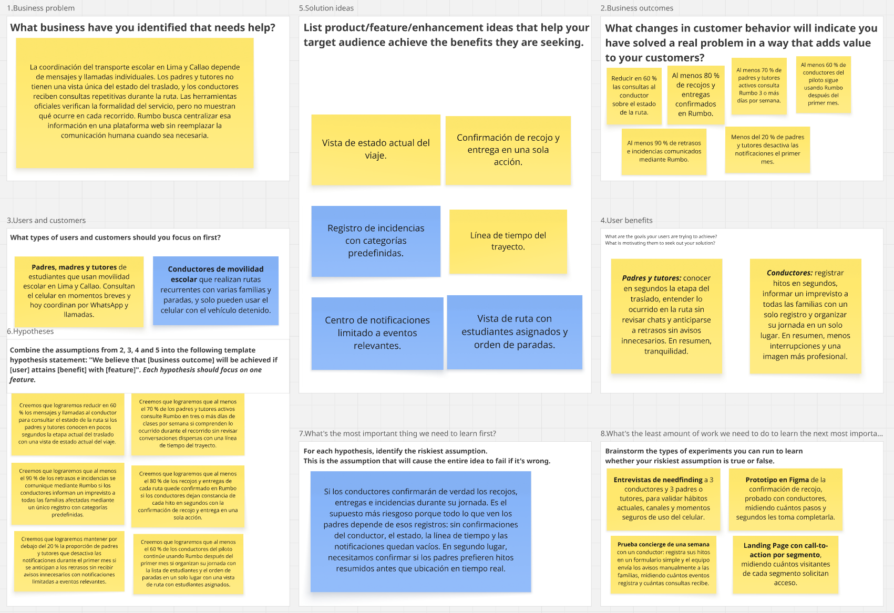
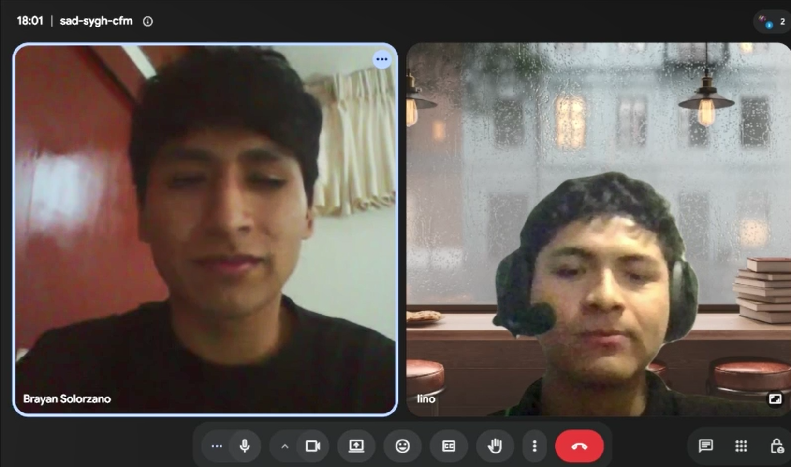

# UNIVERSIDAD PERUANA DE CIENCIAS APLICADAS

### Ingeniería de Software

### Ciclo Académico: 2026-20

### Código: 1ASI0730

### Curso: Aplicaciones Web

### NRC: 8137

### Docente: Hugo Allan Mori Paiva

# Informe de Trabajo Final

### Startup: Rumbo

### Producto: Rumbo

### Integrantes

| Apellidos y Nombres | Código de Alumno |
|---|---|
| Barrientos Quispe, Marcelo | U20221e646 |
| Díaz Ramírez, Alejandro | U202423084 |
| Geronimo Puma, Kevin Joel | U202423163 |
| Lino Quispe, Leonardo Miguel | U202422298 |
| Meza Soza, Alexandra Yamile | U20241b451 |

### SEPTIEMBRE - 2026

---

## Registro de Versiones del Informe

| Versión | Fecha | Autor(es) | Descripción de cambios |
|---|---|---|---|
| 0.1 | 07/09/2026 | Lino Quispe, Leonardo Miguel | Creación de la estructura base del informe de Rumbo. |
| 0.2 | 11/09/2026 | Equipo Rumbo | Actualización de integrantes y refinamiento del Capítulo I para AV1. |

---

## Project Report Collaboration Insights

**Organización:** https://github.com/AIpaca-UPC  
**Project Report:** https://github.com/AIpaca-UPC/web-applications-project-report  
**Landing Page:** https://github.com/AIpaca-UPC/landing-page  
**Frontend Web Application:** https://github.com/AIpaca-UPC/web-applications-web-app  
**Web Service:** https://github.com/AIpaca-UPC/web-applications-web-service

### AV1

**Team Collaboration Commits**  
[Insertar captura]

**Team Collaboration Network**  
[Insertar captura]

**Contributors / Pull Requests**  
[Insertar capturas]

---

# Contenido

## Tabla de Contenidos

- [Student Outcome](#student-outcome)
- [Capítulo I: Introducción](#capítulo-i-introducción)
  - [1.1. Startup Profile](#11-startup-profile)
    - [1.1.1. Descripción de la Startup](#111-descripción-de-la-startup)
    - [1.1.2. Perfiles de integrantes del equipo](#112-perfiles-de-integrantes-del-equipo)
  - [1.2. Solution Profile](#12-solution-profile)
    - [1.2.1. Antecedentes y problemática](#121-antecedentes-y-problemática)
    - [1.2.2. Lean UX Process](#122-lean-ux-process)
      - [1.2.2.1. Lean UX Problem Statement](#1221-lean-ux-problem-statement)
      - [1.2.2.2. Lean UX Assumptions](#1222-lean-ux-assumptions)
      - [1.2.2.3. Lean UX Hypothesis Statements](#1223-lean-ux-hypothesis-statements)
      - [1.2.2.4. Lean UX Canvas](#1224-lean-ux-canvas)
  - [1.3. Segmentos objetivo](#13-segmentos-objetivo)
- [Capítulo II: Requirements Elicitation & Analysis](#capítulo-ii-requirements-elicitation--analysis)
  - [2.1. Competidores](#21-competidores)
    - [2.1.1. Análisis competitivo](#211-análisis-competitivo)
    - [2.1.2. Estrategias y tácticas frente a competidores](#212-estrategias-y-tácticas-frente-a-competidores)
  - [2.2. Entrevistas](#22-entrevistas)
    - [2.2.1. Diseño de entrevistas](#221-diseño-de-entrevistas)
    - [2.2.2. Registro de entrevistas](#222-registro-de-entrevistas)
    - [2.2.3. Análisis de entrevistas](#223-análisis-de-entrevistas)
  - [2.3. Needfinding](#23-needfinding)
    - [2.3.1. User Personas](#231-user-personas)
    - [2.3.2. User Task Matrix](#232-user-task-matrix)
    - [2.3.3. User Journey Mapping](#233-user-journey-mapping)
    - [2.3.4. Empathy Mapping](#234-empathy-mapping)
  - [2.4. Big Picture Event Storming](#24-big-picture-event-storming)
  - [2.5. Ubiquitous Language](#25-ubiquitous-language)
- [Capítulo III: Requirements Specification](#capítulo-iii-requirements-specification)
  - [3.1. User Stories](#31-user-stories)
  - [3.2. Impact Mapping](#32-impact-mapping)
  - [3.3. Product Backlog](#33-product-backlog)
- [Capítulo IV: Product Design](#capítulo-iv-product-design)
  - [4.1. Style Guidelines](#41-style-guidelines)
  - [4.2. Information Architecture](#42-information-architecture)
  - [4.3. Landing Page UI Design](#43-landing-page-ui-design)
  - [4.4. Web Applications UX/UI Design](#44-web-applications-uxui-design)
  - [4.5. Web Applications Prototyping](#45-web-applications-prototyping)
  - [4.6. Domain-Driven Software Architecture](#46-domain-driven-software-architecture)
  - [4.7. Software Object-Oriented Design](#47-software-object-oriented-design)
  - [4.8. Database Design](#48-database-design)
- [Capítulo V: Product Implementation, Validation & Deployment](#capítulo-v-product-implementation-validation--deployment)
  - [5.1. Software Configuration Management](#51-software-configuration-management)
  - [5.2. Landing Page, Services & Applications Implementation](#52-landing-page-services--applications-implementation)
- [Conclusiones](#conclusiones)
- [Bibliografía](#bibliografía)
- [Anexos](#anexos)

---

# Student Outcome

El curso contribuye al cumplimiento del **ABET – EAC – Student Outcome 5**: la capacidad de funcionar efectivamente en un equipo cuyos miembros proporcionan liderazgo de manera conjunta, crean un entorno colaborativo e inclusivo, establecen objetivos, planifican tareas y cumplen objetivos.

| Criterio específico | Acciones realizadas | Conclusiones |
|---|---|---|
| Trabaja en equipo para proporcionar liderazgo en forma conjunta. | **[Integrante 1]** — AV1: [acción].   **[Integrante 2]** — AV1: [acción].   **[Integrante 3]** — AV1: [acción].   **[Integrante 4]** — AV1: [acción].   **[Integrante 5]** — AV1: [acción]. | [Conclusión grupal]. |
| Crea un entorno colaborativo e inclusivo, establece metas, planifica tareas y cumple objetivos. | **[Integrante 1]** — AV1: [acción].   **[Integrante 2]** — AV1: [acción].   **[Integrante 3]** — AV1: [acción].   **[Integrante 4]** — AV1: [acción].   **[Integrante 5]** — AV1: [acción]. | [Conclusión grupal]. |

---

# Capítulo I: Introducción

## 1.1. Startup Profile

### 1.1.1. Descripción de la Startup

**AIpaca** es una startup tecnológica peruana enfocada en el desarrollo de soluciones digitales que simplifican la coordinación de servicios cotidianos, con especial atención en el transporte escolar. Nuestro propósito es aprovechar la tecnología para brindar tranquilidad a las familias y eficiencia a quienes prestan el servicio, mediante herramientas accesibles, seguras y fáciles de usar que permitan una comunicación clara, oportuna y ordenada entre padres, tutores y conductores de movilidad escolar.

Nuestra solución es **Rumbo**, una plataforma web responsive orientada al uso móvil que centraliza la información del traslado escolar. **Rumbo** permite a los padres y tutores conocer el estado actual de la ruta, revisar una línea de tiempo con los principales hitos del recorrido y recibir notificaciones ante eventos relevantes como recojos, llegadas, retrasos o incidencias. A su vez, permite a los conductores consultar su ruta y los estudiantes asignados, confirmar recojos y entregas mediante interacciones breves y registrar incidencias una sola vez para comunicarlas a todas las familias correspondientes.

La propuesta de **AIpaca** se centra en construir un ecosistema de coordinación del transporte escolar que sea confiable, escalable y respetuoso de la privacidad, donde la información de cada traslado esté disponible únicamente para los usuarios autorizados. Rumbo no busca reemplazar las obligaciones de seguridad, autorización y operación que corresponden a los prestadores del servicio, ni la comunicación humana cuando esta sea necesaria. Su objetivo es complementarlas con información estructurada que reduzca la incertidumbre de las familias y la carga operativa de los conductores en una ciudad con alta congestión y tiempos de viaje variables.

**Misión:** Desarrollar herramientas digitales accesibles y confiables que permitan a padres, tutores y conductores de movilidad escolar coordinar los traslados de los estudiantes de forma clara y oportuna, brindando tranquilidad a las familias y eficiencia a quienes prestan el servicio.

**Visión:** En los próximos 5 años, consolidar a AIpaca como una empresa referente en soluciones digitales para la coordinación del transporte escolar en el Perú y Latinoamérica, reconocida por generar confianza entre familias y prestadores del servicio mediante tecnología accesible, segura y escalable.

Alcance del proyecto: El alcance inicial de Rumbo está orientado a padres o tutores y conductores de movilidad escolar en Lima y Callao. Ofrece una plataforma web responsive que integra la consulta del estado del traslado, la línea de tiempo del trayecto, la confirmación de recojos y entregas, el registro de incidencias y un centro de notificaciones. A mediano plazo, buscamos ampliar la solución hacia centros educativos y empresas de transporte escolar, incorporando la gestión de múltiples rutas y unidades, para consolidar un modelo de coordinación que transforme la manera en que se organiza la movilidad escolar en otras ciudades del país y de la región.

### 1.1.2. Perfiles de integrantes del equipo

<table>
  <thead>
    <tr><th>Foto</th><th>Apellidos y nombres</th><th>Código</th><th>Carrera</th><th>Habilidades</th></tr>
  </thead>
  <tbody>
    <tr>
      <td align="center"></td>
      <td>Barrientos Quispe, Marcelo</td>
      <td>U20221e646</td>
      <td>Ingeniería de Software</td>
      <td>Me considero una persona adaptable al entorno, sé trabajar en equipo y aprendo rápido. Cuento con conocimientos técnicos en tecnologías de JavaScript.</td>
    </tr>
    <tr>
      <td align="center">[Insertar foto]</td>
      <td>Díaz Ramírez, Alejandro</td>
      <td>U202423084</td>
      <td>Ingeniería de Software</td>
      <td>[Completar perfil]</td>
    </tr>
    <tr>
      <td align="center">[Insertar foto]</td>
      <td>Geronimo Puma, Kevin Joel</td>
      <td>U202423163</td>
      <td>Ingeniería de Software</td>
      <td>[Completar perfil]</td>
    </tr>
    <tr>
      <td align="center"></td>
      <td>Lino Quispe, Leonardo Miguel</td>
      <td>U202422298</td>
      <td>Ingeniería de Software</td>
      <td>Soy estudiante de Ingeniería de Software del 4to ciclo en la UPC. Tengo conocimientos en programación en C++ y Python, y experiencia desarrollando proyectos académicos donde analizo y organizo soluciones tecnológicas. Me gusta enfocarme en aprender de forma práctica y en construir soluciones que sean claras, funcionales y aplicadas a problemas reales.</td>
    </tr>
    <tr>
      <td align="center"></td>
      <td>Meza Soza, Alexandra Yamile</td>
      <td>U20241b451</td>
      <td>Ingeniería de Software</td>
      <td>[Completar perfil]</td>
    </tr>
  </tbody>
</table>

## 1.2. Solution Profile

El **Solution Profile** presenta una descripción general de la solución propuesta por **AIpaca**. Aborda el contexto en el que opera el transporte escolar en Lima y Callao, los problemas detectados en la coordinación entre familias y conductores, y las suposiciones estratégicas que guían el desarrollo de **Rumbo**. Esta sección busca conectar los hallazgos de la fase de descubrimiento con una propuesta de valor clara y sentar las bases para el diseño, la validación y el desarrollo de la solución.

### 1.2.1. Antecedentes y problemática

El transporte escolar constituye un servicio formal y regulado en Lima y Callao. En enero de 2026, la Autoridad de Transporte Urbano para Lima y Callao (ATU) informó que **3758 vehículos se encontraban habilitados para prestar el servicio de transporte de estudiantes** y recordó que los padres pueden verificar digitalmente si el vehículo y el conductor están autorizados [1]. Esta cifra confirma que existe un ecosistema amplio de familias, conductores y operadores que realizan traslados escolares de manera recurrente.

En esta sección se analiza el contexto en el que surge la problemática principal, considerando sus factores sociales, tecnológicos y operativos. Se utiliza la técnica de las 5 W y 2 H para responder de forma estructurada qué ocurre, quiénes están involucrados, cuándo y dónde sucede, por qué ocurre, cómo se abordará y cuánto costará implementar la solución.

#### Técnica de las 5 W's + 2 H's

**What (¿Qué?) — ¿Cuál es el problema?**  

El transporte escolar en Lima y Callao es un servicio formal y regulado. Sin embargo, la coordinación diaria entre padres y conductores sigue dependiendo de mensajes y llamadas individuales. Según la Autoridad de Transporte Urbano para Lima y Callao (ATU), 3758 vehículos cuentan con habilitación para prestar este servicio durante 2026, tras un proceso de verificación y autorización realizado en 2025 (Infobae, 2026a). Además, la ATU habilitó un enlace público para que los padres verifiquen si el vehículo y el conductor contratados están autorizados (Exitosa Noticias, 2026)

Estos mecanismos resuelven la pregunta de si el servicio es formal antes de contratarlo, pero no la de qué está pasando durante la ruta. Los padres no cuentan con una vista única donde consultar si el menor ya fue recogido, si la movilidad está retrasada, si llegó al colegio o si ocurrió un imprevisto. Esa información se transmite de forma dispersa, y buena parte de ella recae sobre el conductor, que debe responder las mismas consultas a varias familias mientras cumple su ruta.

**When (¿Cuándo?) — ¿Cuándo ocurre?**  

El problema ocurre todos los días de clases, en tres momentos: antes del recojo, durante el traslado y al momento de la llegada o entrega. El Ministerio de Educación fijó el inicio del año escolar 2026 para el lunes 16 de marzo y su término para el viernes 18 de diciembre, con 36 semanas de clases (Infobae, 2026a). Durante todo ese periodo, cada familia depende de uno o dos trayectos diarios

La incertidumbre se intensifica porque los horarios escolares coinciden con las horas de mayor congestión. En Lima el tráfico se concentra entre las 6 a. m. y las 9 a. m., y nuevamente en las horas punta de la tarde (El Comercio, 2026). En esas franjas un retraso de pocos minutos puede convertirse en una espera prolongada, y es cuando los padres más necesitan información oportuna.

**Where (¿Dónde?) — ¿Dónde surge?**  

El problema se presenta principalmente en Lima Metropolitana y el Callao, en las rutas que conectan hogares, puntos de recojo y centros educativos. Se trata de una de las ciudades con mayor congestión del mundo: el TomTom Traffic Index 2025 ubicó a Lima como la novena ciudad más congestionada del mundo, con un nivel de tráfico de 69,3 %, y con 195 horas anuales perdidas por conductor en embotellamientos (El Popular, 2026).

La situación se mantiene en 2026. Con datos de TomTom consolidados hasta el 3 de agosto de 2026, en la hora punta matinal de los días laborables la velocidad promedio en Lima fue de 14,74 km/h, la más baja frente a Ciudad de México, Bogotá y Santiago de Chile (Energiminas, 2026). En este entorno, los tiempos de llegada son difíciles de anticipar para las familias.

**Who (¿Quiénes?) — ¿Quiénes son los afectados?**  

- **Padres y tutores**, que necesitan saber en qué etapa se encuentra el traslado de sus hijos y hoy dependen de preguntarle directamente al conductor.

- **Conductores de movilidad escolar**, que deben cumplir su ruta en medio del tráfico y, al mismo tiempo, comunicar recojos, retrasos o incidencias a varias familias de forma individual. Su trabajo está sujeto a exigencias formales: la ATU verifica que los vehículos cuenten con SOAT y CITV vigentes y que los conductores tengan licencia de categoría AIIB (Infobae, 2026a).

**Why (¿Por qué?) — ¿Por qué ocurre y por qué importa?**  

- **Comunicación fragmentada en canales generales:** La coordinación se realiza principalmente por mensajería instantánea. Según la Encuesta Residencial de Servicios de Telecomunicaciones (ERESTEL) 2025 de Osiptel, el 68,6 % de los peruanos usó plataformas de comunicación instantánea durante el último año, y entre ellos WhatsApp alcanza el 98,6 % de usuarios (Expreso, 2026). Estos canales son útiles, pero no fueron diseñados para registrar hitos de una ruta: la información queda mezclada con otros mensajes y cada familia recibe actualizaciones distintas.

- **Alta variabilidad de los tiempos de viaje:** La congestión de Lima hace que la hora estimada de llegada cambie constantemente, lo que multiplica las consultas de los padres.

- **Carga operativa del conductor:** El conductor es la única fuente de información en tiempo real, pero su prioridad debe ser conducir con seguridad. Responder mensajes durante la ruta compite con esa prioridad.

- **Ausencia de un registro estructurado:** Los recojos, entregas e incidencias no suelen quedar documentados de forma ordenada, lo que dificulta resolver dudas posteriores sobre lo ocurrido en un trayecto.

- **Verificación sin visibilidad en ruta:** Las herramientas oficiales permiten comprobar la formalidad del servicio, pero no ofrecen seguimiento del estado de cada traslado.

**How (¿Cómo?) — ¿Cómo se abordará?**  

Para responder a esta necesidad, AIpaca propone Rumbo, una plataforma web responsive orientada al uso móvil que centraliza el estado de cada traslado. La elección del canal responde al contexto local: según el INEI, en el cuarto trimestre de 2025 el 98,4 % de los hogares de Lima Metropolitana contó con telefonía móvil, y en ese mismo periodo el uso de Internet en Lima Metropolitana alcanzó el 90,3 % de la población de 6 años a más (Instituto Nacional de Estadística e Informática [INEI], 2026). Además, el 89,2 % de los usuarios de Internet accedió a la red mediante un teléfono celular (Altavoz, 2026).

Para los padres y tutores: Podrán ver de un vistazo el estado actual del viaje, revisar una línea de tiempo con los hitos del recorrido y recibir notificaciones solo ante eventos relevantes, como recojo, llegada, retraso o incidencia.

Para los conductores: Podrán consultar su ruta y los estudiantes asignados, confirmar recojos y entregas mediante interacciones breves y registrar una incidencia una sola vez para que llegue a todas las familias correspondientes.

La información de cada menor será visible únicamente para los usuarios autorizados. Esto es coherente con el marco peruano de protección de datos: el Decreto Supremo N.º 016-2024-JUS, publicado el 30 de noviembre de 2024, aprobó el nuevo reglamento de la Ley N.º 29733, Ley de Protección de Datos Personales (Escobedo, 2024), y entró en vigor el 31 de marzo de 2025, reforzando las medidas de seguridad y exigiendo notificar los incidentes de seguridad a la Autoridad Nacional de Protección de Datos Personales (LP Derecho, s. f.).

Rumbo no reemplaza las obligaciones de seguridad, autorización y operación de los prestadores del servicio, ni la comunicación humana cuando sea necesaria. Su objetivo es complementarlas con información estructurada que reduzca la incertidumbre de las familias y la carga del conductor.

**How much (¿Cuánto?)**  

La implementación de Rumbo requiere una inversión inicial orientada al desarrollo de software, la infraestructura en la nube, la adecuación a la normativa de datos personales y un piloto con familias y conductores. Al ser una solución exclusivamente de software, no requiere fabricar hardware, lo que reduce la inversión inicial y facilita escalar el modelo SaaS.

Como referencia del mercado, el precio mensual por estudiante de una movilidad escolar varía aproximadamente entre S/ 150 y S/ 300, según la distancia y los servicios adicionales (Comparabien, 2025). Esto sugiere que una suscripción de bajo costo podría presentarse como un valor agregado del servicio.

Presupuesto estimado (estimación referencial elaborada por el equipo):

Desarrollo de software
Diseño UX/UI y prototipado: S/ 2,000 – S/ 3,000
Frontend web responsive (Vue + PrimeVue): S/ 4,000 – S/ 6,000
Backend, API REST y base de datos (ASP.NET Core): S/ 4,500 – S/ 6,500
Integración de servicios de ubicación y notificaciones: S/ 1,500 – S/ 2,500

Infraestructura (anual)
Dominio, hosting en la nube y base de datos gestionada: S/ 1,500 – S/ 2,500
Servicio de notificaciones (push, correo o SMS): S/ 800 – S/ 1,500

Seguridad y cumplimiento
Adecuación a la Ley N.º 29733 (políticas de privacidad, consentimiento y asesoría legal): S/ 1,500 – S/ 2,500
Pruebas de seguridad: S/ 1,000 – S/ 1,500

Marketing y lanzamiento
Landing page, estrategia digital y materiales: S/ 2,000 – S/ 3,000
Piloto con conductores y familias (capacitación e incentivos): S/ 1,500 – S/ 2,500

Mantenimiento y soporte (anual)
Actualizaciones de software y soporte técnico: S/ 3,000 – S/ 5,000

Total estimado: S/ 23,300 – S/ 36,500

### 1.2.2. Lean UX Process

El proceso Lean UX que adoptamos en AIpaca busca maximizar la eficiencia en el desarrollo de Rumbo mediante la validación continua, el pensamiento crítico y la acción rápida. Siguiendo esta filosofía, estructuramos nuestro enfoque en cuatro componentes: la definición del problema, la formulación de suposiciones, la creación de hipótesis y el desarrollo de un lienzo estratégico. Este proceso nos permite aprender de padres, tutores y conductores antes de invertir esfuerzo en funcionalidades que no aporten valor real.

#### 1.2.2.1. Lean UX Problem Statement

El estado actual de la coordinación del transporte escolar en Lima y Callao se ha centrado principalmente en verificar la formalidad del servicio y en la comunicación directa entre padres o tutores y conductores mediante mensajería instantánea y llamadas. Esto genera incertidumbre sobre recojos, llegadas y retrasos, y consultas repetitivas que interrumpen al conductor durante la ruta.

Lo que los productos y servicios existentes no resuelven es una vista única y estructurada, restringida por permisos, donde se registren los hitos de cada traslado (recojos, entregas, retrasos e incidencias) y se notifique solo a los tutores autorizados.

Rumbo abordará esta brecha mediante una plataforma web responsive en la que los conductores confirman hitos con interacciones breves, y los padres consultan el estado actual y la línea de tiempo del viaje y reciben notificaciones relevantes.

Nuestro enfoque inicial serán los conductores de movilidad escolar autorizados por la ATU en Lima y Callao y los padres o tutores que contratan sus servicios.

Sabremos que tenemos éxito cuando los padres consulten Rumbo en lugar de escribir al conductor, reduciendo en 60 % las consultas sobre el estado de la ruta, y cuando los conductores confirmen al menos el 80 % de los recojos y entregas dentro de la plataforma.

- **Domain:** Transporte escolar, movilidad urbana y coordinación digital entre familias y prestadores de servicio.

- **Customer Segments:**

Padres, madres y tutores de estudiantes que usan movilidad escolar.

Conductores de movilidad escolar que realizan rutas recurrentes.

- **Pain Points:** 

**Padres y Tutores**

- Incertidumbre sobre si el menor ya fue recogido, si la movilidad está en camino o si llegó al destino.

- Falta de avisos oportunos ante retrasos o imprevistos.

- Información dispersa entre chats, llamadas y mensajes de otros temas.

**Conductores**

- Consultas repetitivas de varias familias sobre lo mismo durante la ruta.

- Necesidad de comunicar un retraso o incidencia a cada familia por separado.

- Ausencia de un registro ordenado de recojos, entregas e incidencias para resolver dudas posteriores.

- **Gap:** Creemos que no existe una solución de uso extendido en Lima y Callao que combine, en una sola plataforma, el estado del traslado, la confirmación de recojos y entregas, el registro de incidencias y notificaciones dirigidas solo a los tutores autorizados. Este supuesto será contrastado en el análisis competitivo. 

- **Vision/Strategy:** Consolidar a AIpaca como una empresa referente en soluciones digitales para la coordinación del transporte escolar en el Perú y Latinoamérica, reconocida por generar confianza entre familias y conductores mediante tecnología accesible, segura y escalable.

- **Initial Segment:** Conductores de movilidad escolar autorizados por la ATU en Lima y Callao, y los padres o tutores que contratan sus servicios y usan un teléfono celular con acceso a Internet.

#### 1.2.2.2. Lean UX Assumptions

Los siguientes supuestos representan las creencias iniciales del equipo sobre el modelo de negocio, los usuarios y la viabilidad de Rumbo. Serán validados mediante entrevistas, prototipos y pruebas durante las iteraciones del proceso Lean UX.

##### Business Assumptions

Estas Business Assumptions servirán como base para formular los Feature Assumptions y los Hypothesis Statements, y permitirán validar los elementos críticos del modelo.

1. Creemos que los padres y tutores necesitan conocer el estado del traslado escolar de sus hijos para reducir su incertidumbre durante la ruta.

2. Creemos que una plataforma web responsive con estados, hitos, notificaciones e incidencias puede satisfacer esta necesidad mejor que la mensajería de uso general.

3. Creemos que nuestros clientes iniciales serán conductores independientes de 
movilidad escolar en Lima y Callao, junto con las familias que contratan sus servicios.

4. Creemos que el valor más importante para los padres es la tranquilidad de saber qué ocurre en la ruta sin tener que preguntar y, para los conductores, la reducción de mensajes repetitivos.

5. Creemos que un modelo SaaS con acceso gratuito para padres y tutores y suscripción mensual para conductores nos permitirá crecer, porque el conductor puede presentar Rumbo como un valor agregado de su servicio.

6. Creemos que nuestra ventaja competitiva será una experiencia enfocada en hitos resumidos, y no en un seguimiento continuo de coordenadas, lo que la hace más clara y menos invasiva.

7. Creemos que los conductores adoptarán la plataforma solo si registrar un evento toma pocos segundos y no interfiere con la conducción.

8. Creemos que los mayores riesgos son la desconfianza sobre el manejo de datos de menores y la resistencia de los conductores a cambiar sus hábitos, y que podremos mitigarlos con permisos estrictos por rol, cumplimiento de la Ley N.º 29733 y pilotos gratuitos con conductores reales.

9. Creemos que el costo de la suscripción será bajo en relación con lo que las familias pagan mensualmente por el servicio de movilidad escolar.

##### Business Outcome Assumptions

1. Reducir en 60 % los mensajes y llamadas de padres y tutores al conductor para consultar el estado de la ruta.

2. Lograr que al menos el 70 % de los padres y tutores activos consulte Rumbo en tres o más días de clases por semana.

3. Lograr que al menos el 80 % de los recojos y entregas de cada ruta quede confirmado dentro de Rumbo.

4. Lograr que al menos el 90 % de los retrasos e incidencias se comunique a las familias mediante Rumbo y no mediante mensajes individuales.

5. Mantener por debajo del 20 % la proporción de padres y tutores que desactiva las notificaciones durante el primer mes de uso.

6. Lograr que al menos el 60 % de los conductores que participen en el piloto continúe usando Rumbo después del primer mes.

##### User Assumptions

En esta etapa se identificaron los principales supuestos sobre los usuarios, sus necesidades y el contexto de uso, antes de realizar las entrevistas de validación.

**¿Quién es el usuario?**

- **Padres, madres y tutores:** 

1. Creemos que los padres y tutores trabajan o realizan otras actividades durante el horario de traslado y consultan el celular solo en momentos breves.

2. Creemos que hoy coordinan con el conductor principalmente mediante WhatsApp y llamadas telefónicas.

3. Creemos que sus momentos de mayor incertidumbre son antes del recojo, durante los retrasos por tráfico y al esperar la confirmación de llegada.

4. Creemos que prefieren recibir información resumida en estados e hitos antes que seguir una ubicación en tiempo real.

5. Creemos que solo confiarán en una plataforma si la información de su hijo es visible únicamente para los tutores autorizados.

- **Conductores de movilidad escolar:** 

6. Creemos que los conductores realizan rutas recurrentes en las que atienden a varias familias y paradas por jornada.

7. Creemos que reciben consultas repetidas de distintas familias sobre un mismo evento de la ruta.

8. Creemos que organizan su lista de estudiantes y paradas de manera informal, de memoria, en papel o en chats.

9. Creemos que solo pueden interactuar con el celular de forma segura cuando el vehículo está detenido.

10. Creemos que valoran ofrecer una imagen más profesional y ordenada ante las familias.

##### Feature Assumptions

En esta sección se detallan los supuestos sobre las funcionalidades del producto. Cada Feature Assumption conecta una necesidad del usuario con una posible solución de diseño y anticipa su impacto en la experiencia.

1. Creemos que una vista de estado actual del viaje permitirá a los padres y tutores entender en pocos segundos en qué etapa está el traslado.

2. Creemos que una línea de tiempo del trayecto dará más claridad sobre lo ocurrido durante el recorrido que una secuencia de mensajes de chat.

3. Creemos que la confirmación de recojo y entrega con una sola acción permitirá a los conductores registrar los hitos sin afectar su flujo de trabajo.

4. Creemos que un registro de incidencias con categorías predefinidas permitirá comunicar imprevistos con suficiente contexto y en poco tiempo.

5. Creemos que las notificaciones limitadas a eventos relevantes mantendrán informados a los padres sin saturarlos.

6. Creemos que una vista de ruta con los estudiantes asignados y el orden de paradas facilitará la organización diaria del conductor.

##### User Outcome and Benefit Assumptions

1. Los padres y tutores conocerán en pocos segundos la etapa actual del traslado sin contactar al conductor.

2. Los padres y tutores comprenderán lo ocurrido durante el recorrido sin revisar conversaciones dispersas.

3. Los conductores dejarán constancia de cada recojo y entrega en segundos, con el vehículo detenido.

4. Los conductores informarán un imprevisto a todas las familias afectadas mediante un único registro.

5. Los padres y tutores podrán anticiparse a retrasos sin recibir avisos innecesarios.

6. Los conductores organizarán su jornada con la lista de estudiantes y el orden de paradas en un solo lugar.

#### 1.2.2.3. Lean UX Hypothesis Statements

Se formula un Hypothesis Statement por cada Feature Assumption, siguiendo la estructura: *Creemos que lograremos [resultado de negocio] si [persona] obtiene [beneficio] con [funcionalidad].*

**Hipótesis 1 — Estado actual del viaje**  

Creemos que lograremos reducir en 60 % los mensajes y llamadas al conductor para consultar el estado de la ruta si los padres y tutores conocen en pocos segundos la etapa actual del traslado con una vista de estado actual del viaje.

**Hipótesis 2 — Línea de tiempo del trayecto**  

Creemos que lograremos que al menos el 70 % de los padres y tutores activos consulte Rumbo en tres o más días de clases por semana si comprenden lo ocurrido durante el recorrido sin revisar conversaciones dispersas con una línea de tiempo del trayecto.

**Hipótesis 3 — Confirmación de recojo y entrega**  

Creemos que lograremos que al menos el 80 % de los recojos y entregas de cada ruta quede confirmado en Rumbo si los conductores dejan constancia de cada hito en segundos con la confirmación de recojo y entrega en una sola acción.

**Hipótesis 4 — Registro de incidencias**  

Creemos que lograremos que al menos el 90 % de los retrasos e incidencias se comunique mediante Rumbo si los conductores informan un imprevisto a todas las familias afectadas mediante un único registro con categorías predefinidas.

**Hipótesis 5 — Centro de notificaciones**  

Creemos que lograremos mantener por debajo del 20 % la proporción de padres y tutores que desactiva las notificaciones durante el primer mes si se anticipan a los retrasos sin recibir avisos innecesarios con notificaciones limitadas a eventos relevantes.

**Hipótesis 6 — Vista de ruta del conductor**  

Creemos que lograremos que al menos el 60 % de los conductores del piloto continúe usando Rumbo después del primer mes si organizan su jornada con la lista de estudiantes y el orden de paradas en un solo lugar con una vista de ruta con estudiantes asignados.

#### 1.2.2.4. Lean UX Canvas

El **Lean UX Canvas** resume en un solo artefacto los elementos trabajados en el Lean UX Process: el problema de negocio, los resultados esperados, los segmentos objetivo, sus beneficios, las soluciones propuestas y las hipótesis que las conectan. Además, identifica el supuesto más riesgoso para Rumbo y los experimentos de menor esfuerzo que permitirán validarlo.

## 1.3. Segmentos objetivo

En esta sección se identifican y describen los **segmentos de usuarios** hacia los cuales se dirige Rumbo. Estos segmentos servirán como referencia para el diseño de funcionalidades, la experiencia de usuario, las entrevistas de Needfinding y la comunicación del producto.

### Padres y tutores

**Descripción:**  
Padres, madres o tutores responsables de menores que utilizan servicios de movilidad escolar en Lima y Callao. Este segmento busca disminuir la incertidumbre durante los recorridos y acceder a información clara sobre recojo, traslado, retrasos, llegada e incidencias.

**Características demográficas y comportamiento:**
- Adultos responsables de menores en edad escolar que contratan o utilizan servicios de movilidad escolar.
- Utilizan principalmente el teléfono móvil para comunicarse y consultar información cotidiana.
- Valoran la inmediatez, claridad y facilidad de uso por encima de interfaces complejas.
- Requieren información relevante, pero no necesariamente una secuencia continua de mensajes.
- La confianza en la plataforma depende de la privacidad y del control sobre quién puede consultar información del menor.

**Sustento estadístico:**
- La ATU reportó **3758 vehículos habilitados para transporte escolar en Lima y Callao** en enero de 2026, evidenciando un mercado formal y recurrente de familias usuarias del servicio [1].
- El INEI informó que **98,4 % de los hogares de Lima Metropolitana contaba con telefonía móvil**, **90,3 % de la población de 6 años a más utilizaba Internet** y **91,0 % de los usuarios de Internet accedía mediante celular** durante el cuarto trimestre de 2025 [4]. Esto respalda una experiencia web orientada principalmente al uso móvil.

### Conductores de movilidad escolar

**Descripción:**  
Conductores que realizan rutas programadas para el traslado de estudiantes entre hogares, puntos de recojo y centros educativos. Este segmento necesita organizar el recorrido y comunicar a las familias los principales eventos de la ruta de forma rápida y consistente.

**Características demográficas y comportamiento:**
- Prestadores de un servicio regulado que operan vehículos autorizados para transporte de estudiantes.
- Trabajan con rutas, horarios, puntos de recojo y varios estudiantes durante una misma jornada.
- Necesitan reducir acciones digitales mientras conducen, por lo que las interacciones deben ser breves y ejecutarse únicamente cuando sea seguro hacerlo.
- Requieren comunicar retrasos, incidencias, recojos y entregas sin repetir la misma información individualmente.
- Valoran herramientas que simplifiquen la coordinación sin reemplazar sus responsabilidades operativas y de seguridad.

**Sustento estadístico:**
- La ATU reportó **3758 vehículos escolares habilitados en Lima y Callao** [1], lo que permite identificar un grupo concreto de operadores y conductores dentro del mercado formal.
- Lima registró **69,3 % de congestión promedio durante 2025**, con recorridos de 10 km de hasta **51 min 17 s en la hora punta de la tarde** y aproximadamente **195 horas anuales perdidas en tráfico de hora punta** [2]. Este contexto sustenta la necesidad de gestionar retrasos y comunicar variaciones de tiempo de manera ordenada.

---

## 2.1. Competidores

En esta sección se identifican y describen los principales competidores de Rumbo 
dentro del mercado de la coordinación del transporte escolar.

### titiGO (competidor directo)

titiGO es una plataforma para el seguimiento y control del transporte escolar que 
opera en Lima. Conecta colegios, movilidades y padres de familia. Los conductores 
crean un perfil de movilidad que el colegio confirma como verificado. Los padres 
reciben notificaciones sobre los estados del viaje, pueden cancelar recogidas e 
informar imprevistos. Incorpora un código QR diario que el personal del colegio 
escanea para confirmar el retiro del estudiante.

### Transporte Escolar (competidor directo)

Transporte Escolar es una aplicación desarrollada en Ecuador para el seguimiento 
escolar en tiempo real. Conductores y padres se registran gratuitamente y acceden a 
paneles diferenciados. El conductor comparte su ubicación, gestiona estudiantes y 
rutas, y envía alertas. El padre vincula a sus hijos mediante un código proporcionado 
por el conductor y visualiza su estado, la distancia al destino y el recorrido.

### [Tercer competidor directo] (competidor directo)

[Descripción del tercer competidor, una vez verificada su vigencia]

### WhatsApp (competidor indirecto)

WhatsApp es la herramienta de mensajería que conductores y padres utilizan hoy para 
coordinar el servicio. Permite grupos, chats individuales y compartir ubicación en 
tiempo real. Sin embargo, la información queda distribuida entre conversaciones y 
carece de funciones para gestionar rutas, estudiantes o registrar hitos del recorrido.

### 2.1.1. Análisis competitivo

En esta sección se realiza un análisis detallado de nuestros tres principales competidores: **WhatsApp, Transporte Escolar y titiGO**. Para ello, se presenta un **Competitive Analysis Landscape**, cuyo objetivo es conocer y comparar las principales características de cada competidor, considerando sus fortalezas, debilidades, oportunidades de mejora y modelos de negocio. Este análisis permitirá identificar oportunidades de diferenciación y establecer las estrategias y tácticas de negocio que **Rumbo** adoptará para desarrollar una ventaja competitiva dentro del mercado del seguimiento y gestión de movilidades escolares.

## Competitive Analysis Landscape

<table>
  <thead>
    <tr>
      <th colspan="2">¿Por qué llevar a cabo este análisis?</th>
      <th colspan="4">[el objetivo del análisis]</th>
    </tr>
    <tr>
      <th colspan="2"></th>
      <th>Rumbo</th>
      <th>titiGO</th>
      <th>Transporte Escolar</th>
      <th>WhatsApp</th>
    </tr>
    <tr>
      <th>Competidores</th>
      <th></th>
      <th>[logo] AIpaca — Rumbo</th>
      <th>[logo] titiGO</th>
      <th>[logo] Transporte Escolar</th>
      <th>[logo] WhatsApp</th>
    </tr>
  </thead>
  <tbody>
    <tr>
      <td rowspan="2"><b>Perfil</b></td>
      <td>Overview</td>
      <td>Plataforma web responsive que centraliza el estado del traslado escolar, sus hitos e incidencias, dirigida a padres/tutores y conductores.</td>
      <td>Plataforma de seguimiento y control del transporte escolar que conecta colegios, movilidades y padres.</td>
      <td>Aplicación móvil de seguimiento escolar en tiempo real para conductores y padres.</td>
      <td>Aplicación de mensajería de uso general empleada para coordinar el servicio de movilidad escolar.</td>
    </tr>
    <tr>
      <td>Ventaja competitiva ¿Qué valor ofrece a los clientes?</td>
      <td>Muestra el estado del traslado mediante hitos confirmados y una línea de tiempo, sin exigir seguimiento continuo de ubicación ni depender de un colegio.</td>
      <td>Valida el retiro del estudiante mediante códigos QR verificados por el colegio.</td>
      <td>Permite visualizar la ubicación de la movilidad y el estado del estudiante durante el recorrido.</td>
      <td>Comunicación inmediata, gratuita y ya adoptada por ambos segmentos.</td>
    </tr>
    <tr>
      <td rowspan="2"><b>Perfil de Marketing</b></td>
      <td>Mercado objetivo</td>
      <td>Padres/tutores y conductores de movilidad escolar en Lima y Callao.</td>
      <td>Colegios, movilidades escolares y padres de familia.</td>
      <td>Conductores de movilidad escolar y padres de familia en Ecuador.</td>
      <td>Público general; en este contexto, conductores y padres de familia.</td>
    </tr>
    <tr>
      <td>Estrategias de marketing</td>
      <td>Captación directa de conductores independientes, quienes incorporan a las familias de su ruta; difusión en redes sociales y demostraciones.</td>
      <td>Captación de colegios para integrar luego a movilidades y familias.</td>
      <td>Difusión mediante tiendas de aplicaciones.</td>
      <td>Crecimiento por adopción masiva, sin especialización en transporte escolar.</td>
    </tr>
    <tr>
      <td rowspan="3"><b>Perfil de Producto</b></td>
      <td>Productos &amp; Servicios</td>
      <td>Estado actual del viaje, línea de tiempo, confirmación de recojo y entrega, registro de incidencias y centro de notificaciones.</td>
      <td>Seguimiento del transporte, notificaciones, control de retiro mediante QR y gestión de movilidades.</td>
      <td>Seguimiento GPS, gestión de estudiantes y rutas, mensajería, alertas y notificaciones.</td>
      <td>Mensajería, grupos, llamadas y ubicación en tiempo real.</td>
    </tr>
    <tr>
      <td>Precios &amp; Costos</td>
      <td>Modelo SaaS: acceso gratuito para padres y tutores, suscripción mensual para conductores.</td>
      <td>No especificado públicamente.</td>
      <td>Descarga gratuita; condiciones comerciales no especificadas.</td>
      <td>Gratuito en sus funciones principales.</td>
    </tr>
    <tr>
      <td>Canales de distribución (Web y/o Móvil)</td>
      <td>Landing Page y aplicación web responsive, optimizada para navegador móvil.</td>
      <td>Aplicación móvil.</td>
      <td>Aplicación móvil.</td>
      <td>Aplicación móvil, versión web y de escritorio.</td>
    </tr>
    <tr>
      <td rowspan="4"><b>Análisis SWOT</b></td>
      <td>Fortalezas</td>
      <td>Especialización en el contexto peruano; información centralizada por hitos; permisos por rol que limitan la visibilidad de datos del menor; no depende de la participación de un colegio.</td>
      <td>Integración entre colegios, movilidades y padres; validación del retiro mediante QR.</td>
      <td>Seguimiento GPS y gestión completa de estudiantes y rutas.</td>
      <td>Amplia base de usuarios, facilidad de uso y comunicación instantánea.</td>
    </tr>
    <tr>
      <td>Debilidades</td>
      <td>Producto nuevo sin base de usuarios; depende de que el conductor registre los hitos; sin aplicación móvil nativa en el alcance inicial.</td>
      <td>Depende de que el colegio verifique las movilidades, lo que excluye a conductores independientes.</td>
      <td>Menor integración con instituciones educativas; su enfoque en ubicación continua puede generar reparos de privacidad.</td>
      <td>Sin funciones especializadas; la información queda dispersa entre conversaciones y no deja registro estructurado.</td>
    </tr>
    <tr>
      <td>Oportunidades</td>
      <td>Digitalización de las movilidades escolares independientes y alta penetración de Internet móvil en Lima Metropolitana.</td>
      <td>Expansión hacia más instituciones educativas.</td>
      <td>Incorporación de nuevas funciones de gestión y seguridad.</td>
      <td>Integración con otras herramientas que complementen la coordinación.</td>
    </tr>
    <tr>
      <td>Amenazas</td>
      <td>Resistencia de los conductores a cambiar de herramienta; preferencia consolidada por WhatsApp; exigencias de la Ley N.º 29733 sobre datos de menores.</td>
      <td>Aparición de plataformas dirigidas directamente a conductores independientes.</td>
      <td>Competencia de plataformas con mayor integración institucional.</td>
      <td>Aparición de soluciones especializadas que cubran lo que hoy se coordina por mensajería.</td>
    </tr>
  </tbody>
</table>

### 2.1.2. Estrategias y tácticas frente a competidores

A partir de las fortalezas, debilidades, oportunidades y amenazas identificadas, se 
definen las siguientes estrategias y tácticas preliminares que Rumbo adoptará para 
diferenciarse en el mercado del transporte escolar.

| Hallazgo del análisis | Estrategia de Rumbo | Táctica |
|---|---|---|
| WhatsApp concentra la coordinación actual, pero dispersa la información entre conversaciones. | Diferenciarse mediante la centralización estructurada de los hitos del traslado. | Registrar cada recojo, entrega, retraso e incidencia como un evento consultable en una línea de tiempo, en lugar de mensajes sueltos. |
| titiGO depende de la verificación del colegio. | Atender al conductor independiente, que hoy queda fuera de esa propuesta. | Permitir que el conductor cree y publique su ruta, asigne estudiantes y opere sin intervención de una institución educativa. |
| Transporte Escolar basa su valor en la ubicación continua. | Diferenciarse con una experiencia menos invasiva y más clara. | Mostrar estados e hitos confirmados en lugar de una secuencia continua de coordenadas, y limitar la información visible a los tutores autorizados. |
| La adopción de una herramienta nueva es el mayor riesgo. | Reducir el costo de cambio frente a herramientas conocidas. | Diseñar la confirmación de hitos en una sola acción y ofrecer pilotos gratuitos a conductores durante el primer mes. |
| El manejo de datos de menores condiciona la confianza. | Convertir el cumplimiento normativo en un atributo visible del producto. | Implementar permisos por rol, política de privacidad conforme a la Ley N.º 29733 y términos de servicio enlazados en el footer. |
| Existe una oportunidad de digitalización del sector. | Posicionar a Rumbo como la alternativa especializada para Lima y Callao. | Difundir la plataforma mediante redes sociales, demostraciones a conductores autorizados por la ATU y alianzas con asociaciones del rubro. |                                               |

### Estrategias principales

1. Estrategia de diferenciación por especialización
Rumbo buscará diferenciarse de herramientas generales como WhatsApp mediante funciones diseñadas específicamente para las necesidades de las movilidades escolares, como seguimiento de rutas, estados del viaje, gestión de estudiantes e incidencias.

2. Estrategia de adaptación al mercado peruano
A diferencia de soluciones que dependen principalmente de colegios o sistemas de transporte institucionales, Rumbo estará orientado inicialmente a la realidad de las movilidades escolares independientes, permitiendo que los conductores puedan gestionar su servicio y relacionarse directamente con los padres.

3. Estrategia de centralización de información
Rumbo buscará solucionar el problema de utilizar múltiples herramientas para administrar el servicio. La plataforma reunirá seguimiento, comunicación, notificaciones, horarios, incidencias y confirmaciones en un mismo espacio.

4. Estrategia de adopción y confianza
Para afrontar la amenaza de que los usuarios prefieran continuar utilizando herramientas conocidas, Rumbo priorizará una interfaz sencilla y funciones fáciles de entender, además de mecanismos que permitan a los padres conocer el estado del traslado de sus hijos y recibir confirmaciones durante el recorrido.

## 2.2. Entrevistas

Para este bloque se realizarán **entrevistas semiestructuradas** con el objetivo de comprender las necesidades, hábitos, dificultades y expectativas de los dos segmentos objetivo de Rumbo: **padres o tutores** y **conductores de movilidad escolar**. Las entrevistas buscan conocer cómo se coordina actualmente el traslado escolar, qué información se intercambia, qué situaciones generan mayor incertidumbre y cuáles son las barreras que podrían influir en la adopción de una solución digital.

Se realizarán **seis entrevistas en total: tres por cada segmento**, de acuerdo con el alcance definido para AV1. La información obtenida servirá como evidencia para construir los User Personas, User Task Matrix, User Journey Maps, Empathy Maps y los demás artefactos de Needfinding.

### 2.2.1. Diseño de entrevistas

Las preguntas combinan información demográfica y contextual con preguntas abiertas sobre comportamientos reales. Durante la entrevista se priorizará que el participante describa experiencias concretas antes de presentar posibles funcionalidades de Rumbo, con el fin de reducir el sesgo de confirmación y detectar necesidades que el equipo todavía no haya considerado.

### Preguntas dirigidas al primer segmento — Padres y tutores

1. ¿Cuál es tu nombre completo, edad, ocupación y distrito de residencia?
2. ¿Qué relación tienes con el menor que utiliza movilidad escolar, qué edad tiene y con qué frecuencia utiliza este servicio?
3. ¿Qué dispositivo, navegador y aplicaciones utilizas con mayor frecuencia para comunicarte o consultar información durante el día?
4. Cuéntame cómo coordinas actualmente el recojo, traslado y regreso del menor con el conductor.
5. ¿Cómo sabes actualmente que la movilidad está próxima, que el menor fue recogido o que llegó a su destino?
6. ¿Qué situaciones inesperadas o retrasos has vivido durante un traslado escolar y cómo actuaste cuando ocurrieron?
7. ¿En qué momentos del recorrido sientes mayor incertidumbre o falta de información?
8. ¿Con qué frecuencia contactas al conductor durante una ruta, por qué motivos y qué consultas se repiten más?
9. ¿Qué información o notificaciones te resultarían realmente útiles durante el recorrido y cuáles considerarías innecesarias?
10. ¿Qué aspectos de privacidad o seguridad te preocuparían al utilizar una plataforma relacionada con la ubicación y el traslado de un menor?
11. ¿Qué tendría que ofrecer una herramienta digital para que confíes en ella y la utilices con frecuencia, y qué dificultades podrían hacer que dejaras de usarla?
12. Si pudieras cambiar una sola cosa de la forma en que hoy se coordina la movilidad escolar, ¿qué cambiarías y por qué?

### Preguntas dirigidas al segundo segmento — Conductores de movilidad escolar

1. ¿Cuál es tu nombre completo, edad, ocupación, distrito de residencia y cuántos años de experiencia tienes realizando transporte escolar?
2. ¿Cuántos estudiantes y rutas manejas normalmente durante una jornada de trabajo?
3. ¿Qué dispositivo, navegador y aplicaciones o canales digitales utilizas con mayor frecuencia para organizar tu trabajo y comunicarte con las familias?
4. Cuéntame cómo organizas actualmente los estudiantes, horarios, puntos de recojo y cambios que pueden surgir antes de una ruta.
5. ¿Cómo confirmas actualmente que un estudiante fue recogido o entregado y cómo comunicas esos eventos a sus familiares?
6. ¿Qué situaciones imprevistas o retrasos ocurren con mayor frecuencia durante una ruta y cómo los comunicas a las familias?
7. ¿Qué información te piden los padres con mayor frecuencia y qué parte de esa comunicación te quita más tiempo o se vuelve repetitiva?
8. ¿En qué momentos sería seguro y realista registrar información en un sistema sin distraerte de la conducción, y qué acciones digitales serían poco prácticas durante tu jornada?
9. ¿Qué información te sería útil conservar como historial de una ruta para resolver posteriormente dudas o reclamos?
10. ¿Qué datos consideras privados o que no deberían mostrarse libremente dentro de una plataforma de movilidad escolar?
11. ¿Qué tendría que ofrecer una herramienta digital para que la utilices de manera recurrente y qué barreras podrían impedir que la adoptes?
12. Si pudieras mejorar una sola parte de la coordinación con padres y tutores, ¿cuál sería y por qué?

### 2.2.2. Registro de entrevistas

Para cada entrevista se registrará nombre completo, edad, distrito, segmento, captura, URL del video, timing, duración y resumen descriptivo. Actualmente se cuenta con **cuatro entrevistas efectivamente registradas: una del segmento Padres/Tutores y tres del segmento Conductores de movilidad escolar**. Para alcanzar el mínimo de tres entrevistas por segmento todavía faltan **dos entrevistas de padres/tutores**.

| # | Entrevistado | Edad | Distrito | Segmento | Duración | Referencia |
| -: | ----------- | ---: | -------- | -------- | :-----   | ---------- |
|  1 | **Pendiente** | — | — | Padre/Tutor | — | Pendiente |
|  2 | **Pendiente** | — | — | Padre/Tutor | — | Pendiente |
|  3 | Leonel Adrián Mitma Garro | 24 | Callao | Padre/Tutor | [Completar] | [Entrevista 3](#entrevista-3--leonel-adrián-mitma-garro) |
|  4 | Gabriel Alexandro Sosa Guevara | 20 | Olivos | Conductor | 09:51 | [Entrevista 4](#entrevista-4--gabriel-alexandro-sosa-guevara) |
|  5 | Brayan Solorzano Pineda | 25 | Pueblo Libre | Conductor | 09:05 | [Entrevista 5](#entrevista-5--brayan-solorzano-pineda) |
|  6 | Vilma Hoyos Martinez | 56 | San Miguel | Conductor | 18:14 | [Entrevista 6](#entrevista-6--vilma-hoyos-martinez) |

## Entrevista 3 — Leonel Adrián Mitma Garro

- **Edad:** 24 años.
- **Ocupación / segmento:** Padre o tutor de familia.
- **Edad del menor:** 6 años.
- **Distrito:** Callao.
- **Frecuencia de uso:** 5 días a la semana.
- **Timing de inicio:** 00:00.
- **Video:** https://upcedupe-my.sharepoint.com/:v:/g/personal/u202423163_upc_edu_pe/IQAiG1Qiytv5T7nH1uVETjB1AbaTGE1RMaOf4cY4BH8dFkE?e=9F3PT4
  
  
 

  
**Resumen preliminar:** Leonel Adrián es un padre de familia de 24 años que reside en el distrito del Callao. Utiliza el servicio de movilidad escolar cinco días a la semana para que su hijo de 6 años asista al nido. Para comunicarse con el conductor, emplea principalmente WhatsApp. Por este medio, el chófer envía fotografías al grupo de padres como evidencia de que los niños han llegado a su destino, lo cual le genera tranquilidad. A pesar de no haber experimentado retrasos ni complicaciones con el servicio, Adrián admite sentir cierta incertidumbre durante el trayecto de su hijo debido a la inseguridad ciudadana que hay en su distrito. Si se implementara una herramienta digital para el servicio, considera que lo más útil sería poder visualizar la ubicación exacta del vehículo en tiempo real. Además, mencionó que sería ideal contar con cámaras de seguridad, aunque es consciente de que sería difícil de implementar. Por el momento, Adrián se encuentra completamente satisfecho con el servicio, siente que todo va acorde y no realizaría ningún cambio en la forma actual de coordinación.

## Entrevista 4 — Gabriel Alexandro Sosa Guevara

- **Edad:** 20 años.
- **Ocupación / segmento:** Conductor de movilidad escolar.
- **Experiencia en el rubro:** 2 años.
- **Distrito:** Olivos.
- **Duración:** 09:51.
- **Timing de inicio:** 00:00.
- **Video:** https://upcedupe-my.sharepoint.com/:v:/g/personal/u202422298_upc_edu_pe/IQC8MugJp8RuRYBv6-JB1JqxAa7zKfdSDfWOW6lMscwFzxg?nav=eyJyZWZlcnJhbEluZm8iOnsicmVmZXJyYWxBcHBQbGF0Zm9ybSI6IldlYiIsInJlZmVycmFsTW9kZSI6InZpZXciLCJyZWZlcnJhbFZpZXciOiJNeUZpbGVzTGlua0NvcHkifX0&e=MUf4ft

**Resumen preliminar:** Gabriel cuenta con 2 años de experiencia realizando transporte escolar. Utiliza diariamente su teléfono para trabajar y principalmente usa WhatsApp para comunicarse con las familias y Google Maps para organizar sus rutas. Comenta que uno de los problemas que presenta es tener la información fragmentada en distintos chats, lo que hace poco práctico buscar entre conversaciones para verificar si un estudiante será recogido o consultar la dirección de un punto de llegada alternativo. Además, menciona que es repetitivo responder diariamente las preguntas de los padres sobre cuánto falta para que llegue su hijo, si la movilidad se encuentra cerca o si el estudiante se encuentra bien, ya que esto puede distraerlo mientras conduce. También considera que, en caso de utilizar una aplicación, esta debería ser fácil y rápida de utilizar para no quitarle tiempo durante la conducción. Entre las funcionalidades que considera útiles se encuentran una lista de alumnos, el orden de recojo y la posibilidad de registrar rápidamente cuándo recoge o entrega a un estudiante. Asimismo, le gustaría que los padres puedan visualizar el estado de la ruta y su ubicación para mantenerse informados sin necesidad de comunicarse constantemente con él.

## Entrevista 5 — Brayan Solorzano Pineda

- **Edad:** 25 años.
- **Ocupación / segmento:** Conductor de movilidad escolar.
- **Experiencia en el rubro:** 5 años.
- **Distrito:** Pueblo Libre.
- **Duración:** 09:05.
- **Timing de inicio:** 00:00.
- **Video:** https://upcedupe-my.sharepoint.com/:v:/g/personal/u202422298_upc_edu_pe/IQDViGOQ_7GOQYDKI1MqVAXNAacWQv3o8bRMqBJbKkhsKp8?nav=eyJyZWZlcnJhbEluZm8iOnsicmVmZXJyYWxBcHBQbGF0Zm9ybSI6IldlYiIsInJlZmVycmFsTW9kZSI6InZpZXciLCJyZWZlcnJhbFZpZXciOiJNeUZpbGVzTGlua0NvcHkifX0&e=6tRx0m

**Resumen preliminar:** Brayan cuenta con 5 años de experiencia en el rubro. Comenzó trabajando en transporte personal, pero luego se trasladó al rubro del transporte escolar. Utiliza un grupo de WhatsApp para enviar avisos a los padres; sin embargo, los tutores prefieren escribirle por privado. Además, utiliza WaySide para evitar el tráfico y el calendario de su teléfono para recordar horarios especiales. Ha tenido problemas para recordar cambios en las rutas debido a modificaciones en el recojo de un alumno, especialmente porque varios padres le escriben. Diariamente, los padres también le preguntan si ya se encuentra cerca o si los niños ya llegaron a la escuela, lo cual considera repetitivo. Comenta que durante la conducción no utilizaría una aplicación. Sin embargo, le sería útil contar con un registro del inicio del recorrido, la hora de recojo de cada alumno y la hora de llegada a la escuela. También considera útil registrar cuando un alumno no será recogido. En general, considera que una aplicación debería ayudarlo a organizar los cambios y permitir que los padres puedan seguir la ruta sin necesidad de preguntarle constantemente. No utilizaría una aplicación que lo obligue a realizar muchas acciones manualmente o que tenga un costo muy elevado. Como característica adicional, le gustaría que pudiera utilizarse en zonas donde existe poca señal.

## Entrevista 6 — Vilma Hoyos Martinez

- **Edad:** 56 años.
- **Ocupación / segmento:** Conductor de movilidad escolar.
- **Experiencia en el rubro:** 25 años.
- **Distrito:** San Miguel.
- **Duración:** 18:14.
- **Timing de inicio:** 00:06.
- **Video:** https://upcedupe-my.sharepoint.com/:v:/g/personal/u20241b451_upc_edu_pe/IQAarNiMmGEZT73ZVhSkpNMNAVFqyptTBINEQvTJU6AW7BY?nav=eyJyZWZlcnJhbEluZm8iOnsicmVmZXJyYWxBcHAiOiJTdHJlYW1XZWJBcHAiLCJyZWZlcnJhbFZpZXciOiJTaGFyZURpYWxvZy1MaW5rIiwicmVmZXJyYWxBcHBQbGF0Zm9ybSI6IldlYiIsInJlZmVycmFsTW9kZSI6InZpZXcifX0%3D&e=asjxgo

**Resumen preliminar:** Vilma cuenta con 25 años de experiencia en el rubro de la movilidad escolar. Empezó llevando a estudiantes del colegio San Toribio, en el Rímac, hace 10 años y actualmente está a cargo de 26 niños en San Miguel, a quienes lleva a los colegios Claretiano y Los Rosales. La señora Vilma cuenta con un ayudante, quien utiliza la aplicación WhatsApp para comunicarse con las familias, coordinar horarios, llamar para avisar que deben bajar, informar si el niño asistirá, si necesita esperar y compartir su ubicación en tiempo real. Ha presentado problemas con la puntualidad de los niños y con la coordinación con los padres respecto a si los niños serán recogidos o no. Comenta que tiene conocimientos casi nulos en tecnología. Los padres le han recomendado utilizar algunas aplicaciones para poder realizar un mejor seguimiento del recorrido de sus hijos, pero menciona que no sabe cómo utilizarlas y, por ese motivo, no las implementa.

### 2.2.3. Análisis de entrevistas

Una vez finalizadas las entrevistas, se compararán las respuestas entre ambos segmentos para identificar patrones, diferencias y necesidades recurrentes. Los porcentajes se completarán únicamente con los resultados reales obtenidos durante el trabajo de campo.

Con las **tres entrevistas de conductores** registradas se cuenta con un primer perfil descriptivo del segmento: las edades son **20, 25 y 56 años**, con un promedio de **33,7 años**; la experiencia declarada en transporte escolar es de **2, 5 y 25 años**, con un promedio de **10,7 años**. El análisis porcentual comparativo entre ambos segmentos se cerrará cuando se completen las **dos entrevistas pendientes de padres/tutores**, sin inventar porcentajes antes de contar con esa evidencia.

| Variable de análisis | Padres y tutores | Conductores de movilidad escolar |
|---|---:|---:|
| Canal principal de comunicación utilizado actualmente | [ ]% | [ ]% |
| Necesidad de conocer o comunicar el estado de la ruta | [ ]% | [ ]% |
| Necesidad de confirmación de recojo y entrega | [ ]% | [ ]% |
| Experiencia con retrasos o cambios de horario | [ ]% | [ ]% |
| Interés en notificaciones de eventos relevantes | [ ]% | [ ]% |
| Preocupación por privacidad y seguridad de la información | [ ]% | [ ]% |

## 2.3. Needfinding

### 2.3.1. User Personas

En esta sección se presentan las User Personas correspondientes a los dos segmentos objetivos: **Padres/Tutores y Conductores**. Estas User Personas fueron elaboradas a partir de la información recopilada en las entrevistas previamente analizadas, con el objetivo de identificar un perfil común para cada segmento. En ellas se describe el perfil de nuestro usuario ideal, incluyendo sus características, necesidades y principales comportamientos.

## Segmento — Padres y tutores

## Segmento — Conductores

### 2.3.2. User Task Matrix

| Tarea | Padre/Tutor — Frecuencia | Padre/Tutor — Importancia | Conductor — Frecuencia | Conductor — Importancia |
|---|---|---|---|---|
| Confirmar que el menor fue recogido | [ ] | [ ] | [ ] | [ ] |
| Consultar o comunicar un retraso | [ ] | [ ] | [ ] | [ ] |
| Confirmar una entrega | [ ] | [ ] | [ ] | [ ] |
| Comunicar una incidencia | [ ] | [ ] | [ ] | [ ] |
| Revisar lo ocurrido durante la ruta | [ ] | [ ] | [ ] | [ ] |

### 2.3.3. User Journey Mapping

En esta sección se presentan los **User Journey Maps** correspondientes a los dos segmentos objetivos: **Padres/Tutores y Conductores**. Estos mapas representan el recorrido actual de cada usuario durante el servicio de movilidad escolar, desde el inicio hasta el final de su experiencia.

Se presentan las versiones **As-Is**, que permiten analizar cómo se desarrolla actualmente el proceso sin la intervención de nuestra solución. A través de las diferentes etapas, actividades, puntos de contacto y dificultades identificadas, se busca comprender la experiencia de cada User Persona y detectar oportunidades de mejora.

## Segmento — Padres y tutores

El journey de los padres de familia durante las mañanas inicia con la preparación en casa, donde alistan al menor con una sensación inicial de serenidad, aunque experimentan la falta de visibilidad sobre el inicio de la ruta. Al pasar a la espera en la acera, se vive un estado de vigilancia mientras aguardan a la intemperie la llegada de la movilidad, lo que da paso a la etapa de retraso e incertidumbre: al cumplirse más de quince minutos de demora sin respuesta del conductor debido a que va manejando, la ansiedad y el miedo a llegar tarde se apoderan del tutor. Posteriormente, durante el abordaje y despacho, la subida se realiza de forma apresurada y sin la certeza de las medidas de seguridad, generando temor. Finalmente, en el trayecto y llegada, los padres experimentan angustia e incertidumbre total hasta recibir la confirmación de que el menor ha ingresado sin novedades al colegio.

## Segmento — Conductores

El recorrido diario del conductor inicia antes del viaje con una etapa neutral donde revisa chats de WhatsApp para corroborar asistencias de forma tediosa y repetitiva. Al pasar al durante el viaje de ida, la experiencia desciende hacia la molestia (annoyance) debido a lo estresante y peligroso que resulta manejar mientras responde mensajes constantes y llamadas sobre demoras. Posteriormente, en el después del viaje y la previa antes del viaje de retorno, el conductor se informa de cambios mediante chats fragmentados con una actitud serena y de anticipación. Al encontrarse en el colegio para la recogida, la experiencia se mantiene en un estado de vigilancia y neutralidad mientras cuenta y verifica la asistencia de los menores lidiando con llamadas de última hora. En el durante el viaje de regreso, vuelve a experimentar momentos neutrales al repartir a los estudiantes mientras responde chats y busca información de emergencia. Finalmente, la jornada concluye en el después del viaje de vuelta a casa con una sensación de serenidad al comunicarse individualmente con los padres para confirmar que los niños llegaron a sus domicilios.

### 2.3.4. Empathy Mapping

En esta sección se presentan los **Empathy Maps** elaborados para cada uno de los User Personas: **Parent/Tutor y Driver**. Estos mapas fueron construidos a partir de las observaciones obtenidas durante las entrevistas y permiten comprender sus necesidades, comportamientos, pensamientos, emociones, Pains y Gains dentro del contexto de la movilidad escolar.

## Segmento — Padres y tutores

## Segmento — Conductores

## 2.4. Big Picture Event Storming

El Big Picture EventStorming elaborado por el equipo permite construir una visión general del dominio del transporte escolar antes de definir la solución. Mediante una sesión colaborativa se organizan los eventos relevantes del negocio, actores, sistemas externos, puntos de decisión y posibles problemas u oportunidades del proceso.

**Artefacto:** [Enlace Miro](https://miro.com/app/board/uXjVIveDKA8=/?share_link_id=909349762479)

## 2.5. Ubiquitous Language

En esta sección se define el glosario de términos del dominio de Rumbo, con el fin de que todos los miembros del equipo y los stakeholders utilicen un lenguaje común y sin ambigüedades durante el ciclo de vida del producto. Los términos se expresan en inglés, acompañados de su equivalente en español, y sus definiciones corresponden exclusivamente al dominio del transporte escolar.

Los conceptos aquí definidos provienen del Big Picture EventStorming presentado en la sección anterior. Para cada término se indican los eventos de dominio asociados, de modo que la correspondencia entre el modelado del dominio y el lenguaje del equipo quede explícita.

### Personas y entidades del servicio

| Término | Definición en el dominio de Rumbo | Eventos de dominio asociados |
|---|---|---|
| **Student** (Estudiante) | Menor que utiliza el servicio de movilidad escolar y se encuentra asignado a una o más rutas. | Student Registered |
| **Parent / Tutor** (Padre o tutor) | Persona autorizada para consultar la información de un estudiante y recibir notificaciones sobre sus traslados. | Parent Account Registered |
| **Driver** (Conductor) | Persona responsable de ejecutar una ruta de movilidad escolar y registrar los eventos del recorrido. | Driver Account Registered |
| **Vehicle** (Vehículo) | Unidad utilizada por un conductor para prestar el servicio de movilidad escolar. | Vehicle Registered |
| **Authorized User** (Usuario autorizado) | Persona cuya identidad y permisos le habilitan a acceder a información específica dentro de Rumbo. | — |
| **Driver Credential** (Credencial del conductor) | Documento que acredita al conductor como habilitado para prestar el servicio de transporte de estudiantes. | Driver Credential Submitted, Driver Credential Verified |
| **Tutor Authorization** (Autorización de tutor) | Permiso otorgado a un padre o tutor para acceder a la información de un estudiante determinado. | Parent Linked to Student |
| **School Transport Service** (Servicio de movilidad escolar) | Servicio destinado al traslado recurrente de estudiantes entre puntos de recojo, centros educativos y puntos de entrega. | — |

### Planificación de rutas

| Término | Definición en el dominio de Rumbo | Eventos de dominio asociados |
|---|---|---|
| **Route** (Ruta) | Recorrido planificado que contiene un conjunto ordenado de paradas y estudiantes asignados. | Route Created, Route Modified |
| **Stop** (Parada) | Punto planificado dentro de una ruta donde se realiza un recojo o una entrega. | Stop Added to Route, Stop Order Defined |
| **Stop Order** (Orden de paradas) | Secuencia en la que el conductor debe visitar las paradas de una ruta. | Stop Order Defined |
| **Route Schedule** (Horario de la ruta) | Días y horas en los que una ruta se ejecuta de forma recurrente. | Route Schedule Defined |
| **Assigned Student** (Estudiante asignado) | Estudiante incluido dentro de una ruta específica para una jornada o periodo determinado. | Student Assigned to Route |

### Ejecución del traslado

| Término | Definición en el dominio de Rumbo | Eventos de dominio asociados |
|---|---|---|
| **Trip** (Viaje) | Ejecución concreta de una ruta en una fecha y franja horaria determinadas. | Trip Scheduled, Trip Started, Trip Completed, Trip Cancelled |
| **Trip Roster** (Lista de estudiantes del viaje) | Relación de estudiantes previstos para un viaje específico, considerando las ausencias reportadas. | Trip Roster Generated |
| **Trip Status** (Estado del viaje) | Situación general de un viaje: programado, iniciado, en recorrido, retrasado, completado o cancelado. | Trip Status Consulted |
| **Student Absence** (Ausencia del estudiante) | Comunicación anticipada de que un estudiante no utilizará el servicio en una jornada determinada. | Student Absence Reported |
| **Pickup** (Recojo) | Evento mediante el cual el conductor confirma que un estudiante fue recogido en el punto correspondiente. | Student Pickup Confirmed, Student Pickup Missed |
| **Drop-off** (Entrega) | Evento mediante el cual el conductor confirma que un estudiante fue entregado en el destino previsto. | Student Drop-off Confirmed, Drop-off Rejected |
| **School Arrival** (Llegada al colegio) | Evento que confirma que la movilidad llegó al centro educativo correspondiente. | School Arrival Confirmed |
| **Return Trip** (Viaje de retorno) | Ejecución de la ruta en sentido inverso, desde el centro educativo hacia los puntos de entrega. | Return Trip Started |
| **Route Completion** (Cierre de la ruta) | Término de un viaje después de completar los recojos o entregas previstos. | Stop Completed, Stop Reached, Trip Completed |

### Eventos e incidencias

| Término | Definición en el dominio de Rumbo | Eventos de dominio asociados |
|---|---|---|
| **Route Event** (Evento de ruta) | Acontecimiento relevante producido durante la ejecución de un viaje. | — |
| **Trip Timeline** (Línea de tiempo del viaje) | Secuencia cronológica de los principales eventos registrados durante un viaje. | Trip Timeline Generated, Trip Timeline Consulted |
| **Delay** (Retraso) | Diferencia significativa entre el horario previsto de una ruta y su avance real. | Delay Registered |
| **ETA** (Tiempo estimado de llegada) | Hora estimada en la que la movilidad arribará a una parada o destino. | — |
| **Incident** (Incidencia) | Situación imprevista ocurrida durante el servicio que requiere ser registrada y comunicada a los tutores autorizados. | Incident Reported, Issue Acknowledged, Incident Resolved |
| **Incident Type** (Tipo de incidencia) | Categoría que clasifica una incidencia según la naturaleza del imprevisto registrado. | — |
| **Trip History** (Historial de viajes) | Registro de los viajes ejecutados y sus eventos, conservado para consulta posterior. | Trip History Archived |
| **Data Deletion Request** (Solicitud de supresión de datos) | Pedido de un tutor para que se eliminen los datos personales de un estudiante, conforme a la normativa vigente de protección de datos personales. | Student Data Deletion Requested |

### Comunicación

| Término | Definición en el dominio de Rumbo | Eventos de dominio asociados |
|---|---|---|
| **Notification** (Notificación) | Aviso enviado a un usuario autorizado como consecuencia de un evento relevante de la ruta. | Notification Triggered, Notification Sent, Notification Read, Notification Delivery Failed |
| **Notification Preference** (Preferencia de notificación) | Configuración mediante la cual un padre o tutor determina qué avisos desea recibir. | — |

### Modelo de negocio

| Término | Definición en el dominio de Rumbo | Eventos de dominio asociados |
|---|---|---|
| **Subscription** (Suscripción) | Plan contratado por un conductor que le habilita el uso de Rumbo durante un periodo determinado. | Subscription Activated |

# Capítulo III: Requirements Specification

## 3.1. User Stories

Esta sección reúne las User Stories funcionales y las Technical Stories necesarias para especificar el comportamiento del producto y sus principales capacidades técnicas.

### Epics
- **EP01 — Identidad, perfiles y autorización.**
- **EP02 — Suscripción del conductor.**
- **EP03 — Planificación de rutas y viajes.**
- **EP04 — Ejecución del traslado.**
- **EP05 — Incidencias, notificaciones, consultas e historial.**
- **EP06 — Landing Page e información pública.**
- **EP07 — Servicios backend e integraciones.**

### User Stories de dominio

| Story ID | Evento de dominio | Título | Descripción | Criterios de Aceptación | Epic |
|---|---|---|---|---|---|
| US01 | `Driver Account Registered` | Registrar cuenta de conductor | Como conductor, deseo crear mi cuenta de conductor para iniciar la configuración de mi servicio. | **Escenario 1:** Given que no existe una cuenta con mi correo, When completo los datos obligatorios y confirmo el registro, Then el sistema crea la cuenta de conductor y registra el evento. // **Escenario 2:** Given que un usuario sin permiso intenta ejecutar la acción, When solicita la operación, Then el sistema la rechaza sin registrar el evento. | EP01 |
| US02 | `Driver Credential Submitted` | Enviar credenciales del conductor | Como conductor, deseo enviar mis credenciales y documentos para solicitar su revisión dentro de Rumbo. | **Escenario 1:** Given que mi cuenta de conductor está activa, When adjunto la información requerida y envío la solicitud, Then el sistema guarda la evidencia y registra el envío de credenciales. // **Escenario 2:** Given que un usuario sin permiso intenta ejecutar la acción, When solicita la operación, Then el sistema la rechaza sin registrar el evento. | EP01 |
| US03 | `Driver Credential Verified` | Verificar credenciales del conductor | Como conductor, deseo obtener el resultado de verificación de mis credenciales para conocer si puedo continuar con el alta del servicio. | **Escenario 1:** Given que existen credenciales enviadas y una fuente de verificación disponible, When se procesa la verificación, Then el sistema guarda el resultado verificable y registra la credencial como verificada cuando corresponde. // **Escenario 2:** Given que un usuario sin permiso intenta ejecutar la acción, When solicita la operación, Then el sistema la rechaza sin registrar el evento. | EP01 |
| US04 | `Vehicle Registered` | Registrar vehículo | Como conductor, deseo registrar el vehículo que utilizaré para asociarlo a mis rutas escolares. | **Escenario 1:** Given que mi cuenta está habilitada, When registro placa y datos obligatorios válidos, Then el sistema crea el vehículo y registra el evento. // **Escenario 2:** Given que un usuario sin permiso intenta ejecutar la acción, When solicita la operación, Then el sistema la rechaza sin registrar el evento. | EP01 |
| US05 | `Parent Account Registered` | Registrar cuenta de padre o tutor | Como padre/tutor, deseo crear mi cuenta para acceder a la información autorizada de los traslados. | **Escenario 1:** Given que no existe una cuenta con mi correo, When completo los datos obligatorios y confirmo el registro, Then el sistema crea la cuenta de padre/tutor y registra el evento. // **Escenario 2:** Given que un usuario sin permiso intenta ejecutar la acción, When solicita la operación, Then el sistema la rechaza sin registrar el evento. | EP01 |
| US06 | `Student Registered` | Registrar estudiante | Como padre/tutor, deseo registrar los datos básicos del estudiante para vincularlo posteriormente con una movilidad autorizada. | **Escenario 1:** Given que estoy autenticado como tutor, When registro los datos obligatorios del menor, Then el sistema crea el perfil del estudiante y registra el evento. // **Escenario 2:** Given que un usuario sin permiso intenta ejecutar la acción, When solicita la operación, Then el sistema la rechaza sin registrar el evento. | EP01 |
| US07 | `Parent Linked to Student` | Vincular tutor con estudiante | Como padre/tutor, deseo vincularme con el estudiante bajo mi responsabilidad para consultar únicamente la información que me corresponde. | **Escenario 1:** Given que existe un estudiante y la relación puede ser autorizada, When confirmo la vinculación, Then el sistema crea la relación de autorización y registra el evento. // **Escenario 2:** Given que un usuario sin permiso intenta ejecutar la acción, When solicita la operación, Then el sistema la rechaza sin registrar el evento. | EP01 |
| US08 | `Subscription Activated` | Activar suscripción del conductor | Como conductor, deseo activar una suscripción de Rumbo para habilitar las funciones incluidas en mi plan. | **Escenario 1:** Given que existe un plan válido y se cumplen sus condiciones, When confirmo la activación o el pago aprobado, Then el sistema activa la suscripción y registra el evento. // **Escenario 2:** Given que un usuario sin permiso intenta ejecutar la acción, When solicita la operación, Then el sistema la rechaza sin registrar el evento. | EP02 |
| US13 | `Route Created` | Crear ruta escolar | Como conductor, deseo crear una ruta escolar para organizar un recorrido recurrente. | **Escenario 1:** Given que estoy autenticado y tengo un vehículo disponible, When registro nombre, turno y datos mínimos de la ruta, Then el sistema crea la ruta y registra el evento. // **Escenario 2:** Given que un usuario sin permiso intenta ejecutar la acción, When solicita la operación, Then el sistema la rechaza sin registrar el evento. | EP03 |
| US14 | `Stop Added to Route` | Agregar parada a la ruta | Como conductor, deseo agregar una parada para definir los puntos de recojo o entrega del recorrido. | **Escenario 1:** Given que existe una ruta editable, When registro una parada válida, Then el sistema incorpora la parada y registra el evento. // **Escenario 2:** Given que un usuario sin permiso intenta ejecutar la acción, When solicita la operación, Then el sistema la rechaza sin registrar el evento. | EP03 |
| US15 | `Stop Order Defined` | Definir orden de paradas | Como conductor, deseo ordenar las paradas de la ruta para mantener una secuencia operativa clara. | **Escenario 1:** Given que la ruta contiene dos o más paradas, When guardo un nuevo orden, Then el sistema conserva la secuencia y registra el evento. // **Escenario 2:** Given que un usuario sin permiso intenta ejecutar la acción, When solicita la operación, Then el sistema la rechaza sin registrar el evento. | EP03 |
| US16 | `Student Assigned to Route` | Asignar estudiante a la ruta | Como conductor, deseo asignar un estudiante autorizado a una ruta para incluirlo en los recorridos correspondientes. | **Escenario 1:** Given que existe autorización del tutor y capacidad disponible, When selecciono estudiante, ruta y turno, Then el sistema crea la asignación y registra el evento. // **Escenario 2:** Given que un usuario sin permiso intenta ejecutar la acción, When solicita la operación, Then el sistema la rechaza sin registrar el evento. | EP03 |
| US17 | `Route Schedule Defined` | Definir horario de la ruta | Como conductor, deseo definir días y horarios de una ruta para programar sus recorridos recurrentes. | **Escenario 1:** Given que la ruta existe, When configuro un horario válido, Then el sistema guarda el horario y registra el evento. // **Escenario 2:** Given que un usuario sin permiso intenta ejecutar la acción, When solicita la operación, Then el sistema la rechaza sin registrar el evento. | EP03 |
| US18 | `Route Modified` | Modificar ruta | Como conductor, deseo actualizar la configuración de una ruta para mantenerla alineada con la operación real. | **Escenario 1:** Given que la ruta es editable, When modifico un dato permitido, Then el sistema guarda el cambio con trazabilidad y registra el evento. // **Escenario 2:** Given que un usuario sin permiso intenta ejecutar la acción, When solicita la operación, Then el sistema la rechaza sin registrar el evento. | EP03 |
| US19 | `Trip Scheduled` | Programar viaje | Como conductor, deseo programar un viaje a partir de una ruta para preparar un traslado para una fecha y turno. | **Escenario 1:** Given que existe una ruta publicada internamente con horario válido, When confirmo la fecha y el turno, Then el sistema crea el viaje programado y registra el evento. // **Escenario 2:** Given que un usuario sin permiso intenta ejecutar la acción, When solicita la operación, Then el sistema la rechaza sin registrar el evento. | EP03 |
| US20 | `Trip Roster Generated` | Generar lista del viaje | Como conductor, deseo obtener la lista de estudiantes prevista para el viaje para saber a quiénes debo recoger o entregar. | **Escenario 1:** Given que existe un viaje programado, When consulto la lista antes de iniciar, Then el sistema genera la nómina considerando asignaciones y ausencias registradas. // **Escenario 2:** Given que un usuario sin permiso intenta ejecutar la acción, When solicita la operación, Then el sistema la rechaza sin registrar el evento. | EP03 |
| US21 | `Student Absence Reported` | Reportar ausencia del estudiante | Como padre/tutor, deseo informar que el estudiante no usará la movilidad para evitar una parada innecesaria. | **Escenario 1:** Given que existe un viaje aplicable, When registro la ausencia para la fecha correspondiente, Then el sistema actualiza la nómina y registra el evento. // **Escenario 2:** Given que un usuario sin permiso intenta ejecutar la acción, When solicita la operación, Then el sistema la rechaza sin registrar el evento. | EP03 |
| US22 | `Trip Cancelled` | Cancelar viaje | Como conductor, deseo cancelar un viaje que no se realizará para evitar que las familias esperen un servicio inexistente. | **Escenario 1:** Given que el viaje aún no está completado, When confirmo la cancelación e indico el motivo cuando corresponda, Then el sistema cambia el estado, registra la cancelación y comunica a usuarios autorizados. // **Escenario 2:** Given que un usuario sin permiso intenta ejecutar la acción, When solicita la operación, Then el sistema la rechaza sin registrar el evento. | EP03 |
| US23 | `Trip Started` | Iniciar viaje | Como conductor, deseo iniciar el viaje programado para dejar visible que la ruta está en ejecución. | **Escenario 1:** Given que el viaje está programado y el vehículo está listo, When confirmo el inicio con el vehículo detenido, Then el sistema registra hora de inicio y el evento. // **Escenario 2:** Given que un usuario sin permiso intenta ejecutar la acción, When solicita la operación, Then el sistema la rechaza sin registrar el evento. | EP04 |
| US24 | `Stop Reached` | Registrar llegada a una parada | Como conductor/asistente, deseo registrar que la movilidad llegó a una parada para mantener actualizado el avance de la ruta. | **Escenario 1:** Given que el viaje está activo, When confirmo la llegada estando detenido, Then el sistema registra la parada alcanzada con fecha y hora. // **Escenario 2:** Given que un usuario sin permiso intenta ejecutar la acción, When solicita la operación, Then el sistema la rechaza sin registrar el evento. | EP04 |
| US25 | `Student Pickup Confirmed` | Confirmar recojo del estudiante | Como conductor/asistente, deseo confirmar el recojo de un estudiante para dejar constancia del hito para su tutor. | **Escenario 1:** Given que el viaje está activo y el estudiante figura en la parada, When confirmo el recojo, Then el sistema registra fecha, hora, estudiante y evento. // **Escenario 2:** Given que un usuario sin permiso intenta ejecutar la acción, When solicita la operación, Then el sistema la rechaza sin registrar el evento. | EP04 |
| US26 | `Student Pickup Missed` | Registrar recojo no realizado | Como conductor/asistente, deseo marcar un recojo que no pudo realizarse para evitar que el estado del estudiante sea ambiguo. | **Escenario 1:** Given que el estudiante estaba previsto en la parada, When indico que el recojo no se realizó, Then el sistema registra el evento sin marcar al estudiante como recogido. // **Escenario 2:** Given que un usuario sin permiso intenta ejecutar la acción, When solicita la operación, Then el sistema la rechaza sin registrar el evento. | EP04 |
| US27 | `Stop Completed` | Completar parada | Como conductor/asistente, deseo cerrar una parada atendida para continuar con la siguiente etapa de la ruta. | **Escenario 1:** Given que los estudiantes previstos de la parada tienen un resultado registrado, When confirmo el cierre de la parada, Then el sistema marca la parada como completada y registra el evento. // **Escenario 2:** Given que un usuario sin permiso intenta ejecutar la acción, When solicita la operación, Then el sistema la rechaza sin registrar el evento. | EP04 |
| US28 | `Delay Registered` | Registrar retraso | Como conductor/asistente, deseo registrar un retraso y su causa para informar a las familias afectadas con un solo registro. | **Escenario 1:** Given que el viaje está activo, When registro una demora válida, Then el sistema incorpora el retraso al viaje y registra el evento. // **Escenario 2:** Given que un usuario sin permiso intenta ejecutar la acción, When solicita la operación, Then el sistema la rechaza sin registrar el evento. | EP05 |
| US29 | `Incident Reported` | Reportar incidencia | Como conductor/asistente, deseo registrar una incidencia operativa para comunicar el imprevisto con contexto suficiente. | **Escenario 1:** Given que el viaje está activo, When selecciono categoría y agrego la información necesaria, Then el sistema registra la incidencia, fecha y hora. // **Escenario 2:** Given que un usuario sin permiso intenta ejecutar la acción, When solicita la operación, Then el sistema la rechaza sin registrar el evento. | EP05 |
| US30 | `School Arrival Confirmed` | Confirmar llegada al colegio | Como conductor/asistente, deseo confirmar la llegada al centro educativo para informar que la etapa de ida fue completada. | **Escenario 1:** Given que el viaje de ida está activo, When confirmo la llegada al colegio, Then el sistema registra la llegada y actualiza el estado correspondiente. // **Escenario 2:** Given que un usuario sin permiso intenta ejecutar la acción, When solicita la operación, Then el sistema la rechaza sin registrar el evento. | EP04 |
| US31 | `Return Trip Started` | Iniciar viaje de retorno | Como conductor, deseo iniciar el recorrido de retorno para diferenciarlo de la ruta de ida. | **Escenario 1:** Given que existe un retorno programado o habilitado, When confirmo su inicio, Then el sistema registra el inicio del retorno y su hora. // **Escenario 2:** Given que un usuario sin permiso intenta ejecutar la acción, When solicita la operación, Then el sistema la rechaza sin registrar el evento. | EP04 |
| US32 | `Student Drop-off Confirmed` | Confirmar entrega del estudiante | Como conductor/asistente, deseo confirmar la entrega del estudiante para cerrar su traslado individual y avisar al tutor. | **Escenario 1:** Given que el estudiante fue trasladado al destino autorizado, When confirmo la entrega, Then el sistema registra destino, fecha, hora y evento. // **Escenario 2:** Given que un usuario sin permiso intenta ejecutar la acción, When solicita la operación, Then el sistema la rechaza sin registrar el evento. | EP04 |
| US33 | `Drop-off Rejected` | Registrar entrega rechazada | Como conductor/asistente, deseo registrar que una entrega no pudo completarse para mantener trazabilidad y evitar marcar una entrega falsa. | **Escenario 1:** Given que existe un intento de entrega, When selecciono el motivo de rechazo, Then el sistema registra el evento y mantiene el traslado como no entregado. // **Escenario 2:** Given que un usuario sin permiso intenta ejecutar la acción, When solicita la operación, Then el sistema la rechaza sin registrar el evento. | EP04 |
| US36 | `Trip Completed` | Completar viaje | Como conductor, deseo finalizar un viaje para consolidar su resultado e historial. | **Escenario 1:** Given que los hitos obligatorios tienen un resultado, When confirmo el cierre del recorrido, Then el sistema registra la hora de fin y el evento de viaje completado. // **Escenario 2:** Given que un usuario sin permiso intenta ejecutar la acción, When solicita la operación, Then el sistema la rechaza sin registrar el evento. | EP04 |
| US37 | `Incident Resolved` | Resolver incidencia | Como conductor/asistente, deseo marcar una incidencia como resuelta para informar que la situación fue normalizada. | **Escenario 1:** Given que existe una incidencia abierta, When registro su resolución, Then el sistema actualiza el estado y registra el evento. // **Escenario 2:** Given que un usuario sin permiso intenta ejecutar la acción, When solicita la operación, Then el sistema la rechaza sin registrar el evento. | EP05 |
| US38 | `Trip Timeline Generated` | Generar línea de tiempo del viaje | Como padre/tutor, deseo disponer de una línea de tiempo ordenada para entender qué ocurrió sin revisar chats. | **Escenario 1:** Given que existen eventos autorizados del viaje, When abro el detalle del traslado, Then el sistema genera la secuencia cronológica con fecha y hora. // **Escenario 2:** Given que la misma operación se reprocesa, When el backend detecta el mismo contexto, Then evita duplicar el evento y conserva la trazabilidad. | EP05 |
| US39 | `Trip History Archived` | Archivar historial del viaje | Como padre/tutor, deseo conservar el historial de viajes finalizados para consultar posteriormente dudas o reclamos. | **Escenario 1:** Given que un viaje fue completado o cancelado, When el sistema consolida sus eventos, Then el historial queda archivado sin perder trazabilidad. // **Escenario 2:** Given que la misma operación se reprocesa, When el backend detecta el mismo contexto, Then evita duplicar el evento y conserva la trazabilidad. | EP05 |
| US40 | `Student Data Deletion Requested` | Solicitar eliminación de datos del estudiante | Como padre/tutor, deseo solicitar la supresión de los datos personales del estudiante para ejercer el control sobre su información. | **Escenario 1:** Given que soy tutor autorizado, When envío una solicitud de eliminación, Then el sistema registra la solicitud y su fecha para el flujo de atención correspondiente. // **Escenario 2:** Given que un usuario sin permiso intenta ejecutar la acción, When solicita la operación, Then el sistema la rechaza sin registrar el evento. | EP01 |
| US41 | `Notification Triggered` | Disparar notificación por evento relevante | Como padre/tutor, deseo recibir avisos solo cuando ocurra un evento relevante para mantenerme informado sin mensajes repetitivos. | **Escenario 1:** Given que ocurre un evento notificable y tengo acceso al viaje, When el sistema evalúa las reglas y preferencias, Then se genera una notificación dirigida a los destinatarios autorizados. // **Escenario 2:** Given que la misma operación se reprocesa, When el backend detecta el mismo contexto, Then evita duplicar el evento y conserva la trazabilidad. | EP05 |
| US43 | `Notification Sent` | Enviar notificación | Como padre/tutor, deseo recibir la notificación generada para conocer oportunamente el evento de la ruta. | **Escenario 1:** Given que existe una notificación pendiente y un canal válido, When el servicio de mensajería procesa el envío, Then el sistema registra que la notificación fue enviada. // **Escenario 2:** Given que la misma operación se reprocesa, When el backend detecta el mismo contexto, Then evita duplicar el evento y conserva la trazabilidad. | EP05 |
| US44 | `Notification Delivery Failed` | Registrar fallo de entrega de notificación | Como padre/tutor, deseo que un fallo de notificación quede registrado para evitar que el sistema asuma que fui informado. | **Escenario 1:** Given que el proveedor devuelve un error de entrega, When el sistema procesa el resultado, Then se registra el fallo y la notificación no se marca como entregada. // **Escenario 2:** Given que la misma operación se reprocesa, When el backend detecta el mismo contexto, Then evita duplicar el evento y conserva la trazabilidad. | EP05 |
| US45 | `Notification Read` | Marcar notificación como leída | Como padre/tutor, deseo marcar como leído un aviso consultado para distinguir información nueva de la revisada. | **Escenario 1:** Given que tengo una notificación visible, When abro su detalle, Then el sistema registra la lectura con fecha y hora. // **Escenario 2:** Given que la misma operación se reprocesa, When el backend detecta el mismo contexto, Then evita duplicar el evento y conserva la trazabilidad. | EP05 |
| US46 | `Trip Status Consulted` | Consultar estado del viaje | Como padre/tutor, deseo consultar el estado actual del viaje para saber en pocos segundos en qué etapa está el traslado. | **Escenario 1:** Given que tengo acceso autorizado a un viaje, When abro la vista de estado, Then el sistema muestra el estado vigente y registra la consulta. // **Escenario 2:** Given que un usuario sin permiso intenta ejecutar la acción, When solicita la operación, Then el sistema la rechaza sin registrar el evento. | EP05 |
| US47 | `Trip Timeline Consulted` | Consultar línea de tiempo | Como padre/tutor, deseo consultar la línea de tiempo del trayecto para revisar los hitos ya ocurridos. | **Escenario 1:** Given que tengo acceso autorizado al viaje, When abro la línea de tiempo, Then el sistema muestra los eventos en orden cronológico y registra la consulta. // **Escenario 2:** Given que un usuario sin permiso intenta ejecutar la acción, When solicita la operación, Then el sistema la rechaza sin registrar el evento. | EP05 |
| US48 | `Issue Acknowledged` | Confirmar lectura de una incidencia | Como padre/tutor, deseo confirmar que he tomado conocimiento de una incidencia relevante para dejar constancia de que el aviso fue revisado. | **Escenario 1:** Given que existe una incidencia visible para mí, When selecciono confirmar conocimiento, Then el sistema registra el reconocimiento con usuario y fecha. // **Escenario 2:** Given que un usuario sin permiso intenta ejecutar la acción, When solicita la operación, Then el sistema la rechaza sin registrar el evento. | EP05 |

### User Stories de Landing Page

Estas siete historias no provienen de una tarjeta naranja del EventStorming porque cubren la experiencia pública exigida para el Landing Page. Se mantienen con sus IDs actuales para no romper la trazabilidad ya usada en Sprint Backlog 1.

| Story ID | Título | Descripción | Criterios de Aceptación | Epic |
|---|---|---|---|---|
| US09 | Presentar propuesta de valor en Landing Page | Como visitante, deseo conocer la propuesta de valor de Rumbo para comprender qué problema resuelve el producto. | Given que accedo a la Landing Page, When visualizo la sección principal, Then encuentro una explicación clara del producto y su beneficio principal. | EP06 |
| US10 | Presentar beneficios por segmento | Como visitante, deseo conocer beneficios específicos para padres/tutores y conductores para identificar si Rumbo responde a mis necesidades. | Given que reviso la Landing Page, When selecciono o llego a mi segmento, Then encuentro beneficios y casos de uso correspondientes. | EP06 |
| US11 | Soportar inglés y español en Landing Page | Como visitante, deseo cambiar entre inglés y español para consultar el contenido en un idioma disponible. | Given que ingreso por primera vez, When carga la Landing Page, Then usa inglés por defecto; Given que selecciono español, When continúo navegando, Then usa es_419 y conserva la preferencia durante la sesión. | EP06 |
| US12 | Acceder a términos y condiciones desde el footer | Como visitante, deseo acceder a Terms & Conditions y Privacy Policy para conocer las reglas de uso y tratamiento de datos. | Given que estoy en cualquier sección, When llego al footer, Then encuentro enlaces visibles a ambos documentos. | EP06 |
| US34 | Formulario público de contacto | Como visitante, deseo enviar una consulta desde la Landing Page para solicitar información sobre Rumbo. | Given que completo los datos obligatorios válidos, When envío el formulario, Then el sistema confirma el registro de la solicitud. | EP06 |
| US35 | Sección de preguntas frecuentes por segmento | Como visitante, deseo consultar preguntas frecuentes para resolver dudas antes de usar Rumbo. | Given que reviso la sección FAQ, When selecciono una pregunta, Then puedo leer una respuesta clara y relevante para mi segmento. | EP06 |
| US42 | Acceder a Rumbo desde el CTA del segmento | Como visitante, deseo ingresar a la experiencia correspondiente a mi segmento para comenzar a usar Rumbo. | Given que me identifico como padre/tutor o conductor, When selecciono el CTA correspondiente, Then soy dirigido al acceso o registro de ese segmento. | EP06 |

### Technical Stories

| Story ID | Título | Descripción | Criterios de Aceptación | Epic |
|---|---|---|---|---|
| TS01 | Integración con ATU API para verificación de credenciales | Como Developer, deseo integrar el servicio externo disponible de ATU para soportar el flujo de verificación de credenciales sin simular una validación oficial. | Given una solicitud válida y disponibilidad del servicio externo, When se consulta la verificación, Then el backend registra la respuesta y su fuente; si el servicio no está disponible, no inventa un estado verificado. | EP07 |
| TS02 | Integración con API Maps para rutas y paradas | Como Developer, deseo integrar una API de mapas para validar y representar ubicaciones de rutas y paradas cuando corresponda. | Given coordenadas o direcciones válidas, When el backend consulta el servicio, Then retorna la información necesaria sin convertir el GPS continuo en requisito del MVP. | EP07 |
| TS03 | Integración con servicio de notificaciones | Como Developer, deseo integrar un proveedor de mensajería para procesar Notification Triggered, Notification Sent y Notification Delivery Failed. | Given una notificación válida, When el proveedor procesa el envío, Then el backend conserva el resultado y la trazabilidad del intento. | EP07 |
| TS04 | Autenticación y autorización con JWT y RBAC | Como Developer, deseo proteger el RESTful API por identidad y rol para que padres, conductores y asistentes accedan solo a recursos autorizados. | Given un token válido, When se solicita un recurso, Then el backend aplica permisos; sin autorización suficiente responde con el código HTTP correspondiente. | EP07 |
| TS05 | Documentación del RESTful API con OpenAPI/Swagger | Como Developer, deseo documentar endpoints y esquemas para facilitar pruebas y comprensión del servicio. | Given el backend en ejecución, When abro Swagger/OpenAPI, Then puedo consultar endpoints, parámetros, schemas y respuestas esperadas. | EP07 |
| TS06 | Internacionalización del RESTful API | Como Developer, deseo localizar mensajes de validación y error para en_US y es_419 manteniendo inglés como idioma predeterminado. | Given una solicitud sin preferencia, When se genera un mensaje, Then usa en_US; Given es_419, When existe traducción, Then devuelve español latinoamericano. | EP07 |
| TS07 | Auditoría de eventos operativos | Como Developer, deseo conservar quién, cuándo y qué cambió en eventos críticos de rutas y viajes para mantener trazabilidad. | Given una operación crítica confirmada, When se persiste, Then se registra actor, fecha, acción y referencia del recurso. | EP07 |
| TS08 | Persistencia transaccional con Entity Framework Core | Como Developer, deseo persistir agregados y eventos relevantes con EF Core para mantener consistencia entre estado y trazabilidad. | Given una operación válida, When la transacción se confirma, Then estado y evento quedan persistidos; si falla, no se deja información parcial. | EP07 |

## 3.2. Impact Mapping

| Business Goal | Actor | Impacto esperado | Deliverables / historias relacionadas |
|---|---|---|---|
| Reducir consultas repetitivas sobre el estado del traslado | Padre/Tutor | Consulta estado y timeline sin escribir al conductor | US38, US41, US43-US48 |
| Registrar los principales hitos del traslado con pocos pasos | Conductor / Asistente | Mantiene el viaje actualizado sin conversaciones repetidas | US23-US33, US36-US37 |
| Organizar rutas y estudiantes antes de iniciar | Conductor | Trabaja con una ruta, horario y nómina consistentes | US13-US22 |
| Mantener acceso y datos bajo autorización | Padre/Tutor / Conductor | Cada usuario accede solo a información permitida | US01-US07, US40, TS04, TS07 |
| Sostener el servicio mediante suscripción | Conductor | Activa el acceso comercial al producto | US08 |
| Facilitar comprensión y adopción | Visitante | Entiende Rumbo y entra por el CTA de su segmento | US09-US12, US34-US35, US42 |

## 3.3. Product Backlog

El Product Backlog prioriza primero el alcance correspondiente al Landing Page de AV1 y, a continuación, las funcionalidades necesarias para el registro, planificación, ejecución, comunicación e historial del servicio.

| # Orden | User Story Id | Título | Alcance | Story Points |
|---:|---|---|---|:---:|
| 1 | US09 | Presentar propuesta de valor en Landing Page | Landing Page | 2 |
| 2 | US10 | Presentar beneficios por segmento | Landing Page | 2 |
| 3 | US11 | Soportar inglés y español en Landing Page | Landing Page | 3 |
| 4 | US12 | Acceder a términos y condiciones desde el footer | Landing Page | 2 |
| 5 | US42 | Acceder a Rumbo desde el CTA del segmento | Landing Page | 2 |
| 6 | US34 | Formulario público de contacto | Landing Page | 2 |
| 7 | US35 | Sección de preguntas frecuentes por segmento | Landing Page | 2 |
| 8 | US01 | Registrar cuenta de conductor | Evento Driver Account Registered | 3 |
| 9 | US02 | Enviar credenciales del conductor | Evento Driver Credential Submitted | 3 |
| 10 | US03 | Verificar credenciales del conductor | Evento Driver Credential Verified | 5 |
| 11 | US04 | Registrar vehículo | Evento Vehicle Registered | 3 |
| 12 | US05 | Registrar cuenta de padre o tutor | Evento Parent Account Registered | 3 |
| 13 | US06 | Registrar estudiante | Evento Student Registered | 3 |
| 14 | US07 | Vincular tutor con estudiante | Evento Parent Linked to Student | 5 |
| 15 | US08 | Activar suscripción del conductor | Evento Subscription Activated | 5 |
| 16 | US13 | Crear ruta escolar | Evento Route Created | 5 |
| 17 | US14 | Agregar parada a la ruta | Evento Stop Added to Route | 3 |
| 18 | US15 | Definir orden de paradas | Evento Stop Order Defined | 3 |
| 19 | US16 | Asignar estudiante a la ruta | Evento Student Assigned to Route | 5 |
| 20 | US17 | Definir horario de la ruta | Evento Route Schedule Defined | 3 |
| 21 | US18 | Modificar ruta | Evento Route Modified | 3 |
| 22 | US19 | Programar viaje | Evento Trip Scheduled | 3 |
| 23 | US20 | Generar lista del viaje | Evento Trip Roster Generated | 3 |
| 24 | US21 | Reportar ausencia del estudiante | Evento Student Absence Reported | 3 |
| 25 | US22 | Cancelar viaje | Evento Trip Cancelled | 3 |
| 26 | US23 | Iniciar viaje | Evento Trip Started | 3 |
| 27 | US24 | Registrar llegada a una parada | Evento Stop Reached | 2 |
| 28 | US25 | Confirmar recojo del estudiante | Evento Student Pickup Confirmed | 3 |
| 29 | US26 | Registrar recojo no realizado | Evento Student Pickup Missed | 3 |
| 30 | US27 | Completar parada | Evento Stop Completed | 2 |
| 31 | US28 | Registrar retraso | Evento Delay Registered | 3 |
| 32 | US29 | Reportar incidencia | Evento Incident Reported | 5 |
| 33 | US30 | Confirmar llegada al colegio | Evento School Arrival Confirmed | 3 |
| 34 | US31 | Iniciar viaje de retorno | Evento Return Trip Started | 3 |
| 35 | US32 | Confirmar entrega del estudiante | Evento Student Drop-off Confirmed | 3 |
| 36 | US33 | Registrar entrega rechazada | Evento Drop-off Rejected | 5 |
| 37 | US36 | Completar viaje | Evento Trip Completed | 3 |
| 38 | US37 | Resolver incidencia | Evento Incident Resolved | 3 |
| 39 | US38 | Generar línea de tiempo del viaje | Evento Trip Timeline Generated | 5 |
| 40 | US39 | Archivar historial del viaje | Evento Trip History Archived | 3 |
| 41 | US40 | Solicitar eliminación de datos del estudiante | Evento Student Data Deletion Requested | 5 |
| 42 | US41 | Disparar notificación por evento relevante | Evento Notification Triggered | 3 |
| 43 | US43 | Enviar notificación | Evento Notification Sent | 3 |
| 44 | US44 | Registrar fallo de entrega de notificación | Evento Notification Delivery Failed | 3 |
| 45 | US45 | Marcar notificación como leída | Evento Notification Read | 2 |
| 46 | US46 | Consultar estado del viaje | Evento Trip Status Consulted | 3 |
| 47 | US47 | Consultar línea de tiempo | Evento Trip Timeline Consulted | 3 |
| 48 | US48 | Confirmar lectura de una incidencia | Evento Issue Acknowledged | 2 |
| 49 | TS01 | Integración con ATU API para verificación de credenciales | Capacidad técnica del RESTful API / integración | 5 |
| 50 | TS02 | Integración con API Maps para rutas y paradas | Capacidad técnica del RESTful API / integración | 5 |
| 51 | TS03 | Integración con servicio de notificaciones | Capacidad técnica del RESTful API / integración | 5 |
| 52 | TS04 | Autenticación y autorización con JWT y RBAC | Capacidad técnica del RESTful API / integración | 5 |
| 53 | TS05 | Documentación del RESTful API con OpenAPI/Swagger | Capacidad técnica del RESTful API / integración | 2 |
| 54 | TS06 | Internacionalización del RESTful API | Capacidad técnica del RESTful API / integración | 3 |
| 55 | TS07 | Auditoría de eventos operativos | Capacidad técnica del RESTful API / integración | 5 |
| 56 | TS08 | Persistencia transaccional con Entity Framework Core | Capacidad técnica del RESTful API / integración | 5 |

> Las historias se redactan en el informe con Acceptance Criteria. Los Work-items de implementación se detallan en los Sprint Backlogs del Capítulo V para conservar trazabilidad sin duplicar tareas.

---

# Capítulo IV: Product Design

El diseño de Rumbo mantiene los artefactos funcionales y de dominio ya definidos para el producto, pero adapta las decisiones de interfaz y arquitectura a las tecnologías exigidas por el curso de Aplicaciones Web. La Frontend Web Application se diseña para ser implementada con Vue 3 y JavaScript, utilizando PrimeVue como biblioteca de componentes y Material Design como lenguaje visual. El backend se proyecta como un RESTful API con ASP.NET Core, C# y Entity Framework Core.

## 4.1. Style Guidelines

Las Style Guidelines establecen una base visual común para Landing Page y Frontend Web Application. Los diseños de Figma deben poder implementarse sin redefinir por completo los componentes del framework seleccionado.

### 4.1.1. General Style Guidelines

#### Branding

Rumbo busca transmitir tranquilidad, claridad y control durante el transporte escolar. La identidad evita un tono alarmista y prioriza una lectura rápida de estados, hitos e incidencias.

#### Color Palette

| Token | Valor | Uso |
|---|---|---|
| Primary | #3EA98A | Acciones principales, estados positivos y énfasis |
| Primary Dark | #12403D | Encabezados, navegación y contraste |
| Secondary | #F3D9A4 | Énfasis secundario y superficies de apoyo |
| Surface | #FBFAF6 | Fondo principal |
| Surface Alt | #F5F4EA | Secciones alternas |
| Text | #0F172A | Texto principal |

Los colores se implementarán como design tokens o variables CSS para que puedan reutilizarse en la Landing Page y en la configuración de tema de PrimeVue.

#### Typography

Rumbo utiliza **Outfit** para títulos y mensajes de alto impacto y **Roboto** para contenido funcional, formularios, navegación y lectura continua. En la implementación se definirán fallbacks web-safe y se evitarán tamaños que comprometan la legibilidad en dispositivos móviles.

#### Spacing and Shapes

Se adopta una escala de espaciado basada en múltiplos de 4 px y bordes redondeados consistentes. Las superficies, tarjetas, diálogos y controles deben conservar proporciones compatibles con componentes de PrimeVue y patrones de Material Design.

#### Tone of Voice

| Dimensión | Posicionamiento |
|---|---|
| Divertido – Serio | Serio con cercanía |
| Formal – Casual | Moderadamente casual |
| Respetuoso – Irreverente | Respetuoso |
| Entusiasta – Sereno | Sereno y positivo |

### 4.1.2. Web Style Guidelines

La experiencia se diseña bajo Responsive Web Design y debe ser implementable directamente con **Vue 3 + PrimeVue**, manteniendo **Material Design** como referencia visual. Los mock-ups no deben depender de controles personalizados que no tengan un equivalente razonable en la biblioteca seleccionada.

| Necesidad de interfaz | Componente PrimeVue compatible |
|---|---|
| Acciones primarias y secundarias | Button |
| Agrupación de información | Card / Panel |
| Navegación superior o lateral | Menubar / Drawer |
| Campos de texto y contraseña | InputText / Password |
| Selección de opciones | Select |
| Confirmaciones modales | Dialog / ConfirmDialog |
| Mensajes de estado | Toast / Message |
| Listados tabulares | DataTable |
| Hitos de viaje | Timeline |
| Paginación | Paginator |
| Carga / estado de proceso | ProgressSpinner / ProgressBar |

Las vistas diseñadas en Figma deberán respetar los estados visuales Default, Hover, Focus, Active, Disabled, Loading y Error cuando correspondan. La personalización de PrimeVue se realizará mediante tokens, variables CSS y configuración de tema; no se modificará la semántica de interacción de los componentes únicamente para replicar una apariencia.

#### Responsive Layout

En Desktop se aprovechará la distribución horizontal para dashboards, listas y paneles. En Mobile los componentes se reorganizarán verticalmente, manteniendo targets táctiles adecuados y evitando pérdida de información funcional.

#### Accessibility

Se utilizará HTML semántico, navegación por teclado, focus visible, texto alternativo y atributos ARIA cuando la semántica nativa no sea suficiente. Los componentes PrimeVue seleccionados deberán conservar sus capacidades de accesibilidad y no se eliminarán roles o atributos necesarios durante la personalización.

#### Internationalization

La Landing Page, Frontend Web Application y RESTful API contemplarán **en_US** y **es_419**. El idioma predeterminado será inglés. En Vue, los textos no deberán quedar hardcoded en los componentes cuando deban ser localizables.

## 4.2. Information Architecture

La arquitectura de información diferencia las necesidades de visitantes, padres/tutores y conductores. La Landing Page prioriza comprensión y conversión; la Web Application prioriza tareas operativas y consulta del estado del viaje.

### 4.2.1. Organization Systems

| Producto / contenido | Sistema | Aplicación |
|---|---|---|
| Landing Page | Jerárquico | Propuesta de valor, beneficios, funcionamiento, funcionalidades y CTA |
| How it works | Secuencial | Recojo, ruta en curso, retraso/incidencia y llegada |
| Parent/Tutor Dashboard | Jerárquico | Estado actual primero; luego estudiante, viaje, conductor y eventos |
| Trip Timeline | Cronológico | Hitos ordenados por fecha y hora |
| Driver Assigned Route | Orientado a tareas | Próxima parada, estudiantes y acciones operativas |
| Notifications | Cronológico | Avisos ordenados por momento de generación |

### 4.2.2. Labeling Systems

Las etiquetas serán breves, consistentes y principalmente en inglés por ser el idioma predeterminado.

| English | Spanish | Uso |
|---|---|---|
| Dashboard | Panel principal | Vista principal del tutor |
| Current Trip | Viaje actual | Estado del viaje activo |
| Timeline | Línea de tiempo | Historial cronológico |
| Assigned Route | Ruta asignada | Vista operativa del conductor |
| Students | Estudiantes | Lista de estudiantes |
| Confirm Pickup | Confirmar recojo | Registro de recojo |
| Confirm Drop-off | Confirmar entrega | Registro de entrega |
| Report Delay | Reportar retraso | Registro de demora |
| Report Incident | Reportar incidencia | Registro de incidencia |
| Notifications | Notificaciones | Avisos relevantes |

### 4.2.3. SEO Tags and Meta Tags

| Página | Title | Description | Keywords | Author |
|---|---|---|---|---|
| Landing Page | Rumbo | School transport coordination for families and drivers. | school transport, routes, parents, drivers | AIpaca UPC |
| Sign In | Sign In - Rumbo | Access the Rumbo web application. | Rumbo, sign in, school transport | AIpaca UPC |
| Parent Dashboard | Parent Dashboard - Rumbo | View current trip status and route events. | trip status, timeline, parent | AIpaca UPC |
| Driver Route | Assigned Route - Rumbo | Manage the assigned route and trip events. | driver, route, students | AIpaca UPC |

También se incluirán charset, viewport y metadatos Open Graph cuando correspondan.

### 4.2.4. Searching Systems

El Landing Page no requiere búsqueda interna. En la Web Application se consideran búsquedas y filtros cuando el volumen de información lo justifique:

- historial de viajes por fecha y estado;
- estudiantes por nombre o ruta;
- incidencias por tipo, estado y fecha;
- notificaciones por tipo o estado de lectura.

Los resultados deberán presentar estados vacíos, loading y errores mediante componentes compatibles con PrimeVue.

### 4.2.5. Navigation Systems

La Landing Page utilizará navegación global mediante un menú superior y enlaces ancla. La Web Application separará la navegación por rol.

**Parent/Tutor:** Sign In → Dashboard → Current Trip → Trip Detail → Timeline / Notifications.

**Driver:** Sign In → Assigned Route → Students → Confirm Pickup / Confirm Drop-off / Report Delay / Report Incident.

En Mobile la navegación deberá poder representarse con Drawer u otro patrón equivalente de PrimeVue sin alterar la jerarquía definida.

## 4.3. Landing Page UI Design

### 4.3.1. Landing Page Wireframe

Los wireframes Desktop y Mobile deben reflejar la jerarquía definida en Information Architecture y reservar componentes que luego puedan implementarse con HTML5, CSS3 y JavaScript sin depender de Vue.

**Figma:** [Insertar URL]  
**Desktop:** [Insertar captura]  
**Mobile:** [Insertar captura]

### 4.3.2. Landing Page Mock-up

Los mock-ups aplicarán la paleta, tipografías, Material Design y los patrones de responsive definidos. El CTA de cada segmento deberá dirigir posteriormente a la vista correspondiente de la Frontend Web Application.

**Figma:** [Insertar URL]  
**Desktop:** [Insertar captura]  
**Mobile:** [Insertar captura]

## 4.4. Web Applications UX/UI Design

### 4.4.1. Web Applications Wireframes

Los wireframes se mantienen centrados en las tareas del usuario y se diseñan pensando en su implementación con Vue y PrimeVue.

| Rol | Vista | Objetivo | Componentes PrimeVue previstos |
|---|---|---|---|
| Parent/Tutor | Sign In | Acceder a la cuenta | InputText, Password, Button, Message |
| Parent/Tutor | Dashboard | Consultar estado actual | Card, Tag, Button |
| Parent/Tutor | Trip Detail | Revisar el viaje activo | Card, Timeline, Tag |
| Parent/Tutor | Notifications | Consultar avisos | DataView/List, Tag, Button |
| Driver | Assigned Route | Revisar ruta activa | Card, DataTable/DataView, Button |
| Driver | Student List | Consultar estudiantes | DataTable, Tag, Button |
| Driver | Register Event | Confirmar recojo/entrega | Dialog, Button, Toast |
| Driver | Report Incident | Registrar incidencia | Select, InputText/Textarea, Button, Toast |

**Figma:** [Insertar URL y capturas]

### 4.4.2. Web Applications Wireflow Diagrams

Debe elaborarse un Wireflow por User Goal. Como base se mantienen los siguientes recorridos:

- Padre/Tutor: Sign In → Dashboard → Trip Detail → Timeline / Notifications.
- Conductor: Sign In → Assigned Route → Student List → Register Event.
- Conductor: Assigned Route → Report Delay / Report Incident → Confirmation → Assigned Route.

Cada flujo deberá mostrar el cambio de estado de la pantalla después de la interacción y mantener correspondencia con los wireframes de Figma.

**Artefactos:** [Insertar Wireflows y URL]

### 4.4.3. Web Applications Mock-ups

Los mock-ups deben representar componentes que puedan implementarse mediante PrimeVue y Material Design. Se evitará diseñar variantes visuales que obliguen a reemplazar controles accesibles de la biblioteca por elementos completamente custom.

**Figma:** [Insertar URL y capturas]

### 4.4.4. Web Applications User Flow Diagrams

Se elaborará un User Flow por User Goal, incluyendo happy path y unhappy paths. Los flujos deberán contemplar validaciones, estados vacíos, errores de API, permisos insuficientes y confirmaciones de acción.

**Artefactos:** [Insertar User Flow Diagrams y URL]

## 4.5. Web Applications Prototyping

El prototipo de Figma deberá cubrir Desktop y Mobile Web Browser y mantener los mismos recorridos definidos en los User Flow Diagrams. La navegación simulada deberá ser compatible con la estructura que posteriormente se implementará en Vue.

**Prototype URL:** [Insertar URL de Figma]  
**Video de navegación:** [Insertar Microsoft Stream URL]

## 4.6. Domain-Driven Software Architecture

La organización del dominio se mantiene independiente del framework. La adaptación a Aplicaciones Web afecta principalmente a la implementación de los containers y components.

### 4.6.1. Design-Level Event Storming

Se mantienen seis Bounded Contexts para separar responsabilidades:

| Bounded Context | Responsabilidad |
|---|---|
| Profiles and Verification | Perfiles, estudiantes, vehículos, documentación y vínculos autorizados |
| Identity and Access Management | Cuentas, autenticación, recuperación y roles |
| Route and Trip Planning | Rutas, paradas, asignaciones y programación |
| Real-Time Tracking and Execution | Viajes, estados, recojos, entregas y timeline |
| Alerting and Incident Management | Retrasos, incidencias, alertas y notificaciones |
| Subscriptions and Billing | Planes, suscripciones, pagos y comprobantes |

**Artefacto:** [Insertar captura y URL de FigJam / LucidChart / Miro]

### 4.6.2. Software Architecture Context Diagram

El contexto mantiene a Rumbo como sistema central y a Parent/Tutor y Driver como usuarios principales. Las integraciones externas se incorporarán solo cuando exista una decisión real de implementación.

**Structurizr / Diagram-as-Code:** [Insertar URL y captura]

### 4.6.3. Software Architecture Container Diagrams

| Container | Tecnología objetivo | Responsabilidad |
|---|---|---|
| Landing Page | HTML5, CSS3, JavaScript | Presentar el modelo de negocio y dirigir a la Web Application |
| Frontend Web Application | Vue 3, JavaScript, PrimeVue, Material Design | Interfaz responsive por rol y consumo del RESTful API |
| RESTful Web Service | ASP.NET Core, C# | Exponer recursos, reglas de aplicación, seguridad e integración |
| Persistence | Entity Framework Core + Relational DBMS | Mapeo y persistencia relacional |
| Relational Database | MySQL Server o PostgreSQL | Persistencia de datos del dominio |

La comunicación entre la Frontend Web Application y el Web Service se realizará mediante HTTP/HTTPS y JSON. El frontend no accederá directamente a la base de datos.

**Structurizr / Diagram-as-Code:** [Insertar URL y captura]

### 4.6.4. Software Architecture Components Diagrams

Para la **Frontend Web Application**, el Component Diagram deberá reflejar al menos:

- Vue Views / Pages;
- reusable Vue Components basados en PrimeVue;
- routing and route guards;
- API client / services;
- internationalization resources;
- authentication/session handling.

Para el **RESTful Web Service**, el Component Diagram deberá reflejar al menos:

- ASP.NET Core Controllers / Endpoints;
- Application Services;
- Domain Model / Aggregates;
- authorization and authentication;
- EF Core DbContext and repositories;
- OpenAPI/Swagger;
- adapters para servicios externos cuando existan.

**Artefactos:** [Insertar Component Diagrams]

## 4.7. Software Object-Oriented Design

### 4.7.1. Class Diagrams

Los Class Diagrams deben mantenerse por Bounded Context y describir clases, interfaces, enumeraciones, atributos, métodos, visibilidad, relaciones y multiplicidades. La estructura de dominio no depende de Vue; su implementación de lado servidor se mapeará a clases e interfaces en C#.

| Bounded Context | Clases principales de referencia |
|---|---|
| Profiles and Verification | Parent, Driver, Student, Vehicle, Document, StudentDriverLink |
| Identity and Access Management | UserAccount, Role, Permission, RecoveryToken |
| Route and Trip Planning | Route, Stop, RouteStudent, TripSchedule, Absence |
| Real-Time Tracking and Execution | Trip, TripStudent, TripEvent, Pickup, DropOff, LocationRecord |
| Alerting and Incident Management | Delay, Incident, Notification, NotificationPreference |
| Subscriptions and Billing | Plan, Subscription, Payment, Receipt |

**UML:** [Insertar capturas y URLs]

## 4.8. Database Design

### 4.8.1. Database Diagrams

El diseño de persistencia seguirá los mismos Bounded Contexts. Para el curso se utilizará un DBMS relacional permitido —MySQL Server o PostgreSQL— y Entity Framework Core para el mapeo objeto-relacional.

Cada diagrama deberá incluir tablas, columnas, primary keys, foreign keys, constraints y cardinalidades. Los nombres físicos se definirán en inglés y deberán mantener correspondencia con el modelo de dominio.

| Bounded Context | Persistencia esperada |
|---|---|
| Profiles and Verification | users/profiles, students, drivers, vehicles, documents, links |
| Identity and Access Management | accounts, roles, permissions, refresh/recovery data |
| Route and Trip Planning | routes, stops, assignments, schedules, absences |
| Real-Time Tracking and Execution | trips, trip_students, trip_events, pickups, dropoffs, locations |
| Alerting and Incident Management | delays, incidents, notifications, preferences |
| Subscriptions and Billing | plans, subscriptions, payments, receipts |

**Database Diagrams:** [Insertar capturas y URLs]

---

# Capítulo V: Product Implementation, Validation & Deployment

Este capítulo adapta la implementación de Rumbo a las restricciones tecnológicas del curso de Aplicaciones Web. Para AV1 el incremento funcional obligatorio se concentra en la primera versión del Landing Page. La Frontend Web Application y el RESTful Web Service se preparan desde el diseño y la gestión de configuración, pero su implementación funcional corresponde a entregas posteriores.

## 5.1. Software Configuration Management

### 5.1.1. Software Development Environment Configuration

| Área | Software / Servicio | Uso en Rumbo |
|---|---|---|
| Version Control | Git + GitHub | Repositorios, ramas, Pull Requests y trazabilidad |
| Project Management | YouTrack / Jira / Trello | Product Backlog, Sprint Backlog y seguimiento |
| UX Research | UXPressia | Personas, Journey Maps, Empathy Maps, Impact Mapping |
| UX/UI Design | Figma | Wireframes, Mock-ups y Prototype |
| Flows / Event Storming | FigJam / LucidChart / Miro | Wireflows, User Flows y Event Storming |
| Architecture | Structurizr / PlantUML / Mermaid | C4 y Diagram-as-Code |
| Frontend IDE | VS Code / WebStorm | Landing Page y Vue Web Application |
| Backend IDE | Visual Studio / Rider | ASP.NET Core Web Service |
| Frontend Framework | Vue 3 + JavaScript | Frontend Web Application |
| UI Components | PrimeVue | Componentes Vue accesibles y reutilizables |
| Design Language | Material Design | Lineamientos visuales de Landing Page y Web Application |
| i18n | Vue i18n / recursos localizados | en_US y es_419; inglés por defecto |
| Backend | ASP.NET Core + C# | RESTful API |
| ORM | Entity Framework Core | Persistencia y acceso a datos |
| Database | MySQL Server o PostgreSQL | DBMS relacional |
| API Documentation | OpenAPI / Swagger | Contrato y prueba de endpoints |

### 5.1.2. Source Code Management

Los repositorios de la organización AIpaca-UPC son:

| Producto | Repositorio |
|---|---|
| Project Report | https://github.com/AIpaca-UPC/web-applications-project-report |
| Landing Page | https://github.com/AIpaca-UPC/landing-page |
| Frontend Web Application | https://github.com/AIpaca-UPC/web-applications-web-app |
| RESTful Web Service | https://github.com/AIpaca-UPC/web-applications-web-service |

#### GitFlow

Se utilizará el siguiente esquema:

- main: versiones estables.
- develop: integración del trabajo del equipo.
- feature/<kebab-case>: una rama por feature o incremento.
- release/vMAJOR.MINOR.PATCH: preparación de una versión.
- hotfix/<kebab-case>: correcciones urgentes sobre una versión estable.

En el estado actual ya existen ramas develop y feature en los cuatro repositorios. Para el Project Report se mantienen ramas por capítulo; el Landing Page cuenta con feature/landing-page-v1; la Frontend Web Application cuenta con feature/app-foundation; y el Web Service cuenta con feature/service-foundation.

Los mensajes de commit seguirán Conventional Commits y las releases seguirán Semantic Versioning.

### 5.1.3. Source Code Style Guide & Conventions

Todos los identificadores de código se redactarán en inglés.

#### HTML

- HTML5 semántico.
- atributos alt para imágenes informativas;
- labels asociados a inputs;
- ARIA cuando la semántica nativa no sea suficiente;
- atributos y clases con nombres consistentes.

#### CSS

- estilos organizados por responsabilidad;
- design tokens para color, spacing, radius y typography;
- responsive layouts con Flexbox/Grid;
- evitar valores visuales duplicados cuando puedan expresarse mediante variables;
- la personalización debe conservar compatibilidad con Material Design y PrimeVue.

#### JavaScript and Vue

- Vue Style Guide como referencia principal;
- camelCase para variables, funciones, props y composables;
- PascalCase para nombres de componentes Vue;
- componentes pequeños y reutilizables;
- separación entre presentación, navegación y consumo del API;
- no hardcodear textos que deban internacionalizarse;
- utilizar componentes PrimeVue cuando exista un equivalente adecuado antes de crear controles custom.

#### PrimeVue and Material Design

PrimeVue será la biblioteca de componentes de UI para la Frontend Web Application. Los estilos visuales definidos en Figma deberán poder aplicarse mediante themes, tokens y CSS sin reemplazar la semántica ni las capacidades de accesibilidad de los componentes.

#### C# and ASP.NET Core

- PascalCase para clases, interfaces, métodos, propiedades y tipos públicos;
- camelCase para parámetros y variables locales;
- interfaces con prefijo I cuando aplique;
- async/await para operaciones de I/O;
- separación por responsabilidades;
- validación de inputs y manejo consistente de errores;
- endpoints REST orientados a recursos;
- Entity Framework Core para persistencia;
- documentación OpenAPI/Swagger.

#### Gherkin and API Contracts

Los Acceptance Criteria utilizarán Given-When-Then. Las Technical Stories del RESTful API deberán contemplar request, response, códigos HTTP y escenarios de error verificables.

### 5.1.4. Software Deployment Configuration

La estrategia de despliegue se realizará por producto y se documentará con evidencia cuando cada incremento entre en alcance.

| Producto | Configuración prevista | Estado al adaptar este informe |
|---|---|---|
| Landing Page | Publicación estática desde el repositorio landing-page; GitHub Pages es una opción válida para AV1 | Pendiente de implementación y publicación funcional |
| Frontend Web Application | Build de Vue y despliegue en un hosting para SPA | Corresponde a Sprint posterior |
| RESTful Web Service | Build/publish de ASP.NET Core en plataforma Server Side o Cloud | Corresponde a Sprint posterior |
| Database | Instancia MySQL o PostgreSQL accesible por el Web Service | Corresponde a Sprint posterior |

Para la Frontend Web Application deberá contemplarse la configuración de rutas de SPA, variables de entorno y URL base del API. Para el Web Service deberán definirse environment variables, connection string, CORS, HTTPS, migraciones de Entity Framework Core y publicación de Swagger según el entorno.

## 5.2. Landing Page, Services & Applications Implementation

### 5.2.1. Sprint 1

El Sprint 1 se enfoca en el primer incremento requerido para AV1: diseñar, implementar y desplegar la Landing Page de Rumbo. La Frontend Web Application y el RESTful Web Service permanecen como foundations de repositorio y diseño; no se atribuyen features funcionales que todavía no existen en AIpaca-UPC.

### 5.2.1.1. Sprint Planning 1

| Campo | Detalle |
|---|---|
| Sprint | Sprint 1 |
| Date | [Completar] |
| Time | [Completar] |
| Location | [Completar: presencial/virtual] |
| Prepared By | [Completar] |
| Attendees | [Completar] |
| Previous Sprint Review | N/A — primer Sprint |
| Previous Sprint Retrospective | N/A — primer Sprint |
| Sprint Goal | Implementar y publicar una Landing Page responsive de Rumbo que comunique la propuesta de valor a padres/tutores y conductores y permita acceder a los CTA de cada segmento. |
| Sprint Velocity | [Completar] |
| Sum of Story Points | [Completar según selección final] |

### 5.2.1.2. Aspect Leaders and Collaborators

El equipo deberá cerrar la matriz LACX antes de iniciar la implementación para que cada aspecto tenga un líder y colaboradores identificados.

| Team Member | GitHub Username | Project Report | Landing UX/UI | Landing Development | Deployment |
|---|---|---|---|---|---|
| Lino Quispe, Leonardo Miguel | linolw | [L/C] | [L/C] | [L/C] | [L/C] |
| Geronimo Puma, Kevin Joel | [Completar] | [L/C] | [L/C] | [L/C] | [L/C] |
| Meza Soza, Alexandra Yamile | [Completar] | [L/C] | [L/C] | [L/C] | [L/C] |
| Barrientos Quispe, Marcelo | [Completar] | [L/C] | [L/C] | [L/C] | [L/C] |
| [Integrante 5] | [Completar] | [L/C] | [L/C] | [L/C] | [L/C] |

### 5.2.1.3. Sprint Backlog 1

Los Work-items se vinculan con las User Stories del Product Backlog. Las tareas transversales se identifican como N/A.

**Sprint Board:** [Insertar URL público]

| Story ID | Story Title | Task ID | Task Title | Task Description | Estimation (Hours) | Assigned To | Status |
|---|---|---|---|---|---:|---|---|
| US09 | Presentar propuesta de valor en Landing Page | T01 | Landing structure | Implementar hero, propuesta de valor y navegación principal. | 4 | [Completar] | To-do |
| US10 | Presentar beneficios por segmento | T02 | Benefits sections | Implementar beneficios para padres/tutores y conductores. | 3 | [Completar] | To-do |
| US35 | Sección de preguntas frecuentes por segmento | T03 | FAQ | Implementar contenido y comportamiento de FAQ. | 2 | [Completar] | To-do |
| US42 | Acceder a Rumbo desde el CTA del segmento | T04 | CTA navigation | Implementar CTA y preparar enlace hacia la Web Application. | 2 | [Completar] | To-do |
| US11 | Soportar inglés y español en Landing Page | T05 | Language support | Implementar en_US por defecto y es_419 como idioma alternativo. | 3 | [Completar] | To-do |
| US12 | Acceder a términos y condiciones desde el footer | T06 | Legal links | Incorporar Terms & Conditions y Privacy Policy. | 2 | [Completar] | To-do |
| US34 | Formulario público de contacto | T07 | Contact form | Implementar formulario y validación de datos. | 3 | [Completar] | To-do |
| N/A | Responsive constraint | T08 | Responsive design | Verificar Desktop y Mobile Web Browser. | 4 | [Completar] | To-do |
| N/A | Accessibility constraint | T09 | a11y review | Verificar teclado, focus, contraste y ARIA. | 3 | [Completar] | To-do |
| N/A | Deployment | T10 | Landing deployment | Publicar la primera versión y registrar evidencia. | 2 | [Completar] | To-do |

### 5.2.1.4. Development Evidence for Sprint Review

Al momento de esta adaptación, los repositorios de AIpaca-UPC contienen las foundations documentales, pero el repositorio del Landing Page todavía no evidencia una implementación funcional. Por ello, esta sección registra únicamente el estado verificable y deberá actualizarse al cierre de Sprint 1.

| Repository | Branch | Commit ID | Commit Message | Evidencia actual |
|---|---|---|---|---|
| AIpaca-UPC/landing-page | main | 2656490 | docs: initialize Rumbo landing page | Foundation documental; no constituye implementación funcional |
| AIpaca-UPC/web-applications-web-app | main | 3004e64 | docs: initialize Rumbo frontend repository | Foundation para Sprint posterior |
| AIpaca-UPC/web-applications-web-service | main | d0e9755 | docs: initialize Rumbo web services repository | Foundation para Sprint posterior |

Los commits funcionales de Landing Page deberán añadirse aquí con Repository, Branch, Commit ID, Commit Message, Commit Message Body y fecha.

### 5.2.1.5. Execution Evidence for Sprint Review

Esta evidencia se completará después de implementar la Landing Page.

- Desktop Web Browser: [Insertar captura].
- Mobile Web Browser: [Insertar captura].
- Video de ejecución/navegación: [Insertar Microsoft Stream URL].

No se incluirán capturas de una Frontend Web Application o Web Service que todavía no formen parte del incremento funcional del Sprint.

### 5.2.1.6. Services Documentation Evidence for Sprint Review

Durante Sprint 1 no se implementan endpoints funcionales del RESTful Web Service. Cuando el Web Service entre en alcance, esta sección deberá incluir los endpoints ASP.NET Core documentados con OpenAPI/Swagger, sus verbos HTTP, parámetros, ejemplos de request/response, códigos HTTP, capturas de interacción y commits relacionados.

### 5.2.1.7. Software Deployment Evidence for Sprint Review

La evidencia se completará cuando se publique la primera versión funcional del Landing Page.

**Repositorio:** https://github.com/AIpaca-UPC/landing-page  
**Provider:** [Completar]  
**Production URL:** [Completar]  
**Evidence:** [Insertar capturas y explicación de configuración]

Para entregas posteriores se agregarán por separado las evidencias de despliegue de Vue Web Application, ASP.NET Core Web Service y base de datos.

### 5.2.1.8. Team Collaboration Insights during Sprint

La sección deberá evidenciar participación real del equipo mediante:

- commits por repositorio;
- Network Graph;
- Pull Requests;
- Contributors;
- relación entre la matriz LACX y los Work-items asumidos.

**Commits:** [Insertar captura]  
**Network Graph:** [Insertar captura]  
**Pull Requests / Contributors:** [Insertar capturas]  
**Análisis del Sprint:** [Completar con datos reales al cierre]

---

# Conclusiones

## Avance AV1

1. La existencia de 3758 vehículos escolares habilitados en Lima y Callao confirma que Rumbo se dirige a un servicio formal con un mercado concreto de familias y operadores.
2. La congestión registrada en Lima durante 2025 sustenta la necesidad de considerar retrasos y variabilidad en los tiempos de traslado dentro de la experiencia del producto.
3. La alta penetración de telefonía móvil e Internet en Lima Metropolitana respalda el uso de una solución web responsive como canal principal para los dos segmentos definidos.
4. Las entrevistas de AV1 permitirán comprobar si el problema específico de visibilidad y comunicación planteado por Rumbo coincide con la experiencia real de padres y conductores.
5. El Sprint 1 se concentra en el diseño, implementación y despliegue del Landing Page como primer incremento público del producto.

---

# Bibliografía

- Agencia Andina. (2026, septiembre). [MML: Más de 300 niños y adolescentes murieron por accidentes vehiculares durante 2025](https://andina.pe/agencia/noticia-mml-mas-300-ninos-y-adolescentes-murieron-accidentes-vehiculares-durante-2025-1090366.aspx).

- Altavoz. (2026, 26 de marzo). [El 98,4% de los hogares de Lima Metropolitana contó con telefonía móvil durante el cuarto trimestre de 2025](https://altavoz.pe/economia/el-984-de-los-hogares-de-lima-metropolitana-conto-con-telefonia-movil-durante-el-cuarto-trimestre-de-2025/).

- Comparabien. (2025, 22 de abril). [¿Cuánto se gana en movilidad escolar? Guía para emprendedores](https://comparabien.com.pe/blog-consejos/cuanto-gana-movilidad-escolar-guia-emprendedores).

- El Comercio. (2026, 26 de febrero). [Lima en el top 5 de ciudades con peor tráfico a nivel mundial: más de 8 días al año atrapados en el tráfico vehicular](https://elcomercio.pe/lima/sucesos/lima-en-el-top-5-de-ciudades-con-peor-trafico-a-nivel-mundial-mas-de-8-dias-al-ano-atrapados-en-el-trafico-vehicular-tomtom-traffic-index-ultimas-noticia/).

- El Popular. (2026, 31 de enero). [Lima entre las más congestionadas del mundo: peruanos desperdician en promedio 8 días al año atascados en el tráfico](https://elpopular.pe/actualidad/2026/01/31/lima-entre-las-mas-congestionadas-del-mundo-peruanos-desperdician-en-promedio-8-dias-al-ano-atascados-en-el-trafico-1378787).

- Energiminas. (2026, 7 de agosto). [Lima sigue siendo una de las ciudades latinoamericanas con menor velocidad de circulación](https://energiminas.com/2026/08/07/lima-sigue-siendo-una-de-las-ciudades-latinoamericanas-con-menor-velocidad-de-circulacion/).

- Escobedo, C. (2024). [Se publica el nuevo reglamento de protección de datos personales en Perú](https://iapp.org/news/a/se-publica-el-nuevo-reglamento-de-protecci-n-de-datos-personales-en-per-). *International Association of Privacy Professionals*.

- Exitosa Noticias. (2026, 24 de febrero). [Retorno a clases seguro: ATU habilita link para saber si la movilidad escolar de tus hijos está autorizada](https://www.exitosanoticias.pe/actualidad/retorno-clases-seguro-atu-habilita-link-saber-movilidad-escolar-tus-hijos-esta-autorizada-n169563).

- Expreso. (2026, 1 de junio). [WhatsApp y Yape lideran el uso digital en Perú, según Erestel 2025](https://www.expreso.com.pe/actualidad/whatsapp-y-yape-lideran-el-uso-digital-en-peru-segun-erestel-2025-noticia/1291271).

- Infobae. (2026a, 10 de enero). [Movilidad escolar para el inicio de clases 2026: así puedes identificar vehículos autorizados por la ATU](https://www.infobae.com/peru/2026/01/10/movilidad-escolar-para-el-inicio-de-clases-2026-asi-puedes-identificar-vehiculos-autorizados-por-la-atu/).

- Instituto Nacional de Estadística e Informática. (2026, 26 de marzo). [El 98,4% de los hogares de Lima Metropolitana contó con telefonía móvil durante el cuarto trimestre de 2025](https://www.gob.pe/institucion/inei/noticias/1371146-el-98-4-de-los-hogares-de-lima-metropolitana-conto-con-telefonia-movil-durante-el-cuarto-trimestre-de-2025). *Plataforma del Estado Peruano*.

- LP Derecho. (s. f.). [Ley 29733: repercusión en el sistema de búsqueda de expedientes judiciales (CEJ)](https://lpderecho.pe/ley-29733-repercusion-sistema-busqueda-expedientes-judiciales-cej/).

- Gothelf, J., & Seiden, J. *Lean UX: Designing Great Products with Agile Teams*.
- Material Design. https://m3.material.io/
- Vue.js. https://vuejs.org/
- PrimeVue. https://primevue.org/
- Microsoft ASP.NET Core. https://learn.microsoft.com/aspnet/core/
- Entity Framework Core. https://learn.microsoft.com/ef/core/
- Conventional Commits. https://www.conventionalcommits.org/
- Semantic Versioning. https://semver.org/

---

# Anexos

## Videos de Exposición

### AV1

**Microsoft Stream:** [Completar]  
**Archivo:** `upc-pre-202620-1asi0730-8137-rumbo-expo-av1.mp4`

## Entrevistas de Needfinding

**Videos registrados hasta el momento:**  
- [Conductor 1 — Gabriel Alexandro Sosa Guevara](https://upcedupe-my.sharepoint.com/:v:/g/personal/u202422298_upc_edu_pe/IQC8MugJp8RuRYBv6-JB1JqxAa7zKfdSDfWOW6lMscwFzxg?nav=eyJyZWZlcnJhbEluZm8iOnsicmVmZXJyYWxBcHAiOiJPbmVEcml2ZUZvckJ1c2luZXNzIiwicmVmZXJyYWxBcHBQbGF0Zm9ybSI6IldlYiIsInJlZmVycmFsTW9kZSI6InZpZXciLCJyZWZlcnJhbFZpZXciOiJNeUZpbGVzTGlua0NvcHkifX0&e=MUf4ft) — 09:51.  
- [Conductor 2 — Brayan Solorzano Pineda](https://upcedupe-my.sharepoint.com/:v:/g/personal/u202422298_upc_edu_pe/IQDViGOQ_7GOQYDKI1MqVAXNAacWQv3o8bRMqBJbKkhsKp8?nav=eyJyZWZlcnJhbEluZm8iOnsicmVmZXJyYWxBcHAiOiJPbmVEcml2ZUZvckJ1c2luZXNzIiwicmVmZXJyYWxBcHBQbGF0Zm9ybSI6IldlYiIsInJlZmVycmFsTW9kZSI6InZpZXciLCJyZWZlcnJhbFZpZXciOiJNeUZpbGVzTGlua0NvcHkifX0&e=6tRx0m) — 09:05.

**Archivo consolidado final:** `upc-pre-202620-1asi0730-8137-rumbo-needfinding-sprint-1.mp4` [pendiente si el equipo decide consolidar las entrevistas].

## Navegación del Prototipo

**Microsoft Stream:** [Completar]  
**Archivo:** `upc-pre-202620-1asi0730-8137-rumbo-prototypenavigation-sprint-1.mp4`

## Enlaces del proyecto

- **Organización:** https://github.com/AIpaca-UPC
- **Project Report:** https://github.com/AIpaca-UPC/web-applications-project-report
- **Landing Page:** https://github.com/AIpaca-UPC/landing-page
- **Frontend Web Application:** https://github.com/AIpaca-UPC/web-applications-web-app
- **Web Service:** https://github.com/AIpaca-UPC/web-applications-web-service

## Artefactos externos

- **UXPressia:** [Completar]
- **Figma:** [Completar]
- **Sprint Board:** [Completar]
- **Structurizr:** [Completar]
