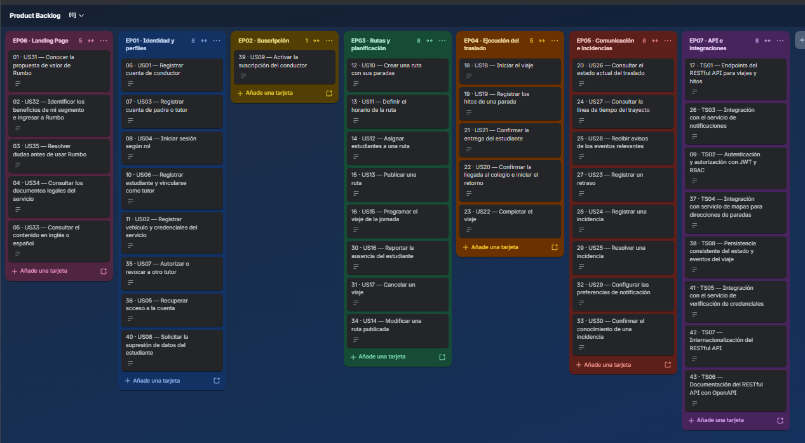

<div align="center">

# UNIVERSIDAD PERUANA DE CIENCIAS APLICADAS


### Ingeniería de Software

### Ciclo Académico: 2026-20

### Código: 1ASI0730

### Curso: Aplicaciones Web

### NRC: 8137

### Docente: [Nombre del docente]

# Informe de Trabajo Final

### Startup: AIpaca

### Producto: Nexo Kids

### Integrantes

| Apellidos y Nombres | Código de Alumno | GitHub Username |
|---|---|---|
| [Integrante 1] | [Código 1] | [usuario1] |
| [Integrante 2] | [Código 2] | [usuario2] |
| [Integrante 3] | [Código 3] | [usuario3] |
| [Integrante 4] | [Código 4] | [usuario4] |
| [Integrante 5] | [Código 5] | [usuario5] |

### SEPTIEMBRE - 2026

</div>

---

## Registro de Versiones del Informe

| Versión | Fecha | Autor(es) | Descripción de cambios |
|---|---|---|---|
| 0.1 | 07/09/2026 | linolw | Creación inicial del repositorio e informe del proyecto. |
| 0.2 | 07/09/2026 | linolw | Preparación de la estructura base del informe para TB1. |
| 0.3 | 07/09/2026 | linolw | Incorporación del checklist y alcance requerido para la entrega. |
| 0.4 | 07/09/2026 | linolw | Alineación del contenido con el Final Project Statement de Aplicaciones Web. |
| 0.5 | 07/09/2026 | linolw | Reestructuración del informe siguiendo el formato de proyectos de ciclos anteriores y adecuación exclusiva al curso de Aplicaciones Web. |

> A partir de este punto, cada integrante debe agregar una nueva fila cuando realice una modificación relevante en el informe. El registro debe mantener coherencia con el historial de commits del repositorio.

---

## Project Report Collaboration Insights

- **URL de la organización del proyecto:**  
  https://github.com/AIpaca-UPC

- **URL del repositorio del informe del proyecto:**  
  https://github.com/AIpaca-UPC/web-applications-project-report

- **URL del repositorio del Landing Page:**  
  https://github.com/AIpaca-UPC/landing-page

- **URL del repositorio del Frontend Web Application:**  
  https://github.com/AIpaca-UPC/web-applications-web-app

- **URL del repositorio del Web Service:**  
  https://github.com/AIpaca-UPC/web-applications-web-service

### AV1

En AV1 el equipo debe evidenciar la elaboración colaborativa del informe y de la primera versión del Landing Page mediante capturas del historial de commits, contributors, branches, pull requests y network graph del repositorio. Las evidencias deben mostrar la participación real de los cinco integrantes y mantener relación con el Registro de Versiones del Informe.

**Evidencias por incorporar:**

- Team Collaboration Commits.
- Team Collaboration Network.
- Contributors del Project Report.
- Principales Pull Requests realizados.

### TB1

Para TB1 se debe actualizar la evidencia anterior y mostrar los cambios realizados luego de AV1. Además de mejorar los artefactos ya presentados, el equipo debe registrar el trabajo correspondiente al Sprint 2 y la primera versión desplegada del Frontend Web Application.

**Evidencias por incorporar:**

- Historial de commits actualizado.
- Network Graph actualizado.
- Pull Requests y merges realizados.
- Participación de los cinco integrantes en el informe.
- Evidencia de colaboración en Landing Page y Frontend Web Application según el alcance del Sprint.

---

# Contenido

## Tabla de Contenidos

- [Student Outcome](#student-outcome)

- [Capítulo I: Introducción](#capítulo-i-introducción)
  - [1.1. Startup Profile](#11-startup-profile)
    - [1.1.1. Descripción de la Startup](#111-descripción-de-la-startup)
    - [1.1.2. Perfiles de integrantes del equipo](#112-perfiles-de-integrantes-del-equipo)
  - [1.2. Solution Profile](#12-solution-profile)
    - [1.2.1. Antecedentes y problemática](#121-antecedentes-y-problemática)
    - [1.2.2. Lean UX Process](#122-lean-ux-process)
      - [1.2.2.1. Lean UX Problem Statements](#1221-lean-ux-problem-statements)
      - [1.2.2.2. Lean UX Assumptions](#1222-lean-ux-assumptions)
      - [1.2.2.3. Lean UX Hypothesis Statements](#1223-lean-ux-hypothesis-statements)
      - [1.2.2.4. Lean UX Canvas](#1224-lean-ux-canvas)
  - [1.3. Segmentos objetivo](#13-segmentos-objetivo)

- [Capítulo II: Requirements Elicitation & Analysis](#capítulo-ii-requirements-elicitation--analysis)
  - [2.1. Competidores](#21-competidores)
    - [2.1.1. Análisis competitivo](#211-análisis-competitivo)
    - [2.1.2. Estrategias y tácticas frente a competidores](#212-estrategias-y-tácticas-frente-a-competidores)
  - [2.2. Entrevistas](#22-entrevistas)
    - [2.2.1. Diseño de entrevistas](#221-diseño-de-entrevistas)
    - [2.2.2. Registro de entrevistas](#222-registro-de-entrevistas)
    - [2.2.3. Análisis de entrevistas](#223-análisis-de-entrevistas)
  - [2.3. Needfinding](#23-needfinding)
    - [2.3.1. User Personas](#231-user-personas)
    - [2.3.2. User Task Matrix](#232-user-task-matrix)
    - [2.3.3. User Journey Mapping](#233-user-journey-mapping)
    - [2.3.4. Empathy Mapping](#234-empathy-mapping)
  - [2.4. Big Picture Event Storming](#24-big-picture-event-storming)
  - [2.5. Ubiquitous Language](#25-ubiquitous-language)

- [Capítulo III: Requirements Specification](#capítulo-iii-requirements-specification)
  - [3.1. User Stories](#31-user-stories)
  - [3.2. Impact Mapping](#32-impact-mapping)
  - [3.3. Product Backlog](#33-product-backlog)

- [Capítulo IV: Product Design](#capítulo-iv-product-design)
  - [4.1. Style Guidelines](#41-style-guidelines)
    - [4.1.1. General Style Guidelines](#411-general-style-guidelines)
    - [4.1.2. Web Style Guidelines](#412-web-style-guidelines)
  - [4.2. Information Architecture](#42-information-architecture)
    - [4.2.1. Organization Systems](#421-organization-systems)
    - [4.2.2. Labeling Systems](#422-labeling-systems)
    - [4.2.3. SEO Tags and Meta Tags](#423-seo-tags-and-meta-tags)
    - [4.2.4. Searching Systems](#424-searching-systems)
    - [4.2.5. Navigation Systems](#425-navigation-systems)
  - [4.3. Landing Page UI Design](#43-landing-page-ui-design)
    - [4.3.1. Landing Page Wireframe](#431-landing-page-wireframe)
    - [4.3.2. Landing Page Mock-up](#432-landing-page-mock-up)
  - [4.4. Web Applications UX/UI Design](#44-web-applications-uxui-design)
    - [4.4.1. Web Applications Wireframes](#441-web-applications-wireframes)
    - [4.4.2. Web Applications Wireflow Diagrams](#442-web-applications-wireflow-diagrams)
    - [4.4.3. Web Applications Mock-ups](#443-web-applications-mock-ups)
    - [4.4.4. Web Applications User Flow Diagrams](#444-web-applications-user-flow-diagrams)
  - [4.5. Web Applications Prototyping](#45-web-applications-prototyping)
  - [4.6. Domain-Driven Software Architecture](#46-domain-driven-software-architecture)
    - [4.6.1. Design-Level Event Storming](#461-design-level-event-storming)
    - [4.6.2. Software Architecture Context Diagram](#462-software-architecture-context-diagram)
    - [4.6.3. Software Architecture Container Diagrams](#463-software-architecture-container-diagrams)
    - [4.6.4. Software Architecture Components Diagrams](#464-software-architecture-components-diagrams)
  - [4.7. Software Object-Oriented Design](#47-software-object-oriented-design)
    - [4.7.1. Class Diagrams](#471-class-diagrams)
  - [4.8. Database Design](#48-database-design)
    - [4.8.1. Database Diagrams](#481-database-diagrams)

- [Capítulo V: Product Implementation, Validation & Deployment](#capítulo-v-product-implementation-validation--deployment)
  - [5.1. Software Configuration Management](#51-software-configuration-management)
    - [5.1.1. Software Development Environment Configuration](#511-software-development-environment-configuration)
    - [5.1.2. Source Code Management](#512-source-code-management)
    - [5.1.3. Source Code Style Guide & Conventions](#513-source-code-style-guide--conventions)
    - [5.1.4. Software Deployment Configuration](#514-software-deployment-configuration)
  - [5.2. Landing Page, Services & Applications Implementation](#52-landing-page-services--applications-implementation)
    - [5.2.1. Sprint 1](#521-sprint-1)
      - [5.2.1.1. Sprint Planning 1](#5211-sprint-planning-1)
      - [5.2.1.2. Aspect Leaders and Collaborators](#5212-aspect-leaders-and-collaborators)
      - [5.2.1.3. Sprint Backlog 1](#5213-sprint-backlog-1)
      - [5.2.1.4. Development Evidence for Sprint Review](#5214-development-evidence-for-sprint-review)
      - [5.2.1.5. Execution Evidence for Sprint Review](#5215-execution-evidence-for-sprint-review)
      - [5.2.1.6. Services Documentation Evidence for Sprint Review](#5216-services-documentation-evidence-for-sprint-review)
      - [5.2.1.7. Software Deployment Evidence for Sprint Review](#5217-software-deployment-evidence-for-sprint-review)
      - [5.2.1.8. Team Collaboration Insights during Sprint](#5218-team-collaboration-insights-during-sprint)
    - [5.2.2. Sprint 2](#522-sprint-2)
      - [5.2.2.1. Sprint Planning 2](#5221-sprint-planning-2)
      - [5.2.2.2. Aspect Leaders and Collaborators](#5222-aspect-leaders-and-collaborators)
      - [5.2.2.3. Sprint Backlog 2](#5223-sprint-backlog-2)
      - [5.2.2.4. Development Evidence for Sprint Review](#5224-development-evidence-for-sprint-review)
      - [5.2.2.5. Execution Evidence for Sprint Review](#5225-execution-evidence-for-sprint-review)
      - [5.2.2.6. Services Documentation Evidence for Sprint Review](#5226-services-documentation-evidence-for-sprint-review)
      - [5.2.2.7. Software Deployment Evidence for Sprint Review](#5227-software-deployment-evidence-for-sprint-review)
      - [5.2.2.8. Team Collaboration Insights during Sprint](#5228-team-collaboration-insights-during-sprint)

- [Conclusiones](#conclusiones)
- [Bibliografía](#bibliografía)
- [Anexos](#anexos)

---

# Student Outcome

El curso contribuye al cumplimiento del **ABET – EAC – Student Outcome 5**:

> La capacidad de funcionar efectivamente en un equipo cuyos miembros juntos proporcionan liderazgo, crean un entorno de colaboración e inclusivo, establecen objetivos, planifican tareas y cumplen objetivos.

En el siguiente cuadro se describen las acciones realizadas y las conclusiones del equipo que permiten sustentar el desarrollo del Student Outcome durante el proyecto. En cada entrega se deben agregar las acciones concretas de cada integrante.

| Criterio específico | Acciones realizadas | Conclusiones |
|---|---|---|
| Trabaja en equipo para proporcionar liderazgo en forma conjunta. | **[Integrante 1]** — AV1: [acción]. TB1: [acción].  <br> **[Integrante 2]** — AV1: [acción]. TB1: [acción].  <br> **[Integrante 3]** — AV1: [acción]. TB1: [acción].  <br> **[Integrante 4]** — AV1: [acción]. TB1: [acción].  <br> **[Integrante 5]** — AV1: [acción]. TB1: [acción]. | [Conclusión grupal basada en la distribución de liderazgo, coordinación y cumplimiento de responsabilidades.] |
| Crea un entorno colaborativo e inclusivo, establece metas, planifica tareas y cumple objetivos. | **[Integrante 1]** — AV1: [acción]. TB1: [acción].  <br> **[Integrante 2]** — AV1: [acción]. TB1: [acción].  <br> **[Integrante 3]** — AV1: [acción]. TB1: [acción].  <br> **[Integrante 4]** — AV1: [acción]. TB1: [acción].  <br> **[Integrante 5]** — AV1: [acción]. TB1: [acción]. | [Conclusión grupal basada en Sprint Planning, Product Backlog, Sprint Backlog, LACX, reuniones y resultados alcanzados.] |

---

# Capítulo I: Introducción

## 1.1. Startup Profile

### 1.1.1. Descripción de la Startup

**AIpaca** es una startup tecnológica orientada a desarrollar soluciones digitales para mejorar la coordinación entre las personas responsables del cuidado cotidiano de menores. Su propuesta busca centralizar información que actualmente suele encontrarse distribuida entre llamadas, mensajes y confirmaciones aisladas de padres, cuidadores, personal de movilidad escolar y personal de instituciones educativas.

La startup desarrolla **Nexo Kids**, una plataforma SaaS que registra los principales eventos de la rutina diaria del menor y permite visualizar de manera ordenada quién se encuentra a cargo, qué cambios de responsabilidad se han producido y qué eventos relevantes han ocurrido durante el día.

La visión del equipo es ofrecer una experiencia clara y confiable para las familias, evitando que el valor del producto dependa únicamente de mostrar una ubicación en un mapa. El foco se encuentra en brindar contexto sobre el estado del menor, facilitar las confirmaciones entre responsables y mantener una secuencia comprensible de los eventos ocurridos durante la jornada.

### 1.1.2. Perfiles de integrantes del equipo

Cada perfil deberá incluir fotografía, nombres y apellidos, código UPC, carrera, principales conocimientos técnicos y habilidades que el integrante aporta al proyecto.

#### [Integrante 1]


- **Código:** [Código]
- **Carrera:** Ingeniería de Software
- **GitHub:** [usuario]
- **Conocimientos técnicos:** [Completar]
- **Habilidades:** [Completar]

#### [Integrante 2]


- **Código:** [Código]
- **Carrera:** Ingeniería de Software
- **GitHub:** [usuario]
- **Conocimientos técnicos:** [Completar]
- **Habilidades:** [Completar]

#### [Integrante 3]


- **Código:** [Código]
- **Carrera:** Ingeniería de Software
- **GitHub:** [usuario]
- **Conocimientos técnicos:** [Completar]
- **Habilidades:** [Completar]

#### [Integrante 4]


- **Código:** [Código]
- **Carrera:** Ingeniería de Software
- **GitHub:** [usuario]
- **Conocimientos técnicos:** [Completar]
- **Habilidades:** [Completar]

#### [Integrante 5]


- **Código:** [Código]
- **Carrera:** Ingeniería de Software
- **GitHub:** [usuario]
- **Conocimientos técnicos:** [Completar]
- **Habilidades:** [Completar]

## 1.2. Solution Profile

### 1.2.1. Antecedentes y problemática

La rutina escolar de un menor puede involucrar varios responsables durante un mismo día. El menor puede encontrarse primero bajo el cuidado de un adulto en casa, luego ser entregado al conductor de la movilidad escolar, posteriormente quedar bajo responsabilidad de la institución educativa y, al finalizar la jornada, pasar nuevamente por el proceso inverso.

En muchos casos estas confirmaciones se realizan mediante llamadas, chats o mensajes independientes. Esto dificulta que los padres tengan una visión única y ordenada de lo ocurrido y puede generar incertidumbre cuando desean conocer quién se encuentra a cargo, si el traslado se realizó con normalidad o si ocurrió una incidencia.

Nexo Kids busca centralizar estos eventos en una experiencia digital que muestre de forma comprensible el estado actual del menor y el historial de cambios de responsabilidad. La plataforma no pretende reemplazar los protocolos físicos de seguridad de colegios o empresas de transporte, sino complementar su coordinación mediante registros y notificaciones digitales.

#### Análisis preliminar 5W+2H

| Dimensión | Análisis |
|---|---|
| **Who?** | Padres o tutores, cuidadores, conductores de movilidad escolar y personal autorizado de instituciones educativas. |
| **What?** | Información fragmentada sobre entregas, recepciones, traslados y cambios de responsable durante la rutina diaria del menor. |
| **Where?** | Hogar, transporte escolar e institución educativa. |
| **When?** | Durante check-in del cuidador, recojos, traslados, ingresos, salidas y entregas. |
| **Why?** | Los distintos actores utilizan canales separados y no siempre existe un registro unificado que permita conocer el estado y reconstruir la secuencia de eventos. |
| **How?** | Mediante una plataforma web que centralice estados, handoffs, eventos, incidencias y notificaciones. |
| **How Much?** | [Completar con resultados de entrevistas y fuentes estadísticas verificables.] |

### 1.2.2. Lean UX Process

#### 1.2.2.1. Lean UX Problem Statements

**Problem Statement — Brand New Initiative**

> The current state of child-care coordination during school-day routines has focused mainly on isolated communication between parents, caregivers, school transportation staff and educational institutions. What existing products and services fail to address is a unified and understandable view of responsibility handoffs and relevant events across home, transportation and school. Our product will address this gap by providing a digital platform that centralizes responsibility confirmations, trip status, daily events and notifications. Our initial focus will be families that coordinate recurring school-day handoffs with caregivers and school transportation services. We will know we are successful when users can identify the current responsible person, confirm the main handoffs and review relevant daily events with less dependence on fragmented communication channels.

#### 1.2.2.2. Lean UX Assumptions

##### Business Assumptions

1. Creemos que las familias valoran una herramienta que centralice los eventos de cuidado y traslado del menor.
2. Creemos que la información sobre quién se encuentra a cargo puede generar más valor que una solución centrada únicamente en GPS.
3. Creemos que cuidadores y conductores utilizarán la plataforma si las acciones requeridas son rápidas y simples.
4. Creemos que existe posibilidad de ofrecer el producto bajo un modelo SaaS para familias y, posteriormente, para organizaciones vinculadas al transporte o educación.

##### Business Outcome Assumptions

1. Incrementar el porcentaje de jornadas en las que se registran los principales cambios de responsable.
2. Lograr que los padres consulten de manera recurrente el estado y timeline diario.
3. Reducir la necesidad de llamadas o mensajes manuales para confirmar situaciones rutinarias.
4. Obtener intención de uso o adopción positiva en las entrevistas de validación del producto.

##### User Assumptions

1. Los padres necesitan conocer quién se encuentra a cargo y qué ocurrió recientemente.
2. Los cuidadores necesitan confirmar check-in, entrega y recepción sin procesos extensos.
3. Los conductores requieren una experiencia enfocada en los menores y rutas que tienen asignadas.
4. El personal autorizado del colegio necesita confirmar ingresos o salidas con la mínima información necesaria.

##### User Outcome and Benefit Assumptions

1. Los padres desean reducir la incertidumbre durante la rutina diaria del menor.
2. Los cuidadores desean contar con evidencia sencilla de las entregas y recepciones realizadas.
3. Los conductores desean registrar los hitos del recorrido sin distraerse de su función principal.
4. Las instituciones desean mantener registros claros de los eventos que les corresponden.

##### Feature Assumptions

1. Timeline diario del menor con hora, estado y responsable.
2. Handoffs mediante PIN o QR.
3. Vista del estado actual y responsable vigente.
4. Estado del trayecto y mapa durante el transporte autorizado.
5. Notificaciones de cambios relevantes e incidencias.
6. Gestión de personas autorizadas para entrega y recepción.

#### 1.2.2.3. Lean UX Hypothesis Statements

**Hypothesis 01**  
We believe we will achieve greater recurrent use of the platform if parents attain a clear understanding of the child's daily status with a chronological timeline of relevant events.

**Hypothesis 02**  
We believe we will achieve more reliable handoff records if caregivers and drivers attain a fast confirmation process with PIN or QR-based handoff validation.

**Hypothesis 03**  
We believe we will achieve greater perceived trust if parents attain immediate visibility of the current responsible person with a current-status dashboard.

**Hypothesis 04**  
We believe we will achieve greater value during school transportation if parents attain visibility of trip progress with transportation status and location information.

**Hypothesis 05**  
We believe we will achieve faster response to relevant situations if parents attain timely awareness with contextual notifications and incident alerts.

**Hypothesis 06**  
We believe we will achieve safer and clearer responsibility changes if parents attain control over who can receive or deliver the child with authorized-person management.

#### 1.2.2.4. Lean UX Canvas

En esta sección se incorporará la captura del Lean UX Canvas elaborado por el equipo, manteniendo coherencia con el Problem Statement, los Assumptions y los Hypothesis Statements definidos previamente.


## 1.3. Segmentos objetivo

Para el análisis inicial se consideran los siguientes segmentos:

### Segmento 1: Padres o tutores

Adultos responsables de menores en edad escolar que necesitan coordinar de manera recurrente el cuidado y traslado de sus hijos con terceros. Buscan información clara, oportuna y fácil de consultar durante la jornada.

### Segmento 2: Cuidadores o nanas

Personas responsables del cuidado del menor en el hogar que participan en procesos de check-in, entrega, recepción y comunicación de incidencias.

### Segmento 3: Conductores o responsables de movilidad escolar

Personas encargadas de recoger, transportar y entregar menores siguiendo rutas y horarios definidos. Necesitan registrar hitos del trayecto de manera rápida y con acceso restringido a la información necesaria.

> Se deben complementar los tres segmentos con información demográfica y fuentes estadísticas de sustento.

---

# Capítulo II: Requirements Elicitation & Analysis

## 2.1. Competidores

### 2.1.1. Análisis competitivo

El análisis competitivo debe considerar al menos tres soluciones relacionadas con seguridad familiar, movilidad escolar, seguimiento de ubicación o coordinación entre responsables. Para cada competidor se debe estudiar su perfil, modelo de negocio, estrategia de marketing, características del producto y análisis SWOT.

| Criterio | Competidor 1 | Competidor 2 | Competidor 3 | Nexo Kids |
|---|---|---|---|---|
| Perfil | [Completar] | [Completar] | [Completar] | Plataforma SaaS para coordinación de cuidado y handoffs. |
| Segmentos | [Completar] | [Completar] | [Completar] | Padres, cuidadores, movilidad y personal autorizado. |
| Propuesta principal | [Completar] | [Completar] | [Completar] | Estado + responsable + timeline + eventos. |
| Seguimiento de transporte | [Completar] | [Completar] | [Completar] | Sí. |
| Cambio de responsable | [Completar] | [Completar] | [Completar] | Sí. |
| Historial de eventos | [Completar] | [Completar] | [Completar] | Sí. |
| Fortalezas | [Completar] | [Completar] | [Completar] | [Completar tras benchmark.] |
| Debilidades | [Completar] | [Completar] | [Completar] | [Completar tras benchmark.] |

### 2.1.2. Estrategias y tácticas frente a competidores

A partir del benchmark, el equipo debe identificar las oportunidades que permitan diferenciar Nexo Kids. La estrategia preliminar consiste en evitar competir únicamente como una aplicación de GPS y concentrar la propuesta en la continuidad del cuidado: quién se encuentra a cargo, qué cambio de responsabilidad ocurrió, cuándo ocurrió y qué evento relevante se registró durante la jornada.

---

## 2.2. Entrevistas

### 2.2.1. Diseño de entrevistas

Las entrevistas se realizarán de manera semiestructurada y se adaptarán al segmento del entrevistado. Las preguntas deben permitir conocer comportamiento actual, necesidades, frustraciones, herramientas utilizadas, dispositivos, canales digitales, frecuencia de las tareas y percepción de la propuesta.

#### Preguntas para padres o tutores

1. ¿Cómo se organiza actualmente para saber quién está a cargo de su hijo durante el día?
2. ¿Cómo confirma que su hijo fue recogido, llegó al colegio o regresó a casa?
3. ¿En qué situaciones suele llamar o enviar mensajes para pedir confirmación?
4. ¿Qué información considera más importante durante un traslado escolar?
5. ¿Ha utilizado alguna aplicación de ubicación o seguimiento familiar? ¿Qué le resultó útil o incómodo?
6. ¿Qué tan importante sería conocer quién aparece como responsable actual del menor?
7. ¿Qué tipo de alertas considera realmente necesarias?
8. ¿Qué información no estaría dispuesto a compartir en una plataforma de este tipo?
9. ¿Desde qué dispositivo realizaría principalmente estas consultas?
10. ¿Qué tendría que ofrecer una solución para que considere usarla con frecuencia?

#### Preguntas para cuidadores

1. ¿Cómo informa actualmente al padre que inició o terminó su jornada?
2. ¿Cómo confirma la entrega del menor a otra persona?
3. ¿Qué dificultades aparecen durante estos cambios de responsabilidad?
4. ¿Qué acciones registra o comunica durante un día normal?
5. ¿Qué información necesita conocer antes de entregar al menor?
6. ¿Qué tan cómodo sería confirmar una entrega mediante PIN o QR?
7. ¿Qué datos considera innecesarios para cumplir su trabajo?
8. ¿Qué tipo de incidencia debería poder reportar rápidamente?

#### Preguntas para movilidad escolar

1. ¿Cómo se informa actualmente a los padres sobre recojos, retrasos o llegadas?
2. ¿Cómo se verifica que el menor subió o bajó del vehículo?
3. ¿Qué información necesita el conductor sobre cada menor asignado?
4. ¿Qué situaciones generan más llamadas o mensajes de los padres?
5. ¿Cómo se gestionan actualmente retrasos, desvíos o incidencias?
6. ¿Qué acciones podrían confirmarse en una aplicación sin distraer al conductor?
7. ¿Qué restricciones debería tener el acceso del conductor a la información del menor?
8. ¿Qué datos del trayecto considera útil compartir con las familias?

### 2.2.2. Registro de entrevistas

Se deben realizar entre **3 y 5 entrevistas por segmento**. Cada registro deberá incluir nombre, edad, distrito, segmento, captura de video, URL de Microsoft Stream, timing de inicio, duración y un resumen de las principales respuestas.

| # | Entrevistado | Edad | Distrito | Segmento | Video / Stream | Inicio | Duración | Resumen |
|---:|---|---:|---|---|---|---|---|---|
| 1 | [Completar] | [ ] | [ ] | Padres | [URL] | [ ] | [ ] | [ ] |
| 2 | [Completar] | [ ] | [ ] | Padres | [URL] | [ ] | [ ] | [ ] |
| 3 | [Completar] | [ ] | [ ] | Padres | [URL] | [ ] | [ ] | [ ] |
| 4 | [Completar] | [ ] | [ ] | Cuidadores | [URL] | [ ] | [ ] | [ ] |
| 5 | [Completar] | [ ] | [ ] | Cuidadores | [URL] | [ ] | [ ] | [ ] |
| 6 | [Completar] | [ ] | [ ] | Cuidadores | [URL] | [ ] | [ ] | [ ] |
| 7 | [Completar] | [ ] | [ ] | Movilidad | [URL] | [ ] | [ ] | [ ] |
| 8 | [Completar] | [ ] | [ ] | Movilidad | [URL] | [ ] | [ ] | [ ] |
| 9 | [Completar] | [ ] | [ ] | Movilidad | [URL] | [ ] | [ ] | [ ] |

### 2.2.3. Análisis de entrevistas

El análisis debe realizarse por segmento y utilizar porcentajes obtenidos exclusivamente de las entrevistas registradas.

| Variable | Padres | Cuidadores | Movilidad |
|---|---:|---:|---:|
| Usa WhatsApp o llamadas para confirmar eventos | [%] | [%] | [%] |
| Considera importante conocer al responsable actual | [%] | [%] | [%] |
| Considera útil registrar entregas/recepciones | [%] | [%] | [%] |
| Utiliza principalmente smartphone | [%] | [%] | [%] |
| Valora alertas de retraso o incidencia | [%] | [%] | [%] |

---

## 2.3. Needfinding

### 2.3.1. User Personas

Se elaborará un User Persona por cada segmento objetivo utilizando UXPressia. Cada ficha deberá derivarse de los patrones observados en las entrevistas e incluir información como objetivos, frustraciones, comportamiento, dispositivos, canales digitales, influencias y contexto de uso.


### 2.3.2. User Task Matrix

| Tarea | Parent Persona | Caregiver Persona | Driver Persona |
|---|---|---|---|
| Confirmar quién está a cargo | Alta / Alta | Media / Alta | Media / Alta |
| Confirmar entrega o recepción | Media / Alta | Alta / Alta | Alta / Alta |
| Consultar estado del trayecto | Alta / Alta | Baja / Baja | Alta / Alta |
| Comunicar retraso o incidencia | Media / Alta | Media / Alta | Alta / Alta |
| Revisar eventos del día | Alta / Media | Media / Baja | Baja / Baja |

> La frecuencia e importancia deberán ajustarse con los resultados reales de las entrevistas.

### 2.3.3. User Journey Mapping

Se debe elaborar un **As-Is User Journey Map por User Persona**, representando la experiencia actual sin Nexo Kids. Cada journey debe mostrar acciones, puntos de contacto, pensamientos, emociones, pains y oportunidades.


### 2.3.4. Empathy Mapping

Se debe elaborar un Empathy Map por User Persona considerando: qué dice, piensa, hace, escucha, ve, pains y gains.


---

## 2.4. Big Picture Event Storming

El Big Picture Event Storming permitirá representar los principales eventos del dominio desde una perspectiva de negocio. De manera preliminar, el flujo considera eventos como `Caregiver Checked In`, `Child Handed Over`, `Trip Started`, `Child Arrived At School`, `School Entry Confirmed`, `Incident Reported` y `Child Returned Home`.


---

## 2.5. Ubiquitous Language

Los términos del Ubiquitous Language se mantienen en inglés, mientras que sus definiciones pueden redactarse en español.

| Término | Definición |
|---|---|
| **Child** | Menor registrado dentro de una familia y asociado a una rutina de cuidado y traslado. |
| **Guardian** | Padre, madre o tutor responsable de administrar la información y autorizaciones del menor. |
| **Caregiver** | Persona autorizada para asumir el cuidado del menor en el hogar o durante una franja determinada. |
| **Driver** | Persona asignada a un servicio de movilidad escolar y responsable de registrar hitos del traslado. |
| **Responsible Party** | Persona o institución que aparece como responsable actual del menor en un momento determinado. |
| **Handoff** | Cambio de responsabilidad entre dos actores autorizados. |
| **Trip** | Traslado del menor dentro de una ruta autorizada. |
| **Trip Event** | Evento registrado durante un traslado, como recojo, inicio, llegada, retraso o descenso. |
| **Daily Timeline** | Secuencia cronológica de eventos relevantes registrados durante la jornada del menor. |
| **Authorized Person** | Persona que cuenta con autorización vigente para entregar o recibir al menor. |
| **Incident** | Situación fuera del flujo esperado que requiere ser registrada y comunicada. |
| **Notification** | Comunicación emitida por la plataforma a partir de un evento o regla configurada. |

---

# Capítulo III: Requirements Specification

## 3.1. User Stories

Las User Stories deben cubrir el alcance del Landing Page y del Frontend Web Application. Los Acceptance Criteria deberán expresarse mediante escenarios **Given-When-Then**, salvo reglas de negocio o restricciones que correspondan mejor a una lista de reglas.

| Epic / Story ID | Título | Descripción | Criterios de Aceptación | Relacionado con |
|---|---|---|---|---|
| EP01 | Landing Page | Como visitante, deseo conocer la propuesta de Nexo Kids para decidir si la solución resulta relevante para mi contexto. | — | — |
| US01 | View Value Proposition | Como visitante, deseo conocer claramente el propósito de Nexo Kids para entender el problema que resuelve. | **Given** que el visitante accede al Landing Page, **When** visualiza la sección principal, **Then** el sistema muestra la propuesta de valor, segmentos principales y CTA. | EP01 |
| US02 | View Product Features | Como visitante, deseo revisar las principales funcionalidades para comprender qué ofrece la plataforma. | **Given** que el visitante se encuentra en el Landing Page, **When** navega a la sección de funcionalidades, **Then** visualiza información sobre timeline, handoffs, transporte y alertas. | EP01 |
| US03 | Contact Startup | Como visitante, deseo encontrar información de contacto para comunicarme con la startup. | **Given** que el visitante revisa el Landing Page, **When** llega a la sección de contacto, **Then** visualiza medios de contacto y accesos a redes sociales. | EP01 |
| EP02 | Daily Care Coordination | Como usuario, deseo consultar y registrar información relacionada con la jornada diaria del menor. | — | — |
| US04 | View Current Status | Como padre o tutor, deseo visualizar el estado actual del menor y responsable vigente para conocer su situación rápidamente. | **Given** que el usuario cuenta con un menor asociado, **When** abre el dashboard, **Then** visualiza el estado actual, responsable y último evento confirmado. | EP02 |
| US05 | View Daily Timeline | Como padre o tutor, deseo consultar la línea de tiempo diaria para revisar los eventos ocurridos durante la jornada. | **Given** que existen eventos registrados, **When** el usuario abre el timeline, **Then** el sistema muestra los eventos ordenados cronológicamente con hora y estado. | EP02 |
| US06 | Confirm Handoff | Como cuidador, deseo confirmar la entrega del menor para registrar el cambio de responsable. | **Given** que existe una entrega programada, **When** se valida el PIN o QR correspondiente, **Then** el sistema registra la hora, participantes y nuevo responsable. | EP02 |
| US07 | View Trip Status | Como padre o tutor, deseo consultar el estado del traslado para conocer el avance de la movilidad escolar. | **Given** que existe un viaje activo, **When** el usuario consulta el estado, **Then** visualiza estado, ubicación disponible y último hito registrado. | EP02 |
| US08 | Report Incident | Como cuidador o conductor, deseo registrar una incidencia para informar oportunamente a los responsables. | **Given** que ocurre una situación fuera del flujo esperado, **When** el usuario registra la incidencia, **Then** se guarda el detalle y se genera la notificación correspondiente. | EP02 |

## 3.2. Impact Mapping

El Impact Mapping debe partir de Business Goals SMART y conectarlos con Actors, Impacts, Deliverables y User Stories.

### Business Goals preliminares

1. Lograr que al menos el **70 % de los usuarios participantes en las validaciones de TB1** pueda identificar correctamente quién aparece como responsable actual sin ayuda del equipo.
2. Lograr que al menos el **70 % de los usuarios participantes en las validaciones de TB1** pueda completar el flujo principal asignado sin intervención del evaluador.
3. Conseguir que al menos el **70 % de los padres entrevistados en validación** manifieste intención de utilizar una solución que centralice cambios de responsable y eventos de la jornada.


## 3.3. Product Backlog

| # Orden | User Story ID | Título | Descripción | Story Points |
|---:|---|---|---|---:|
| 1 | US01 | View Value Proposition | Como visitante, deseo conocer claramente el propósito de Nexo Kids para entender el problema que resuelve. | 3 |
| 2 | US02 | View Product Features | Como visitante, deseo revisar las principales funcionalidades para comprender qué ofrece la plataforma. | 3 |
| 3 | US03 | Contact Startup | Como visitante, deseo encontrar información de contacto para comunicarme con la startup. | 2 |
| 4 | US04 | View Current Status | Como padre o tutor, deseo visualizar el estado actual y responsable vigente del menor. | 5 |
| 5 | US05 | View Daily Timeline | Como padre o tutor, deseo consultar la línea de tiempo diaria del menor. | 5 |
| 6 | US06 | Confirm Handoff | Como cuidador, deseo confirmar la entrega del menor para registrar el cambio de responsable. | 8 |
| 7 | US07 | View Trip Status | Como padre o tutor, deseo consultar el estado del traslado escolar. | 8 |
| 8 | US08 | Report Incident | Como cuidador o conductor, deseo registrar una incidencia para informar a los responsables. | 5 |

**URL público del Product Backlog:** [Completar]



---

# Capítulo IV: Product Design

## 4.1. Style Guidelines

### 4.1.1. General Style Guidelines

La identidad visual de Nexo Kids debe transmitir claridad, cuidado y confianza sin recurrir a una apariencia infantil excesiva. La interfaz debe priorizar la lectura rápida del estado actual, eventos y alertas.

- **Branding:** orientado a cuidado, conexión y continuidad.
- **Typography:** tipografías sans-serif con buena legibilidad en desktop y mobile.
- **Colors:** una paleta principal sobria complementada con colores semánticos para estados informativos, de atención y críticos.
- **Spacing:** uso consistente de espaciado para separar tarjetas, eventos y grupos de información.
- **Tone of Voice:** respetuoso, claro, sereno y directo.

### 4.1.2. Web Style Guidelines

La experiencia web utilizará **Material Design** como referencia visual y **PrimeVue** como biblioteca de componentes. Las vistas deberán aplicar Responsive Web Design, accesibilidad mediante ARIA y soporte de internacionalización.

El idioma por defecto de la interfaz será **English (en_US)** y se considerará **Latin American Spanish (es_419)** como idioma adicional.

---

## 4.2. Information Architecture

### 4.2.1. Organization Systems

- **Landing Page:** organización jerárquica: Hero → problema → propuesta → funcionalidades → segmentos → CTA → contacto.
- **Web App:** organización por tareas principales: Overview, Timeline, Trips, Handoffs, Incidents y Authorized People.
- **Historial:** organización cronológica descendente por fecha y hora.

### 4.2.2. Labeling Systems

Las etiquetas de interfaz deben utilizar términos claros y breves. Para la versión principal en inglés se proponen: `Overview`, `Today`, `Timeline`, `Trips`, `Handoffs`, `Incidents`, `Authorized People` y `Settings`.

### 4.2.3. SEO Tags and Meta Tags

El Landing Page deberá incluir al menos:

```html
<title>Nexo Kids | Daily Care Coordination</title>
<meta name="description" content="Nexo Kids helps families coordinate daily child-care handoffs, school transportation and relevant events in one place.">
<meta name="viewport" content="width=device-width, initial-scale=1.0">
<meta name="robots" content="index, follow">
```

### 4.2.4. Searching Systems

Para TB1 se considera búsqueda y filtrado dentro del historial cuando el volumen de eventos lo requiera. Los filtros iniciales podrán incluir fecha, tipo de evento e incidencia.

### 4.2.5. Navigation Systems

- Landing Page: navegación global mediante menú superior y anchors.
- Web App: navegación persistente mediante sidebar o navigation drawer según breakpoint.
- Vistas móviles: navegación adaptada al espacio disponible.

---

## 4.3. Landing Page UI Design

### 4.3.1. Landing Page Wireframe

El wireframe debe incluir como mínimo Hero, propuesta de valor, problema, funcionalidades, segmentos, screenshots o preview del producto, CTA, contacto y redes sociales.


### 4.3.2. Landing Page Mock-up


---

## 4.4. Web Applications UX/UI Design

### 4.4.1. Web Applications Wireframes

Los wireframes de TB1 deben cubrir los principales User Goals del primer Frontend Web Application, priorizando el dashboard del padre, timeline y flujos incluidos en Sprint 2.


### 4.4.2. Web Applications Wireflow Diagrams

Se debe elaborar un wireflow por cada User Goal incluido en el alcance de TB1, considerando tanto la ruta esperada como las transiciones necesarias entre vistas.


### 4.4.3. Web Applications Mock-ups


### 4.4.4. Web Applications User Flow Diagrams

Los User Flow Diagrams deben incluir el happy path y los unhappy paths relevantes para cada User Goal.


---

## 4.5. Web Applications Prototyping

El prototipo se elaborará en Figma para Desktop y Mobile Web Browser, manteniendo consistencia con los User Flows y con las decisiones de arquitectura de información.

**URL del prototipo en Figma:** [Completar]

**URL del video de navegación:** [Completar]

---

## 4.6. Domain-Driven Software Architecture

### 4.6.1. Design-Level Event Storming

A partir del Big Picture Event Storming se detallarán los procesos incluidos en los principales bounded contexts del producto.

**Bounded Contexts preliminares:**

- **Identity & Access:** usuarios, roles y acceso.
- **Family Care:** familias, menores, cuidadores y personas autorizadas.
- **Custody Coordination:** cambios de responsable y handoffs.
- **School Transportation:** rutas, viajes y eventos de transporte.
- **Incident Management:** incidencias y seguimiento.
- **Notifications:** generación y consulta de notificaciones.


### 4.6.2. Software Architecture Context Diagram


### 4.6.3. Software Architecture Container Diagrams


### 4.6.4. Software Architecture Components Diagrams


---

## 4.7. Software Object-Oriented Design

### 4.7.1. Class Diagrams

El Class Diagram deberá incluir las clases, interfaces, enumeraciones, atributos, métodos, scopes, relaciones, direcciones y multiplicidades correspondientes a los bounded contexts definidos.


---

## 4.8. Database Design

### 4.8.1. Database Diagrams

El Database Diagram deberá representar las tablas, columnas, primary keys, foreign keys, constraints y relaciones necesarias para la persistencia del producto.


---

# Capítulo V: Product Implementation, Validation & Deployment

## 5.1. Software Configuration Management

### 5.1.1. Software Development Environment Configuration

| Producto / Herramienta | Propósito en el proyecto | Referencia |
|---|---|---|
| Git | Control de versiones local | https://git-scm.com/ |
| GitHub | Repositorios, branches, Pull Requests y colaboración | https://github.com/AIpaca-UPC |
| Visual Studio Code / WebStorm | Desarrollo del Landing Page y Frontend Web Application | [URL de descarga correspondiente] |
| Rider / Visual Studio | Desarrollo del Web Service con C# | [URL de descarga correspondiente] |
| Figma | Wireframes, Mock-ups y Prototypes | https://www.figma.com/ |
| UXPressia | User Personas, Journey Maps, Empathy Maps e Impact Map | https://uxpressia.com/ |
| FigJam / LucidChart | Wireflows, User Flows y Event Storming | [URL] |
| Structurizr | C4 Model | https://structurizr.com/ |
| Trello / Jira / YouTrack | Product Backlog y Sprint Backlog | [URL] |
| Swagger / OpenAPI | Documentación del Web Service | [URL] |
| MySQL / PostgreSQL | Base de datos relacional | [URL] |

### 5.1.2. Source Code Management

La organización utilizará GitHub como sistema de control de versiones y aplicará **GitFlow**, **Conventional Commits** y **Semantic Versioning**.

#### Repositorios del curso de Aplicaciones Web

- Landing Page: https://github.com/AIpaca-UPC/landing-page
- Frontend Web Application: https://github.com/AIpaca-UPC/web-applications-web-app
- Web Service: https://github.com/AIpaca-UPC/web-applications-web-service
- Project Report: https://github.com/AIpaca-UPC/web-applications-project-report

#### GitFlow

- `main`: versiones estables y entregables.
- `develop`: integración de funcionalidades en desarrollo.
- `feature/<name>`: desarrollo de una funcionalidad o tarea específica.
- `release/<version>`: preparación de una versión.
- `hotfix/<name>`: corrección urgente sobre producción cuando corresponda.

#### Conventional Commits

```text
feat: add current child status card
fix: correct mobile navigation behavior
docs: add interview analysis
style: update landing page spacing
refactor: reorganize trip service
chore: update project dependencies
```

### 5.1.3. Source Code Style Guide & Conventions

Para los productos de Aplicaciones Web se seguirán las convenciones correspondientes a:

- HTML5.
- CSS3.
- JavaScript.
- Vue.
- C#.
- ASP.NET Core.

Los identificadores de código, componentes, clases, métodos, variables y endpoints se redactarán en inglés. La interfaz principal también utilizará inglés como idioma predeterminado.

### 5.1.4. Software Deployment Configuration

| Producto | Repositorio | Plataforma de despliegue | URL de producción |
|---|---|---|---|
| Landing Page | `landing-page` | [Completar] | [Completar] |
| Frontend Web Application | `web-applications-web-app` | [Completar] | [Completar] |
| Web Service | `web-applications-web-service` | [Completar en sprint correspondiente] | [Completar] |

---

## 5.2. Landing Page, Services & Applications Implementation

## 5.2.1. Sprint 1

### 5.2.1.1. Sprint Planning 1

| Campo | Detalle |
|---|---|
| **Sprint #** | Sprint 1 |
| **Date** | [YYYY-MM-DD] |
| **Time** | [HH:MM AM/PM] |
| **Location** | [Virtual / presencial] |
| **Prepared By** | [Integrante] |
| **Attendees** | [Integrantes] |
| **Sprint Goal** | Implementar y desplegar una primera versión responsive del Landing Page que comunique el propósito de Nexo Kids, sus principales funcionalidades, segmentos objetivo y un CTA claro. |

### 5.2.1.2. Aspect Leaders and Collaborators

| Team Member | GitHub Username | Landing Structure | Responsive UI | Content & CTA | Deployment | Report |
|---|---|---|---|---|---|---|
| [Integrante 1] | [user] | L/C | L/C | L/C | L/C | L/C |
| [Integrante 2] | [user] | L/C | L/C | L/C | L/C | L/C |
| [Integrante 3] | [user] | L/C | L/C | L/C | L/C | L/C |
| [Integrante 4] | [user] | L/C | L/C | L/C | L/C | L/C |
| [Integrante 5] | [user] | L/C | L/C | L/C | L/C | L/C |

### 5.2.1.3. Sprint Backlog 1

**URL público del Sprint Board:** [Completar]

| Sprint | Story ID | Story Title | Task ID | Task Title | Task Description | Estimation (Hours) | Assigned To | Status |
|---|---|---|---|---|---|---:|---|---|
| 1 | US01 | View Value Proposition | T01 | Build Hero | Implementar Hero con propuesta de valor y CTA. | 5 | [ ] | To-do |
| 1 | US02 | View Product Features | T02 | Build Feature Section | Implementar sección responsive de funcionalidades. | 5 | [ ] | To-do |
| 1 | US03 | Contact Startup | T03 | Build Contact Section | Implementar contacto y redes sociales. | 4 | [ ] | To-do |
| 1 | US01-US03 | Landing Page | T04 | Responsive Review | Ajustar layout para desktop, tablet y mobile. | 4 | [ ] | To-do |
| 1 | US01-US03 | Landing Page | T05 | Deploy Landing Page | Configurar despliegue público y comprobar URL. | 4 | [ ] | To-do |

### 5.2.1.4. Development Evidence for Sprint Review

| Repository | Branch | Commit Id | Commit Message | Commit Message Body | Committed on |
|---|---|---|---|---|---|
| `landing-page` | [branch] | [id] | [message] | [body] | [date] |

### 5.2.1.5. Execution Evidence for Sprint Review

Se incorporarán screenshots de las vistas implementadas en Desktop y Mobile, además de un video que muestre la navegación lograda durante Sprint 1.


**Video:** [Completar URL]

### 5.2.1.6. Services Documentation Evidence for Sprint Review

Para Sprint 1, si el Web Service todavía no forma parte del alcance de implementación, se debe indicar expresamente que no se desarrollaron endpoints en este Sprint.

### 5.2.1.7. Software Deployment Evidence for Sprint Review

**Landing Page URL:** [Completar]


### 5.2.1.8. Team Collaboration Insights during Sprint

Se incorporarán capturas de commits, contributors, branches, Pull Requests y Network Graph correspondientes al trabajo del Sprint 1.


---

## 5.2.2. Sprint 2

### 5.2.2.1. Sprint Planning 2

| Campo | Detalle |
|---|---|
| **Sprint #** | Sprint 2 |
| **Date** | [YYYY-MM-DD] |
| **Time** | [HH:MM AM/PM] |
| **Location** | [Virtual / presencial] |
| **Prepared By** | [Integrante] |
| **Attendees** | [Integrantes] |
| **Sprint Goal** | Mejorar la versión del Landing Page e implementar y desplegar la primera versión del Frontend Web Application, priorizando las vistas necesarias para consultar el estado actual y timeline diario del menor. |

### 5.2.2.2. Aspect Leaders and Collaborators

| Team Member | GitHub Username | Landing Improvements | Web App Shell | Current Status | Daily Timeline | Deployment | Report |
|---|---|---|---|---|---|---|---|
| [Integrante 1] | [user] | L/C | L/C | L/C | L/C | L/C | L/C |
| [Integrante 2] | [user] | L/C | L/C | L/C | L/C | L/C | L/C |
| [Integrante 3] | [user] | L/C | L/C | L/C | L/C | L/C | L/C |
| [Integrante 4] | [user] | L/C | L/C | L/C | L/C | L/C | L/C |
| [Integrante 5] | [user] | L/C | L/C | L/C | L/C | L/C | L/C |

### 5.2.2.3. Sprint Backlog 2

**URL público del Sprint Board:** [Completar]

| Sprint | Story ID | Story Title | Task ID | Task Title | Task Description | Estimation (Hours) | Assigned To | Status |
|---|---|---|---|---|---|---:|---|---|
| 2 | US04 | View Current Status | T06 | Build Dashboard Shell | Crear layout principal responsive con PrimeVue. | 6 | [ ] | To-do |
| 2 | US04 | View Current Status | T07 | Build Status Card | Implementar tarjeta de estado y responsable actual. | 5 | [ ] | To-do |
| 2 | US05 | View Daily Timeline | T08 | Build Timeline | Implementar visualización cronológica de eventos. | 6 | [ ] | To-do |
| 2 | US04-US05 | Web Application | T09 | Add i18n Structure | Preparar en_US y es_419 con inglés por defecto. | 4 | [ ] | To-do |
| 2 | US04-US05 | Web Application | T10 | Accessibility Review | Configurar ARIA y revisar navegación responsive. | 4 | [ ] | To-do |
| 2 | US04-US05 | Web Application | T11 | Deploy Frontend | Desplegar primera versión pública de la Web App. | 4 | [ ] | To-do |
| 2 | US01-US03 | Landing Page | T12 | Improve Landing Page | Aplicar correcciones recibidas después de AV1. | 4 | [ ] | To-do |

### 5.2.2.4. Development Evidence for Sprint Review

| Repository | Branch | Commit Id | Commit Message | Commit Message Body | Committed on |
|---|---|---|---|---|---|
| `landing-page` | [branch] | [id] | [message] | [body] | [date] |
| `web-applications-web-app` | [branch] | [id] | [message] | [body] | [date] |

### 5.2.2.5. Execution Evidence for Sprint Review

Se incorporarán screenshots de la nueva versión del Landing Page y de las vistas implementadas en el Frontend Web Application, mostrando el comportamiento responsive.


**Video:** [Completar URL]

### 5.2.2.6. Services Documentation Evidence for Sprint Review

Si el Web Service aún no se encuentra dentro del alcance de TB1, se dejará constancia de ello. En caso el equipo implemente endpoints antes de lo requerido, deberán registrarse método HTTP, sintaxis, parámetros, response, URL de Swagger y commits asociados.

### 5.2.2.7. Software Deployment Evidence for Sprint Review

**Landing Page URL actualizado:** [Completar]  
**Frontend Web Application URL:** [Completar]


### 5.2.2.8. Team Collaboration Insights during Sprint

La sección incluirá capturas y explicación de la colaboración del equipo durante Sprint 2. Todos los integrantes deberán contar con participación verificable en los productos incluidos en el alcance del Sprint y en la elaboración del informe.


---

# Conclusiones

1. La propuesta de Nexo Kids aborda un problema de coordinación distribuida entre padres, cuidadores, transporte escolar e instituciones, concentrándose en la continuidad del cuidado y no únicamente en la ubicación del menor.
2. El proceso de Lean UX permitirá validar si la visibilidad del responsable actual, los handoffs y el timeline diario responden a necesidades reales de los segmentos objetivo.
3. Para TB1, el principal objetivo técnico será contar con una nueva versión desplegada del Landing Page y la primera versión desplegada del Frontend Web Application.
4. Las conclusiones deberán actualizarse con los resultados reales obtenidos en entrevistas, implementación y revisión de los Sprints.

---

# Bibliografía

- Gothelf, J., & Seiden, J. *Lean UX*. O'Reilly Media.
- Evans, E. *Domain-Driven Design: Tackling Complexity in the Heart of Software*.
- Nielsen Norman Group. *Design Systems 101*.
- Git. *Git Documentation*.
- GitHub. *GitHub Documentation*.
- Conventional Commits. *Conventional Commits Specification*.
- Semantic Versioning. *Semantic Versioning 2.0.0*.
- Vue.js. *Vue Documentation*.
- PrimeVue. *PrimeVue Documentation*.
- Microsoft. *ASP.NET Core Documentation*.
- Microsoft. *Entity Framework Core Documentation*.
- OpenAPI Initiative. *OpenAPI Specification*.

> Antes de la entrega final, completar la bibliografía con las fuentes efectivamente utilizadas y el formato indicado por el curso.

---

# Anexos

## Videos de Exposiciones

### AV1

- **Microsoft Stream:** [Completar]
- **Archivo:** `upc-pre-202620-1asi0730-8137-aipaca-expo-av1.mp4`

### TB1

- **Microsoft Stream:** [Completar]
- **Archivo:** `upc-pre-202620-1asi0730-8137-aipaca-expo-tb1.mp4`

## Needfinding Interviews

- **Microsoft Stream:** [Completar]
- **Archivo:** `upc-pre-202620-1asi0730-8137-aipaca-needfinding-sprint-1.mp4`

## Prototype Navigation

- **Microsoft Stream:** [Completar]
- **Archivo:** `upc-pre-202620-1asi0730-8137-aipaca-prototypenavigation-sprint-2.mp4`

## URLs principales del proyecto

- **Organización:** https://github.com/AIpaca-UPC
- **Project Report:** https://github.com/AIpaca-UPC/web-applications-project-report
- **Landing Page:** https://github.com/AIpaca-UPC/landing-page
- **Frontend Web Application:** https://github.com/AIpaca-UPC/web-applications-web-app
- **Web Service:** https://github.com/AIpaca-UPC/web-applications-web-service
- **Figma:** [Completar]
- **UXPressia:** [Completar]
- **Product Backlog:** [Completar]
- **Sprint Board:** [Completar]
