

# UNIVERSIDAD PERUANA DE CIENCIAS APLICADAS

### Ingeniería de Software

### Ciclo Académico: 2026-20

### Código: 1ASI0730

### Curso: Aplicaciones Web

### NRC: 8137

### Docente: Hugo Allan Mori Paiva

# Informe de Trabajo Final

### Startup: Rumbo

### Producto: Rumbo

### Integrantes

| Apellidos y Nombres | Código de Alumno |
|---|---|
| Lino Quispe, Leonardo Miguel | U202422298 |
| Barrientos Quispe, Marcelo | U20221e646 |
| Geronimo Puma, Kevin Joel | U202423163 |
| Meza Soza, Alexandra Yamile | U20241b451 |
| [Integrante 5] | [Código 5] |

### SEPTIEMBRE - 2026

---

## Registro de Versiones del Informe

| Versión | Fecha | Autor(es) | Descripción de cambios |
|---|---|---|---|
| 0.1 | 07/09/2026 | linolw | Creación de la estructura base del informe del proyecto. |
| 0.2 | 07/09/2026 | linolw | Definición de Rumbo como startup y producto, y adecuación del informe al alcance de AV1. |
| 0.3 | 07/09/2026 | linolw | Refinamiento de la problemática, segmentos objetivo y artefactos iniciales con fuentes del contexto peruano. |

---

## Project Report Collaboration Insights

**Organización:** https://github.com/AIpaca-UPC  
**Project Report:** https://github.com/AIpaca-UPC/web-applications-project-report  
**Landing Page:** https://github.com/AIpaca-UPC/landing-page  
**Frontend Web Application:** https://github.com/AIpaca-UPC/web-applications-web-app  
**Web Service:** https://github.com/AIpaca-UPC/web-applications-web-service

### AV1

**Team Collaboration Commits**  
[Insertar captura]

**Team Collaboration Network**  
[Insertar captura]

**Contributors / Pull Requests**  
[Insertar capturas]

---

# Contenido

## Tabla de Contenidos

- [Student Outcome](#student-outcome)
- [Capítulo I: Introducción](#capítulo-i-introducción)
  - [1.1. Startup Profile](#11-startup-profile)
    - [1.1.1. Descripción de la Startup](#111-descripción-de-la-startup)
    - [1.1.2. Perfiles de integrantes del equipo](#112-perfiles-de-integrantes-del-equipo)
  - [1.2. Solution Profile](#12-solution-profile)
    - [1.2.1. Antecedentes y problemática](#121-antecedentes-y-problemática)
    - [1.2.2. Lean UX Process](#122-lean-ux-process)
      - [1.2.2.1. Lean UX Problem Statement](#1221-lean-ux-problem-statement)
      - [1.2.2.2. Lean UX Assumptions](#1222-lean-ux-assumptions)
      - [1.2.2.3. Lean UX Hypothesis Statements](#1223-lean-ux-hypothesis-statements)
      - [1.2.2.4. Lean UX Canvas](#1224-lean-ux-canvas)
  - [1.3. Segmentos objetivo](#13-segmentos-objetivo)
- [Capítulo II: Requirements Elicitation & Analysis](#capítulo-ii-requirements-elicitation--analysis)
  - [2.1. Competidores](#21-competidores)
    - [2.1.1. Análisis competitivo](#211-análisis-competitivo)
    - [2.1.2. Estrategias y tácticas frente a competidores](#212-estrategias-y-tácticas-frente-a-competidores)
  - [2.2. Entrevistas](#22-entrevistas)
    - [2.2.1. Diseño de entrevistas](#221-diseño-de-entrevistas)
    - [2.2.2. Registro de entrevistas](#222-registro-de-entrevistas)
    - [2.2.3. Análisis de entrevistas](#223-análisis-de-entrevistas)
  - [2.3. Needfinding](#23-needfinding)
    - [2.3.1. User Personas](#231-user-personas)
    - [2.3.2. User Task Matrix](#232-user-task-matrix)
    - [2.3.3. User Journey Mapping](#233-user-journey-mapping)
    - [2.3.4. Empathy Mapping](#234-empathy-mapping)
  - [2.4. Big Picture Event Storming](#24-big-picture-event-storming)
  - [2.5. Ubiquitous Language](#25-ubiquitous-language)
- [Capítulo III: Requirements Specification](#capítulo-iii-requirements-specification)
  - [3.1. User Stories](#31-user-stories)
  - [3.2. Impact Mapping](#32-impact-mapping)
  - [3.3. Product Backlog](#33-product-backlog)
- [Capítulo IV: Product Design](#capítulo-iv-product-design)
  - [4.1. Style Guidelines](#41-style-guidelines)
  - [4.2. Information Architecture](#42-information-architecture)
  - [4.3. Landing Page UI Design](#43-landing-page-ui-design)
  - [4.4. Web Applications UX/UI Design](#44-web-applications-uxui-design)
  - [4.5. Web Applications Prototyping](#45-web-applications-prototyping)
  - [4.6. Domain-Driven Software Architecture](#46-domain-driven-software-architecture)
  - [4.7. Software Object-Oriented Design](#47-software-object-oriented-design)
  - [4.8. Database Design](#48-database-design)
- [Capítulo V: Product Implementation, Validation & Deployment](#capítulo-v-product-implementation-validation--deployment)
  - [5.1. Software Configuration Management](#51-software-configuration-management)
  - [5.2. Landing Page, Services & Applications Implementation](#52-landing-page-services--applications-implementation)
- [Conclusiones](#conclusiones)
- [Bibliografía](#bibliografía)
- [Anexos](#anexos)

---

# Student Outcome

El curso contribuye al cumplimiento del **ABET – EAC – Student Outcome 5**: la capacidad de funcionar efectivamente en un equipo cuyos miembros proporcionan liderazgo de manera conjunta, crean un entorno colaborativo e inclusivo, establecen objetivos, planifican tareas y cumplen objetivos.

| Criterio específico | Acciones realizadas | Conclusiones |
|---|---|---|
| Trabaja en equipo para proporcionar liderazgo en forma conjunta. | **[Integrante 1]** — AV1: [acción].   **[Integrante 2]** — AV1: [acción].   **[Integrante 3]** — AV1: [acción].   **[Integrante 4]** — AV1: [acción].   **[Integrante 5]** — AV1: [acción]. | [Conclusión grupal]. |
| Crea un entorno colaborativo e inclusivo, establece metas, planifica tareas y cumple objetivos. | **[Integrante 1]** — AV1: [acción].   **[Integrante 2]** — AV1: [acción].   **[Integrante 3]** — AV1: [acción].   **[Integrante 4]** — AV1: [acción].   **[Integrante 5]** — AV1: [acción]. | [Conclusión grupal]. |

---

# Capítulo I: Introducción

## 1.1. Startup Profile

### 1.1.1. Descripción de la Startup

**Rumbo** es una startup peruana que busca mejorar la experiencia de coordinación del transporte escolar entre padres de familia y conductores. La propuesta nace a partir de un contexto cotidiano: durante una ruta escolar pueden producirse recojos, entregas, retrasos, cambios en el recorrido o incidencias que requieren ser comunicados de manera clara y oportuna.

La solución propone una plataforma web orientada a mostrar el estado del traslado, los principales hitos de la ruta y las incidencias registradas. Para los padres, Rumbo busca ofrecer una forma rápida de comprender qué está ocurriendo durante el recorrido. Para los conductores, busca reducir la necesidad de comunicar la misma información de manera individual a varias familias y facilitar el registro de eventos relevantes de la jornada.

Rumbo se plantea inicialmente para el contexto de Lima y Callao, donde existe un mercado formal de transporte escolar y una alta penetración de conectividad móvil. La propuesta no pretende sustituir las obligaciones de seguridad, autorización y operación que corresponden a los prestadores del servicio, sino complementar la experiencia mediante información organizada y accesible.

### 1.1.2. Perfiles de integrantes del equipo

<table>
  <thead>
    <tr>
      <th>Foto</th>
      <th>Apellidos y nombres</th>
      <th>Código</th>
      <th>Carrera</th>
      <th>Habilidades</th>
    </tr>
  </thead>
  <tbody>
    <tr>
      <td>[Insertar foto]</td>
      <td>[Apellidos y nombres]</td>
      <td>[Código]</td>
      <td>Ingeniería de Software</td>
      <td>[Habilidades y conocimientos relevantes]</td>
    </tr>
    <tr>
      <td>[Insertar foto]</td>
      <td>[Apellidos y nombres]</td>
      <td>[Código]</td>
      <td>Ingeniería de Software</td>
      <td>[Habilidades y conocimientos relevantes]</td>
    </tr>
    <tr>
      <td>[Insertar foto]</td>
      <td>[Apellidos y nombres]</td>
      <td>[Código]</td>
      <td>Ingeniería de Software</td>
      <td>[Habilidades y conocimientos relevantes]</td>
    </tr>
    <tr>
      <td>[Insertar foto]</td>
      <td>[Apellidos y nombres]</td>
      <td>[Código]</td>
      <td>Ingeniería de Software</td>
      <td>[Habilidades y conocimientos relevantes]</td>
    </tr>
    <tr>
      <td>[Insertar foto]</td>
      <td>[Apellidos y nombres]</td>
      <td>[Código]</td>
      <td>Ingeniería de Software</td>
      <td>[Habilidades y conocimientos relevantes]</td>
    </tr>
  </tbody>
</table>

## 1.2. Solution Profile

### 1.2.1. Antecedentes y problemática

El transporte escolar constituye un servicio formal y regulado en Lima y Callao. En enero de 2026, la Autoridad de Transporte Urbano para Lima y Callao (ATU) informó que **3758 vehículos se encontraban habilitados para prestar el servicio de transporte de estudiantes**. La misma entidad permite que los padres verifiquen en línea si tanto el vehículo como el conductor se encuentran autorizados. Esto confirma la existencia de un ecosistema relevante de familias, conductores y operadores que realizan traslados escolares de manera recurrente [1].

Este servicio opera, además, dentro de una ciudad con altos niveles de congestión. Según el **TomTom Traffic Index 2025**, Lima registró un nivel promedio de congestión de **69,3 %**. Un recorrido de 10 km tomó en promedio **43 min 10 s durante la hora punta de la mañana** y **51 min 17 s durante la hora punta de la tarde**. El reporte estima que un conductor perdió aproximadamente **195 horas al año** en tráfico durante horas punta [2]. Estas condiciones hacen que los tiempos de llegada puedan variar de manera importante y aumentan la necesidad de contar con información oportuna sobre el estado de una ruta.

La seguridad vial también forma parte del contexto en el que opera cualquier servicio de transporte. El Observatorio Nacional de Seguridad Vial reportó para 2025 **88 243 siniestros de tránsito, 55 329 personas lesionadas y 3428 fallecidas** a nivel nacional [3]. Estas cifras no corresponden exclusivamente a transporte escolar, por lo que Rumbo no las utiliza para afirmar que las movilidades escolares sean inseguras; sí evidencian que el traslado terrestre se desarrolla en un entorno donde la información, la prevención y la capacidad de reacción ante incidencias son relevantes.

Desde el punto de vista tecnológico, la adopción de una solución web resulta viable para el contexto objetivo. Durante el cuarto trimestre de 2025, el INEI reportó que **98,4 % de los hogares de Lima Metropolitana contaba con telefonía móvil**, que **90,3 % de la población de 6 años a más utilizaba Internet** y que **91,0 % de los usuarios de Internet de Lima Metropolitana accedía mediante un teléfono celular** [4]. Por ello, una experiencia web responsive y orientada al uso móvil resulta coherente con los hábitos de conectividad del mercado local.

A partir de este contexto, Rumbo aborda un problema específico que será contrastado con las entrevistas de AV1: **la falta de una vista única y fácil de consultar sobre el estado de la movilidad escolar, sus principales hitos, retrasos e incidencias**. Actualmente, este tipo de información puede requerir comunicación directa entre padres y conductores. Rumbo busca centralizarla sin reemplazar la comunicación humana cuando esta sea necesaria.

#### 5W + 2H

| Dimensión | Análisis |
|---|---|
| **Who? / ¿Quiénes?** | Padres o tutores de menores que utilizan movilidad escolar y conductores que prestan el servicio. |
| **What? / ¿Qué ocurre?** | Los padres necesitan conocer hitos como recojo, avance, llegada, retraso o incidencia; los conductores necesitan comunicar estos eventos de forma ordenada. |
| **Where? / ¿Dónde?** | Principalmente en Lima y Callao, durante rutas entre hogares, puntos de recojo y centros educativos. |
| **When? / ¿Cuándo?** | Antes del recojo, durante el traslado y al momento de la entrega o llegada. |
| **Why? / ¿Por qué importa?** | La congestión genera variabilidad en los tiempos de viaje y el transporte de menores requiere información clara y oportuna para las familias. |
| **How? / ¿Cómo se aborda?** | Mediante una plataforma web responsive con seguimiento del estado de ruta, hitos, notificaciones e incidencias. |
| **How much? / ¿Qué magnitud tiene?** | ATU reportó 3758 vehículos escolares habilitados en Lima y Callao; Lima registró 69,3 % de congestión promedio en 2025 y 195 horas anuales perdidas en hora punta. |

### 1.2.2. Lean UX Process

#### 1.2.2.1. Lean UX Problem Statement

El estado actual de la coordinación del transporte escolar en Lima y Callao se desarrolla en un contexto de alta congestión, tiempos de viaje variables y comunicación frecuente entre familias y conductores. Aunque existen mecanismos oficiales para verificar la formalidad del vehículo y del conductor, los padres no necesariamente disponen de una experiencia única donde puedan consultar de forma sencilla los principales eventos de una ruta.

Rumbo busca cubrir esta brecha mediante una plataforma web que concentre el estado del recorrido, confirmaciones de recojo y entrega, retrasos, incidencias y notificaciones. El enfoque inicial se dirige a **padres o tutores y conductores de movilidad escolar**. Consideraremos que la propuesta aporta valor cuando los padres puedan comprender el estado del traslado con menos consultas directas y los conductores puedan registrar los eventos principales mediante interacciones breves.

#### 1.2.2.2. Lean UX Assumptions

##### Business Assumptions

1. Creemos que existe una oportunidad de valor en complementar el servicio de movilidad escolar con información digital estructurada sobre cada ruta.
2. Creemos que los padres estarán más dispuestos a utilizar Rumbo si reciben información útil sin necesidad de revisar constantemente la aplicación.
3. Creemos que los conductores adoptarán la solución si el registro de eventos requiere pocos pasos y no interfiere con la conducción.
4. Creemos que la confianza en la plataforma dependerá de una adecuada gestión de permisos, privacidad y visibilidad de la información del menor.
5. Creemos que el contexto de Lima y Callao es adecuado para un primer lanzamiento por la cantidad de unidades escolares formales y el alto nivel de conectividad móvil.

##### Business Outcome Assumptions

1. Aumentar la proporción de recojos y entregas que quedan registrados dentro de la plataforma.
2. Reducir las consultas repetitivas de los padres relacionadas con el estado de la ruta.
3. Conseguir uso recurrente de Rumbo durante los días de servicio escolar.
4. Lograr que los conductores registren los principales hitos sin afectar su flujo de trabajo.
5. Obtener evidencia de que los padres consideran útil recibir notificaciones sobre recojo, llegada, retrasos e incidencias.

##### User Assumptions

1. Los padres necesitan saber si el menor ya fue recogido, si la movilidad está en ruta y si llegó al destino previsto.
2. Los padres valoran recibir información resumida antes que una secuencia continua de coordenadas.
3. Los conductores necesitan consultar rápidamente su ruta y los menores asignados.
4. Los conductores necesitan comunicar retrasos e incidencias a varias familias sin repetir el mismo mensaje individualmente.
5. Ambos segmentos necesitan que la información visible esté limitada a lo estrictamente necesario para su rol.

##### User Outcome and Benefit Assumptions

1. Los padres podrán conocer en pocos segundos el estado actual del traslado.
2. Los padres podrán revisar los principales acontecimientos de una ruta desde una línea de tiempo.
3. Los padres podrán anticiparse a retrasos mediante avisos relevantes.
4. Los conductores podrán confirmar recojos y entregas de forma rápida.
5. Los conductores podrán registrar incidencias con información suficiente para que los padres comprendan la situación.

##### Feature Assumptions

1. Una vista de **estado actual del viaje** facilitará la consulta rápida de la ruta.
2. Una **línea de tiempo del trayecto** permitirá revisar los hitos ocurridos durante el servicio.
3. La **confirmación de recojo y entrega** permitirá dejar constancia de los eventos principales de cada menor.
4. El **seguimiento de la movilidad escolar** permitirá visualizar el progreso general del recorrido.
5. Un **centro de notificaciones** permitirá comunicar recojos, llegadas, retrasos e incidencias sin saturar al usuario.
6. Un **registro de incidencias** permitirá al conductor comunicar situaciones imprevistas con contexto suficiente.

#### 1.2.2.3. Lean UX Hypothesis Statements

**Hipótesis 1 — Estado actual del viaje**  
Creemos que lograremos reducir la necesidad de consultas directas al conductor si los padres pueden conocer el estado actual del traslado mediante una vista que resuma la etapa de la ruta y el último hito confirmado.

**Hipótesis 2 — Línea de tiempo del trayecto**  
Creemos que lograremos mejorar la claridad sobre lo ocurrido durante el recorrido si los padres pueden revisar los eventos del traslado mediante una línea de tiempo cronológica.

**Hipótesis 3 — Confirmación de recojo y entrega**  
Creemos que lograremos registrar de manera más consistente los principales hitos de la ruta si los conductores pueden confirmar recojos y entregas mediante una interacción breve.

**Hipótesis 4 — Seguimiento de movilidad**  
Creemos que lograremos aumentar la visibilidad del recorrido si los padres pueden consultar el progreso de la movilidad a través de estados e hitos relevantes de la ruta.

**Hipótesis 5 — Centro de notificaciones**  
Creemos que lograremos una comunicación más oportuna si los padres reciben avisos únicamente ante eventos relevantes como recojo, llegada, retraso o incidencia.

**Hipótesis 6 — Registro de incidencias**  
Creemos que lograremos una mejor coordinación ante situaciones imprevistas si los conductores pueden registrar una incidencia indicando el tipo de evento, momento y observación correspondiente.

#### 1.2.2.4. Lean UX Canvas

**UXPressia:** [Insertar captura y URL del Lean UX Canvas]

## 1.3. Segmentos objetivo

### Segmento 1 — Padres y tutores

Padres, madres o tutores de menores que utilizan un servicio de movilidad escolar en Lima y Callao. El segmento tiene una relación directa con la contratación y supervisión del servicio. La ATU permite que los padres verifiquen digitalmente si el vehículo y el conductor están autorizados, lo que demuestra que ya existe una interacción digital asociada a la confianza y formalidad del servicio [1].

La alta disponibilidad de telefonía móvil e Internet en Lima Metropolitana permite plantear una experiencia responsive orientada principalmente al teléfono celular [4]. Para este segmento, Rumbo busca resolver tareas como consultar el estado de una ruta, recibir avisos relevantes y revisar incidencias o eventos del recorrido.

### Segmento 2 — Conductores de movilidad escolar

Conductores que realizan rutas recurrentes de transporte de estudiantes en Lima y Callao. La ATU reportó 3758 unidades habilitadas para este servicio y mantiene procedimientos de autorización, inspección y verificación del conductor y del vehículo [1]. Este marco formal permite identificar un segmento profesional concreto, sujeto a responsabilidades específicas durante el traslado de menores.

Para este segmento, Rumbo busca facilitar la consulta de rutas y estudiantes asignados, el registro de recojos y entregas, y la comunicación de retrasos o incidencias mediante acciones rápidas y de baja carga operativa.

---

# Capítulo II: Requirements Elicitation & Analysis

## 2.1. Competidores

### 2.1.1. Análisis competitivo

| Criterio | Competidor 1 | Competidor 2 | Competidor 3 | Rumbo |
|---|---|---|---|---|
| Segmento principal | [Completar] | [Completar] | [Completar] | Padres/tutores y conductores de movilidad escolar |
| Propuesta de valor | [Completar] | [Completar] | [Completar] | Visibilidad de la ruta mediante estados, hitos, avisos e incidencias |
| Seguimiento de ruta | [Completar] | [Completar] | [Completar] | Sí |
| Confirmación de recojo / entrega | [Completar] | [Completar] | [Completar] | Sí |
| Línea de tiempo | [Completar] | [Completar] | [Completar] | Sí |
| Registro de incidencias | [Completar] | [Completar] | [Completar] | Sí |
| Modelo de negocio | [Completar] | [Completar] | [Completar] | SaaS |

**Competitive Analysis Landscape:** [Insertar artefacto]

### 2.1.2. Estrategias y tácticas frente a competidores

| Hallazgo | Estrategia de Rumbo | Táctica |
|---|---|---|
| [Completar] | [Completar] | [Completar] |
| [Completar] | [Completar] | [Completar] |
| [Completar] | [Completar] | [Completar] |

## 2.2. Entrevistas

Se realizarán **seis entrevistas: tres a padres o tutores y tres a conductores de movilidad escolar**.

### 2.2.1. Diseño de entrevistas

#### Preguntas para padres y tutores

1. ¿Cómo coordinas actualmente el recojo y regreso del menor cuando utiliza movilidad escolar?
2. ¿Cómo sabes que la movilidad está próxima o que el menor ya fue recogido?
3. ¿En qué momentos del trayecto sientes que tienes menos información?
4. ¿Cómo confirmas que el menor llegó al colegio o regresó al punto de entrega?
5. ¿Qué información consideras indispensable recibir durante el traslado?
6. ¿Qué tipo de retrasos o situaciones inesperadas te generan mayor preocupación?
7. ¿Qué aplicaciones o canales utilizas actualmente para comunicarte con el conductor?
8. ¿Qué información preferirías no recibir para evitar notificaciones innecesarias?
9. ¿Qué aspectos te harían confiar o desconfiar de una plataforma para movilidad escolar?
10. ¿Qué tendría que mostrarte una aplicación para que realmente te resulte útil durante la ruta?

#### Preguntas para conductores de movilidad escolar

1. ¿Cómo organizas actualmente la lista de menores y puntos de recojo de tu ruta?
2. ¿Cómo confirmas que un menor fue recogido o entregado?
3. ¿Cómo informas a las familias sobre retrasos o cambios importantes del recorrido?
4. ¿Qué situaciones imprevistas ocurren con mayor frecuencia durante una ruta?
5. ¿Qué información necesitas consultar antes de iniciar o continuar un recojo?
6. ¿Qué acciones digitales serían difíciles de realizar durante tu jornada?
7. ¿Qué tipo de confirmación podrías registrar rápidamente sin distraerte de la conducción?
8. ¿Qué información sería útil dejar registrada para resolver después una duda sobre el trayecto?
9. ¿Qué información consideras que no debería mostrarse o solicitarse al conductor?
10. ¿Qué tendría que ofrecer una aplicación para que realmente la utilices durante tu trabajo?

### 2.2.2. Registro de entrevistas

| # | Entrevistado | Edad | Distrito | Segmento | Screenshot | URL / Timing | Duración | Resumen |
|---:|---|---:|---|---|---|---|---|---|
| 1 | [Completar] | [ ] | [ ] | Padre/Tutor | [ ] | [ ] | [ ] | [ ] |
| 2 | [Completar] | [ ] | [ ] | Padre/Tutor | [ ] | [ ] | [ ] | [ ] |
| 3 | [Completar] | [ ] | [ ] | Padre/Tutor | [ ] | [ ] | [ ] | [ ] |
| 4 | [Completar] | [ ] | [ ] | Conductor | [ ] | [ ] | [ ] | [ ] |
| 5 | [Completar] | [ ] | [ ] | Conductor | [ ] | [ ] | [ ] | [ ] |
| 6 | [Completar] | [ ] | [ ] | Conductor | [ ] | [ ] | [ ] | [ ] |

### 2.2.3. Análisis de entrevistas

| Variable | Padres y tutores | Conductores de movilidad escolar |
|---|---:|---:|
| [Variable 1] | [ ]% | [ ]% |
| [Variable 2] | [ ]% | [ ]% |
| [Variable 3] | [ ]% | [ ]% |
| [Variable 4] | [ ]% | [ ]% |

## 2.3. Needfinding

### 2.3.1. User Personas

- **User Persona — Padre/Tutor:** [Insertar captura UXPressia]
- **User Persona — Conductor:** [Insertar captura UXPressia]

### 2.3.2. User Task Matrix

| Tarea | Padre/Tutor — Frecuencia | Padre/Tutor — Importancia | Conductor — Frecuencia | Conductor — Importancia |
|---|---|---|---|---|
| Confirmar que el menor fue recogido | [ ] | [ ] | [ ] | [ ] |
| Consultar o comunicar un retraso | [ ] | [ ] | [ ] | [ ] |
| Confirmar una entrega | [ ] | [ ] | [ ] | [ ] |
| Comunicar una incidencia | [ ] | [ ] | [ ] | [ ] |
| Revisar lo ocurrido durante la ruta | [ ] | [ ] | [ ] | [ ] |

### 2.3.3. User Journey Mapping

- **As-Is Journey — Padre/Tutor:** [Insertar captura UXPressia]
- **As-Is Journey — Conductor:** [Insertar captura UXPressia]

### 2.3.4. Empathy Mapping

- **Empathy Map — Padre/Tutor:** [Insertar captura UXPressia]
- **Empathy Map — Conductor:** [Insertar captura UXPressia]

## 2.4. Big Picture Event Storming

Eventos iniciales del dominio:

- `Route Scheduled`
- `Driver Assigned`
- `Student Assigned to Route`
- `Route Started`
- `Vehicle Approaching Stop`
- `Student Pickup Confirmed`
- `Pickup Delayed`
- `Trip In Progress`
- `School Arrival Confirmed`
- `Return Route Started`
- `Student Drop-off Confirmed`
- `Incident Reported`
- `Route Completed`

**Artefacto:** [Insertar captura y URL]

## 2.5. Ubiquitous Language

| Término | Definición en el dominio de Rumbo |
|---|---|
| **Student** | Menor que utiliza el servicio de movilidad escolar y se encuentra asociado a una o más rutas autorizadas. |
| **Parent / Tutor** | Padre, madre o tutor autorizado para consultar información del estudiante y recibir notificaciones relacionadas con sus traslados. |
| **Driver** | Conductor responsable de ejecutar una ruta de movilidad escolar y registrar los principales eventos del recorrido. |
| **School Transport Service** | Servicio de transporte destinado al traslado recurrente de estudiantes entre puntos de recojo, centros educativos y puntos de entrega. |
| **Vehicle** | Unidad utilizada por un conductor para prestar el servicio de movilidad escolar. |
| **Route** | Recorrido planificado que contiene un conjunto ordenado de paradas y estudiantes asignados. |
| **Trip** | Ejecución concreta de una ruta en una fecha y franja horaria determinadas. |
| **Stop** | Punto planificado dentro de una ruta donde se realiza un recojo o una entrega. |
| **Pickup** | Evento mediante el cual el conductor confirma que un estudiante fue recogido en el punto correspondiente. |
| **Drop-off** | Evento mediante el cual el conductor confirma que un estudiante fue entregado en el destino previsto. |
| **Assigned Student** | Estudiante incluido dentro de una ruta específica para una jornada o periodo determinado. |
| **Trip Status** | Estado general de un viaje, por ejemplo programado, iniciado, en recorrido, retrasado o finalizado. |
| **Route Event** | Acontecimiento relevante producido durante la ejecución de una ruta. |
| **Delay** | Diferencia significativa entre el horario previsto y el avance real de la ruta. |
| **Incident** | Situación imprevista ocurrida durante el servicio que requiere ser registrada y comunicada a los padres autorizados. |
| **Notification** | Aviso enviado a un usuario autorizado como consecuencia de un evento relevante de la ruta. |
| **ETA** | Tiempo estimado de llegada de la movilidad a una parada o destino. |
| **Authorized User** | Persona cuya identidad y permisos le permiten acceder a información específica dentro de Rumbo. |
| **Trip Timeline** | Secuencia cronológica de los principales eventos registrados durante un viaje. |
| **School Arrival** | Evento que confirma que la movilidad llegó al centro educativo correspondiente. |
| **Route Completion** | Evento que marca el cierre de una ruta después de completar los recojos o entregas previstos. |

---

# Capítulo III: Requirements Specification

## 3.1. User Stories

### Epics

| Epic ID | Título | Descripción |
|---|---|---|
| EP01 | Visibilidad del traslado | Funcionalidades para consultar el estado y los eventos de una ruta. |
| EP02 | Recojos y entregas | Funcionalidades para registrar hitos de recojo y entrega. |
| EP03 | Comunicación de incidencias | Funcionalidades para registrar y comunicar situaciones imprevistas. |
| EP04 | Experiencia del Landing Page | Contenido público que presenta Rumbo y su propuesta de valor. |

### User Stories

#### US01 — Consultar estado actual del traslado

**Como** padre o tutor, **deseo** consultar el estado actual del traslado, **para** saber en qué etapa se encuentra la ruta sin tener que contactar directamente al conductor.

**Criterio de aceptación**  
**Dado que** el padre tiene un estudiante autorizado, **cuando** accede al viaje activo, **entonces** visualiza el estado actual y el último evento confirmado.

#### US02 — Revisar línea de tiempo del trayecto

**Como** padre o tutor, **deseo** revisar la línea de tiempo del trayecto, **para** conocer los principales eventos ocurridos durante la ruta.

#### US03 — Confirmar recojo de estudiante

**Como** conductor, **deseo** confirmar el recojo de un estudiante, **para** dejar registrado el evento y ponerlo a disposición del padre autorizado.

#### US04 — Confirmar entrega de estudiante

**Como** conductor, **deseo** confirmar la entrega de un estudiante, **para** dejar constancia de que el traslado previsto fue completado.

#### US05 — Registrar una incidencia

**Como** conductor, **deseo** registrar una incidencia, **para** comunicar a los padres autorizados una situación inesperada ocurrida durante la ruta.

#### US06 — Conocer Rumbo desde el Landing Page

**Como** visitante, **deseo** comprender qué es Rumbo y a quién está dirigido, **para** decidir si la solución resulta relevante para mis necesidades.

### Technical Stories

- **TS01 — Landing Page responsive:** Como Developer, deseo implementar el Landing Page de forma responsive para que pueda utilizarse correctamente desde desktop, tablet y mobile.
- **TS02 — Internacionalización:** Como Developer, deseo preparar recursos para `en_US` y `es_419` para soportar los idiomas definidos para el producto.
- **TS03 — Accesibilidad:** Como Developer, deseo utilizar HTML semántico, navegación por teclado y atributos ARIA cuando correspondan para mejorar la accesibilidad de la experiencia.

## 3.2. Impact Mapping

| Objetivo de negocio | Actor | Impacto esperado | Entregable | User Stories |
|---|---|---|---|---|
| Reducir consultas manuales sobre el estado de la ruta | Padre/Tutor | Consulta la información directamente en Rumbo | Estado actual + línea de tiempo | US01, US02 |
| Aumentar el registro de hitos del recorrido | Conductor | Confirma recojos y entregas | Confirmaciones de ruta | US03, US04 |
| Mejorar la comunicación ante imprevistos | Conductor | Registra incidencias con información estructurada | Registro de incidencias | US05 |

**UXPressia:** [Insertar captura y URL]

## 3.3. Product Backlog

| # | User Story ID | Título | Descripción | Story Points |
|---:|---|---|---|---:|
| 1 | US06 | Conocer Rumbo desde el Landing Page | Comunicar con claridad la propuesta de valor de Rumbo. | 3 |
| 2 | US01 | Consultar estado actual del traslado | Mostrar la etapa actual y el último evento confirmado. | 5 |
| 3 | US02 | Revisar línea de tiempo del trayecto | Mostrar cronológicamente los principales eventos del viaje. | 5 |
| 4 | US03 | Confirmar recojo de estudiante | Registrar un recojo dentro de la ruta. | 5 |
| 5 | US04 | Confirmar entrega de estudiante | Registrar una entrega dentro de la ruta. | 5 |
| 6 | US05 | Registrar una incidencia | Registrar y comunicar una situación inesperada. | 5 |
| 7 | TS02 | Internacionalización | Preparar soporte para los idiomas del producto. | 3 |
| 8 | TS03 | Accesibilidad | Implementar fundamentos de accesibilidad web. | 3 |

**Product Backlog URL:** [Completar]

---

# Capítulo IV: Product Design

## 4.1. Style Guidelines

Las Style Guidelines de Rumbo establecen los lineamientos visuales y de comunicación que permiten mantener una experiencia consistente entre el Landing Page y los demás productos digitales de la solución. Estas directrices comprenden el uso de colores, tipografías, espaciado, componentes visuales y tono de comunicación.

La identidad visual fue diseñada buscando transmitir tranquilidad, confianza y cercanía, atributos relacionados con la propuesta de valor de Rumbo y con las necesidades de sus principales segmentos objetivo: padres de familia y conductores de transporte escolar. Para ello, se emplea una composición visual limpia, con amplios espacios entre contenidos, superficies claras y tonos verdes como elementos principales de identificación y acción.

### 4.1.1. General Style Guidelines

#### Branding
La identidad visual de Rumbo busca proyectar una imagen cercana, segura y confiable. Al tratarse de una solución relacionada con el transporte escolar y la comunicación entre padres de familia y conductores, se priorizó una estética que transmita tranquilidad antes que una apariencia excesivamente tecnológica o corporativa.

La marca utiliza principalmente tonalidades verdes acompañadas de colores crema y arena. Esta combinación permite diferenciar las acciones principales sin generar una interfaz visualmente agresiva. Asimismo, el uso de fondos claros y espacios amplios favorece la lectura y permite que los mensajes y Call-to-Action mantengan una jerarquía visual clara.

  
  
Logotipo de Rumbo

#### Color Palette
La paleta cromática de Rumbo está compuesta principalmente por tonos verdes, crema y arena. Los colores verdes son utilizados para representar la identidad de la marca, destacar acciones y diferenciar elementos interactivos, mientras que los tonos crema permiten mantener superficies visualmente ligeras. Los tonos arena funcionan como colores de énfasis secundarios.

**Primary Color I (#3EA98A):** Color verde usado para destacar elementos.

**Primary Color II (#12403D):** Color verde oscuro usado para fondos y contraste.

**Secondary Color I (#F3D9A4):** Color verde claro usado para elementos de énfasis secundario.

**Secondary Color II (#F3D9A4):** Color arena usado para elementos de énfasis secundario.

**Neutral Color I (#FBFAF6):** Color crema usado para superficies de contenido.

**Neutral Color II (#F5F4EA):** Color crema oscuro usado como fondo alternativo para distintas secciones.

**Neutral Color III (#0F172A):** Color azul oscuro usado para texto y detalles.

#### Typography

Rumbo emplea las familias tipográficas **Outfit** y **Roboto**, seleccionadas para diferenciar los contenidos de alta jerarquía de los elementos funcionales y textos de lectura continua.

| Typeface | Aplicación |
|---|---|
| **Outfit** | Títulos principales, encabezados de sección y mensajes de alto impacto visual. |
| **Roboto** | Párrafos, navegación, botones, etiquetas, formularios y contenido complementario. |

**Outfit** se utiliza en títulos como “Tranquilidad en cada trayecto”, “Beneficios diseñados para tu total tranquilidad” y “¿Cómo funciona Rumbo?”. Su geometría y peso visual permiten generar encabezados fácilmente identificables y fortalecer la personalidad del producto.

**Roboto**, en cambio, se utiliza para los elementos que requieren una lectura rápida y continua, como textos descriptivos, opciones de navegación, Call-to-Action, preguntas frecuentes y contenido del footer. Su utilización permite mantener una alta legibilidad y una apariencia consistente en los distintos componentes de la interfaz.

#### Spacing and Shapes

El sistema de espaciado de Rumbo está basado en múltiplos de 4px. Este enfoque garantiza consistencia visual en todos los componentes, facilita la alineación de elementos y reduce la toma de decisiones discrecionales durante el diseño y desarrollo. Todos los márgenes internos (padding) y la separación entre componentes siguen esta escala.

| Nivel | Tamaño | Uso en Rumbo |
|---|---:|---|
| `spacing-xs` | 4 px | Espaciado mínimo. Se utiliza entre elementos muy relacionados, como un icono y su etiqueta, o pequeños elementos internos de un componente. |
| `spacing-s` | 8 px | Espaciado pequeño. Se aplica entre textos, iconos y elementos estrechamente relacionados dentro de botones, tarjetas y controles. |
| `spacing-m` | 12 px | Espaciado secundario. Se emplea principalmente como padding interno de botones compactos, campos de formulario y grupos pequeños de contenido. |
| `spacing-l` | 16 px | Espaciado estándar. Se utiliza como margen lateral base en dispositivos móviles y para separar elementos dentro de tarjetas y bloques de contenido. |
| `spacing-xl` | 24 px | Espaciado intermedio. Se aplica como padding de tarjetas y contenedores principales, además de separar grupos de contenido relacionados. |
| `spacing-xxl` | 32 px | Espaciado grande. Se utiliza en márgenes laterales de la experiencia Desktop y para separar componentes principales dentro de una misma sección. |
| `spacing-3xl` | 48 px | Espaciado estructural. Se reserva para separar secciones principales del Landing Page y establecer una clara diferenciación entre bloques de información. |

#### Tone of Voice

El tono de comunicación de Rumbo busca generar confianza y tranquilidad. Debido a que la solución se relaciona con el transporte de menores, el producto evita expresiones excesivamente informales, humorísticas o alarmistas.

| Dimensión | Posicionamiento | Justificación |
|---|---|---|
| Divertido – Serio | Serio con cercanía | La información relacionada con trayectos, retrasos e incidencias debe comunicarse con claridad y responsabilidad. |
| Formal – Casual | Moderadamente casual | Se utiliza lenguaje sencillo y directo, evitando tecnicismos innecesarios para padres y conductores. |
| Respetuoso – Irreverente | Respetuoso | La comunicación debe mantener la confianza entre familias, conductores y organizaciones educativas. |
| Entusiasta – Sereno | Sereno y positivo | Rumbo busca disminuir la incertidumbre y transmitir control antes que urgencia o preocupación. |

Los mensajes principales emplean frases breves orientadas al beneficio del usuario, como “Tranquilidad en cada trayecto” y “Empieza a sentirte más tranquilo hoy”. De esta manera, la propuesta de valor se comunica desde la perspectiva de la tranquilidad y seguridad que obtiene el usuario, en lugar de centrarse únicamente en características técnicas.

### 4.1.2. Web Style Guidelines
Las Web Style Guidelines de Rumbo definen la manera en que las decisiones establecidas en las General Style Guidelines se aplican a las interfaces web del producto. Su propósito es mantener consistencia visual y de interacción entre el Landing Page y la Web Application, considerando distintos tamaños de pantalla y las necesidades particulares de los segmentos objetivo.

La experiencia web se diseña bajo un enfoque responsive, accesible y consistente. Se consideran los idiomas `en_US` y `es_419`, utilizando inglés como idioma predeterminado de la experiencia. Asimismo, los componentes interactivos deberán incorporar atributos semánticos y ARIA cuando sea necesario para facilitar su uso mediante tecnologías asistivas. Para la Frontend Web Application, los diseños deberán ser compatibles con **Vue 3** y los componentes de **PrimeVue**, manteniendo **Material Design** como lenguaje visual; la personalización se realizará mediante theme tokens y CSS sin perder los estados ni la accesibilidad de los componentes.

#### Responsive Layout

La interfaz utiliza una estructura flexible que permite reorganizar el contenido según el espacio disponible. En pantallas de mayor tamaño se aprovecha la distribución horizontal para presentar información relacionada en múltiples columnas, mientras que en dispositivos de menor tamaño los elementos se reorganizan progresivamente en una disposición vertical.

En el Landing Page, este comportamiento se aplica principalmente a las secciones de beneficios, funcionamiento, indicadores y testimonios. En la Web Application, la misma lógica permitirá adaptar dashboards, listas, tarjetas y formularios sin alterar la jerarquía de la información.

Los márgenes y separaciones utilizan el sistema de spacing definido previamente, evitando valores arbitrarios y manteniendo consistencia entre Desktop y Mobile Web Browser.

#### Visual Hierarchy

La jerarquía visual se establece principalmente mediante tamaño tipográfico, peso, contraste y espaciado.

Los títulos principales utilizan la tipografía Outfit y representan el mayor nivel de jerarquía visual. Los textos descriptivos, botones, formularios y elementos funcionales utilizan Roboto para mantener una lectura clara y consistente.

El color `#0F172A` se utiliza principalmente para títulos y textos de alta relevancia, mientras que `#3EA98A` permite destacar acciones principales y elementos interactivos. Las superficies en `#FBFAF6`, `#F5F4EA` y blanco permiten diferenciar secciones sin generar una interfaz visualmente saturada.

#### Buttons and Call-to-Action

Los botones se organizan según la importancia de la acción que representan.

| Tipo | Aplicación |
|---|---|
| Primary Button | Acciones principales como registro, confirmación o acceso a una funcionalidad destacada. Utiliza principalmente el color `#3EA98A`. |
| Secondary Button | Acciones complementarias que no requieren competir visualmente con la acción principal. |
| Text Action | Acciones de menor prioridad o navegación contextual. |

Las etiquetas de los botones utilizan verbos o expresiones breves que permiten anticipar claramente el resultado de la acción.

#### Cards

Las tarjetas se utilizan para agrupar contenidos relacionados y facilitar su exploración visual. En Rumbo se aplican principalmente para representar beneficios, pasos del funcionamiento, testimonios, información del trayecto y otros grupos de datos relacionados.

Las tarjetas emplean superficies claras, bordes redondeados, espaciado interno consistente y sombras suaves cuando se requiere separarlas del fondo. Los títulos y acciones de cada tarjeta conservan la jerarquía tipográfica y cromática definida en las General Style Guidelines.

#### Interaction States

Los componentes interactivos deben comunicar visualmente su estado durante la interacción.

Se consideran como mínimo los siguientes estados:

- **Default:** estado inicial del componente.
- **Hover:** indica que un elemento puede ser seleccionado mediante un dispositivo apuntador.
- **Focus:** permite identificar el componente activo durante la navegación mediante teclado.
- **Active:** comunica que el elemento se encuentra siendo seleccionado o ejecutado.
- **Disabled:** indica que una acción no se encuentra disponible en el contexto actual.

Los estados no deben comunicarse únicamente mediante cambios de color; cuando sea necesario se utilizarán cambios adicionales de borde, forma, iconografía o texto.

#### Accessibility

Las interfaces de Rumbo se diseñan considerando principios de accesibilidad desde las primeras etapas del producto.

Entre las principales decisiones se encuentran:

- mantener suficiente contraste entre texto y fondo;
- proporcionar indicadores visibles de focus;
- utilizar HTML semántico;
- proporcionar texto alternativo para imágenes informativas;
- permitir navegación mediante teclado;
- evitar transmitir información exclusivamente mediante color;
- utilizar atributos ARIA cuando la semántica nativa no sea suficiente;
- mantener tamaños y áreas de interacción adecuados para dispositivos táctiles.

Estas reglas deberán conservarse tanto en el Landing Page como en las diferentes vistas de la Web Application.

#### Internationalization

Rumbo considera soporte de internacionalización para `en_US` y `es_419`. El idioma predeterminado será inglés y los contenidos deberán conservar equivalencia semántica entre ambas versiones.

Las etiquetas, botones, mensajes, alertas y demás elementos de interfaz deberán evitar textos incrustados directamente en los componentes cuando ello dificulte su posterior localización.

## 4.2. Information Architecture
La arquitectura de información de Rumbo define cómo se organizan, etiquetan y conectan los contenidos y funcionalidades del Landing Page y de la Web Application. Su diseño considera las necesidades diferenciadas de los dos principales segmentos objetivo: padres o tutores, quienes principalmente consultan el estado del trayecto, y conductores de movilidad escolar, quienes registran los eventos que ocurren durante la ruta.

En el Landing Page, la información se organiza con un enfoque informativo y progresivo, permitiendo que un visitante conozca primero la propuesta de valor de Rumbo, posteriormente sus beneficios y funcionamiento, y finalmente pueda acceder a una acción de registro o inicio de sesión.

En la Web Application, la organización se encuentra orientada a tareas y cambia de acuerdo con el rol del usuario. Para padres y tutores se prioriza la consulta del estado actual del trayecto, su detalle, línea de tiempo y notificaciones. Para conductores se prioriza la ruta asignada y las acciones necesarias para registrar recojos, entregas, retrasos e incidencias con la menor cantidad posible de pasos.

### 4.2.1. Organization Systems

Rumbo combina diferentes sistemas de organización de acuerdo con el tipo de contenido y las tareas que debe realizar cada usuario. No se utiliza un único esquema para toda la experiencia, sino que se selecciona el sistema que permita comprender y localizar la información con mayor facilidad.

| Producto / contenido | Sistema de organización | Aplicación |
|---|---|---|
| Landing Page | Jerárquico | El visitante encuentra primero la propuesta de valor y posteriormente beneficios, funcionamiento, funcionalidades, recursos y Call-to-Action. |
| How it works | Secuencial | Los principales eventos del trayecto se presentan siguiendo su orden natural: recojo, ruta en curso, eventual incidencia y llegada. |
| Web Application | Según audiencia | La información y acciones disponibles se diferencian entre Parent/Tutor y Driver. |
| Parent/Tutor Dashboard | Jerárquico | El estado actual del viaje ocupa el mayor nivel de prioridad, seguido por información complementaria del estudiante, conductor, vehículo y ETA. |
| Trip Timeline | Cronológico | Los eventos registrados durante el trayecto se muestran según el momento en que ocurrieron. |
| Driver Assigned Route | Jerárquico y orientado a tareas | La ruta activa y la próxima acción del conductor se priorizan sobre información secundaria. |
| Student List | Secuencial | Los estudiantes asociados a la ruta se presentan como parte del flujo operativo del conductor, permitiendo registrar recojo o entrega. |
| Notifications | Cronológico | Los avisos relacionados con el trayecto se presentan de acuerdo con su fecha y hora de generación. |

La organización del Landing Page sigue principalmente un esquema jerárquico debido a que un visitante necesita comprender primero qué es Rumbo antes de conocer detalles específicos del producto.

En la Web Application predomina una organización por audiencia y por tareas. Esta separación responde a que padres/tutores y conductores persiguen objetivos diferentes: los primeros consultan información del trayecto, mientras que los segundos registran eventos de la operación.

Asimismo, la información temporal utiliza esquemas cronológicos. Esto resulta especialmente relevante en la línea de tiempo del viaje y en las notificaciones, donde el orden de ocurrencia permite comprender la evolución del trayecto.

### 4.2.2. Labeling Systems

El sistema de etiquetado de Rumbo utiliza términos breves, consistentes y relacionados con el dominio del transporte escolar. Las etiquetas buscan permitir que cada usuario anticipe con claridad qué información encontrará o qué acción realizará antes de seleccionar un elemento.

Debido a que el idioma predeterminado de la solución será inglés (`en_US`), las etiquetas principales se definen en inglés y cuentan con su equivalente para español latinoamericano (`es_419`).

| English (`en_US`) | Spanish (`es_419`) | Producto / asociación |
|---|---|---|
| Benefits | Beneficios | Landing Page: ventajas principales del producto. |
| How it works | Cómo funciona | Landing Page: explicación resumida del funcionamiento de Rumbo. |
| Features | Funcionalidades | Landing Page: principales capacidades del producto. |
| Resources | Recursos | Landing Page: contenido complementario y FAQ. |
| Sign in | Iniciar sesión | Acceso a la Web Application. |
| Sign up | Registrarse | Creación de una cuenta. |
| Dashboard | Panel principal | Vista principal de Parent/Tutor. |
| Trip Status | Estado del trayecto | Estado actual del viaje. |
| Trip Detail | Detalle del trayecto | Información ampliada sobre el viaje activo. |
| Timeline | Línea de tiempo | Eventos del trayecto ordenados cronológicamente. |
| Notifications | Notificaciones | Avisos asociados al estudiante o al trayecto. |
| Assigned Route | Ruta asignada | Vista principal del conductor. |
| Students | Estudiantes | Lista de estudiantes vinculados a la ruta. |
| Confirm Pickup | Confirmar recojo | Registro de recojo de un estudiante. |
| Confirm Drop-off | Confirmar entrega | Registro de entrega del estudiante. |
| Report Delay | Reportar retraso | Registro de una demora durante el recorrido. |
| Report Incident | Reportar incidencia | Registro de un evento excepcional. |
| Terms of Service | Términos del servicio | Condiciones de utilización del producto. |
| Privacy | Privacidad | Información relacionada con el tratamiento de datos. |

Las mismas etiquetas deben mantenerse entre navegación, botones, formularios, notificaciones y documentación del producto, evitando utilizar términos diferentes para representar una misma acción.

### 4.2.3. SEO Tags and Meta Tags

Rumbo utilizará SEO Tags y Meta Tags para describir correctamente el contenido de las principales páginas del Landing Page y de la Web Application. Estos elementos permitirán proporcionar información relevante a navegadores, motores de búsqueda y plataformas externas.

De acuerdo con los lineamientos del proyecto, para cada página principal se definirán como mínimo los valores de **Title**, **Description**, **Keywords** y **Author**.

#### Landing Page

| Elemento | Valor |
|---|---|
| **Title** | `Rumbo | School Transport Tracking and Communication` |
| **Meta Description** | `Rumbo helps families and school transport drivers stay informed through trip monitoring, alerts and direct communication.` |
| **Meta Keywords** | `school transport, school routes, trip monitoring, parents, drivers, alerts, school mobility` |
| **Meta Author** | `AIpaca OS` |

#### Web Application – Sign In

| Elemento | Valor |
|---|---|
| **Title** | `Sign In | Rumbo` |
| **Meta Description** | `Access your Rumbo account to view school trip information and manage route-related activities.` |
| **Meta Keywords** | `Rumbo sign in, school transport, trip monitoring, parents, drivers` |
| **Meta Author** | `AIpaca OS` |

#### Web Application – Parent/Tutor Dashboard

| Elemento | Valor |
|---|---|
| **Title** | `Parent Dashboard | Rumbo` |
| **Meta Description** | `View the current school trip status, timeline and notifications associated with your student.` |
| **Meta Keywords** | `school trip status, parent dashboard, trip timeline, school transport notifications` |
| **Meta Author** | `AIpaca OS` |

#### Web Application – Driver Assigned Route

| Elemento | Valor |
|---|---|
| **Title** | `Assigned Route | Rumbo` |
| **Meta Description** | `View the assigned school route and register pickups, drop-offs, delays and incidents.` |
| **Meta Keywords** | `assigned route, school transport driver, pickup, drop-off, route incidents` |
| **Meta Author** | `AIpaca OS` |

### 4.2.4. Searching Systems

En la versión actual de Rumbo no se incorpora un sistema de búsqueda general ni en el Landing Page ni en los principales flujos definidos para la Web Application.

En el Landing Page, el volumen de información es reducido y todos los contenidos pueden ser localizados mediante navegación global y enlaces internos.

En la Web Application, los flujos actuales presentan información contextual asociada directamente al usuario autenticado. El padre o tutor accede al trayecto y notificaciones vinculadas con su estudiante, mientras que el conductor accede directamente a su ruta y estudiantes asignados. Por esta razón, en el alcance actual no existe un volumen de información que requiera un motor de búsqueda.

| Producto / vista | Searching System | Justificación |
|---|---|---|
| Landing Page | No requerido | El contenido es reducido y accesible mediante navegación directa. |
| Parent/Tutor Dashboard | No requerido en el alcance actual | La información presentada corresponde directamente al usuario autenticado. |
| Trip Timeline | No requerido inicialmente | Los eventos se presentan cronológicamente dentro de un único trayecto. |
| Driver Assigned Route | No requerido en el alcance actual | El conductor accede directamente a la ruta que tiene asignada. |
| Student List | No requerido inicialmente | La lista corresponde únicamente a los estudiantes asociados con la ruta activa. |

Si durante iteraciones posteriores el volumen de rutas, estudiantes, notificaciones o viajes históricos aumenta, se evaluará la incorporación de mecanismos de búsqueda, filtrado y ordenamiento como parte de nuevos User Stories.

### 4.2.5. Navigation Systems
Rumbo utiliza diferentes sistemas de navegación de acuerdo con el contexto del usuario. El Landing Page emplea navegación global y contextual, mientras que la Web Application utiliza navegación orientada a tareas y roles.

La navegación busca reducir la cantidad de decisiones necesarias para alcanzar las acciones principales. Esto resulta especialmente importante para el perfil Driver, debido a que sus interacciones deben mantenerse breves durante la operación del servicio.

#### Landing Page Navigation

La navegación global del Landing Page se encuentra disponible mediante el header y permite acceder directamente a las principales secciones:

`Home, Benefits, How it works, Features, Resources`

Asimismo, el header incluye los Call-to-Action relacionados con acceso:

`Sign in, Sign up`

El footer proporciona navegación complementaria hacia información del producto, de la startup y documentos legales.

#### Parent/Tutor Navigation

Después de autenticarse, el Parent/Tutor accede directamente al Dashboard, que funciona como punto central de su experiencia.

El prototipo de Rumbo conecta las vistas principales definidas en los wireflows para validar el recorrido antes de la implementación en Vue 3. El alcance priorizado para AV1 considera los flujos de consulta del padre/tutor y de registro del conductor.

**Recorrido del padre/tutor:** `Sign In → Dashboard → Trip Detail → Trip Timeline / Notifications`.

**Recorrido del conductor:** `Sign In → Assigned Route → Student List → Register Event / Report Incident → Route Summary`.

Durante la revisión del prototipo se consideran como criterios principales:

- acceso a la información principal en pocos pasos;
- jerarquía clara del estado actual y ETA;
- acciones breves para el conductor;
- confirmación visual después de registrar un evento;
- consistencia con la identidad visual de Rumbo;
- comportamiento responsive para escritorio y dispositivos móviles.

La propuesta visual toma como referencia los mock-ups elaborados en Figma para la Landing Page y extiende el mismo sistema de colores, tipografía, tarjetas y botones hacia la aplicación web.

`Sign In → Dashboard`

Desde el Dashboard puede acceder a:

- `Trip Detail`
- `Notifications`

A partir de Trip Detail puede profundizar hacia:

- `Trip Timeline`

La estructura prioriza la consulta del estado actual antes de presentar información histórica o complementaria.

#### Driver Navigation

Después de iniciar sesión, el Driver accede directamente a la ruta que tiene asignada:

`Sign In → Assigned Route`

Assigned Route funciona como el principal punto de navegación operativa. Desde esta vista el conductor puede:

- consultar `Student List`;
- registrar `Pickup / Drop-off`;
- registrar `Delay`;
- registrar `Incident`.

Después de completar cualquiera de estas acciones, la navegación retorna a Assigned Route para evitar recorridos innecesarios.

 

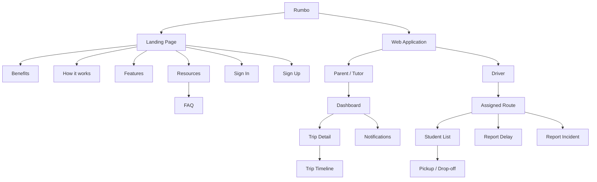
Se compararán respuestas por segmento, separando **características objetivas** (edad, distrito, experiencia, dispositivo, navegador, canales y organización) y **características subjetivas** (motivaciones, frustraciones, necesidades, actitud hacia tecnología, privacidad y barreras). Los porcentajes se completarán solo con datos reales.

### 4.3.1. Landing Page Wireframe

El wireframe de la Landing Page organiza el contenido de forma secuencial para explicar la propuesta de Rumbo antes de llevar al usuario a una acción. La estructura toma como base el diseño trabajado en Figma y mantiene la misma jerarquía para Desktop y Mobile.

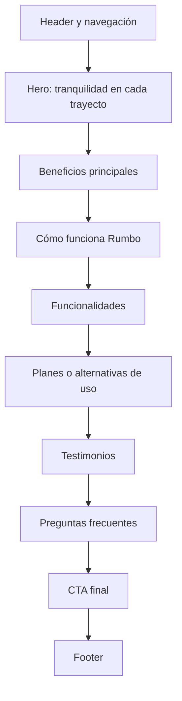

  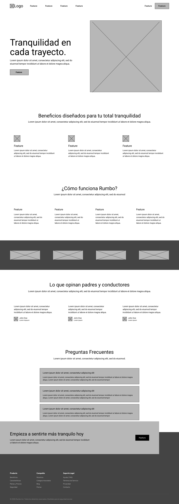

### 4.3.2. Landing Page Mock-up

El mock-up de alta fidelidad mantiene una estética limpia, con fondos claros, tipografía de alto contraste, tarjetas redondeadas y CTAs destacados. Las referencias trabajadas en Figma muestran como eje visual un hero con la propuesta **“Tranquilidad en cada trayecto”**, acompañado por una vista del seguimiento de la movilidad.

| Sección | Decisión de diseño |
|---|---|
| Hero | Mensaje principal, breve descripción, CTA y representación visual del seguimiento. |
| Beneficios | Tarjetas para monitoreo, alertas y comunicación. |
| Cómo funciona | Proceso resumido en pasos consecutivos. |
| Funcionalidades | Bloques visuales para seguimiento, incidencias, notificaciones y control de ruta. |
| Planes | Tarjetas comparables con CTA diferenciado. |
| Testimonios | Opiniones breves para reforzar confianza. |
| FAQ | Acordeones con dudas frecuentes sobre seguridad y funcionamiento. |
| CTA y footer | Cierre de conversión y accesos informativos. |

El mock-up conserva el sistema visual de Rumbo definido en 4.1: tonos verdes y oscuros para confianza y seguridad, superficies claras para lectura y componentes simples que pueden reutilizarse posteriormente en la Web Application.

  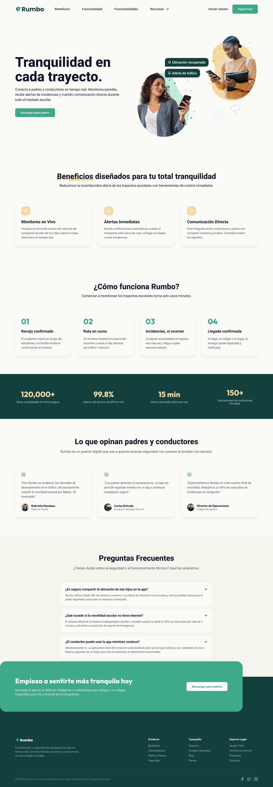

## 4.4. Web Applications UX/UI Design

El diseño de la Web Application considera dos experiencias principales: **padres/tutores** y **conductores**. En ambos casos se prioriza la información del trayecto, pero las acciones disponibles cambian según el rol. Los padres consultan; los conductores registran eventos de la ruta con la menor cantidad posible de pasos.

### 4.4.1. Web Applications Wireframes

Los wireframes se definieron a partir de las tareas centrales de cada segmento.

| Rol | Vista | Contenido principal |
|---|---|---|
| Padre/Tutor | Sign In | Correo, contraseña y recuperación de acceso. |
| Padre/Tutor | Dashboard | Estado actual, estudiante, conductor, vehículo y ETA. |
| Padre/Tutor | Trip Detail | Mapa o progreso de ruta y datos del trayecto. |
| Padre/Tutor | Trip Timeline | Recojo, retrasos, incidencias y llegada en orden cronológico. |
| Padre/Tutor | Notifications | Avisos relevantes asociados al estudiante. |
| Conductor | Sign In | Acceso seguro al panel de ruta. |
| Conductor | Assigned Route | Ruta activa, horario, paradas y estudiantes asignados. |
| Conductor | Student List | Estado de recojo o entrega de cada estudiante. |
| Conductor | Register Event | Confirmación rápida de recojo, llegada o entrega. |
| Conductor | Report Incident | Tipo de incidencia, descripción breve y registro del evento. |

La prioridad del wireframe es que la vista principal responda rápidamente a dos preguntas: **“¿qué está pasando en el trayecto?”** para la familia y **“¿qué debo registrar ahora?”** para el conductor.

### 4.4.2. Web Applications Wireflow Diagrams

#### Wireflow — Padre/Tutor

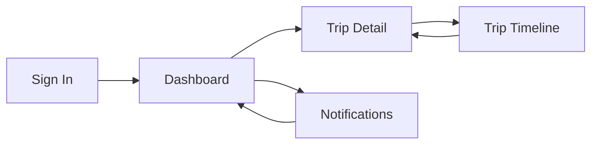

El padre ingresa al Dashboard y desde allí puede revisar el estado actual, abrir el detalle del viaje, consultar el historial de eventos o revisar las notificaciones asociadas.

#### Wireflow — Conductor

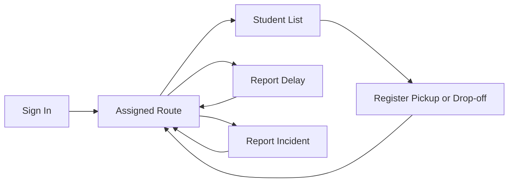

El conductor mantiene como punto central la ruta asignada. Las acciones de recojo, entrega, retraso e incidencia regresan al mismo panel para evitar navegación innecesaria durante la jornada.

### 4.4.3. Web Applications Mock-ups

La propuesta visual de la Web Application reutiliza el lenguaje definido para la Landing Page: fondo claro, tarjetas blancas, verde como color de acción y tonos oscuros para textos y estados principales.

| Vista | Componentes de alta fidelidad |
|---|---|
| Dashboard de padre/tutor | Tarjeta de estudiante, estado del viaje, ETA, conductor, vehículo y acceso al timeline. |
| Trip Detail | Mapa o progreso visual, paradas, estado actual y última actualización. |
| Timeline | Eventos con hora, tipo y estado mediante una línea cronológica. |
| Notifications | Tarjetas de aviso con prioridad y fecha. |
| Assigned Route | Ruta activa, número de estudiantes, próxima parada y acciones rápidas. |
| Student List | Lista con nombre del estudiante y estado pendiente/recogido/entregado. |
| Incident Form | Selector de tipo de incidencia, descripción corta y botón de registro. |

Los controles del conductor se plantean con botones grandes, mensajes breves y confirmaciones visibles. Para padres se prioriza lectura rápida, estado actual y jerarquía visual de alertas.

### 4.4.4. Web Applications User Flow Diagrams

#### User Flow — Padre/Tutor

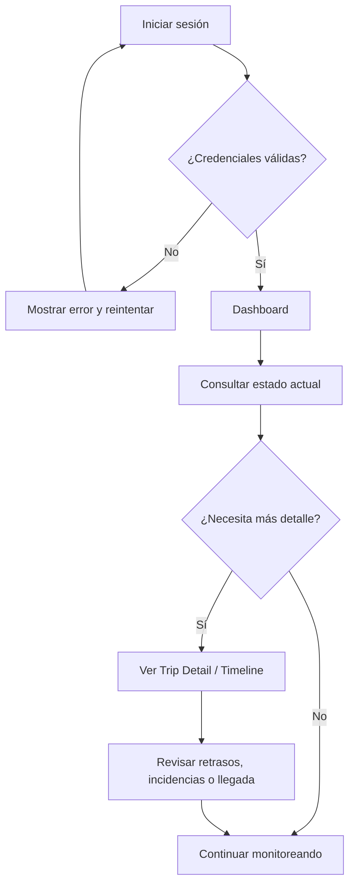

#### User Flow — Conductor

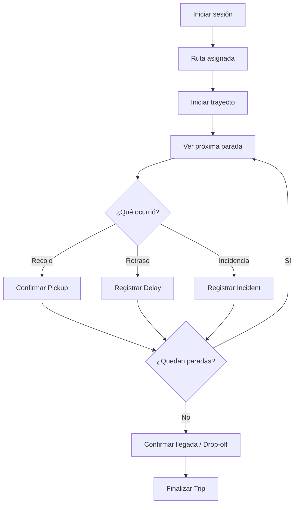

Los flujos reducen bifurcaciones y evitan acciones largas en el perfil del conductor. Las operaciones críticas se realizan desde la ruta activa y generan un evento que luego puede ser consultado por los padres.

## 4.5. Web Applications Prototyping
[Figma Prototype]

## 4.6. Domain-Driven Software Architecture

### 4.6.1. Design-Level Event Storming

El **Design-Level Event Storming** permite detallar el comportamiento interno de cada parte del dominio de Rumbo a partir de **Actors, Commands, Aggregates, Domain Events, Business Policies, Read Models y Hotspots**. Para esta etapa se mantuvo la división en seis Bounded Contexts, de modo que cada uno concentre reglas y responsabilidades relacionadas y pueda evolucionar sin mezclar lógica de otros contextos.

Los seis Bounded Contexts identificados son:

| Bounded Context | Responsabilidad |
|---|---|
| **Profiles and Verification** | Gestiona los perfiles de padres, conductores y estudiantes, así como vehículos, documentación registrada y vínculos autorizados. |
| **Identity and Access Management (IAM)** | Gestiona cuentas, autenticación, recuperación de acceso, roles y permisos. |
| **Route and Trip Planning** | Gestiona rutas, paradas, asignaciones de estudiantes, turnos, programación y ausencias. |
| **Real-Time Tracking and Execution** | Gestiona la ejecución del viaje, recojos, entregas, estados y línea de tiempo del trayecto. |
| **Alerting and Incident Management** | Gestiona retrasos, incidencias, alertas, notificaciones y preferencias de aviso. |
| **Subscriptions and Billing** | Gestiona planes, suscripciones, pagos, renovaciones y comprobantes. |

Para mantener una lectura uniforme de los diagramas se utilizan las siguientes convenciones: **amarillo** para Actors, **azul** para Commands, **azul claro** para Aggregates, **naranja** para Domain Events, **morado** para Business Policies, **verde** para Read Models y **fucsia** para Hotspots.

#### Profiles and Verification Bounded Context

Este fue el primer Bounded Context modelado por el equipo. Representa el registro y consulta de información de padres, conductores, estudiantes y vehículos, así como la relación autorizada entre estudiante y conductor.

> En Rumbo, la verificación se limita a controles internos sobre la información y la vigencia declarada de documentos registrados. No se asume validación oficial con ATU, Policía u otra entidad pública mientras dicha integración no exista.

#### Identity and Access Management (IAM) Bounded Context

Este contexto controla el acceso a Rumbo. Incluye registro de cuenta, autenticación, recuperación de contraseña y aplicación de permisos según el rol del usuario.

  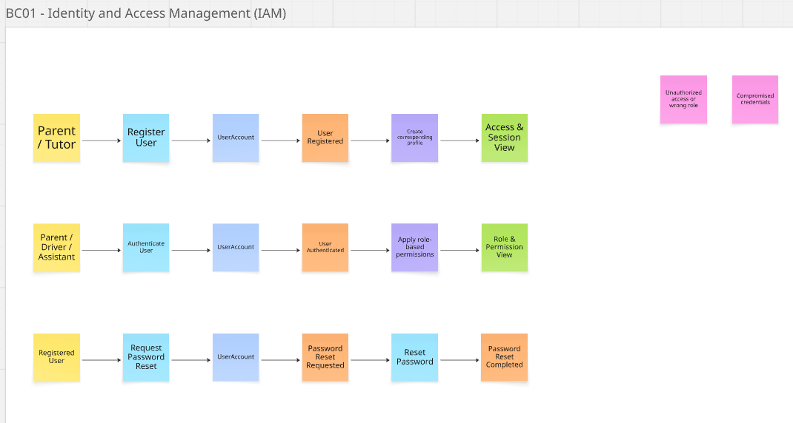

#### Route and Trip Planning Bounded Context

Este contexto organiza la planificación operativa del servicio. Incluye la creación de rutas, la gestión de paradas, la asignación de estudiantes y la programación diaria de recorridos.

  

#### Real-Time Tracking and Execution Bounded Context

Este contexto supervisa la ejecución del trayecto en tiempo real. Incluye el inicio del viaje, registro de ubicación, confirmación de recojo y descenso, verificación de cinturón y cierre del trayecto.

  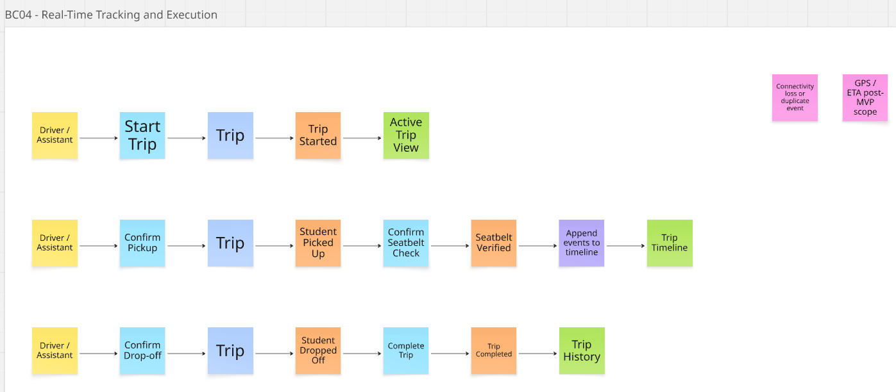

#### Alerting and Incident Management Bounded Context

Este contexto gestiona retrasos, incidencias y comunicaciones relevantes hacia las familias. Incluye notificaciones, alertas automáticas y el registro de incidentes ocurridos durante el servicio.

  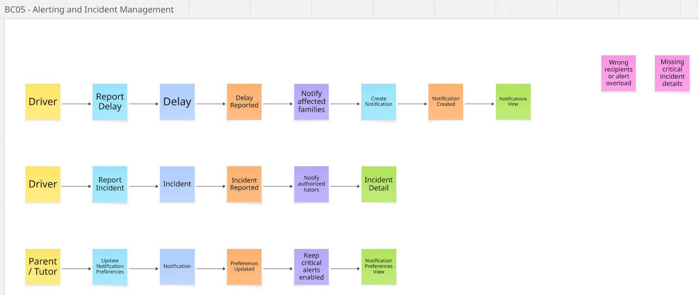

#### Subscriptions and Billing Bounded Context

Este contexto administra la suscripción del conductor a la plataforma. Incluye selección de plan, pagos, comprobantes, renovación, pausa, cancelación y reactivación del servicio.

  

En conjunto, los seis Bounded Contexts establecen la base para los Class Diagrams y Database Diagrams de las secciones 4.7 y 4.8. La división evita concentrar toda la lógica en un único modelo y mantiene trazabilidad entre las User Stories, el comportamiento del dominio y el diseño técnico.

**Tablero editable de Design-Level Event Storming:** [Rumbo - Design-Level Event Storming](https://miro.com/app/board/uXjVHl8Ic-k=/)

### 4.6.2. Software Architecture Context Diagram

Este diagrama muestra la visión general del sistema Rumbo, posicionando la plataforma en el centro y detallando sus interacciones con los usuarios (padres y conductores) y dependencias externas (Auth0, Google Maps, FCM y SendGrid).

### 4.6.3. Software Architecture Container Diagrams

El Container Diagram mantiene la misma separación arquitectónica, adaptada al stack de Aplicaciones Web: Landing Page en HTML5/CSS3/JavaScript, Frontend Web Application como SPA en **Vue 3 + JavaScript + PrimeVue**, RESTful API en **ASP.NET Core + C#**, persistencia mediante **Entity Framework Core** y un DBMS relacional MySQL o PostgreSQL.

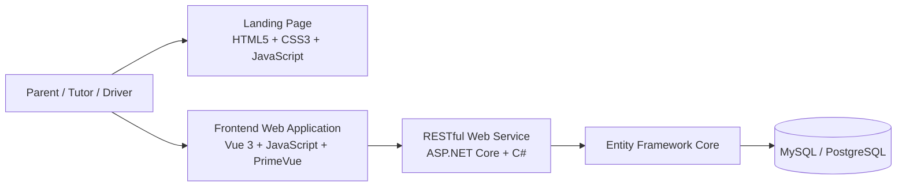

### 4.6.4. Software Architecture Components Diagrams

Para la Frontend Web Application se mantiene la separación entre navegación, vistas, componentes reutilizables y consumo de servicios, adaptada a Vue. Los componentes visuales deberán apoyarse en **PrimeVue** cuando exista un equivalente adecuado y conservar el lenguaje visual de Material Design definido en las Style Guidelines.

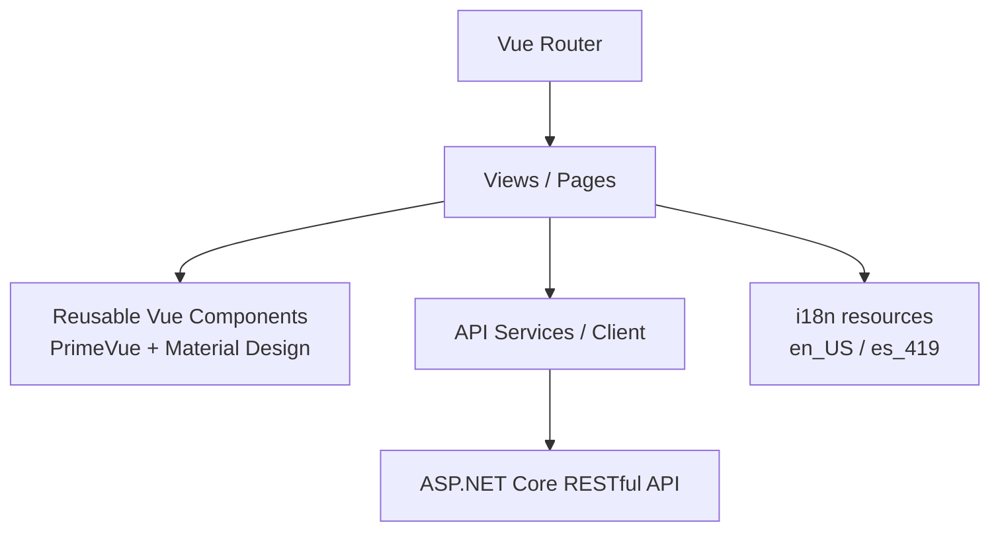

Para el backend, la API se implementará con ASP.NET Core y una separación por responsabilidades entre endpoints/controllers, application services, domain model y persistencia mediante Entity Framework Core.

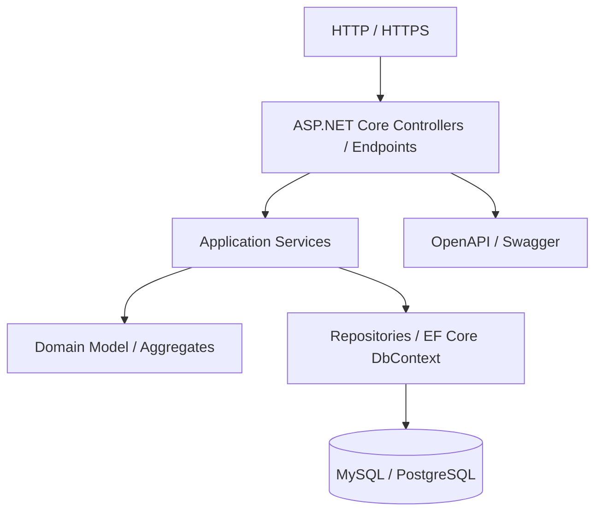

## 4.7. Software Object-Oriented Design

### 4.7.1. Class Diagrams

Los Class Diagrams se presentan por **Bounded Context** para mantener la separación definida en el Design-Level Event Storming. Los diagramas incluyen clases, interfaces, enumeraciones, atributos, métodos, visibilidad, relaciones y multiplicidades, de acuerdo con el nivel de detalle solicitado para el diseño orientado a objetos.

#### Profiles and Verification

#### Identity and Access Management (IAM)

#### Route and Trip Planning

#### Real-Time Tracking and Execution

#### Alerting and Incident Management

#### Subscriptions and Billing

## 4.8. Database Design

El diseño de persistencia se divide por los mismos **Bounded Contexts** definidos en el modelado DDD. Cada diagrama representa las tablas, columnas, claves primarias, claves foráneas y relaciones que permiten persistir la información administrada por su contexto. Los ERD fueron elaborados en **Lucidchart** y se incorporan al informe como imágenes legibles junto con su fuente editable.

### 4.8.1. Database Diagrams

#### Profiles and Verification

Incluye perfiles de padres, conductores y estudiantes, vehículos, documentos registrados y vínculos entre estudiantes y conductores.

  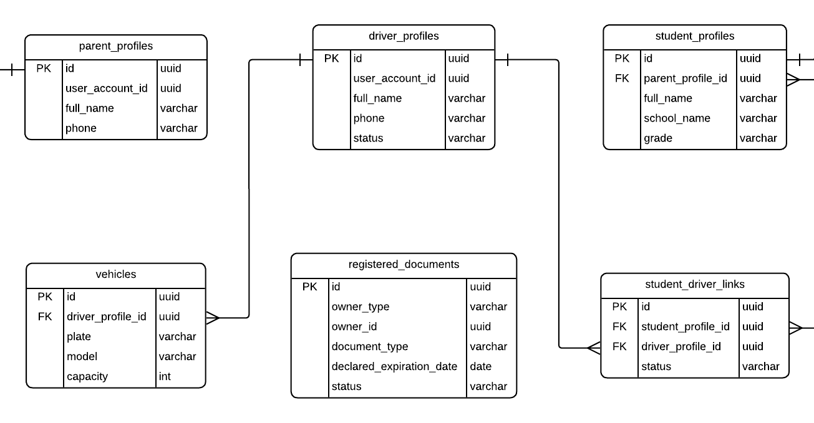

**Fuente editable:** https://lucid.app/lucidchart/c71a5220-bf71-4924-bbd8-cdec37c2f06c/edit

#### Identity and Access Management (IAM)

Incluye cuentas, credenciales, roles, permisos, relaciones de autorización y tokens de recuperación de acceso.

  

**Fuente editable:** https://lucid.app/lucidchart/f8fd5cb8-8ed5-4ac9-ae4f-0127d8369a18/edit

#### Route and Trip Planning

Incluye rutas, paradas, asignaciones de estudiantes, programación de viajes y ausencias.

  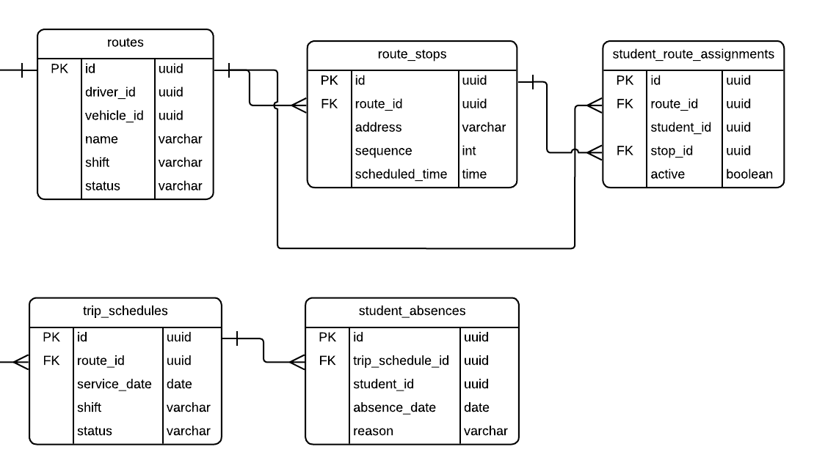

**Fuente editable:** https://lucid.app/lucidchart/dc535238-b74a-409c-9270-8bfcf4ea11a7/edit

#### Real-Time Tracking and Execution

Incluye viajes, estudiantes del viaje, eventos, recojos, entregas, verificaciones y registros de ubicación previstos para la evolución del producto.

  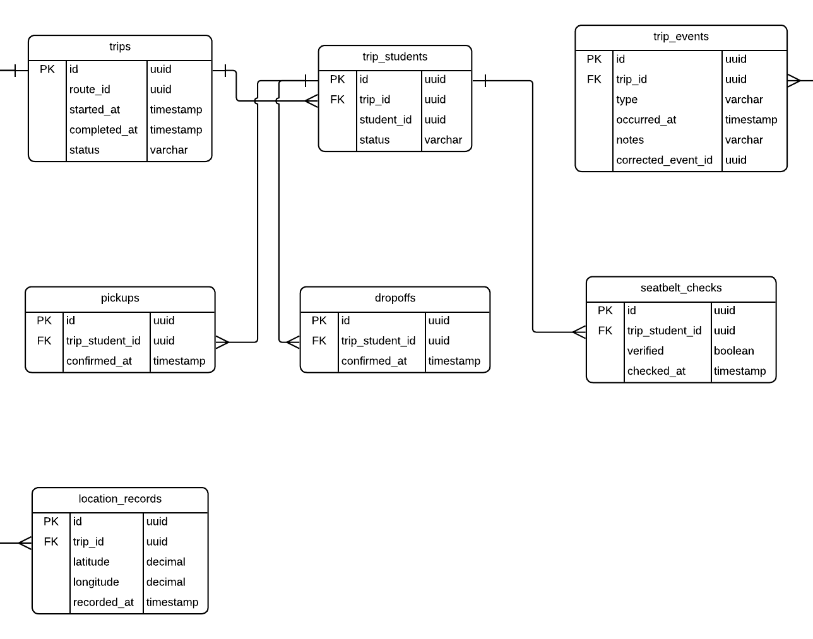

**Fuente editable:** https://lucid.app/lucidchart/3fcc7afd-47ae-4293-9ef2-66b0a7c74621/edit

#### Alerting and Incident Management

Incluye retrasos, incidencias, notificaciones, destinatarios y preferencias de notificación.

  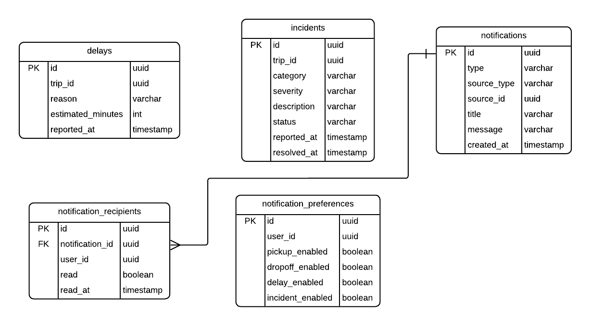

**Fuente editable:** https://lucid.app/lucidchart/b464254e-0388-492e-862d-b93d5ee3e25f/edit

#### Subscriptions and Billing

Incluye planes, suscripciones, pagos y comprobantes asociados al ciclo comercial.

  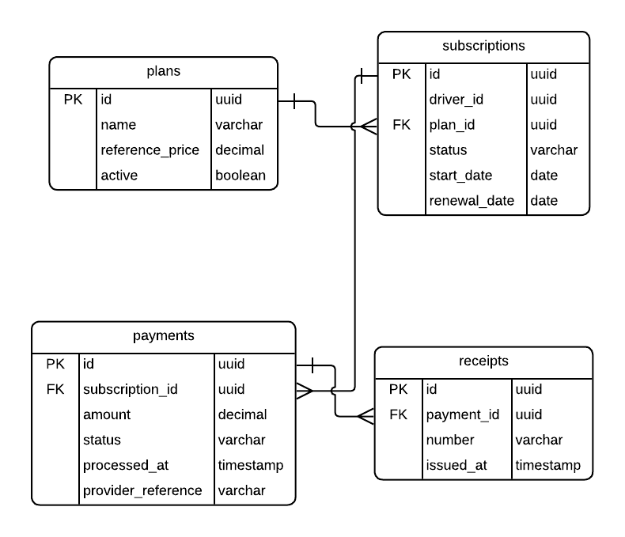

**Fuente editable:** https://lucid.app/lucidchart/178dfc99-92f9-4eef-8699-ecd2085c650a/edit

---

# Capítulo V: Product Implementation, Validation & Deployment

## 5.1. Software Configuration Management

### 5.1.1. Software Development Environment Configuration

| Software / Servicio | Uso |
|---|---|
| GitHub / Git | Repositorios, control de versiones y colaboración |
| Visual Studio Code / WebStorm | Landing Page y Frontend Web Application |
| Visual Studio / Rider | Web Service con ASP.NET Core |
| Figma | Wireframes, Mock-ups y Prototype |
| UXPressia | User Personas, Journey Maps, Empathy Maps, Impact Mapping y Lean UX Canvas |
| FigJam / Miro / Lucidchart | Event Storming y flujos |
| Structurizr | Diagramas C4 |
| Trello / Jira / YouTrack | Product Backlog y Sprint Backlog |
| MySQL / PostgreSQL | Persistencia relacional |
| Swagger / OpenAPI | Documentación del RESTful API |

### 5.1.2. Source Code Management

| Producto | Repositorio |
|---|---|
| Project Report | https://github.com/AIpaca-UPC/web-applications-project-report |
| Landing Page | https://github.com/AIpaca-UPC/landing-page |
| Frontend Web Application | https://github.com/AIpaca-UPC/web-applications-web-app |
| Web Service | https://github.com/AIpaca-UPC/web-applications-web-service |

**GitFlow:** `main`, `develop`, `feature/*`.  
**Commits:** Conventional Commits.  
**Versionado:** Semantic Versioning.

### 5.1.3. Source Code Style Guide & Conventions

- Identificadores de código en inglés.
- HTML5 semántico.
- CSS organizado por responsabilidad.
- `camelCase` para variables y funciones JavaScript.
- `PascalCase` para componentes y clases.
- Uso de `alt`, labels y ARIA cuando corresponda.
- Convenciones propias de Vue, PrimeVue, C# y ASP.NET Core.

### 5.1.4. Software Deployment Configuration

**Proveedor:** [GitHub Pages / Netlify / Vercel / otro]  
**Production URL:** [Completar]

## 5.2. Landing Page, Services & Applications Implementation

### 5.2.1. Sprint 1

#### 5.2.1.1. Sprint Planning 1

| Campo | Detalle |
|---|---|
| Sprint | Sprint 1 |
| Fecha | [Completar] |
| Hora | [Completar] |
| Lugar / medio | [Completar] |
| Preparado por | [Completar] |
| Asistentes | [Completar] |
| Sprint Goal | Diseñar, implementar y desplegar la primera versión responsive del Landing Page de Rumbo. |
| Duración | [Completar] |

#### 5.2.1.2. Aspect Leaders and Collaborators

| Integrante | GitHub Username | Informe | UX/UI Landing Page | Implementación Landing Page | Deployment |
|---|---|---|---|---|---|
| [Integrante 1] | [usuario1] | L/C | L/C | L/C | L/C |
| [Integrante 2] | [usuario2] | L/C | L/C | L/C | L/C |
| [Integrante 3] | [usuario3] | L/C | L/C | L/C | L/C |
| [Integrante 4] | [usuario4] | L/C | L/C | L/C | L/C |
| [Integrante 5] | [usuario5] | L/C | L/C | L/C | L/C |

#### 5.2.1.3. Sprint Backlog 1

**Sprint Board:** [Insertar URL]

| Story ID | Tarea | Estimación | Responsable | Estado |
|---|---|---:|---|---|
| US06 | Definir estructura y contenido del Landing Page | 4 h | [ ] | To-do |
| US06 | Diseñar Wireframes y Mock-ups Desktop/Mobile | 6 h | [ ] | To-do |
| US06 | Implementar estructura HTML | 4 h | [ ] | To-do |
| US06 | Implementar estilos responsive | 6 h | [ ] | To-do |
| TS02 | Preparar internacionalización | 4 h | [ ] | To-do |
| TS03 | Revisar accesibilidad | 4 h | [ ] | To-do |
| US06 | Desplegar Landing Page | 4 h | [ ] | To-do |

#### 5.2.1.4. Development Evidence for Sprint Review

| Repositorio | Rama | Commit ID | Mensaje | Fecha |
|---|---|---|---|---|
| landing-page | [ ] | [ ] | [ ] | [ ] |
| web-applications-project-report | [ ] | [ ] | [ ] | [ ] |

#### 5.2.1.5. Execution Evidence for Sprint Review

**Desktop:** [Insertar captura]  
**Mobile:** [Insertar captura]  
**Video:** [Insertar URL]

#### 5.2.1.6. Services Documentation Evidence for Sprint Review

En AV1 el incremento implementado se concentra en el Landing Page. La documentación de endpoints se incorporará cuando el Web Service forme parte del alcance de implementación de un Sprint posterior.

#### 5.2.1.7. Software Deployment Evidence for Sprint Review

**Repositorio:** https://github.com/AIpaca-UPC/landing-page  
**Proveedor:** [Completar]  
**Production URL:** [Completar]  
**Evidencia:** [Insertar capturas]

#### 5.2.1.8. Team Collaboration Insights during Sprint

**Commits:** [Insertar captura]  
**Network Graph:** [Insertar captura]  
**Pull Requests / Contributors:** [Insertar capturas]  
**Análisis:** [Completar con la participación real del Sprint]

---

# Conclusiones

## Avance AV1

1. La existencia de 3758 vehículos escolares habilitados en Lima y Callao confirma que Rumbo se dirige a un servicio formal con un mercado concreto de familias y operadores.
2. La congestión registrada en Lima durante 2025 sustenta la necesidad de considerar retrasos y variabilidad en los tiempos de traslado dentro de la experiencia del producto.
3. La alta penetración de telefonía móvil e Internet en Lima Metropolitana respalda el uso de una solución web responsive como canal principal para los dos segmentos definidos.
4. Las entrevistas de AV1 permitirán comprobar si el problema específico de visibilidad y comunicación planteado por Rumbo coincide con la experiencia real de padres y conductores.
5. El Sprint 1 se concentra en el diseño, implementación y despliegue del Landing Page como primer incremento público del producto.

---

# Bibliografía

[1] Autoridad de Transporte Urbano para Lima y Callao. (2026, 10 de enero). *Vacaciones útiles seguras: ATU exhorta a padres de familia a usar movilidades escolares autorizadas*. https://www.gob.pe/institucion/atu/noticias/1331042-vacaciones-utiles-seguras-atu-exhorta-a-padres-de-familia-a-usar-movilidades-escolares-autorizadas

[2] TomTom. (2026). *TomTom Traffic Index 2025: Lima, Peru*. https://www.tomtom.com/traffic-index/city/lima/

[3] Observatorio Nacional de Seguridad Vial. (2026). *Estadísticas de siniestralidad vial 2025*. https://www.onsv.gob.pe/

[4] Instituto Nacional de Estadística e Informática. (2026, 26 de marzo). *El 98,4% de los hogares de Lima Metropolitana contó con telefonía móvil durante el cuarto trimestre de 2025*. https://www.gob.pe/institucion/inei/noticias/1371146-el-98-4-de-los-hogares-de-lima-metropolitana-conto-con-telefonia-movil-durante-el-cuarto-trimestre-de-2025

- Gothelf, J., & Seiden, J. *Lean UX: Designing Great Products with Agile Teams*.
- Material Design. https://m3.material.io/
- Vue.js. https://vuejs.org/
- PrimeVue. https://primevue.org/
- Microsoft ASP.NET Core. https://learn.microsoft.com/aspnet/core/
- Entity Framework Core. https://learn.microsoft.com/ef/core/
- Conventional Commits. https://www.conventionalcommits.org/
- Semantic Versioning. https://semver.org/

---

# Anexos

## Videos de Exposición

### AV1

**Microsoft Stream:** [Completar]  
**Archivo:** `upc-pre-202620-1asi0730-8137-rumbo-expo-av1.mp4`

## Entrevistas de Needfinding

**Microsoft Stream:** [Completar]  
**Archivo:** `upc-pre-202620-1asi0730-8137-rumbo-needfinding-sprint-1.mp4`

## Navegación del Prototipo

**Microsoft Stream:** [Completar]  
**Archivo:** `upc-pre-202620-1asi0730-8137-rumbo-prototypenavigation-sprint-1.mp4`

## Enlaces del proyecto

- **Organización:** https://github.com/AIpaca-UPC
- **Project Report:** https://github.com/AIpaca-UPC/web-applications-project-report
- **Landing Page:** https://github.com/AIpaca-UPC/landing-page
- **Frontend Web Application:** https://github.com/AIpaca-UPC/web-applications-web-app
- **Web Service:** https://github.com/AIpaca-UPC/web-applications-web-service

## Artefactos externos

- **UXPressia:** [Completar]
- **Figma:** [Completar]
- **Sprint Board:** [Completar]
- **Structurizr:** [Completar]
