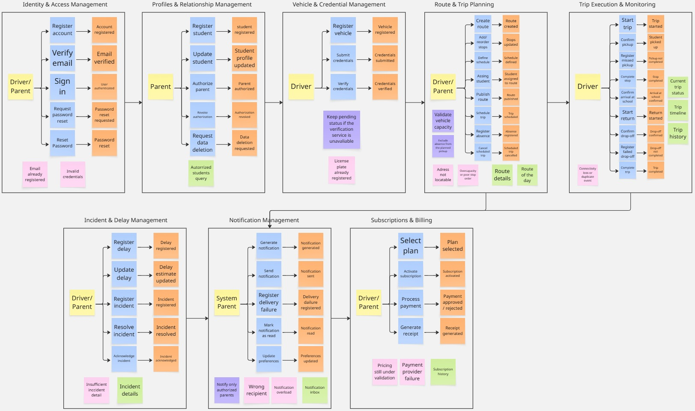

# UNIVERSIDAD PERUANA DE CIENCIAS APLICADAS

### Ingeniería de Software

### Ciclo Académico: 2026-20

### Código: 1ASI0730

### Curso: Aplicaciones Web

### NRC: 8137

### Docente: Hugo Allan Mori Paiva

# Informe de Trabajo Final

### Startup: AIpaca

### Producto: Rumbo

### Integrantes

| Apellidos y Nombres | Código de Alumno |
|---|---|
| Barrientos Quispe, Marcelo | U20221E646 |
| Díaz Ramírez, Alejandro | U202423084 |
| Geronimo Puma, Kevin Joel | U202423163 |
| Lino Quispe, Leonardo Miguel | U202422298 |
| Meza Soza, Alexandra Yamile | U20241b451 |

### SEPTIEMBRE - 2026

---

## Registro de Versiones del Informe

| Versión | Fecha | Autor(es) | Descripción de cambios |
|---|---|---|---|
| 0.1 | 07/09/2026 | Lino Quispe, Leonardo Miguel | Creación de la estructura base del informe de Rumbo. |
| 0.2 | 11/09/2026 | Equipo Rumbo | Actualización de integrantes y refinamiento del Capítulo I para AV1. |
| 0.3 | 20/09/2026 | Equipo Rumbo | Integración de Collaboration Insights, Student Outcome, artefactos de Product Design y avance de Sprint 1. |
| 0.4 | 08/10/2026 | Equipo Rumbo | Consolidación del Capítulo II para Aplicaciones Web: análisis competitivo, entrevistas, Needfinding, Big Picture EventStorming y Ubiquitous Language. |
| 0.5 | 08/10/2026 | Equipo Rumbo | Consolidación de los Capítulos I y II en la rama de Requirements Specification, conservando los capítulos posteriores para revisión. |
| 0.6 | 08/10/2026 | Equipo Rumbo | Actualización del Capítulo III: Impact Mapping adaptado, incorporación de US36–US38 y repriorización del Product Backlog por valor de negocio. |
| 0.7 | 08/10/2026 | Equipo Rumbo | Actualización de evidencia del Product Backlog, corrección de Story Points del Landing Page y restauración del esqueleto de capítulos posteriores. |

---

## Project Report Collaboration Insights

**Organización:** https://github.com/AIpaca-UPC  
**Project Report:** https://github.com/AIpaca-UPC/web-applications-project-report  
**Landing Page:** https://github.com/AIpaca-UPC/landing-page  
**Frontend Web Application:** https://github.com/AIpaca-UPC/web-applications-web-app  
**Web Service:** https://github.com/AIpaca-UPC/web-applications-web-service

### AV1

  

Durante el periodo mostrado por GitHub Insights (20 de agosto al 20 de septiembre de 2026), el Project Report registra **4 autores activos**, **109 commits en todas las ramas** y **6 pull requests fusionados**. La captura también muestra **0 pull requests abiertos** y **0 issues activos** al cierre del periodo.

Como evidencia complementaria de colaboración se utilizan los recursos nativos del repositorio:

- **Commits:** https://github.com/AIpaca-UPC/web-applications-project-report/commits
- **Network:** https://github.com/AIpaca-UPC/web-applications-project-report/network
- **Contributors:** https://github.com/AIpaca-UPC/web-applications-project-report/graphs/contributors
- **Pull Requests:** https://github.com/AIpaca-UPC/web-applications-project-report/pulls

---

# Contenido

## Tabla de Contenidos

- [Student Outcome](#student-outcome)
- [Capítulo I: Introducción](#capítulo-i-introducción)
  - [1.1. Startup Profile](#11-startup-profile)
    - [1.1.1. Descripción de la Startup](#111-descripción-de-la-startup)
    - [1.1.2. Perfiles de integrantes del equipo](#112-perfiles-de-integrantes-del-equipo)
  - [1.2. Solution Profile](#12-solution-profile)
    - [1.2.1. Antecedentes y problemática](#121-antecedentes-y-problemática)
    - [1.2.2. Lean UX Process](#122-lean-ux-process)
      - [1.2.2.1. Lean UX Problem Statement](#1221-lean-ux-problem-statement)
      - [1.2.2.2. Lean UX Assumptions](#1222-lean-ux-assumptions)
      - [1.2.2.3. Lean UX Hypothesis Statements](#1223-lean-ux-hypothesis-statements)
      - [1.2.2.4. Lean UX Canvas](#1224-lean-ux-canvas)
  - [1.3. Segmentos objetivo](#13-segmentos-objetivo)
- [Capítulo II: Requirements Elicitation & Analysis](#capítulo-ii-requirements-elicitation--analysis)
  - [2.1. Competidores](#21-competidores)
    - [2.1.1. Análisis competitivo](#211-análisis-competitivo)
    - [2.1.2. Estrategias y tácticas frente a competidores](#212-estrategias-y-tácticas-frente-a-competidores)
  - [2.2. Entrevistas](#22-entrevistas)
    - [2.2.1. Diseño de entrevistas](#221-diseño-de-entrevistas)
    - [2.2.2. Registro de entrevistas](#222-registro-de-entrevistas)
    - [2.2.3. Análisis de entrevistas](#223-análisis-de-entrevistas)
  - [2.3. Needfinding](#23-needfinding)
    - [2.3.1. User Personas](#231-user-personas)
    - [2.3.2. User Task Matrix](#232-user-task-matrix)
    - [2.3.3. User Journey Mapping](#233-user-journey-mapping)
    - [2.3.4. Empathy Mapping](#234-empathy-mapping)
  - [2.4. Big Picture EventStorming](#24-big-picture-eventstorming)
  - [2.5. Ubiquitous Language](#25-ubiquitous-language)
- [Capítulo III: Requirements Specification](#capítulo-iii-requirements-specification)
  - [3.1. User Stories](#31-user-stories)
  - [3.2. Impact Mapping](#32-impact-mapping)
  - [3.3. Product Backlog](#33-product-backlog)
- [Capítulo IV: Product Design](#capítulo-iv-product-design)
  - [4.1. Style Guidelines](#41-style-guidelines)
    - [4.1.1. General Style Guidelines](#411-general-style-guidelines)
    - [4.1.2. Web Style Guidelines](#412-web-style-guidelines)
  - [4.2. Information Architecture](#42-information-architecture)
    - [4.2.1. Organization Systems](#421-organization-systems)
    - [4.2.2. Labeling Systems](#422-labeling-systems)
    - [4.2.3. SEO Tags and Meta Tags](#423-seo-tags-and-meta-tags)
    - [4.2.4. Searching Systems](#424-searching-systems)
    - [4.2.5. Navigation Systems](#425-navigation-systems)
  - [4.3. Landing Page UI Design](#43-landing-page-ui-design)
    - [4.3.1. Landing Page Wireframe](#431-landing-page-wireframe)
    - [4.3.2. Landing Page Mock-up](#432-landing-page-mock-up)
  - [4.4. Web Applications UX/UI Design](#44-web-applications-uxui-design)
    - [4.4.1. Web Applications Wireframes](#441-web-applications-wireframes)
    - [4.4.2. Web Applications Wireflow Diagrams](#442-web-applications-wireflow-diagrams)
    - [4.4.3. Web Applications Mock-ups](#443-web-applications-mock-ups)
    - [4.4.4. Web Applications User Flow Diagrams](#444-web-applications-user-flow-diagrams)
  - [4.5. Web Applications Prototyping](#45-web-applications-prototyping)
  - [4.6. Domain-Driven Software Architecture](#46-domain-driven-software-architecture)
    - [4.6.1. Design-Level EventStorming](#461-design-level-eventstorming)
    - [4.6.2. Software Architecture Context Diagram](#462-software-architecture-context-diagram)
    - [4.6.3. Software Architecture Container Diagrams](#463-software-architecture-container-diagrams)
    - [4.6.4. Software Architecture Components Diagrams](#464-software-architecture-components-diagrams)
  - [4.7. Software Object-Oriented Design](#47-software-object-oriented-design)
    - [4.7.1. Class Diagrams](#471-class-diagrams)
  - [4.8. Database Design](#48-database-design)
    - [4.8.1. Database Diagrams](#481-database-diagrams)
- [Capítulo V: Product Implementation, Validation & Deployment](#capítulo-v-product-implementation-validation--deployment)
  - [5.1. Software Configuration Management](#51-software-configuration-management)
    - [5.1.1. Software Development Environment Configuration](#511-software-development-environment-configuration)
    - [5.1.2. Source Code Management](#512-source-code-management)
    - [5.1.3. Source Code Style Guide & Conventions](#513-source-code-style-guide--conventions)
    - [5.1.4. Software Deployment Configuration](#514-software-deployment-configuration)
  - [5.2. Landing Page, Services & Applications Implementation](#52-landing-page-services--applications-implementation)
  - [5.3. Validation Interviews](#53-validation-interviews)
    - [5.3.1. Diseño de Entrevistas](#531-diseño-de-entrevistas)
    - [5.3.2. Registro de Entrevistas](#532-registro-de-entrevistas)
    - [5.3.3. Evaluaciones según heurísticas](#533-evaluaciones-según-heurísticas)
  - [5.4. Video About-the-Product](#54-video-about-the-product)
- [Conclusiones](#conclusiones)
  - [Conclusiones y recomendaciones](#conclusiones-y-recomendaciones)
  - [Video About-The-Team](#video-about-the-team)
- [Bibliografía](#bibliografía)
- [Anexos](#anexos)

---

# Student Outcome

El curso contribuye al cumplimiento del **ABET – EAC – Student Outcome 5**: la capacidad de funcionar efectivamente en un equipo cuyos miembros proporcionan liderazgo de manera conjunta, crean un entorno colaborativo e inclusivo, establecen objetivos, planifican tareas y cumplen objetivos.

| Criterio específico | Acciones realizadas | Conclusiones |
|---|---|---|
| Trabaja en equipo para proporcionar liderazgo en forma conjunta. | **Barrientos Quispe, Marcelo — AV1:** liderazgo del Capítulo I.   **Meza Soza, Alexandra Yamile — AV1:** liderazgo del Capítulo II.   **Lino Quispe, Leonardo Miguel — AV1:** liderazgo de los Capítulos III y V e integración de evidencias.   **Geronimo Puma, Kevin Joel — AV1:** desarrollo conjunto del Capítulo IV.   **Díaz Ramírez, Alejandro — AV1:** desarrollo conjunto del Capítulo IV. | El equipo distribuyó el liderazgo por capítulos y coordinó la integración de los entregables para mantener una versión común del Project Report. |
| Crea un entorno colaborativo e inclusivo, establece metas, planifica tareas y cumple objetivos. | **Marcelo, Alexandra, Leonardo, Kevin y Alejandro — AV1:** organizaron el trabajo mediante ramas feature en GitHub, revisión de cambios, Product/Sprint Backlog en Trello y artefactos colaborativos en las herramientas definidas para el proyecto. | La planificación por responsabilidades y el uso de herramientas compartidas permitió organizar el avance, revisar el trabajo de otros integrantes y mantener trazabilidad del Sprint 1. |

---

# Capítulo I: Introducción

## 1.1. Startup Profile

### 1.1.1. Descripción de la Startup

**AIpaca** es una startup tecnológica peruana enfocada en el desarrollo de soluciones digitales que simplifican la coordinación de servicios cotidianos, con especial atención en el transporte escolar. Nuestro propósito es aprovechar la tecnología para brindar tranquilidad a las familias y eficiencia a quienes prestan el servicio, mediante herramientas accesibles, seguras y fáciles de usar que permitan una comunicación clara, oportuna y ordenada entre padres, tutores y conductores de movilidad escolar.

Nuestra solución es **Rumbo**, una plataforma web responsive orientada al uso móvil que centraliza la información del traslado escolar. **Rumbo** permite a los padres y tutores conocer el estado actual de la ruta, revisar una línea de tiempo con los principales hitos del recorrido y recibir notificaciones ante eventos relevantes como recojos, llegadas, retrasos o incidencias. A su vez, permite a los conductores consultar su ruta y los estudiantes asignados, confirmar recojos y entregas mediante interacciones breves y registrar incidencias una sola vez para comunicarlas a todas las familias correspondientes.

La propuesta de **AIpaca** se centra en construir un ecosistema de coordinación del transporte escolar que sea confiable, escalable y respetuoso de la privacidad, donde la información de cada traslado esté disponible únicamente para los usuarios autorizados. Rumbo no busca reemplazar las obligaciones de seguridad, autorización y operación que corresponden a los prestadores del servicio, ni la comunicación humana cuando esta sea necesaria. Su objetivo es complementarlas con información estructurada que reduzca la incertidumbre de las familias y la carga operativa de los conductores en una ciudad con alta congestión y tiempos de viaje variables.

**Misión:** Desarrollar herramientas digitales accesibles y confiables que permitan a padres, tutores y conductores de movilidad escolar coordinar los traslados de los estudiantes de forma clara y oportuna, brindando tranquilidad a las familias y eficiencia a quienes prestan el servicio.

**Visión:** En los próximos 5 años, consolidar a AIpaca como una empresa referente en soluciones digitales para la coordinación del transporte escolar en el Perú y Latinoamérica, reconocida por generar confianza entre familias y prestadores del servicio mediante tecnología accesible, segura y escalable.

Alcance del proyecto: El alcance inicial de Rumbo está orientado a padres o tutores y conductores de movilidad escolar en Lima y Callao. Ofrece una plataforma web responsive que integra la consulta del estado del traslado, la línea de tiempo del trayecto, la confirmación de recojos y entregas, el registro de incidencias y un centro de notificaciones. A mediano plazo, buscamos ampliar la solución hacia centros educativos y empresas de transporte escolar, incorporando la gestión de múltiples rutas y unidades, para consolidar un modelo de coordinación que transforme la manera en que se organiza la movilidad escolar en otras ciudades del país y de la región.

### 1.1.2. Perfiles de integrantes del equipo

<table>
  <thead>
    <tr>
      <th>Foto</th>
      <th>Apellidos y nombres</th>
      <th>Código</th>
      <th>Carrera</th>
      <th>Habilidades</th>
    </tr>
  </thead>
  <tbody>
    <tr>
      <td align="center"></td>
      <td>Barrientos Quispe, Marcelo</td>
      <td>U20221E646</td>
      <td>Ingeniería de Software</td>
      <td>Estudiante de Ingeniería de Software con capacidad de adaptación, aprendizaje rápido y trabajo colaborativo. Cuenta con conocimientos técnicos en tecnologías basadas en JavaScript y aporta al equipo en tareas de desarrollo frontend y organización del trabajo.</td>
    </tr>
    <tr>
      <td align="center"></td>
      <td>Díaz Ramírez, Alejandro</td>
      <td>U202423084</td>
      <td>Ingeniería de Software</td>
      <td>Estudiante de Ingeniería de Software con conocimientos en Python y C++, experiencia en prototipado con React Native y trabajo colaborativo con metodologías ágiles. Aporta principalmente en lógica del sistema, estructuración del código y desarrollo técnico.</td>
    </tr>
    <tr>
      <td align="center"></td>
      <td>Geronimo Puma, Kevin Joel</td>
      <td>U202423163</td>
      <td>Ingeniería de Software</td>
      <td>Estudiante de Ingeniería de Software con conocimientos en Python y C++. Se desempeña especialmente en arquitectura de software, diseño de bases de datos, lógica del sistema y organización técnica del desarrollo.</td>
    </tr>
    <tr>
      <td align="center"></td>
      <td>Lino Quispe, Leonardo Miguel</td>
      <td>U202422298</td>
      <td>Ingeniería de Software</td>
      <td>Soy estudiante de Ingeniería de Software del 5.º ciclo en la UPC. Tengo conocimientos en programación en C++ y Python, y experiencia desarrollando proyectos académicos donde analizo y organizo soluciones tecnológicas. Me gusta enfocarme en aprender de forma práctica y en construir soluciones que sean claras, funcionales y aplicadas a problemas reales.</td>
    </tr>
    <tr>
      <td align="center"></td>
      <td>Meza Soza, Alexandra Yamile</td>
      <td>U20241b451</td>
      <td>Ingeniería de Software</td>
      <td>Estudiante de Ingeniería de Software con conocimientos en Python y C++. Se caracteriza por el aprendizaje rápido, el criterio para seleccionar información relevante y el trabajo colaborativo. En el equipo aporta investigación aplicada, análisis y documentación del producto.</td>
    </tr>
  </tbody>
</table>

## 1.2. Solution Profile

El **Solution Profile** presenta una descripción general de la solución propuesta por **AIpaca** y de su producto **Rumbo**. Aborda el contexto en el que opera el transporte escolar en Lima y Callao, los problemas detectados en la coordinación entre familias y conductores y las suposiciones estratégicas que guían el desarrollo del producto. Esta sección conecta los hallazgos de la fase de descubrimiento con una propuesta de valor clara y sienta las bases para el diseño, la validación y el desarrollo posterior de la solución.

Para el curso de **Aplicaciones Web**, Rumbo se plantea como una experiencia compuesta por un **Landing Page**, una **Web Application responsive** y, en las etapas de implementación correspondientes, una **RESTful API de elaboración interna** integrada con la aplicación web y con al menos un servicio externo de terceros. Esta delimitación tecnológica corresponde al alcance específico del curso y no debe confundirse con la implementación realizada en otros cursos del proyecto.

### 1.2.1. Antecedentes y problemática

El transporte escolar constituye un servicio formal y regulado en Lima y Callao. En enero de 2026, la Autoridad de Transporte Urbano para Lima y Callao (ATU) informó que **3758 vehículos se encontraban habilitados para prestar el servicio de transporte de estudiantes** y recordó que los padres pueden verificar digitalmente si el vehículo y el conductor están autorizados (Infobae, 2026a). Esta cifra confirma que existe un ecosistema amplio de familias, conductores y operadores que realizan traslados escolares de manera recurrente.

En esta sección se analiza el contexto en el que surge la problemática principal, considerando sus factores sociales, tecnológicos y operativos. Se utiliza la técnica de las 5 W y 2 H para responder de forma estructurada qué ocurre, quiénes están involucrados, cuándo y dónde sucede, por qué ocurre, cómo se abordará y cuánto costará implementar la solución.

#### Técnica de las 5 W's + 2 H's

**What (¿Qué?) — ¿Cuál es el problema?**  

El transporte escolar en Lima y Callao es un servicio formal y regulado. Sin embargo, la coordinación diaria entre padres y conductores sigue dependiendo de mensajes y llamadas individuales. Según la Autoridad de Transporte Urbano para Lima y Callao (ATU), 3758 vehículos cuentan con habilitación para prestar este servicio durante 2026, tras un proceso de verificación y autorización realizado en 2025 (Infobae, 2026a). Además, la ATU habilitó un enlace público para que los padres verifiquen si el vehículo y el conductor contratados están autorizados (Exitosa Noticias, 2026).

Estos mecanismos resuelven la pregunta de si el servicio es formal antes de contratarlo, pero no la de qué está pasando durante la ruta. Los padres no cuentan con una vista única donde consultar si el menor ya fue recogido, si la movilidad está retrasada, si llegó al colegio o si ocurrió un imprevisto. Esa información se transmite de forma dispersa, y buena parte de ella recae sobre el conductor, que debe responder las mismas consultas a varias familias mientras cumple su ruta.

**When (¿Cuándo?) — ¿Cuándo ocurre?**  

El problema ocurre todos los días de clases, en tres momentos: antes del recojo, durante el traslado y al momento de la llegada o entrega. El Ministerio de Educación fijó el inicio del año escolar 2026 para el lunes 16 de marzo y su término para el viernes 18 de diciembre, con 36 semanas de clases (Infobae, 2026a). Durante todo ese periodo, cada familia depende de uno o dos trayectos diarios.

La incertidumbre se intensifica porque los horarios escolares coinciden con las horas de mayor congestión. En Lima el tráfico se concentra entre las 6 a. m. y las 9 a. m., y nuevamente en las horas punta de la tarde (El Comercio, 2026). En esas franjas un retraso de pocos minutos puede convertirse en una espera prolongada, y es cuando los padres más necesitan información oportuna.

**Where (¿Dónde?) — ¿Dónde surge?**  

El problema se presenta principalmente en Lima Metropolitana y el Callao, en las rutas que conectan hogares, puntos de recojo y centros educativos. Se trata de una de las ciudades con mayor congestión del mundo: el TomTom Traffic Index 2025 ubicó a Lima como la novena ciudad más congestionada del mundo, con un nivel de tráfico de 69,3 %, y con 195 horas anuales perdidas por conductor en embotellamientos (El Popular, 2026).

La situación se mantiene en 2026. Con datos de TomTom consolidados hasta el 3 de agosto de 2026, en la hora punta matinal de los días laborables la velocidad promedio en Lima fue de 14,74 km/h, la más baja frente a Ciudad de México, Bogotá y Santiago de Chile (Energiminas, 2026). En este entorno, los tiempos de llegada son difíciles de anticipar para las familias.

**Who (¿Quiénes?) — ¿Quiénes son los afectados?**  

- **Padres y tutores**, que necesitan saber en qué etapa se encuentra el traslado de sus hijos y hoy dependen de preguntarle directamente al conductor.

- **Conductores de movilidad escolar**, que deben cumplir su ruta en medio del tráfico y, al mismo tiempo, comunicar recojos, retrasos o incidencias a varias familias de forma individual. Su trabajo está sujeto a exigencias formales: la ATU verifica que los vehículos cuenten con SOAT y CITV vigentes y que los conductores tengan licencia de categoría AIIB (Infobae, 2026a).

**Why (¿Por qué?) — ¿Por qué ocurre y por qué importa?**  

- **Comunicación fragmentada en canales generales:** La coordinación se realiza principalmente por mensajería instantánea. Según la Encuesta Residencial de Servicios de Telecomunicaciones (ERESTEL) 2025 de Osiptel, el 68,6 % de los peruanos usó plataformas de comunicación instantánea durante el último año, y entre ellos WhatsApp alcanza el 98,6 % de usuarios (Expreso, 2026). Estos canales son útiles, pero no fueron diseñados para registrar hitos de una ruta: la información queda mezclada con otros mensajes y cada familia recibe actualizaciones distintas.

- **Alta variabilidad de los tiempos de viaje:** La congestión de Lima hace que la hora estimada de llegada cambie constantemente, lo que multiplica las consultas de los padres.

- **Carga operativa del conductor:** El conductor es la única fuente de información en tiempo real, pero su prioridad debe ser conducir con seguridad. Responder mensajes durante la ruta compite con esa prioridad.

- **Ausencia de un registro estructurado:** Los recojos, entregas e incidencias no suelen quedar documentados de forma ordenada, lo que dificulta resolver dudas posteriores sobre lo ocurrido en un trayecto.

- **Verificación sin visibilidad en ruta:** Las herramientas oficiales permiten comprobar la formalidad del servicio, pero no ofrecen seguimiento del estado de cada traslado.

**How (¿Cómo?) — ¿Cómo se abordará?**  

Para responder a esta necesidad, AIpaca propone Rumbo, una plataforma web responsive orientada al uso móvil que centraliza el estado de cada traslado. La elección del canal responde al contexto local: según el INEI, en el cuarto trimestre de 2025 el 98,4 % de los hogares de Lima Metropolitana contó con telefonía móvil, y en ese mismo periodo el uso de Internet en Lima Metropolitana alcanzó el 90,3 % de la población de 6 años a más (Instituto Nacional de Estadística e Informática [INEI], 2026). Además, el 89,2 % de los usuarios de Internet accedió a la red mediante un teléfono celular (Altavoz, 2026).

Para los padres y tutores: Podrán ver de un vistazo el estado actual del viaje, revisar una línea de tiempo con los hitos del recorrido y recibir notificaciones solo ante eventos relevantes, como recojo, llegada, retraso o incidencia.

Para los conductores: Podrán consultar su ruta y los estudiantes asignados, confirmar recojos y entregas mediante interacciones breves y registrar una incidencia una sola vez para que llegue a todas las familias correspondientes.

La información de cada menor será visible únicamente para los usuarios autorizados. Esto es coherente con el marco peruano de protección de datos: el Decreto Supremo N.º 016-2024-JUS, publicado el 30 de noviembre de 2024, aprobó el nuevo reglamento de la Ley N.º 29733, Ley de Protección de Datos Personales (Escobedo, 2024), y entró en vigor el 31 de marzo de 2025, reforzando las medidas de seguridad y exigiendo notificar los incidentes de seguridad a la Autoridad Nacional de Protección de Datos Personales (LP Derecho, s. f.).

Rumbo no reemplaza las obligaciones de seguridad, autorización y operación de los prestadores del servicio, ni la comunicación humana cuando sea necesaria. Su objetivo es complementarlas con información estructurada que reduzca la incertidumbre de las familias y la carga del conductor.

**How much (¿Cuánto?)**  

La implementación de Rumbo requiere una inversión inicial orientada al desarrollo de software, la infraestructura en la nube, la adecuación a la normativa de datos personales y un piloto con familias y conductores. Al ser una solución exclusivamente de software, no requiere fabricar hardware, lo que reduce la inversión inicial y facilita escalar el modelo SaaS.

Como referencia del mercado, el precio mensual por estudiante de una movilidad escolar varía aproximadamente entre S/ 150 y S/ 300, según la distancia y los servicios adicionales (Comparabien, 2025). Esto sugiere que una suscripción de bajo costo podría presentarse como un valor agregado del servicio.

Presupuesto estimado (estimación referencial elaborada por el equipo):

Desarrollo de software
Diseño UX/UI y prototipado: S/ 2,000 – S/ 3,000
Frontend web responsive (Vue + PrimeVue): S/ 4,000 – S/ 6,000
Backend, RESTful API y base de datos (ASP.NET Core + C#): S/ 4,500 – S/ 6,500
Integración de servicios de ubicación y notificaciones: S/ 1,500 – S/ 2,500

Infraestructura (anual)
Dominio, hosting en la nube y base de datos gestionada: S/ 1,500 – S/ 2,500
Servicio de notificaciones (push, correo o SMS): S/ 800 – S/ 1,500

Seguridad y cumplimiento
Adecuación a la Ley N.º 29733 (políticas de privacidad, consentimiento y asesoría legal): S/ 1,500 – S/ 2,500
Pruebas de seguridad: S/ 1,000 – S/ 1,500

Marketing y lanzamiento
Landing page, estrategia digital y materiales: S/ 2,000 – S/ 3,000
Piloto con conductores y familias (capacitación e incentivos): S/ 1,500 – S/ 2,500

Mantenimiento y soporte (anual)
Actualizaciones de software y soporte técnico: S/ 3,000 – S/ 5,000

Total estimado: S/ 23,300 – S/ 36,500

### 1.2.2. Lean UX Process

El proceso Lean UX que adoptamos en AIpaca busca maximizar la eficiencia en el desarrollo de Rumbo mediante la validación continua, el pensamiento crítico y la acción rápida. Siguiendo esta filosofía, estructuramos nuestro enfoque en cuatro componentes: la definición del problema, la formulación de suposiciones, la creación de hipótesis y el desarrollo de un lienzo estratégico. Este proceso nos permite aprender de padres, tutores y conductores antes de invertir esfuerzo en funcionalidades que no aporten valor real.

#### 1.2.2.1. Lean UX Problem Statement

El estado actual de la coordinación del transporte escolar en Lima y Callao se ha centrado principalmente en verificar la formalidad del servicio y en la comunicación directa entre padres o tutores y conductores mediante mensajería instantánea y llamadas. Esto genera incertidumbre sobre recojos, llegadas y retrasos, y consultas repetitivas que interrumpen al conductor durante la ruta.

Lo que los productos y servicios existentes no resuelven es una vista única y estructurada, restringida por permisos, donde se registren los hitos de cada traslado (recojos, entregas, retrasos e incidencias) y se notifique solo a los tutores autorizados.

Rumbo abordará esta brecha mediante una plataforma web responsive en la que los conductores confirman hitos con interacciones breves, y los padres consultan el estado actual y la línea de tiempo del viaje y reciben notificaciones relevantes.

Nuestro enfoque inicial serán los conductores de movilidad escolar autorizados por la ATU en Lima y Callao y los padres o tutores que contratan sus servicios.

Sabremos que tenemos éxito cuando los padres consulten Rumbo en lugar de escribir al conductor, reduciendo en 60 % las consultas sobre el estado de la ruta, y cuando los conductores confirmen al menos el 80 % de los recojos y entregas dentro de la plataforma.

- **Domain:** Transporte escolar, movilidad urbana y coordinación digital entre familias y prestadores de servicio.

- **Customer Segments:**

Padres, madres y tutores de estudiantes que usan movilidad escolar.

Conductores de movilidad escolar que realizan rutas recurrentes.

- **Pain Points:** 

**Padres y Tutores**

- Incertidumbre sobre si el menor ya fue recogido, si la movilidad está en camino o si llegó al destino.

- Falta de avisos oportunos ante retrasos o imprevistos.

- Información dispersa entre chats, llamadas y mensajes de otros temas.

**Conductores**

- Consultas repetitivas de varias familias sobre lo mismo durante la ruta.

- Necesidad de comunicar un retraso o incidencia a cada familia por separado.

- Ausencia de un registro ordenado de recojos, entregas e incidencias para resolver dudas posteriores.

- **Gap:** Creemos que no existe una solución de uso extendido en Lima y Callao que combine, en una sola plataforma, el estado del traslado, la confirmación de recojos y entregas, el registro de incidencias y notificaciones dirigidas solo a los tutores autorizados. Este supuesto será contrastado en el análisis competitivo. 

- **Vision/Strategy:** Consolidar a AIpaca como una empresa referente en soluciones digitales para la coordinación del transporte escolar en el Perú y Latinoamérica, reconocida por generar confianza entre familias y conductores mediante tecnología accesible, segura y escalable.

- **Initial Segment:** Conductores de movilidad escolar autorizados por la ATU en Lima y Callao, y los padres o tutores que contratan sus servicios y usan un teléfono celular con acceso a Internet.

#### 1.2.2.2. Lean UX Assumptions

Los siguientes supuestos representan las creencias iniciales del equipo sobre el modelo de negocio, los usuarios y la viabilidad de Rumbo. Serán validados mediante entrevistas, prototipos y pruebas durante las iteraciones del proceso Lean UX.

##### Business Assumptions

Estas Business Assumptions servirán como base para formular los Feature Assumptions y los Hypothesis Statements, y permitirán validar los elementos críticos del modelo.

1. Creemos que los padres y tutores necesitan conocer el estado del traslado escolar de sus hijos para reducir su incertidumbre durante la ruta.

2. Creemos que una plataforma web responsive con estados, hitos, notificaciones e incidencias puede satisfacer esta necesidad mejor que la mensajería de uso general.

3. Creemos que nuestros clientes iniciales serán conductores independientes de 
movilidad escolar en Lima y Callao, junto con las familias que contratan sus servicios.

4. Creemos que el valor más importante para los padres es la tranquilidad de saber qué ocurre en la ruta sin tener que preguntar y, para los conductores, la reducción de mensajes repetitivos.

5. Creemos que un modelo SaaS con acceso gratuito para padres y tutores y suscripción mensual para conductores nos permitirá crecer, porque el conductor puede presentar Rumbo como un valor agregado de su servicio.

6. Creemos que nuestra ventaja competitiva será una experiencia enfocada en hitos resumidos, y no en un seguimiento continuo de coordenadas, lo que la hace más clara y menos invasiva.

7. Creemos que los conductores adoptarán la plataforma solo si registrar un evento toma pocos segundos y no interfiere con la conducción.

8. Creemos que los mayores riesgos son la desconfianza sobre el manejo de datos de menores y la resistencia de los conductores a cambiar sus hábitos, y que podremos mitigarlos con permisos estrictos por rol, cumplimiento de la Ley N.º 29733 y pilotos gratuitos con conductores reales.

9. Creemos que el costo de la suscripción será bajo en relación con lo que las familias pagan mensualmente por el servicio de movilidad escolar.

##### Business Outcome Assumptions

1. Reducir en 60 % los mensajes y llamadas de padres y tutores al conductor para consultar el estado de la ruta.

2. Lograr que al menos el 70 % de los padres y tutores activos consulte Rumbo en tres o más días de clases por semana.

3. Lograr que al menos el 80 % de los recojos y entregas de cada ruta quede confirmado dentro de Rumbo.

4. Lograr que al menos el 90 % de los retrasos e incidencias se comunique a las familias mediante Rumbo y no mediante mensajes individuales.

5. Mantener por debajo del 20 % la proporción de padres y tutores que desactiva las notificaciones durante el primer mes de uso.

6. Lograr que al menos el 60 % de los conductores que participen en el piloto continúe usando Rumbo después del primer mes.

##### User Assumptions

En esta etapa se identificaron los principales supuestos sobre los usuarios, sus necesidades y el contexto de uso, antes de realizar las entrevistas de validación.

**¿Quién es el usuario?**

- **Padres, madres y tutores:** 

1. Creemos que los padres y tutores trabajan o realizan otras actividades durante el horario de traslado y consultan el celular solo en momentos breves.

2. Creemos que hoy coordinan con el conductor principalmente mediante WhatsApp y llamadas telefónicas.

3. Creemos que sus momentos de mayor incertidumbre son antes del recojo, durante los retrasos por tráfico y al esperar la confirmación de llegada.

4. Creemos que prefieren recibir información resumida en estados e hitos antes que seguir una ubicación en tiempo real.

5. Creemos que solo confiarán en una plataforma si la información de su hijo es visible únicamente para los tutores autorizados.

- **Conductores de movilidad escolar:** 

6. Creemos que los conductores realizan rutas recurrentes en las que atienden a varias familias y paradas por jornada.

7. Creemos que reciben consultas repetidas de distintas familias sobre un mismo evento de la ruta.

8. Creemos que organizan su lista de estudiantes y paradas de manera informal, de memoria, en papel o en chats.

9. Creemos que solo pueden interactuar con el celular de forma segura cuando el vehículo está detenido.

10. Creemos que valoran ofrecer una imagen más profesional y ordenada ante las familias.

##### Feature Assumptions

En esta sección se detallan los supuestos sobre las funcionalidades del producto. Cada Feature Assumption conecta una necesidad del usuario con una posible solución de diseño y anticipa su impacto en la experiencia.

1. Creemos que una vista de estado actual del viaje permitirá a los padres y tutores entender en pocos segundos en qué etapa está el traslado.

2. Creemos que una línea de tiempo del trayecto dará más claridad sobre lo ocurrido durante el recorrido que una secuencia de mensajes de chat.

3. Creemos que la confirmación de recojo y entrega con una sola acción permitirá a los conductores registrar los hitos sin afectar su flujo de trabajo.

4. Creemos que un registro de incidencias con categorías predefinidas permitirá comunicar imprevistos con suficiente contexto y en poco tiempo.

5. Creemos que las notificaciones limitadas a eventos relevantes mantendrán informados a los padres sin saturarlos.

6. Creemos que una vista de ruta con los estudiantes asignados y el orden de paradas facilitará la organización diaria del conductor.

##### User Outcome and Benefit Assumptions

1. Los padres y tutores conocerán en pocos segundos la etapa actual del traslado sin contactar al conductor.

2. Los padres y tutores comprenderán lo ocurrido durante el recorrido sin revisar conversaciones dispersas.

3. Los conductores dejarán constancia de cada recojo y entrega en segundos, con el vehículo detenido.

4. Los conductores informarán un imprevisto a todas las familias afectadas mediante un único registro.

5. Los padres y tutores podrán anticiparse a retrasos sin recibir avisos innecesarios.

6. Los conductores organizarán su jornada con la lista de estudiantes y el orden de paradas en un solo lugar.

#### 1.2.2.3. Lean UX Hypothesis Statements

Se formula un Hypothesis Statement por cada Feature Assumption, siguiendo la estructura: *Creemos que lograremos [resultado de negocio] si [persona] obtiene [beneficio] con [funcionalidad].*

**Hipótesis 1 — Estado actual del viaje**  

Creemos que lograremos reducir en 60 % los mensajes y llamadas al conductor para consultar el estado de la ruta si los padres y tutores conocen en pocos segundos la etapa actual del traslado con una vista de estado actual del viaje.

**Hipótesis 2 — Línea de tiempo del trayecto**  

Creemos que lograremos que al menos el 70 % de los padres y tutores activos consulte Rumbo en tres o más días de clases por semana si comprenden lo ocurrido durante el recorrido sin revisar conversaciones dispersas con una línea de tiempo del trayecto.

**Hipótesis 3 — Confirmación de recojo y entrega**  

Creemos que lograremos que al menos el 80 % de los recojos y entregas de cada ruta quede confirmado en Rumbo si los conductores dejan constancia de cada hito en segundos con la confirmación de recojo y entrega en una sola acción.

**Hipótesis 4 — Registro de incidencias**  

Creemos que lograremos que al menos el 90 % de los retrasos e incidencias se comunique mediante Rumbo si los conductores informan un imprevisto a todas las familias afectadas mediante un único registro con categorías predefinidas.

**Hipótesis 5 — Centro de notificaciones**  

Creemos que lograremos mantener por debajo del 20 % la proporción de padres y tutores que desactiva las notificaciones durante el primer mes si se anticipan a los retrasos sin recibir avisos innecesarios con notificaciones limitadas a eventos relevantes.

**Hipótesis 6 — Vista de ruta del conductor**  

Creemos que lograremos que al menos el 60 % de los conductores del piloto continúe usando Rumbo después del primer mes si organizan su jornada con la lista de estudiantes y el orden de paradas en un solo lugar con una vista de ruta con estudiantes asignados.

#### 1.2.2.4. Lean UX Canvas

El **Lean UX Canvas** resume en un solo artefacto los elementos trabajados en el Lean UX Process: el problema de negocio, los resultados esperados, los segmentos objetivo, sus beneficios, las soluciones propuestas y las hipótesis que las conectan. Además, identifica el supuesto más riesgoso para Rumbo y los experimentos de menor esfuerzo que permitirán validarlo.

## 1.3. Segmentos objetivo

En esta sección se identifican y describen los **segmentos de usuarios** hacia los cuales se dirige Rumbo. Estos segmentos servirán como referencia para el diseño de funcionalidades, la experiencia de usuario, las entrevistas de Needfinding y la comunicación del producto.

### Padres y tutores

**Descripción:**  
Padres, madres o tutores responsables de menores que utilizan servicios de movilidad escolar en Lima y Callao. Este segmento busca disminuir la incertidumbre durante los recorridos y acceder a información clara sobre recojo, traslado, retrasos, llegada e incidencias.

**Características demográficas y comportamiento:**
- Adultos responsables de menores en edad escolar que contratan o utilizan servicios de movilidad escolar.
- Utilizan principalmente el teléfono móvil para comunicarse y consultar información cotidiana.
- Valoran la inmediatez, claridad y facilidad de uso por encima de interfaces complejas.
- Requieren información relevante, pero no necesariamente una secuencia continua de mensajes.
- La confianza en la plataforma depende de la privacidad y del control sobre quién puede consultar información del menor.

**Sustento estadístico:**
- La ATU reportó **3758 vehículos habilitados para transporte escolar en Lima y Callao** en enero de 2026, evidenciando un mercado formal y recurrente de familias usuarias del servicio (Infobae, 2026a).
- El INEI informó que **98,4 % de los hogares de Lima Metropolitana contaba con telefonía móvil** y que **90,3 % de la población de 6 años a más utilizaba Internet** durante el cuarto trimestre de 2025. Además, una fuente secundaria citada por el equipo reporta que **89,2 % de los usuarios de Internet accedía mediante teléfono celular** (Altavoz, 2026). Esto respalda una experiencia web orientada principalmente al uso móvil.

### Conductores de movilidad escolar

**Descripción:**  
Conductores que realizan rutas programadas para el traslado de estudiantes entre hogares, puntos de recojo y centros educativos. Este segmento necesita organizar el recorrido y comunicar a las familias los principales eventos de la ruta de forma rápida y consistente.

**Características demográficas y comportamiento:**
- Prestadores de un servicio regulado que operan vehículos autorizados para transporte de estudiantes.
- Trabajan con rutas, horarios, puntos de recojo y varios estudiantes durante una misma jornada.
- Necesitan reducir acciones digitales mientras conducen, por lo que las interacciones deben ser breves y ejecutarse únicamente cuando sea seguro hacerlo.
- Requieren comunicar retrasos, incidencias, recojos y entregas sin repetir la misma información individualmente.
- Valoran herramientas que simplifiquen la coordinación sin reemplazar sus responsabilidades operativas y de seguridad.

**Sustento estadístico:**
- La ATU reportó **3758 vehículos escolares habilitados en Lima y Callao** (Infobae, 2026a), lo que permite identificar un grupo concreto de operadores y conductores dentro del mercado formal.
- Lima registró **69,3 % de congestión promedio durante 2025**, con recorridos de 10 km de hasta **51 min 17 s en la hora punta de la tarde** y aproximadamente **195 horas anuales perdidas en tráfico de hora punta** (El Popular, 2026). Este contexto sustenta la necesidad de gestionar retrasos y comunicar variaciones de tiempo de manera ordenada.

---

# Capítulo II: Requirements Elicitation & Analysis

Este capítulo reúne la obtención y el análisis de requisitos de **Rumbo** para el curso de **Aplicaciones Web**. Los hallazgos se utilizan como base para la especificación posterior del Landing Page, la Frontend Web Application responsive y los RESTful Web Services. El análisis del dominio se mantiene separado de las decisiones tecnológicas de implementación, de modo que los artefactos reflejen primero las necesidades reales de padres/tutores y conductores.

## 2.1. Competidores

### 2.1.1. Análisis competitivo

El análisis competitivo se desarrolla mediante el **Competitive Analysis Landscape** solicitado para el curso de **Aplicaciones Web**. Se compara a **Rumbo** con dos soluciones especializadas en transporte escolar —**SchoolBusTracker** y **Bus esCool**— y con un sustituto informal compuesto por herramientas de uso general como **WhatsApp y Waze**. El objetivo es reconocer diferencias reales entre las alternativas, identificar fortalezas y debilidades y analizar las oportunidades y amenazas particulares de cada una, evitando asumir funcionalidades o condiciones comerciales que no hayan sido verificadas.

<table>
  <thead>
    <tr><th colspan="6">Competitive Analysis Landscape</th></tr>
  </thead>
  <tbody>
    <tr>
      <th colspan="2">¿Por qué llevar a cabo este análisis?</th>
      <td colspan="4">Identificar cómo puede Rumbo diferenciarse frente a soluciones especializadas de transporte escolar y frente a los canales informales que actualmente pueden utilizar padres/tutores y conductores, considerando producto, mercado, canales y factores SWOT.</td>
    </tr>
    <tr>
      <th colspan="2">Competidores / Startup</th>
      <th>
         
        AIpaca / Rumbo
      </th>
      <th>
         
        SchoolBusTracker
      </th>
      <th>
         
        Bus esCool
      </th>
      <th>
         
         
        Canales informales (WhatsApp + Waze)
      </th>
    </tr>
    <tr>
      <th rowspan="2">Perfil</th>
      <th>Overview</th>
      <td><strong>Rumbo</strong>, producto de la startup <strong>AIpaca</strong>, es una plataforma web responsive orientada a la coordinación del transporte escolar entre padres/tutores y conductores. El alcance actual prioriza estados e hitos del viaje, rutas, estudiantes, retrasos, incidencias y notificaciones.</td>
      <td>Suite especializada de transporte escolar dirigida principalmente a instituciones educativas. Incluye aplicaciones para padres y conductores y un panel administrativo para gestionar y supervisar el servicio.</td>
      <td>Plataforma de monitoreo y control de rutas escolares que conecta a colegios, padres de familia, coordinadores de transporte, monitores y conductores.</td>
      <td>Combinación de aplicaciones de mensajería, llamadas, navegación y ubicación que pueden utilizarse para coordinar el servicio, pero que no conforman por sí mismas un sistema especializado de transporte escolar.</td>
    </tr>
    <tr>
      <th>Ventaja competitiva / ¿Qué valor ofrece a los clientes?</th>
      <td>Experiencia enfocada inicialmente en padres/tutores y conductores, con información estructurada del traslado y un historial de eventos que reduce la dependencia de consultas repetitivas.</td>
      <td>Oferta madura e integrada: seguimiento en tiempo real, registro de subida y bajada, alertas, reservas, pagos, administración y reportes dentro de una misma suite.</td>
      <td>Seguimiento en tiempo real, avisos sobre imprevistos, control de inasistencias, información de abordaje y herramientas específicas para la operación de rutas escolares.</td>
      <td>Familiaridad de uso, amplia presencia en los teléfonos de los usuarios y posibilidad de comunicarse o consultar navegación sin adoptar inicialmente una plataforma adicional.</td>
    </tr>
    <tr>
      <th rowspan="2">Perfil de Marketing</th>
      <th>Mercado objetivo</th>
      <td>Padres/tutores y conductores de movilidad escolar de Lima y Callao.</td>
      <td>Colegios y organizaciones que administran transporte escolar, junto con padres, estudiantes y conductores que utilizan el servicio.</td>
      <td>Colegios, padres de familia, coordinadores de transporte, monitores y conductores vinculados a rutas escolares.</td>
      <td>Mercado general de usuarios de mensajería y navegación; dentro del problema de Rumbo actúan como herramientas sustitutas para familias y conductores.</td>
    </tr>
    <tr>
      <th>Estrategias de marketing</th>
      <td>Propuesta centrada en simplificar la coordinación entre los dos segmentos iniciales y reducir la comunicación manual mediante una experiencia web responsive.</td>
      <td>Comercialización orientada a instituciones mediante demostraciones, paquetes de servicio y posibilidades de personalización de la experiencia para cada organización.</td>
      <td>Adopción vinculada a instituciones y operadores de transporte, con una propuesta multirrol y un plan de prueba piloto comunicado desde su sitio oficial.</td>
      <td>No existe una estrategia única de transporte escolar: la adopción deriva principalmente de la presencia y utilidad general de cada aplicación.</td>
    </tr>
    <tr>
      <th rowspan="3">Perfil de Producto</th>
      <th>Productos &amp; Servicios</th>
      <td>Gestión de rutas, paradas y estudiantes; programación del traslado; estados e hitos del viaje; confirmaciones de recojo y entrega; retrasos, incidencias, notificaciones e historial.</td>
      <td>Parent App, Driver App y Admin Panel; seguimiento de rutas, registro de abordaje y descenso, alertas, reservas, pagos, gestión administrativa y reportes.</td>
      <td>Ubicación de la ruta en tiempo real, notificaciones de imprevistos y proximidad, gestión de inasistencias, información de abordaje, herramientas para conductor/monitor y panel de coordinación con reportes.</td>
      <td>Chats, llamadas, envío de mensajes, ubicación compartida y navegación. La información queda repartida entre herramientas y conversaciones diferentes.</td>
    </tr>
    <tr>
      <th>Precios &amp; Costos</th>
      <td>El modelo SaaS constituye una hipótesis del proyecto; el precio y las condiciones comerciales todavía requieren validación.</td>
      <td>Dispone de paquetes comerciales para instituciones. En este análisis no se asigna un precio concreto porque no se ha verificado uno aplicable de manera general.</td>
      <td>Servicio comercial para instituciones y usuarios vinculados a la ruta. En las fuentes consultadas no se verificó un precio público general aplicable a todos los clientes.</td>
      <td>No requieren una licencia específica de transporte escolar; el usuario puede tener costos asociados a conectividad o a las condiciones generales de cada servicio.</td>
    </tr>
    <tr>
      <th>Canales de distribución (Web y/o Móvil)</th>
      <td>Landing Page y Frontend Web Application responsive.</td>
      <td>Aplicaciones móviles para usuarios y plataforma/panel de administración.</td>
      <td>Aplicaciones móviles para los participantes de la ruta y plataforma web para coordinación.</td>
      <td>Principalmente aplicaciones móviles; algunos servicios también disponen de acceso web.</td>
    </tr>
    <tr>
      <th rowspan="4">Análisis SWOT</th>
      <th>Fortalezas</th>
      <td>Enfoque concreto en los dos segmentos iniciales de Rumbo; estructura de eventos del viaje; experiencia responsive; el valor del MVP no depende de GPS continuo, ETA dinámico o geofencing.</td>
      <td>Suite especializada consolidada, múltiples aplicaciones por rol, seguimiento en tiempo real, registro de pasajeros, administración, reportes, reservas y pagos.</td>
      <td>Especialización en rutas escolares, ubicación en tiempo real, notificaciones de eventos, gestión de inasistencias y coordinación entre varios roles.</td>
      <td>Alta familiaridad, disponibilidad inmediata y flexibilidad para mensajería, llamadas, navegación y ubicación compartida.</td>
    </tr>
    <tr>
      <th>Debilidades</th>
      <td>Producto nuevo y sin base instalada; varias capacidades todavía deben implementarse y validarse; el MVP actual no contempla como requisito GPS continuo, ETA dinámico ni geofencing.</td>
      <td>Su propuesta está orientada principalmente a instituciones y operaciones de transporte organizadas, por lo que puede resultar más amplia que las necesidades iniciales de una relación directa conductor–familia.</td>
      <td>La propuesta articula colegio, coordinadores, monitores y conductores, por lo que su adopción está fuertemente vinculada a una operación institucional o de ruta ya organizada.</td>
      <td>Información fragmentada, historial difícil de estructurar, ausencia de un ciclo de vida propio del viaje y necesidad de repetir comunicaciones manualmente.</td>
    </tr>
    <tr>
      <th>Oportunidades</th>
      <td>Atender la coordinación digital entre familias y conductores de movilidad escolar en Lima y Callao con una solución enfocada, accesible desde navegador y adaptada al contexto local.</td>
      <td>Ampliar su presencia a nuevos mercados e instituciones y aprovechar su suite existente para organizaciones que buscan digitalizar integralmente la gestión del transporte escolar.</td>
      <td>Extender alianzas con colegios y operadores de transporte escolar en más mercados latinoamericanos y aprovechar su experiencia de monitoreo y comunicación multirrol.</td>
      <td>Mantenerse como alternativa sustituta debido a la baja fricción de adopción y a que los usuarios ya conocen estas herramientas, incorporando además nuevas capacidades generales de comunicación y navegación.</td>
    </tr>
    <tr>
      <th>Amenazas</th>
      <td>Hábitos arraigados de coordinación mediante mensajería y llamadas; presencia de plataformas especializadas ya operativas; exigencias de confianza y privacidad por tratar información relacionada con menores.</td>
      <td>Competidores locales más ligeros o adaptados a mercados específicos; barreras de adopción para operadores pequeños; sustitución parcial mediante herramientas generalistas de comunicación y navegación.</td>
      <td>Entrada de soluciones con onboarding más simple para conductores independientes; competencia de suites internacionales y permanencia de canales informales ya adoptados.</td>
      <td>Las plataformas especializadas pueden reemplazar parte de su uso en transporte escolar al ofrecer permisos por rol, trazabilidad, estados del viaje, notificaciones estructuradas y reportes.</td>
    </tr>
  </tbody>
</table>

**Fuentes consultadas para contrastar las capacidades de los competidores:**  
- SchoolBusTracker: https://www.schoolbustrackerapp.com/  
- Bus esCool: https://busescool.com/  
- WhatsApp Brand Resources: https://www.meta.com/brand/resources/whatsapp/whatsapp-brand/  
- Waze: https://www.waze.com/

### 2.1.2. Estrategias y tácticas frente a competidores

Para organizar las estrategias y tácticas preliminares de **Rumbo** frente a la competencia, se emplean las matrices **FODA** y **CAME**. La matriz FODA resume la situación interna de la startup y el contexto externo identificado en el Competitive Analysis Landscape. A partir de ello, la matriz CAME plantea acciones para **Corregir debilidades, Afrontar amenazas, Mantener fortalezas y Explotar oportunidades**.

#### Matriz FODA

<table>
  <thead>
    <tr>
      <th>Interno / Externo</th>
      <th>Positivo</th>
      <th>Negativo</th>
    </tr>
  </thead>
  <tbody>
    <tr>
      <th>Interno</th>
      <td>
        <strong>Fortalezas (F)</strong>  
        • Enfoque específico en los dos segmentos objetivo del proyecto: padres/tutores y conductores de movilidad escolar.  
        • Centralización de estados del traslado, hitos, retrasos, incidencias y notificaciones dentro de un mismo flujo de información.  
        • Web Application responsive planteada para funcionar con los dispositivos de los usuarios y sin requerir hardware propietario para las funcionalidades del MVP.
      </td>
      <td>
        <strong>Debilidades (D)</strong>  
        • Producto nuevo, sin una base instalada ni confianza consolidada frente a soluciones que ya operan en el mercado.  
        • El alcance actual no contempla todavía GPS continuo, ETA dinámico ni geofencing, mientras que competidores especializados ya ofrecen capacidades de seguimiento en tiempo real.  
        • El valor de la coordinación depende de que conductores y familias adopten y utilicen de manera consistente la plataforma.
      </td>
    </tr>
    <tr>
      <th>Externo</th>
      <td>
        <strong>Oportunidades (O)</strong>  
        • Los canales informales como mensajería, llamadas y ubicación compartida no estructuran el ciclo del traslado escolar ni consolidan un historial único de eventos.  
        • Las soluciones especializadas analizadas presentan una fuerte orientación a colegios, administradores y operaciones de transporte, lo que permite a Rumbo enfocarse en una experiencia directa para padres/tutores y conductores.  
        • La necesidad de reducir incertidumbre, mensajes repetitivos y falta de trazabilidad durante el traslado abre espacio para una solución centrada en estados e hitos claramente registrados.
      </td>
      <td>
        <strong>Amenazas (A)</strong>  
        • SchoolBusTracker y Bus esCool ya ofrecen funciones especializadas de seguimiento, notificaciones y gestión del transporte escolar.  
        • WhatsApp, llamadas y herramientas de navegación cuentan con alta familiaridad y pueden seguir siendo suficientes para usuarios que no perciban un beneficio adicional al cambiar de herramienta.  
        • Las expectativas de los usuarios pueden estar influenciadas por competidores que ya ofrecen localización en tiempo real y otras capacidades que Rumbo ha dejado fuera del alcance actual.
      </td>
    </tr>
  </tbody>
</table>

#### Matriz CAME

| Estrategia | Tácticas preliminares de Rumbo |
|---|---|
| **C — Corregir Debilidades** | Validar progresivamente el MVP con ambos segmentos objetivo para mejorar usabilidad y confianza. Mantener claramente delimitado el alcance actual y evaluar GPS continuo, ETA dinámico y geofencing únicamente como evolución posterior si la validación demuestra su necesidad. Reforzar onboarding, autorizaciones y manejo de información de menores para reducir barreras de adopción. |
| **A — Afrontar Amenazas** | Diferenciarse de las soluciones especializadas mediante una experiencia más acotada a la coordinación directa entre conductor y familia. Frente a WhatsApp, llamadas y navegación, demostrar el valor de disponer de estados, hitos, retrasos e incidencias en un registro estructurado. Evitar competir mediante funcionalidades que todavía no están implementadas y sostener la propuesta sobre capacidades verificables del producto. |
| **M — Mantener Fortalezas** | Conservar el enfoque en los dos segmentos definidos, la estructura cronológica de eventos del viaje y la centralización de información relevante. Mantener una experiencia responsive y consistente entre las vistas destinadas a conductores y padres/tutores. Preservar las reglas de autorización y privacidad previstas por el proyecto. |
| **E — Explotar Oportunidades** | Orientar la adopción hacia casos donde la coordinación actual depende de mensajes o llamadas repetitivas. Posicionar a Rumbo como una alternativa estructurada para registrar y consultar el estado del traslado sin requerir una plataforma completa de administración de flotas. Priorizar en la experiencia las funcionalidades que cubren directamente los vacíos detectados: hitos del viaje, retrasos, incidencias, notificaciones y trazabilidad. |

## 2.2. Entrevistas

Para este bloque se realizaron **entrevistas semiestructuradas** con el objetivo de comprender las necesidades, hábitos, dificultades y expectativas de los dos segmentos objetivo de Rumbo: **padres o tutores** y **conductores de movilidad escolar**. Las entrevistas buscan conocer cómo se coordina actualmente el traslado escolar, qué información se intercambia, qué situaciones generan mayor incertidumbre y cuáles son las barreras que podrían influir en la adopción de una solución digital.

Se realizaron **seis entrevistas en total: tres por cada segmento**, de acuerdo con el alcance definido para AV1. La información obtenida servirá como evidencia para construir los User Personas, User Task Matrix, User Journey Maps, Empathy Maps y los demás artefactos de Needfinding.

### 2.2.1. Diseño de entrevistas

Las preguntas combinan información demográfica y contextual con preguntas abiertas sobre comportamientos reales. Durante la entrevista se priorizará que el participante describa experiencias concretas antes de presentar posibles funcionalidades de Rumbo, con el fin de reducir el sesgo de confirmación y detectar necesidades que el equipo todavía no haya considerado.

### Preguntas dirigidas al primer segmento — Padres y tutores

1. ¿Cuál es tu nombre completo, edad, ocupación y distrito de residencia?
2. ¿Qué relación tienes con el menor que utiliza movilidad escolar, qué edad tiene y con qué frecuencia utiliza este servicio?
3. ¿Qué dispositivo, navegador y aplicaciones utilizas con mayor frecuencia para comunicarte o consultar información durante el día?
4. Cuéntame cómo coordinas actualmente el recojo, traslado y regreso del menor con el conductor.
5. ¿Cómo sabes actualmente que la movilidad está próxima, que el menor fue recogido o que llegó a su destino?
6. ¿Qué situaciones inesperadas o retrasos has vivido durante un traslado escolar y cómo actuaste cuando ocurrieron?
7. ¿En qué momentos del recorrido sientes mayor incertidumbre o falta de información?
8. ¿Con qué frecuencia contactas al conductor durante una ruta, por qué motivos y qué consultas se repiten más?
9. ¿Qué información o notificaciones te resultarían realmente útiles durante el recorrido y cuáles considerarías innecesarias?
10. ¿Qué aspectos de privacidad o seguridad te preocuparían al utilizar una plataforma relacionada con la ubicación y el traslado de un menor?
11. ¿Qué tendría que ofrecer una herramienta digital para que confíes en ella y la utilices con frecuencia, y qué dificultades podrían hacer que dejaras de usarla?
12. Si pudieras cambiar una sola cosa de la forma en que hoy se coordina la movilidad escolar, ¿qué cambiarías y por qué?

### Preguntas dirigidas al segundo segmento — Conductores de movilidad escolar

1. ¿Cuál es tu nombre completo, edad, ocupación, distrito de residencia y cuántos años de experiencia tienes realizando transporte escolar?
2. ¿Cuántos estudiantes y rutas manejas normalmente durante una jornada de trabajo?
3. ¿Qué dispositivo, navegador y aplicaciones o canales digitales utilizas con mayor frecuencia para organizar tu trabajo y comunicarte con las familias?
4. Cuéntame cómo organizas actualmente los estudiantes, horarios, puntos de recojo y cambios que pueden surgir antes de una ruta.
5. ¿Cómo confirmas actualmente que un estudiante fue recogido o entregado y cómo comunicas esos eventos a sus familiares?
6. ¿Qué situaciones imprevistas o retrasos ocurren con mayor frecuencia durante una ruta y cómo los comunicas a las familias?
7. ¿Qué información te piden los padres con mayor frecuencia y qué parte de esa comunicación te quita más tiempo o se vuelve repetitiva?
8. ¿En qué momentos sería seguro y realista registrar información en un sistema sin distraerte de la conducción, y qué acciones digitales serían poco prácticas durante tu jornada?
9. ¿Qué información te sería útil conservar como historial de una ruta para resolver posteriormente dudas o reclamos?
10. ¿Qué datos consideras privados o que no deberían mostrarse libremente dentro de una plataforma de movilidad escolar?
11. ¿Qué tendría que ofrecer una herramienta digital para que la utilices de manera recurrente y qué barreras podrían impedir que la adoptes?
12. Si pudieras mejorar una sola parte de la coordinación con padres y tutores, ¿cuál sería y por qué?

### 2.2.2. Registro de entrevistas

Para cada entrevista se registra nombre completo, edad, distrito, segmento, captura, URL del video, timing, duración y resumen descriptivo. Actualmente se cuenta con **seis entrevistas registradas: tres del segmento Padres/Tutores y tres del segmento Conductores de movilidad escolar**, cumpliendo el mínimo requerido para ambos segmentos.

| # | Entrevistado | Edad | Distrito | Segmento | Duración | Referencia |
| -: | ----------- | ---: | -------- | -------- | :-----   | ---------- |
|  1 | Gisela Paola Santi Quispe | 45 | San Miguel | Padre/Tutor | 12:55 | [Entrevista 1](#entrevista-1--gisela-paola-santi-quispe) |
|  2 | Marleny Nori Padilla Aguirre | 47 | Cercado de Lima | Padre/Tutor | 15:32 | [Entrevista 2](#entrevista-2--marleny-nori-padilla-aguirre) |
|  3 | Leonel Adrián Mitma Garro | 24 | Callao | Padre/Tutor | 7:43 | [Entrevista 3](#entrevista-3--leonel-adrián-mitma-garro) |
|  4 | Gabriel Alexandro Sosa Guevara | 20 | Los Olivos | Conductor | 09:51 | [Entrevista 4](#entrevista-4--gabriel-alexandro-sosa-guevara) |
|  5 | Brayan Solorzano Pineda | 25 | Pueblo Libre | Conductor | 09:05 | [Entrevista 5](#entrevista-5--brayan-solorzano-pineda) |
|  6 | Vilma Hoyos Martinez | 56 | San Miguel | Conductor | 18:14 | [Entrevista 6](#entrevista-6--vilma-hoyos-martinez) |

## Entrevista 1 — Gisela Paola Santi Quispe

- **Edad:** 45 años.
- **Ocupación / segmento:** Padre o tutor de familia.
- **Edad del menor:** 12 años y  6 años
- **Distrito:** San Miguel.
- **Frecuencia de uso:** 2 días a la semana.
- **Timing de inicio:** 00:00.
- **Video:** https://upcedupe-my.sharepoint.com/:v:/g/personal/u20221e646_upc_edu_pe/IQAidRav7C7uTanDv_bGmDR7AelCr3B6zxh1HNJcxzSEYkY?e=jnKSeK&nav=eyJyZWZlcnJhbEluZm8iOnsicmVmZXJyYWxBcHAiOiJTdHJlYW1XZWJBcHAiLCJyZWZlcnJhbFZpZXciOiJTaGFyZURpYWxvZy1MaW5rIiwicmVmZXJyYWxBcHBQbGF0Zm9ybSI6IldlYiIsInJlZmVycmFsTW9kZSI6InZpZXcifX0%3D

**Resumen:** 

Paola Santi es una madre de familia de 45 años de edad que reside en el distrito de San Miguel. Utiliza el servicio de movilidad escolar de forma moderada, aproximadamente dos veces a la semana, para sus hijos de 6 y 12 años que asisten a la escuela.

Para comunicarse con el chófer o el tutor, usa WhatsApp, medio por el cual se envían mensajes y actualizaciones del conductor.

Paola opina que lo que más le preocupa es el nivel de privacidad con respecto a la ubicación de sus menores, así como la información del chofer, siendo fundamental que este sea de confianza absoluta.

## Entrevista 2 — Marleny Nori Padilla Aguirre

- **Edad:** 47 años.
- **Ocupación / segmento:** Padre o tutor de familia.
- **Edad del menor:** 14 años.
- **Distrito:** Cercado de Lima.
- **Frecuencia de uso:** 1 día a la semana.
- **Timing de inicio:** 00:00.
- **Video:** https://upcedupe-my.sharepoint.com/:v:/g/personal/u20221e646_upc_edu_pe/IQBZEYrCvz0UTYUAl1mpybc0AY7AkjTMQVY_AlCxp-8OP34?e=nc6MsX&nav=eyJyZWZlcnJhbEluZm8iOnsicmVmZXJyYWxBcHAiOiJTdHJlYW1XZWJBcHAiLCJyZWZlcnJhbFZpZXciOiJTaGFyZURpYWxvZy1MaW5rIiwicmVmZXJyYWxBcHBQbGF0Zm9ybSI6IldlYiIsInJlZmVycmFsTW9kZSI6InZpZXcifX0%3D
  

  
**Resumen:** 

Marleny Padilla es una madre de familia y ama de casa de 47 años de edad que reside en el distrito de Cercado de Lima. Utiliza el servicio de movilidad escolar con baja frecuencia para su hija de 14 años que asiste a una escuela secundaria.

Para comunicarse con el tutor o el chófer, usa WhatsApp, medio por el cual se envían mensajes y actualizaciones de ubicación.

Marleny opina que lo que más le preocupa es el nivel de privacidad con respecto a la ubicación de su menor, así como la información del chofer, siendo fundamental que este sea de confianza absoluta.

## Entrevista 3 — Leonel Adrián Mitma Garro

- **Edad:** 24 años.
- **Ocupación / segmento:** Padre o tutor de familia.
- **Edad del menor:** 6 años.
- **Distrito:** Callao.
- **Frecuencia de uso:** 5 días a la semana.
- **Timing de inicio:** 00:00.
- **Video:** https://upcedupe-my.sharepoint.com/:v:/g/personal/u202423163_upc_edu_pe/IQAiG1Qiytv5T7nH1uVETjB1AbaTGE1RMaOf4cY4BH8dFkE?e=9F3PT4
  
  
 

  
**Resumen:** Leonel Adrián es un padre de familia de 24 años que reside en el distrito del Callao. Utiliza el servicio de movilidad escolar cinco días a la semana para que su hijo de 6 años asista al nido. Para comunicarse con el conductor, emplea principalmente WhatsApp. Por este medio, el chófer envía fotografías al grupo de padres como evidencia de que los niños han llegado a su destino, lo cual le genera tranquilidad. A pesar de no haber experimentado retrasos ni complicaciones con el servicio, Adrián admite sentir cierta incertidumbre durante el trayecto de su hijo debido a la inseguridad ciudadana que hay en su distrito. Si se implementara una herramienta digital para el servicio, considera que lo más útil sería poder visualizar la ubicación exacta del vehículo en tiempo real. Además, mencionó que sería ideal contar con cámaras de seguridad, aunque es consciente de que sería difícil de implementar. Por el momento, Adrián se encuentra completamente satisfecho con el servicio, siente que todo va acorde y no realizaría ningún cambio en la forma actual de coordinación.

## Entrevista 4 — Gabriel Alexandro Sosa Guevara

- **Edad:** 20 años.
- **Ocupación / segmento:** Conductor de movilidad escolar.
- **Experiencia en el rubro:** 2 años.
- **Distrito:** Los Olivos.
- **Duración:** 09:51.
- **Timing de inicio:** 00:00.
- **Video:** https://upcedupe-my.sharepoint.com/:v:/g/personal/u202422298_upc_edu_pe/IQC8MugJp8RuRYBv6-JB1JqxAa7zKfdSDfWOW6lMscwFzxg?nav=eyJyZWZlcnJhbEluZm8iOnsicmVmZXJyYWxBcHBQbGF0Zm9ybSI6IldlYiIsInJlZmVycmFsTW9kZSI6InZpZXciLCJyZWZlcnJhbFZpZXciOiJNeUZpbGVzTGlua0NvcHkifX0&e=MUf4ft

**Resumen:** Gabriel cuenta con 2 años de experiencia realizando transporte escolar. Utiliza diariamente su teléfono para trabajar y principalmente usa WhatsApp para comunicarse con las familias y Google Maps para organizar sus rutas. Comenta que uno de los problemas que presenta es tener la información fragmentada en distintos chats, lo que hace poco práctico buscar entre conversaciones para verificar si un estudiante será recogido o consultar la dirección de un punto de llegada alternativo. Además, menciona que es repetitivo responder diariamente las preguntas de los padres sobre cuánto falta para que llegue su hijo, si la movilidad se encuentra cerca o si el estudiante se encuentra bien, ya que esto puede distraerlo mientras conduce. También considera que, en caso de utilizar una aplicación, esta debería ser fácil y rápida de utilizar para no quitarle tiempo durante la conducción. Entre las funcionalidades que considera útiles se encuentran una lista de alumnos, el orden de recojo y la posibilidad de registrar rápidamente cuándo recoge o entrega a un estudiante. Asimismo, le gustaría que los padres puedan visualizar el estado de la ruta y su ubicación para mantenerse informados sin necesidad de comunicarse constantemente con él.

## Entrevista 5 — Brayan Solorzano Pineda

- **Edad:** 25 años.
- **Ocupación / segmento:** Conductor de movilidad escolar.
- **Experiencia en el rubro:** 5 años.
- **Distrito:** Pueblo Libre.
- **Duración:** 09:05.
- **Timing de inicio:** 00:00.
- **Video:** https://upcedupe-my.sharepoint.com/:v:/g/personal/u202422298_upc_edu_pe/IQDViGOQ_7GOQYDKI1MqVAXNAacWQv3o8bRMqBJbKkhsKp8?nav=eyJyZWZlcnJhbEluZm8iOnsicmVmZXJyYWxBcHBQbGF0Zm9ybSI6IldlYiIsInJlZmVycmFsTW9kZSI6InZpZXciLCJyZWZlcnJhbFZpZXciOiJNeUZpbGVzTGlua0NvcHkifX0&e=6tRx0m

**Resumen:** Brayan cuenta con 5 años de experiencia en el rubro. Comenzó trabajando en transporte personal, pero luego se trasladó al rubro del transporte escolar. Utiliza un grupo de WhatsApp para enviar avisos a los padres; sin embargo, los tutores prefieren escribirle por privado. Además, utiliza Waze para evitar el tráfico y el calendario de su teléfono para recordar horarios especiales. Ha tenido problemas para recordar cambios en las rutas debido a modificaciones en el recojo de un alumno, especialmente porque varios padres le escriben. Diariamente, los padres también le preguntan si ya se encuentra cerca o si los niños ya llegaron a la escuela, lo cual considera repetitivo. Comenta que durante la conducción no utilizaría una aplicación. Sin embargo, le sería útil contar con un registro del inicio del recorrido, la hora de recojo de cada alumno y la hora de llegada a la escuela. También considera útil registrar cuando un alumno no será recogido. En general, considera que una aplicación debería ayudarlo a organizar los cambios y permitir que los padres puedan seguir la ruta sin necesidad de preguntarle constantemente. No utilizaría una aplicación que lo obligue a realizar muchas acciones manualmente o que tenga un costo muy elevado. Como característica adicional, le gustaría que pudiera utilizarse en zonas donde existe poca señal.

## Entrevista 6 — Vilma Hoyos Martinez

- **Edad:** 56 años.
- **Ocupación / segmento:** Conductor de movilidad escolar.
- **Experiencia en el rubro:** 25 años.
- **Distrito:** San Miguel.
- **Duración:** 18:14.
- **Timing de inicio:** 00:06.
- **Video:** https://upcedupe-my.sharepoint.com/:v:/g/personal/u20241b451_upc_edu_pe/IQAarNiMmGEZT73ZVhSkpNMNAVFqyptTBINEQvTJU6AW7BY?nav=eyJyZWZlcnJhbEluZm8iOnsicmVmZXJyYWxBcHAiOiJTdHJlYW1XZWJBcHAiLCJyZWZlcnJhbFZpZXciOiJTaGFyZURpYWxvZy1MaW5rIiwicmVmZXJyYWxBcHBQbGF0Zm9ybSI6IldlYiIsInJlZmVycmFsTW9kZSI6InZpZXcifX0%3D&e=asjxgo

**Resumen:** Vilma cuenta con 25 años de experiencia en el rubro de la movilidad escolar. Empezó llevando a estudiantes del colegio San Toribio, en el Rímac, hace 10 años y actualmente está a cargo de 26 niños en San Miguel, a quienes lleva a los colegios Claretiano y Los Rosales. La señora Vilma cuenta con un ayudante, quien utiliza la aplicación WhatsApp para comunicarse con las familias, coordinar horarios, llamar para avisar que deben bajar, informar si el niño asistirá, si necesita esperar y compartir su ubicación en tiempo real. Ha presentado problemas con la puntualidad de los niños y con la coordinación con los padres respecto a si los niños serán recogidos o no. Comenta que tiene conocimientos casi nulos en tecnología. Los padres le han recomendado utilizar algunas aplicaciones para poder realizar un mejor seguimiento del recorrido de sus hijos, pero menciona que no sabe cómo utilizarlas y, por ese motivo, no las implementa.

### 2.2.3. Análisis de entrevistas

En esta sección se analizan las respuestas obtenidas en las entrevistas registradas, con el fin de identificar las características objetivas y subjetivas más frecuentes en cada segmento objetivo. Los resultados presentados provienen exclusivamente de las entrevistas documentadas en la sección anterior y constituyen la base para la construcción de los User Personas.

#### Segmento 1: Conductores de movilidad escolar

Se registraron tres entrevistas a conductores de movilidad escolar que operan en Lima Metropolitana.

**Características demográficas y de contexto**

| Variable | Resultado |
|---|---|
| Edad de los entrevistados | 20, 25 y 56 años (promedio: 33,7 años) |
| Distritos de operación | Los Olivos, Pueblo Libre y San Miguel (100 % Lima Metropolitana) |
| Experiencia en el rubro | 2, 5 y 25 años (promedio: 10,7 años) |
| Conductores que operan de forma independiente | 100 % |
| Conductores que cuentan con un ayudante o asistente | 33,3 % |

**Herramientas y canales digitales utilizados**

| Variable | Porcentaje |
|---|---:|
| Utiliza WhatsApp como canal principal con las familias | 100 % |
| Utiliza una aplicación de navegación (Google Maps, Waze) | 66,7 % |
| Utiliza el calendario del teléfono para horarios especiales | 33,3 % |
| Declara conocimientos casi nulos en tecnología | 33,3 % |
| Delega el uso del teléfono en un ayudante durante la ruta | 33,3 % |

**Frustraciones identificadas**

| Variable | Porcentaje |
|---|---:|
| Recibe consultas repetitivas de los padres sobre el avance de la ruta | 100 % |
| Presenta dificultades para coordinar si un estudiante será recogido o no | 100 % |
| Considera que la información queda fragmentada entre conversaciones | 66,7 % |
| Indica que responder mensajes lo distrae mientras conduce | 66,7 % |
| Ha tenido problemas para recordar cambios comunicados por los padres | 33,3 % |
| Ha tenido problemas de puntualidad con los estudiantes | 33,3 % |

**Necesidades y expectativas sobre una solución digital**

| Variable | Porcentaje |
|---|---:|
| Considera útil registrar los hitos de recojo y entrega | 66,7 % |
| Requiere que la aplicación sea rápida y de pocos pasos | 66,7 % |
| Desea que los padres puedan seguir la ruta sin contactarlo | 66,7 % |
| Considera útil contar con la lista de alumnos y el orden de recojo | 33,3 % |
| Declara que no utilizaría la aplicación mientras conduce | 33,3 % |
| Menciona el costo como condición para adoptar la herramienta | 33,3 % |
| Menciona el funcionamiento en zonas con poca señal | 33,3 % |
| No adopta aplicaciones recomendadas por desconocimiento de su uso | 33,3 % |

#### Segmento 2: Padres y tutores

Se registraron tres entrevistas a padres y tutores de estudiantes que utilizan el servicio de movilidad escolar en Lima Metropolitana y el Callao.

**Características demográficas y de contexto**

| Variable | Resultado |
|---|---|
| Edad de los entrevistados | 24, 45 y 47 años (promedio: 38,7 años) |
| Distritos de residencia | Callao, Cercado de Lima y San Miguel |
| Edad de los menores que utilizan el servicio | 6, 6, 12 y 14 años (promedio: 9,5 años) |
| Entrevistados con más de un menor en el servicio | 33,3 % |
| Frecuencia de uso del servicio | 1, 2 y 5 días a la semana |
| Entrevistados que utilizan el servicio de forma diaria | 33,3 % |

**Herramientas y canales digitales utilizados**

| Variable | Porcentaje |
|---|---:|
| Utiliza WhatsApp como canal principal con el conductor | 100 % |
| Recibe actualizaciones de estado o ubicación por ese canal | 100 % |
| Recibe evidencia de llegada mediante fotografías en el grupo de padres | 33,3 % |

**Frustraciones y preocupaciones identificadas**

| Variable | Porcentaje |
|---|---:|
| Manifiesta preocupación por la privacidad de la ubicación del menor | 66,7 % |
| Considera fundamental la confianza en el conductor y su información | 66,7 % |
| Declara incertidumbre durante el trayecto del menor | 33,3 % |
| Asocia esa incertidumbre a la inseguridad ciudadana de su distrito | 33,3 % |
| Ha experimentado retrasos o complicaciones con el servicio | 0 % |
| Manifiesta estar conforme con la forma actual de coordinación | 33,3 % |

**Necesidades y expectativas sobre una solución digital**

| Variable | Porcentaje |
|---|---:|
| Considera prioritaria la ubicación del vehículo en tiempo real | 33,3 % |
| Valora recibir evidencia de que el menor llegó a su destino | 33,3 % |
| Menciona funcionalidades de videovigilancia dentro del vehículo | 33,3 % |
| Condiciona el uso de la herramienta al tratamiento de los datos del menor | 66,7 % |
| Declara que no modificaría su forma actual de coordinación | 33,3 % |

#### Hallazgos del análisis

**WhatsApp es el canal universal de coordinación.** La totalidad de los entrevistados de ambos segmentos utiliza esta aplicación para coordinar el servicio, lo que confirma el supuesto de que la comunicación ocurre hoy en un canal de uso general no diseñado para este fin.

**Las consultas repetitivas afectan principalmente al conductor.** Los tres conductores señalaron responder diariamente las mismas preguntas sobre la proximidad de la movilidad, y dos de ellos indicaron que esto los distrae mientras conducen. En contraste, ningún padre entrevistado describió esa comunicación como un problema propio. Esto sugiere que la reducción de consultas es un beneficio percibido con mayor claridad por el segmento de conductores, y que la propuesta de valor hacia las familias debe sustentarse en la tranquilidad y la confianza antes que en la eficiencia.

**La privacidad es la principal preocupación de los padres y tutores.** Dos de los tres entrevistados manifestaron que su mayor inquietud es el tratamiento de la ubicación del menor y la información del conductor, y condicionaron su confianza en una herramienta digital a este aspecto. Este hallazgo valida el supuesto de que la adopción dependerá de una adecuada gestión de permisos y visibilidad, y otorga prioridad a las historias de autorización de tutores y control de acceso.

**La expectativa de ubicación en tiempo real es menor a la anticipada.** Solo uno de los tres padres entrevistados mencionó la ubicación en tiempo real como la funcionalidad más valiosa, mientras que dos expresaron reparos precisamente sobre ese tipo de información. Esto respalda la decisión de diseño de Rumbo de mostrar estados e hitos confirmados en lugar de una secuencia continua de coordenadas, y de mantener el seguimiento de ubicación fuera del alcance inicial.

**La coordinación de ausencias es un problema no anticipado en su magnitud.** Los tres conductores mencionaron dificultades para saber si un estudiante será recogido, ya sea por mensajes dispersos, cambios de último momento o falta de aviso. Este hallazgo otorga mayor prioridad a la historia de reporte de ausencias de la que se le había asignado inicialmente en el Product Backlog.

**La evidencia de llegada tiene valor para las familias.** Un entrevistado destacó que recibir fotografías de la llegada le genera tranquilidad, lo que sugiere que la confirmación de hitos cumple una función equivalente sin exponer la ubicación continua del menor ni su imagen.

**La alfabetización digital es una barrera real de adopción.** La conductora con mayor experiencia en el rubro declaró conocimientos casi nulos en tecnología y delega el uso del teléfono en un ayudante, pese a que los padres le han recomendado aplicaciones de seguimiento. Este hallazgo refuerza la necesidad de una interfaz de pocos pasos e introduce la figura del ayudante como un usuario no previsto en los segmentos objetivo.

**La satisfacción con el servicio actual puede reducir la urgencia percibida.** Ningún padre entrevistado reportó haber experimentado retrasos o complicaciones, y uno manifestó no modificaría su forma actual de coordinación. Rumbo debe, por tanto, presentarse como un complemento que aporta tranquilidad y orden, y no como la corrección de un problema que las familias perciban como crítico.

## 2.3. Needfinding

### 2.3.1. User Personas

En esta sección se presentan las User Personas correspondientes a los dos segmentos objetivos: **Padres/Tutores y Conductores**. Estas User Personas fueron elaboradas a partir de la información recopilada en las entrevistas previamente analizadas, con el objetivo de identificar un perfil común para cada segmento. En ellas se describe el perfil de nuestro usuario ideal, incluyendo sus características, necesidades y principales comportamientos.

## Segmento — Padres y tutores

## Segmento — Conductores

### 2.3.2. User Task Matrix

La User Task Matrix resume las tareas que realizan los dos segmentos objetivo en su rutina de movilidad escolar, independientemente de que exista Rumbo. Para mantener coherencia con los User Personas, se consideran **Gabriela Morales (Padre/Tutor)** y **Carlos Rivas (Conductor)**.

| Tarea del usuario | Padre/Tutor — Frecuencia | Padre/Tutor — Importancia | Conductor — Frecuencia | Conductor — Importancia |
|---|:---:|:---:|:---:|:---:|
| Preparar al estudiante antes del recojo | Diaria | Alta | No aplica | No aplica |
| Confirmar si el estudiante utilizará la movilidad | Diaria | Alta | Diaria | Alta |
| Esperar / llegar al punto de recojo acordado | Diaria | Alta | Diaria | Alta |
| Organizar el orden de paradas del recorrido | No aplica | No aplica | Diaria | Alta |
| Confirmar que el estudiante fue recogido | Diaria | Alta | Diaria | Alta |
| Consultar o comunicar el avance del traslado | Diaria | Alta | Diaria | Alta |
| Comunicar un retraso | Ocasional | Alta | Ocasional | Alta |
| Comunicar una incidencia | Ocasional | Alta | Ocasional | Alta |
| Confirmar la llegada o entrega del estudiante | Diaria | Alta | Diaria | Alta |
| Coordinar el retorno del estudiante | Diaria | Media | Diaria | Media |

Las tareas de **confirmar asistencia, recojo y entrega** son recurrentes y de alta importancia para ambos segmentos. La diferencia principal está en que el padre/tutor necesita mantenerse informado, mientras que el conductor debe organizar el recorrido y comunicar cambios sin distraerse durante la conducción. Esta matriz respalda la prioridad dada a los estados del traslado, hitos, retrasos, incidencias y reporte de ausencias dentro del Product Backlog.

### 2.3.3. User Journey Mapping

En esta sección se presentan los **User Journey Maps** correspondientes a los dos segmentos objetivos: **Padres/Tutores y Conductores**. Estos mapas representan el recorrido actual de cada usuario durante el servicio de movilidad escolar, desde el inicio hasta el final de su experiencia.

Se presentan las versiones **As-Is**, que permiten analizar cómo se desarrolla actualmente el proceso sin la intervención de nuestra solución. A través de las diferentes etapas, actividades, puntos de contacto y dificultades identificadas, se busca comprender la experiencia de cada User Persona y detectar oportunidades de mejora.

## Segmento — Padres y tutores

El journey del segmento Padre/Tutor inicia con la preparación del menor y la coordinación del servicio mediante WhatsApp. Durante la espera y el traslado, la principal necesidad es contar con información suficiente para confirmar el avance y la llegada sin depender de consultas constantes al conductor. Las entrevistas de Aplicaciones Web también muestran que la **privacidad de la ubicación del menor** y la **confianza en el conductor** son factores determinantes para adoptar una herramienta digital. Por ello, las oportunidades de mejora se concentran en ofrecer confirmaciones claras del traslado, información visible únicamente para usuarios autorizados y una experiencia que complemente —en lugar de complicar— la coordinación actual.

## Segmento — Conductores

El recorrido diario del conductor inicia antes del viaje con una etapa neutral donde revisa chats de WhatsApp para corroborar asistencias de forma tediosa y repetitiva. Al pasar al durante el viaje de ida, la experiencia desciende hacia la molestia (annoyance) debido a lo estresante y peligroso que resulta manejar mientras responde mensajes constantes y llamadas sobre demoras. Posteriormente, en el después del viaje y la previa antes del viaje de retorno, el conductor se informa de cambios mediante chats fragmentados con una actitud serena y de anticipación. Al encontrarse en el colegio para la recogida, la experiencia se mantiene en un estado de vigilancia y neutralidad mientras cuenta y verifica la asistencia de los menores lidiando con llamadas de última hora. En el durante el viaje de regreso, vuelve a experimentar momentos neutrales al repartir a los estudiantes mientras responde chats y busca información de emergencia. Finalmente, la jornada concluye en el después del viaje de vuelta a casa con una sensación de serenidad al comunicarse individualmente con los padres para confirmar que los niños llegaron a sus domicilios.

### 2.3.4. Empathy Mapping

En esta sección se presentan los **Empathy Maps** elaborados para cada uno de los User Personas: **Parent/Tutor y Driver**. Estos mapas fueron construidos a partir de las observaciones obtenidas durante las entrevistas y permiten comprender sus necesidades, comportamientos, pensamientos, emociones, Pains y Gains dentro del contexto de la movilidad escolar.

## Segmento — Padres y tutores

## Segmento — Conductores

## 2.4. Big Picture Event Storming

El equipo realizó una sesión colaborativa de **Big Picture Event Storming** para comprender de manera integral el dominio de **Rumbo**. Aunque las entrevistas y los hallazgos de Needfinding de este curso corresponden específicamente al proyecto de **Aplicaciones Web**, el dominio del negocio es el mismo: la coordinación, planificación, ejecución y comunicación del servicio de movilidad escolar. Por ello, se reutiliza y adapta el artefacto consolidado del dominio, manteniéndolo independiente de las decisiones tecnológicas de implementación.

El objetivo de esta actividad es identificar los eventos significativos del negocio, ordenar sus relaciones, reconocer reglas, riesgos y oportunidades, y obtener una primera delimitación de responsabilidades que posteriormente será refinada mediante Domain-Driven Design en el Capítulo IV.

### Resumen del proceso realizado

**1. Exploración del dominio.**  
Se recorrió el servicio de extremo a extremo considerando las principales actividades de padres/tutores y conductores: registro y configuración inicial, administración de estudiantes y vehículos, planificación de rutas, programación y ejecución de viajes, confirmación de recojos y entregas, reporte de ausencias, gestión de retrasos e incidencias y comunicación de eventos relevantes.

**2. Identificación de Domain Events.**  
El equipo registró hechos significativos del negocio en tiempo pasado, entre ellos *Account Registered*, *Student Registered*, *Vehicle Registered*, *Route Published*, *Trip Scheduled*, *Trip Started*, *Student Picked Up*, *Delay Reported*, *Incident Registered*, *Student Dropped Off*, *Notification Sent* y *Subscription Activated*. Estos eventos permiten representar cambios relevantes del dominio sin depender de pantallas, frameworks o detalles técnicos.

**3. Ordenamiento y relación de eventos.**  
Los eventos se organizaron de acuerdo con el flujo del negocio. Una cuenta habilita la gestión del perfil; los vehículos y credenciales permiten configurar el servicio; las rutas y asignaciones originan viajes programados; durante la ejecución se producen recojos, entregas, retrasos o incidencias; y estos eventos pueden generar notificaciones para usuarios autorizados.

**4. Identificación de reglas, vistas y hotspots.**  
Durante el análisis se identificaron reglas como validar la capacidad del vehículo, considerar ausencias reportadas antes del recojo y limitar la información del menor a tutores autorizados. También se reconocieron riesgos como credenciales inválidas, direcciones no localizables, cambios de último momento, pérdida de conectividad, distracciones durante la conducción, destinatarios incorrectos y fallos en procesos externos. Las vistas de consulta representan información necesaria para conocer el estado del dominio, como *Current Trip Status*, *Trip Timeline* y *Notification Inbox*.

**5. Delimitación preliminar de Bounded Contexts.**  
Como resultado del Big Picture se reconocen ocho áreas de responsabilidad preliminares. Esta delimitación sirve como insumo para el **Design-Level EventStorming** del Capítulo IV; no significa que todos los contextos deban implementarse en el mismo Sprint o entrega.

| Bounded Context | Responsabilidad principal |
|---|---|
| **Identity & Access Management** | Gestionar cuentas, autenticación, verificación de correo y recuperación de acceso. |
| **Profiles & Relationship Management** | Gestionar estudiantes, tutores y relaciones de autorización. |
| **Vehicle & Credential Management** | Gestionar vehículos, credenciales y su estado de verificación. |
| **Route & Trip Planning** | Gestionar rutas, paradas, horarios, asignaciones, ausencias y programación de viajes. |
| **Trip Execution & Monitoring** | Registrar el inicio y desarrollo del viaje, recojos, entregas, estado y línea de tiempo. |
| **Incident & Delay Management** | Gestionar retrasos, incidencias, actualizaciones y resolución. |
| **Notification Management** | Gestionar generación, envío, lectura y preferencias de notificación. |
| **Subscriptions & Billing** | Representar planes, suscripciones, pagos y comprobantes previstos para la evolución comercial del producto. |

### Captura consolidada y resultado

La siguiente captura presenta el **Big Picture Event Storming consolidado de Rumbo**, utilizado como referencia común del dominio para el proyecto de Aplicaciones Web.

  

**Artefacto colaborativo:** [Miro - Rumbo Big Picture Event Storming](https://miro.com/app/board/uXjVHr48KA8=/?share_link_id=942564800097)

El Big Picture evidencia que el núcleo operativo de Rumbo se concentra en la planificación y ejecución del traslado escolar, mientras que identidad, perfiles, vehículos, incidencias, notificaciones y suscripciones aportan capacidades de soporte. Esta vista de alto nivel será refinada posteriormente en **4.6.1 Design-Level EventStorming**, donde se profundizará en Bounded Contexts, Aggregates, Commands, Events y Queries.

## 2.5. Ubiquitous Language

En esta sección se define el glosario de términos del dominio de Rumbo, con el fin de que todos los miembros del equipo y los stakeholders utilicen un lenguaje común y sin ambigüedades durante el ciclo de vida del producto. Los términos se expresan en inglés, acompañados de su equivalente en español, y sus definiciones corresponden exclusivamente al dominio del transporte escolar.

El glosario se mantiene centrado únicamente en términos del dominio del transporte escolar y evita términos técnicos de ingeniería de software.

### Personas y entidades del servicio

| Término | Definición en el dominio de Rumbo |
|---|---|
| **Student** (Estudiante) | Menor que utiliza el servicio de movilidad escolar y se encuentra asignado a una o más rutas. |
| **Parent / Tutor** (Padre o tutor) | Persona autorizada para consultar la información de un estudiante y recibir notificaciones sobre sus traslados. |
| **Driver** (Conductor) | Persona responsable de ejecutar una ruta de movilidad escolar y registrar los eventos del recorrido. |
| **Vehicle** (Vehículo) | Unidad utilizada por un conductor para prestar el servicio de movilidad escolar. |
| **Authorized User** (Usuario autorizado) | Persona cuya identidad y permisos le habilitan a acceder a información específica dentro de Rumbo. |
| **Driver Credential** (Credencial del conductor) | Documento que acredita al conductor como habilitado para prestar el servicio de transporte de estudiantes. |
| **Tutor Authorization** (Autorización de tutor) | Permiso otorgado a un padre o tutor para acceder a la información de un estudiante determinado. |
| **School Transport Service** (Servicio de movilidad escolar) | Servicio destinado al traslado recurrente de estudiantes entre puntos de recojo, centros educativos y puntos de entrega. |

### Planificación de rutas

| Término | Definición en el dominio de Rumbo |
|---|---|
| **Route** (Ruta) | Recorrido planificado que contiene un conjunto ordenado de paradas y estudiantes asignados. |
| **Stop** (Parada) | Punto planificado dentro de una ruta donde se realiza un recojo o una entrega. |
| **Stop Order** (Orden de paradas) | Secuencia en la que el conductor debe visitar las paradas de una ruta. |
| **Route Schedule** (Horario de la ruta) | Días y horas en los que una ruta se ejecuta de forma recurrente. |
| **Assigned Student** (Estudiante asignado) | Estudiante incluido dentro de una ruta específica para una jornada o periodo determinado. |

### Ejecución del traslado

| Término | Definición en el dominio de Rumbo |
|---|---|
| **Trip** (Viaje) | Ejecución concreta de una ruta en una fecha y franja horaria determinadas. |
| **Trip Roster** (Lista de estudiantes del viaje) | Relación de estudiantes previstos para un viaje específico, considerando las ausencias reportadas. |
| **Trip Status** (Estado del viaje) | Situación general de un viaje: programado, iniciado, en recorrido, retrasado, completado o cancelado. |
| **Student Absence** (Ausencia del estudiante) | Comunicación anticipada de que un estudiante no utilizará el servicio en una jornada determinada. |
| **Pickup** (Recojo) | Evento mediante el cual el conductor confirma que un estudiante fue recogido en el punto correspondiente. |
| **Drop-off** (Entrega) | Evento mediante el cual el conductor confirma que un estudiante fue entregado en el destino previsto. |
| **School Arrival** (Llegada al colegio) | Evento que confirma que la movilidad llegó al centro educativo correspondiente. |
| **Return Trip** (Viaje de retorno) | Ejecución de la ruta en sentido inverso, desde el centro educativo hacia los puntos de entrega. |
| **Route Completion** (Cierre de la ruta) | Término de un viaje después de completar los recojos o entregas previstos. |

### Eventos e incidencias

| Término | Definición en el dominio de Rumbo |
|---|---|
| **Route Event** (Evento de ruta) | Acontecimiento relevante producido durante la ejecución de un viaje. |
| **Trip Timeline** (Línea de tiempo del viaje) | Secuencia cronológica de los principales eventos registrados durante un viaje. |
| **Delay** (Retraso) | Diferencia significativa entre el horario previsto de una ruta y su avance real. |
| **ETA** (Tiempo estimado de llegada) | Hora estimada en la que la movilidad arribará a una parada o destino. |
| **Incident** (Incidencia) | Situación imprevista ocurrida durante el servicio que requiere ser registrada y comunicada a los tutores autorizados. |
| **Incident Type** (Tipo de incidencia) | Categoría que clasifica una incidencia según la naturaleza del imprevisto registrado. |
| **Trip History** (Historial de viajes) | Registro de los viajes ejecutados y sus eventos, conservado para consulta posterior. |
| **Data Deletion Request** (Solicitud de supresión de datos) | Pedido de un tutor para que se eliminen los datos personales de un estudiante, conforme a la normativa vigente de protección de datos personales. |

### Comunicación

| Término | Definición en el dominio de Rumbo |
|---|---|
| **Notification** (Notificación) | Aviso enviado a un usuario autorizado como consecuencia de un evento relevante de la ruta. |
| **Notification Preference** (Preferencia de notificación) | Configuración mediante la cual un padre o tutor determina qué avisos desea recibir. |

### Modelo de negocio

| Término | Definición en el dominio de Rumbo |
|---|---|
| **Subscription** (Suscripción) | Plan contratado por un conductor que le habilita el uso de Rumbo durante un periodo determinado. |

---

# Capítulo III: Requirements Specification

## 3.1. User Stories

Las User Stories representan los requisitos funcionales de **Rumbo** desde la perspectiva de sus usuarios. Se consideran los dos segmentos definidos en los capítulos anteriores —**padres/tutores** y **conductores de movilidad escolar**—, además de las historias del **Landing Page** y las **Technical Stories** necesarias para el RESTful API.

Los criterios de aceptación se redactan en presente, son comprobables y utilizan la estructura **Given-When-Then**. Para el Landing Page se utiliza el rol **visitante** y para las Technical Stories el rol **Developer**. Los Epics, User Stories y Technical Stories se presentan en un único cuadro para mantener el formato solicitado en el curso de Aplicaciones Web. El conjunto actualizado comprende **7 Epics, 38 User Stories y 8 Technical Stories**.

Los criterios de aceptación se redactan en presente, son comprobables y utilizan la estructura **Given-When-Then**. Para el Landing Page se utiliza el rol **visitante** y para las Technical Stories el rol **Developer**. El conjunto comprende **7 Epics, 38 User Stories y 8 Technical Stories**.

### Epics

| Epic ID | Título | Descripción | User Stories que lo componen |
|---|---|---|---|
| **EP01** | Identidad, perfiles y autorización | Registro de conductores, padres y estudiantes, acceso según rol, control de tutores autorizados, consulta de la información declarada del conductor y del vehículo, contactos de emergencia y solicitud de supresión de datos. | US01–US08, US36, US38 |
| **EP02** | Suscripción del conductor | Activación y vigencia del plan que habilita al conductor el uso de las funcionalidades de Rumbo. | US09 |
| **EP03** | Planificación de rutas y viajes | Creación de rutas con sus paradas, orden y horario, asignación de estudiantes autorizados, publicación y programación de viajes, ausencias, cancelaciones y delegación controlada de la confirmación de hitos a un asistente. | US10–US17, US37 |
| **EP04** | Ejecución del traslado | Registro de los hitos del recorrido por parte del conductor: inicio del viaje, recojos, llegada al centro educativo, retorno, entregas y cierre del traslado. | US18–US22 |
| **EP05** | Visibilidad, incidencias y comunicación | Consulta del estado y de la línea de tiempo por parte de los tutores autorizados, y comunicación de retrasos, incidencias y notificaciones sobre los eventos relevantes de la ruta. | US23–US30 |
| **EP06** | Landing Page e información pública | Contenido público que presenta la propuesta de valor de Rumbo, los beneficios por segmento, los documentos legales y los accesos a la aplicación web. | US31–US35 |
| **EP07** | RESTful API e integraciones | Capacidades técnicas del RESTful API, incluyendo autenticación, documentación, internacionalización e integración con los servicios externos requeridos por Rumbo. | TS01–TS08 |

### User Stories y Technical Stories

| Story ID | Título | Descripción | Criterios de Aceptación | Epic ID |
|---|---|---|---|---|
| US01 | Registrar cuenta de conductor | Como conductor, deseo crear mi cuenta para iniciar la configuración de mi servicio en Rumbo. | **Escenario 1: Registro exitoso** Given que no existe una cuenta asociada al correo indicado When el conductor completa los datos obligatorios y confirma el registro Then el sistema crea la cuenta con rol de conductor y solicita la verificación del correo  **Escenario 2: Correo ya registrado** Given que existe una cuenta asociada al correo indicado When el conductor intenta registrarse con ese correo Then el sistema rechaza el registro e indica que puede iniciar sesión o recuperar su acceso  **Escenario 3: Datos obligatorios incompletos** Given una solicitud de registro con datos obligatorios faltantes When el conductor confirma el registro Then el sistema informa qué datos obligatorios debe completar y no crea la cuenta | EP01 |
| US02 | Registrar vehículo y credenciales del servicio | Como conductor, deseo registrar mi vehículo y las credenciales que acreditan mi servicio para que las familias conozcan la información declarada de mi movilidad. | **Escenario 1: Registro de vehículo y credenciales** Given un conductor con cuenta activa When registra la placa, la capacidad del vehículo y los documentos requeridos Then el sistema asocia el vehículo al conductor y deja las credenciales en estado pendiente de verificación  **Escenario 2: Placa ya registrada** Given que la placa indicada pertenece a un vehículo activo de otro conductor When el conductor intenta registrarla Then el sistema rechaza el registro e informa que la placa ya se encuentra asociada  **Escenario 3: Verificación de credenciales** Given credenciales enviadas y un servicio de verificación disponible When el sistema obtiene una respuesta del servicio Then registra el resultado junto con su fuente y fecha de consulta  **Escenario 4: Servicio de verificación no disponible** Given credenciales enviadas y el servicio de verificación fuera de operación When el sistema intenta la consulta Then mantiene las credenciales como pendientes y no las declara verificadas | EP01 |
| US03 | Registrar cuenta de padre o tutor | Como padre o tutor, deseo crear mi cuenta para acceder a la información autorizada de los traslados de mis hijos. | **Escenario 1: Registro exitoso** Given que no existe una cuenta asociada al correo indicado When el tutor completa los datos obligatorios y confirma el registro Then el sistema crea la cuenta con rol de padre o tutor y solicita la verificación del correo  **Escenario 2: Correo ya registrado** Given que existe una cuenta asociada al correo indicado When el tutor intenta registrarse con ese correo Then el sistema rechaza el registro e indica que puede iniciar sesión o recuperar su acceso | EP01 |
| US04 | Iniciar sesión según rol | Como usuario registrado, deseo iniciar sesión con mis credenciales para acceder a las funcionalidades correspondientes a mi rol. | **Escenario 1: Acceso válido** Given una cuenta activa con credenciales correctas When el usuario inicia sesión Then el sistema le otorga acceso a las funcionalidades permitidas para su rol  **Escenario 2: Credenciales inválidas** Given credenciales incorrectas When el usuario intenta iniciar sesión Then el sistema rechaza el acceso sin revelar cuál de los datos es incorrecto  **Escenario 3: Cuenta sin verificar** Given una cuenta cuyo correo no ha sido verificado When el usuario intenta iniciar sesión Then el sistema informa que debe completar la verificación antes de continuar | EP01 |
| US05 | Recuperar acceso a la cuenta | Como usuario registrado, deseo restablecer mi contraseña para recuperar el acceso en caso de olvido. | **Escenario 1: Solicitud válida** Given un correo asociado a una cuenta activa When el usuario solicita recuperar su acceso Then el sistema envía un enlace temporal para establecer una nueva contraseña  **Escenario 2: Enlace expirado o utilizado** Given un enlace de recuperación vencido o ya usado When el usuario intenta acceder con él Then el sistema lo rechaza y solicita generar una nueva petición  **Escenario 3: Correo no registrado** Given un correo que no corresponde a ninguna cuenta When se solicita la recuperación Then el sistema responde de forma uniforme sin revelar si el correo existe | EP01 |
| US06 | Registrar estudiante y vincularse como tutor | Como padre o tutor, deseo registrar a mi hijo y quedar vinculado como su tutor para poder consultar la información de sus traslados. | **Escenario 1: Registro y vinculación** Given un tutor autenticado When registra los datos obligatorios del estudiante Then el sistema crea el perfil del estudiante y establece la autorización del tutor sobre él  **Escenario 2: Actualización de datos** Given un estudiante ya registrado When el tutor modifica un dato permitido Then el sistema actualiza la información y conserva la relación con sus viajes anteriores  **Escenario 3: Datos obligatorios incompletos** Given un registro con datos faltantes When el tutor confirma la operación Then el sistema indica qué datos debe completar y no crea el perfil | EP01 |
| US07 | Autorizar o revocar a otro tutor | Como padre o tutor, deseo autorizar o retirar el acceso de otro tutor sobre mi hijo para controlar quién puede consultar su información. | **Escenario 1: Autorización de un tutor adicional** Given un tutor con autorización vigente sobre un estudiante When autoriza a otra persona registrada como tutor de ese estudiante Then el sistema crea la nueva autorización y la habilita para consultar la información del menor  **Escenario 2: Revocación** Given una autorización vigente sobre un estudiante When el tutor responsable la revoca Then el sistema retira el acceso y la persona deja de recibir notificaciones sobre ese estudiante  **Escenario 3: Persona no registrada** Given que la persona indicada no cuenta con una cuenta en Rumbo When se intenta autorizarla Then el sistema informa que debe registrarse previamente  **Escenario 4: Consulta sin autorización** Given un usuario sin autorización vigente sobre un estudiante When intenta consultar su información Then el sistema rechaza la operación | EP01 |
| US08 | Solicitar la supresión de datos del estudiante | Como padre o tutor, deseo solicitar la eliminación de los datos personales de mi hijo para ejercer el control sobre su información. | **Escenario 1: Solicitud registrada** Given un tutor con autorización vigente sobre un estudiante When envía una solicitud de supresión de datos Then el sistema registra la solicitud con su fecha y la deriva al procedimiento de atención correspondiente  **Escenario 2: Estudiante con viajes en curso** Given un estudiante asignado a un viaje que aún no finaliza When se registra la solicitud Then el sistema la conserva como pendiente hasta el cierre del viaje e informa esta condición al tutor | EP01 |
| US09 | Activar la suscripción del conductor | Como conductor, deseo activar una suscripción para habilitar las funcionalidades incluidas en mi plan. | **Escenario 1: Activación válida** Given un conductor con cuenta activa y un plan disponible When el conductor confirma la activación de la suscripción Then el sistema registra el plan y su periodo de vigencia y habilita las funcionalidades correspondientes  **Escenario 2: Suscripción ya activa** Given un conductor con una suscripción vigente al mismo plan When solicita activarla nuevamente Then el sistema conserva la suscripción vigente y evita generar una activación duplicada | EP02 |
| US10 | Crear una ruta con sus paradas | Como conductor, deseo crear una ruta con sus paradas en el orden en que las recorro para organizar mi servicio. | **Escenario 1: Creación de la ruta** Given un conductor con cuenta activa y un vehículo registrado When registra el nombre, el turno y los datos obligatorios de la ruta Then el sistema crea la ruta en estado configurable  **Escenario 2: Incorporación de paradas** Given una ruta en estado configurable When el conductor agrega una parada con una dirección válida Then el sistema la incorpora al recorrido y le asigna la siguiente posición disponible  **Escenario 3: Reordenamiento de paradas** Given una ruta con dos o más paradas When el conductor modifica el orden del recorrido Then el sistema conserva la nueva secuencia para los viajes que se generen a partir de esa ruta  **Escenario 4: Dirección no localizable** Given una dirección que el servicio de mapas no puede ubicar When el conductor intenta agregar la parada Then el sistema informa la situación y permite corregir la dirección antes de guardarla | EP03 |
| US11 | Definir el horario de la ruta | Como conductor, deseo establecer los días y horarios de una ruta para que sus viajes se programen de forma recurrente. | **Escenario 1: Horario válido** Given una ruta en estado configurable When el conductor define los días de servicio y las horas correspondientes Then el sistema guarda el horario y lo asocia a la ruta  **Escenario 2: Horario incompleto** Given una ruta con datos de horario incompletos When el conductor intenta confirmar la programación Then el sistema rechaza la operación e indica qué información obligatoria falta | EP03 |
| US12 | Asignar estudiantes a una ruta | Como conductor, deseo asignar a los estudiantes autorizados a una ruta y a su parada para incluirlos en los recorridos. | **Escenario 1: Asignación autorizada** Given un estudiante registrado, una ruta existente y una vinculación autorizada When el conductor asigna al estudiante a una parada de la ruta Then el sistema registra la asignación y lo incluye en los viajes que se generen para esa ruta  **Escenario 2: Estudiante sin autorización** Given un estudiante cuya vinculación no está autorizada When el conductor intenta asignarlo a una ruta Then el sistema rechaza la operación y no crea la asignación  **Escenario 3: Asignación duplicada** Given un estudiante ya asignado a la misma ruta y turno When el conductor intenta asignarlo nuevamente Then el sistema conserva una sola asignación | EP03 |
| US13 | Publicar una ruta | Como conductor, deseo publicar una ruta configurada para habilitar la programación de sus viajes y su visibilidad para los tutores autorizados. | **Escenario 1: Publicación exitosa** Given una ruta con al menos una parada, un horario definido y un estudiante asignado When el conductor la publica Then el sistema cambia su estado a publicada y habilita la generación de viajes  **Escenario 2: Configuración incompleta** Given una ruta sin horario definido o sin paradas When el conductor intenta publicarla Then el sistema impide la publicación e indica qué configuración falta  **Escenario 3: Visibilidad para los tutores** Given una ruta publicada When un tutor autorizado consulta el servicio de su hijo Then puede conocer la ruta, su horario y el conductor responsable | EP03 |
| US14 | Modificar una ruta publicada | Como conductor, deseo actualizar una ruta publicada para mantenerla alineada con mi operación real. | **Escenario 1: Modificación aplicada** Given una ruta publicada When el conductor modifica una parada, su orden o su horario Then el sistema guarda el cambio para los viajes que se generen posteriormente  **Escenario 2: Viaje en curso** Given un viaje activo generado a partir de la ruta When el conductor modifica la configuración de la ruta Then el viaje en curso conserva la configuración con la que fue iniciado | EP03 |
| US15 | Programar el viaje de la jornada | Como conductor, deseo contar con el viaje del día y la lista de estudiantes prevista para saber a quiénes debo recoger. | **Escenario 1: Programación del viaje** Given una ruta publicada con horario vigente When corresponde un día de servicio según su horario Then el sistema programa el viaje para esa fecha y turno  **Escenario 2: Generación de la lista** Given un viaje programado When el conductor consulta la lista antes de iniciar el recorrido Then el sistema presenta a los estudiantes asignados en el orden de sus paradas, excluyendo las ausencias registradas  **Escenario 3: Ruta sin estudiantes activos** Given una ruta publicada cuyos estudiantes reportaron ausencia para la fecha When se programa el viaje Then el sistema lo informa al conductor para que decida si realiza el recorrido | EP03 |
| US16 | Reportar la ausencia del estudiante | Como padre o tutor, deseo informar que mi hijo no usará la movilidad para evitar una parada innecesaria. | **Escenario 1: Ausencia antes del inicio** Given un viaje programado que aún no ha iniciado When el tutor reporta la ausencia del estudiante para esa jornada Then el sistema actualiza la lista del viaje y excluye su recojo  **Escenario 2: Ausencia durante el recorrido** Given un viaje iniciado cuya parada del estudiante aún no ha sido atendida When el tutor reporta la ausencia Then el sistema actualiza la lista del viaje y comunica el cambio al conductor  **Escenario 3: Parada ya atendida** Given que la parada correspondiente al estudiante ya fue completada When el tutor intenta reportar la ausencia para ese viaje Then el sistema rechaza el cambio para esa jornada | EP03 |
| US17 | Cancelar un viaje | Como conductor, deseo cancelar un viaje que no se realizará para que las familias no esperen un servicio inexistente. | **Escenario 1: Cancelación antes del inicio** Given un viaje programado que aún no ha iniciado When el conductor lo cancela indicando el motivo Then el sistema registra la cancelación e informa a los tutores de los estudiantes asignados  **Escenario 2: Cancelación con el viaje en curso** Given un viaje iniciado que no puede continuar When el conductor lo cancela indicando el motivo Then el sistema conserva los hitos ya registrados, cierra el viaje como cancelado e informa a los tutores  **Escenario 3: Viaje completado** Given un viaje que ya fue completado When se intenta cancelarlo Then el sistema rechaza la operación | EP03 |
| US18 | Iniciar el viaje | Como conductor, deseo iniciar el recorrido para que los tutores sepan que la ruta está en ejecución. | **Escenario 1: Inicio del recorrido** Given un viaje programado para la jornada When el conductor confirma el inicio Then el sistema registra la hora de inicio y cambia el estado del viaje a en ejecución  **Escenario 2: Viaje ya iniciado** Given un viaje que ya se encuentra en ejecución When se intenta iniciarlo nuevamente Then el sistema mantiene el estado vigente y no registra un segundo inicio | EP04 |
| US19 | Registrar los hitos de una parada | Como conductor, deseo confirmar los recojos de cada parada en pocos segundos para dejar constancia sin afectar mi recorrido. | **Escenario 1: Recojo confirmado** Given un viaje en ejecución y un estudiante previsto en una parada When el conductor confirma el recojo Then el sistema registra el hito con fecha y hora y actualiza el estado del estudiante  **Escenario 2: Recojo no realizado** Given un estudiante previsto que no aborda la movilidad When el conductor registra el recojo como no realizado Then el sistema conserva el resultado sin marcar al estudiante como recogido  **Escenario 3: Parada completada** Given una parada cuyos estudiantes previstos tienen un resultado registrado When el conductor confirma el cierre de la parada Then el sistema marca la parada como completada y continúa con la siguiente etapa del recorrido | EP04 |
| US20 | Confirmar la llegada al colegio e iniciar el retorno | Como conductor, deseo confirmar la llegada al centro educativo y dar inicio al retorno para diferenciar ambas etapas del servicio. | **Escenario 1: Llegada al colegio** Given un viaje de ida en ejecución When el conductor confirma la llegada al centro educativo Then el sistema registra el hito e informa a los tutores de los estudiantes a bordo  **Escenario 2: Inicio del retorno** Given una llegada al colegio confirmada y un retorno previsto When el conductor inicia el recorrido de vuelta Then el sistema registra el inicio del retorno y conserva el historial de la etapa de ida  **Escenario 3: Servicio sin retorno** Given un viaje configurado únicamente como ida When se confirma la llegada al colegio Then el sistema habilita el cierre del viaje sin requerir un retorno | EP04 |
| US21 | Confirmar la entrega del estudiante | Como conductor, deseo confirmar la entrega de cada estudiante para cerrar su traslado y avisar a su tutor. | **Escenario 1: Entrega confirmada** Given un estudiante a bordo y el vehículo detenido en su punto de entrega When el conductor confirma la entrega Then el sistema registra el hito con destino, fecha y hora e informa a los tutores autorizados  **Escenario 2: Entrega no concretada** Given un punto de entrega donde no se presenta una persona autorizada When el conductor registra la entrega como no concretada indicando el motivo Then el sistema conserva al estudiante como no entregado e informa a sus tutores de inmediato  **Escenario 3: Entrega posterior** Given una entrega registrada como no concretada When la entrega se concreta más adelante durante el mismo viaje Then el sistema registra el nuevo hito conservando el intento anterior | EP04 |
| US22 | Completar el viaje | Como conductor, deseo cerrar el viaje para consolidar su resultado y dejarlo disponible como historial. | **Escenario 1: Cierre del viaje** Given un viaje cuyos estudiantes cuentan con un resultado registrado When el conductor confirma el cierre del recorrido Then el sistema registra la hora de término, consolida la línea de tiempo y archiva el viaje en el historial  **Escenario 2: Hitos pendientes** Given un viaje con estudiantes sin resultado registrado When el conductor intenta cerrarlo Then el sistema advierte qué hitos se encuentran pendientes antes de permitir el cierre  **Escenario 3: Consulta posterior** Given un viaje archivado When un tutor autorizado consulta ese traslado Then el sistema presenta los hitos registrados conservando su orden cronológico | EP04 |
| US23 | Registrar un retraso | Como conductor, deseo registrar un retraso y su causa para informar con un solo registro a todas las familias afectadas. | **Escenario 1: Retraso registrado** Given un viaje en ejecución y el vehículo detenido When el conductor registra una demora indicando su causa y magnitud estimada Then el sistema incorpora el retraso al viaje e informa a los tutores de los estudiantes pendientes de atención  **Escenario 2: Actualización del retraso** Given un retraso previamente informado When el conductor actualiza su estimación Then el sistema conserva el registro anterior y comunica la información vigente  **Escenario 3: Estudiantes ya atendidos** Given un retraso registrado When se determinan los destinatarios del aviso Then el sistema excluye a los tutores cuyos estudiantes ya fueron entregados | EP05 |
| US24 | Registrar una incidencia | Como conductor, deseo registrar una incidencia para comunicar un imprevisto con contexto suficiente y sin repetir el mensaje a cada familia. | **Escenario 1: Incidencia registrada** Given un viaje en ejecución y el vehículo detenido When el conductor selecciona una categoría de incidencia y agrega una observación Then el sistema la incorpora al viaje con fecha y hora e informa a los tutores correspondientes  **Escenario 2: Incidencia que afecta a un estudiante** Given una incidencia asociada a un estudiante en particular When el conductor la registra Then el sistema la comunica únicamente a los tutores autorizados de ese estudiante  **Escenario 3: Categoría no indicada** Given un registro de incidencia sin categoría seleccionada When el conductor intenta guardarla Then el sistema solicita completar la categoría antes de registrarla | EP05 |
| US25 | Resolver una incidencia | Como conductor, deseo marcar una incidencia como resuelta para informar que la situación fue normalizada. | **Escenario 1: Resolución registrada** Given una incidencia abierta When el conductor registra su resolución indicando el desenlace Then el sistema actualiza su estado e informa a los tutores que fueron notificados originalmente  **Escenario 2: Resolución posterior al viaje** Given una incidencia abierta de un viaje ya completado When el conductor la resuelve Then el sistema conserva la resolución dentro del historial de ese viaje  **Escenario 3: Incidencia ya resuelta** Given una incidencia con resolución registrada When se intenta resolverla nuevamente Then el sistema mantiene la resolución original | EP05 |
| US26 | Consultar el estado actual del traslado | Como padre o tutor, deseo conocer en pocos segundos la etapa del traslado para evitar preguntarle al conductor. | **Escenario 1: Viaje en ejecución** Given un viaje activo asociado a un estudiante sobre el que el tutor tiene autorización When el tutor consulta su estado Then el sistema presenta la etapa actual del recorrido y el último hito confirmado con su hora  **Escenario 2: Viaje aún no iniciado** Given un viaje programado que no ha comenzado When el tutor lo consulta Then el sistema informa que el recorrido aún no ha iniciado y su horario previsto  **Escenario 3: Retraso vigente** Given un viaje con un retraso registrado When el tutor consulta su estado Then el sistema presenta el retraso junto con la etapa actual del recorrido  **Escenario 4: Sin viajes para la fecha** Given una fecha sin viajes programados para el estudiante When el tutor consulta su estado Then el sistema informa que no existe un traslado previsto para esa fecha | EP05 |
| US27 | Consultar la línea de tiempo del trayecto | Como padre o tutor, deseo revisar los hitos ocurridos durante el recorrido para entender qué pasó sin revisar conversaciones. | **Escenario 1: Viaje en curso** Given un viaje activo con hitos registrados When el tutor consulta su línea de tiempo Then el sistema presenta los hitos en orden cronológico con su fecha y hora  **Escenario 2: Viaje finalizado** Given un viaje completado When el tutor consulta su detalle Then el sistema presenta los hitos del traslado, incluidos los retrasos e incidencias registrados  **Escenario 3: Alcance de la información** Given un viaje con varios estudiantes a bordo When el tutor consulta la línea de tiempo Then el sistema presenta los hitos generales de la ruta y únicamente los específicos de sus propios estudiantes  **Escenario 4: Consulta del historial** Given viajes archivados de fechas anteriores When el tutor selecciona una fecha Then el sistema presenta la línea de tiempo correspondiente a ese traslado | EP05 |
| US28 | Recibir avisos de los eventos relevantes | Como padre o tutor, deseo recibir avisos solo cuando ocurre un evento relevante para mantenerme informado sin revisar la plataforma constantemente. | **Escenario 1: Aviso generado y entregado** Given un evento notificable de un viaje sobre el que el tutor tiene autorización When el sistema procesa el evento Then genera el aviso, lo envía por el canal configurado y registra su envío  **Escenario 2: Fallo de entrega** Given un aviso cuyo envío es rechazado por el proveedor de mensajería When el sistema recibe el resultado Then registra el fallo, conserva el aviso disponible en la plataforma y no lo considera entregado  **Escenario 3: Destinatarios autorizados** Given un evento asociado a un estudiante When se determinan los destinatarios Then el sistema envía el aviso únicamente a los tutores con autorización vigente sobre ese estudiante  **Escenario 4: Aviso leído** Given un aviso recibido y pendiente de revisión When el tutor lo consulta Then el sistema registra su lectura y lo distingue de los avisos no revisados | EP05 |
| US29 | Configurar las preferencias de notificación | Como padre o tutor, deseo elegir qué avisos recibir para no ser saturado con información que no necesito. | **Escenario 1: Preferencia actualizada** Given un tutor autenticado y un tipo de aviso configurable When modifica su preferencia de notificación Then el sistema guarda la configuración para los siguientes eventos aplicables  **Escenario 2: Aviso desactivado** Given un tipo de aviso desactivado por el tutor When ocurre un evento asociado a ese tipo de aviso Then el sistema respeta la preferencia guardada y no envía ese aviso al tutor | EP05 |
| US30 | Confirmar el conocimiento de una incidencia | Como padre o tutor, deseo confirmar que tomé conocimiento de una incidencia para que el conductor sepa que fui informado. | **Escenario 1: Confirmación registrada** Given una incidencia comunicada al tutor When este confirma haber tomado conocimiento Then el sistema registra la confirmación con su fecha y la pone a disposición del conductor  **Escenario 2: Incidencia sin confirmar** Given una incidencia comunicada y no confirmada When el conductor consulta su estado Then el sistema indica qué tutores aún no han confirmado su conocimiento | EP05 |
| US31 | Conocer la propuesta de valor de Rumbo | Como visitante, deseo comprender qué es Rumbo y qué problema resuelve para decidir si me resulta relevante. | **Escenario 1: Propuesta de valor visible** Given un visitante que accede al sitio público When revisa su contenido principal Then encuentra una explicación del producto y del beneficio que ofrece  **Escenario 2: Funcionamiento del servicio** Given un visitante interesado When continúa revisando el contenido Then encuentra una explicación resumida de cómo opera Rumbo durante un traslado  **Escenario 3: Consulta desde un dispositivo móvil** Given un visitante que accede desde un navegador móvil When revisa el contenido Then este se presenta de forma legible y navegable sin desplazamiento horizontal | EP06 |
| US32 | Identificar los beneficios de mi segmento e ingresar a Rumbo | Como visitante, deseo conocer los beneficios correspondientes a mi perfil e ingresar a la experiencia que me corresponde. | **Escenario 1: Beneficios para padres y tutores** Given un visitante del segmento de padres o tutores When revisa el contenido dirigido a su perfil Then encuentra beneficios relacionados con la visibilidad del traslado y los avisos  **Escenario 2: Beneficios para conductores** Given un visitante del segmento de conductores When revisa el contenido dirigido a su perfil Then encuentra beneficios relacionados con la organización de su ruta y la reducción de mensajes repetitivos  **Escenario 3: Ingreso a la experiencia correspondiente** Given un visitante que se identifica con uno de los dos segmentos When selecciona la acción principal de ese segmento Then es dirigido al acceso o registro correspondiente a ese perfil | EP06 |
| US33 | Consultar el contenido en inglés o español | Como visitante, deseo consultar el contenido en un idioma disponible para comprenderlo con facilidad. | **Escenario 1: Idioma predeterminado** Given un visitante que ingresa por primera vez When se presenta el contenido público Then este se muestra en inglés como idioma predeterminado  **Escenario 2: Cambio de idioma** Given un visitante que selecciona español latinoamericano When continúa navegando Then el contenido se presenta en es_419 y la preferencia se conserva durante la sesión  **Escenario 3: Contenido sin traducción disponible** Given un contenido sin traducción en el idioma seleccionado When el visitante accede a él Then se presenta en el idioma predeterminado sin interrumpir la navegación | EP06 |
| US34 | Consultar los documentos legales del servicio | Como visitante, deseo conocer los términos de servicio y la política de privacidad para entender cómo se trata la información. | **Escenario 1: Documentos accesibles** Given un visitante en cualquier sección del sitio público When busca la información legal Then encuentra los términos de servicio y la política de privacidad  **Escenario 2: Tratamiento de datos de menores** Given un visitante que consulta la política de privacidad When revisa su contenido Then encuentra la descripción del tratamiento de los datos de los estudiantes y los derechos que puede ejercer  **Escenario 3: Acceso desde la aplicación** Given un usuario autenticado When busca la información legal Then accede a los mismos documentos publicados en el sitio público | EP06 |
| US35 | Resolver dudas antes de usar Rumbo | Como visitante, deseo resolver mis dudas o comunicarme con el equipo para decidir si utilizo el servicio. | **Escenario 1: Consulta enviada** Given un visitante que completa los datos obligatorios con información válida When envía su consulta Then el sistema confirma que la solicitud fue registrada  **Escenario 2: Datos incompletos** Given una solicitud de registro con datos obligatorios faltantes When el visitante intenta enviarlo Then el sistema indica qué información debe completar  **Escenario 3: Preguntas frecuentes por segmento** Given un visitante con dudas sobre el servicio When revisa las preguntas frecuentes de su segmento Then encuentra respuestas sobre privacidad, funcionamiento y requisitos de uso | EP06 |
| US36 | Consultar la información declarada del conductor | Como padre o tutor, deseo consultar la información declarada del conductor y del vehículo para confiar en el servicio que traslada a mi hijo. | **Escenario 1: Información disponible** Given un tutor con una vinculación autorizada sobre un estudiante asignado a la ruta del conductor When consulta la información del servicio Then el sistema presenta el vehículo asociado y el estado registrado de cada credencial declarada  **Escenario 2: Credencial vencida según la fecha registrada** Given una credencial cuya fecha de vigencia es anterior a la fecha actual When el tutor consulta la información del servicio Then el sistema la presenta como vencida sin afirmar una validación oficial externa  **Escenario 3: Verificación pendiente** Given una credencial cuyo resultado de verificación aún no ha sido obtenido When el tutor consulta la información del servicio Then el sistema la presenta como pendiente y no la declara verificada  **Escenario 4: Sin vinculación autorizada** Given un usuario sin vinculación vigente con ese conductor When intenta consultar la información del servicio Then el sistema rechaza la operación | EP01 |
| US37 | Habilitar el acceso de un asistente | Como conductor, deseo habilitar el acceso de un asistente para delegar la confirmación de hitos sin compartir mi cuenta. | **Escenario 1: Asistente habilitado** Given un conductor con al menos una ruta publicada When registra a un asistente y le asigna el rol correspondiente Then el sistema crea el acceso del asistente limitado a las rutas que el conductor le indique  **Escenario 2: Alcance de las acciones permitidas** Given un asistente con acceso habilitado sobre una ruta When intenta modificar la configuración de la ruta, el vehículo o la suscripción Then el sistema rechaza la operación y conserva su acceso únicamente para la confirmación de hitos  **Escenario 3: Trazabilidad del responsable** Given un asistente que confirma un hito durante un viaje When el sistema registra el evento Then conserva al asistente como responsable del registro y al conductor como titular de la ruta  **Escenario 4: Acceso revocado** Given un asistente con acceso vigente When el conductor revoca su acceso Then el asistente deja de registrar hitos y se conservan los eventos que registró previamente | EP03 |
| US38 | Registrar contactos de emergencia del estudiante | Como padre o tutor, deseo registrar contactos de emergencia para que el conductor sepa a quién acudir ante una situación imprevista. | **Escenario 1: Contacto registrado** Given un tutor con autorización vigente sobre un estudiante When registra un contacto con nombre, teléfono y relación con el menor Then el sistema lo asocia al estudiante y lo deja disponible para el conductor de su ruta  **Escenario 2: Orden de prioridad** Given un estudiante con más de un contacto de emergencia When el tutor define el orden de prioridad Then el sistema conserva ese orden al presentar los contactos  **Escenario 3: Visibilidad limitada** Given un contacto de emergencia registrado When un conductor que no tiene a ese estudiante asignado intenta consultarlo Then el sistema rechaza el acceso  **Escenario 4: Datos obligatorios incompletos** Given un registro de contacto sin número de teléfono When el tutor confirma la operación Then el sistema indica qué datos debe completar y no crea el contacto | EP01 |
| TS01 | Endpoints del RESTful API para viajes y hitos | Como Developer, deseo exponer endpoints REST para la gestión de viajes y sus hitos, de modo que la aplicación web pueda registrar y consultar el estado del traslado. | **Escenario 1: Registro de un hito** Given una solicitud autenticada con un payload válido When se invoca POST sobre el recurso de hitos del viaje Then el servicio persiste el evento y responde con 201 y la representación del recurso creado  **Escenario 2: Payload inválido** Given una solicitud con datos que no cumplen el esquema When se invoca el endpoint Then el servicio responde con 400 y el detalle de los campos rechazados  **Escenario 3: Consulta del estado** Given un viaje existente y una solicitud autorizada When se invoca GET sobre el recurso del viaje Then el servicio responde con 200 y el estado vigente con su último hito  **Escenario 4: Recurso inexistente** Given un identificador de viaje que no existe When se invoca el endpoint Then el servicio responde con 404 | EP07 |
| TS02 | Autenticación y autorización con JWT y RBAC | Como Developer, deseo proteger el RESTful API mediante tokens y control de acceso por rol para que cada usuario acceda únicamente a los recursos autorizados. | **Escenario 1: Emisión del token** Given credenciales válidas When se invoca el endpoint de autenticación Then el servicio responde con 200 y un token que contiene el rol del usuario  **Escenario 2: Solicitud sin token** Given una solicitud a un recurso protegido sin credenciales When el servicio la procesa Then responde con 401  **Escenario 3: Rol sin permisos suficientes** Given un token válido cuyo rol no permite la operación When se invoca el recurso Then el servicio responde con 403  **Escenario 4: Token expirado** Given un token vencido When se invoca un recurso protegido Then el servicio responde con 401 e indica que la sesión debe renovarse | EP07 |
| TS03 | Integración con el servicio de notificaciones | Como Developer, deseo integrar un proveedor de mensajería para distribuir los avisos generados por los eventos del viaje. | **Escenario 1: Envío exitoso** Given un aviso pendiente y un destinatario con canal válido When el backend delega el envío al proveedor Then registra el resultado exitoso junto con su identificador de seguimiento  **Escenario 2: Error del proveedor** Given un proveedor que devuelve un error de entrega When el backend procesa la respuesta Then registra el fallo y mantiene el aviso disponible para consulta  **Escenario 3: Reintento controlado** Given un fallo temporal de entrega When el backend reintenta el envío dentro del límite configurado Then evita duplicar el aviso para el mismo destinatario y evento | EP07 |
| TS04 | Integración con servicio de mapas para direcciones de paradas | Como Developer, deseo integrar un servicio externo de mapas para validar y normalizar las direcciones de las paradas de una ruta. | **Escenario 1: Dirección válida** Given una dirección proporcionada por el conductor When el backend consulta el servicio externo Then obtiene la ubicación normalizada y la asocia a la parada  **Escenario 2: Dirección no localizable** Given una dirección que el servicio no puede resolver When el backend procesa la respuesta Then devuelve un resultado que permite al usuario corregir la dirección  **Escenario 3: Servicio no disponible** Given una falla del proveedor externo When el backend realiza la consulta Then responde indicando que la validación no está disponible sin bloquear el registro de la ruta | EP07 |
| TS05 | Integración con el servicio de verificación de credenciales | Como Developer, deseo integrar el servicio público de consulta de habilitación para respaldar la verificación de credenciales del conductor. | **Escenario 1: Consulta exitosa** Given una solicitud con los datos requeridos When el backend consulta el servicio externo Then registra la respuesta obtenida junto con su fuente y fecha de consulta  **Escenario 2: Servicio no disponible** Given un servicio externo fuera de operación When el backend intenta la consulta Then conserva el estado pendiente y no declara la credencial como verificada  **Escenario 3: Resultado negativo** Given una consulta cuyo resultado indica que la credencial no se encuentra habilitada When el backend registra la respuesta Then el estado de la credencial refleja ese resultado sin inferir información adicional | EP07 |
| TS06 | Documentación del RESTful API con OpenAPI | Como Developer, deseo documentar los endpoints mediante OpenAPI para facilitar su comprensión y prueba por parte del equipo. | **Escenario 1: Documentación disponible** Given el backend en ejecución When se accede a la documentación publicada Then se presentan los endpoints, sus parámetros y los esquemas de datos  **Escenario 2: Detalle de un endpoint** Given un endpoint documentado When se revisa su definición Then se presentan sus códigos de respuesta y ejemplos de request y response  **Escenario 3: Sincronía con la implementación** Given un endpoint modificado When se genera la documentación Then esta refleja la definición vigente del servicio | EP07 |
| TS07 | Internacionalización del RESTful API | Como Developer, deseo localizar los mensajes del API para en_US y es_419 manteniendo el inglés como idioma predeterminado. | **Escenario 1: Sin preferencia de idioma** Given una solicitud que no declara un idioma When el servicio genera un mensaje de validación o error Then lo devuelve en en_US  **Escenario 2: Preferencia soportada** Given una solicitud que declara es_419 When existe traducción disponible Then el servicio devuelve el mensaje en español latinoamericano conservando la estructura del response  **Escenario 3: Preferencia no soportada** Given una solicitud que declara un idioma no contemplado When el servicio genera el mensaje Then utiliza en_US sin rechazar la solicitud | EP07 |
| TS08 | Persistencia consistente del estado y eventos del viaje | Como Developer, deseo persistir el estado del viaje y sus eventos de forma consistente para evitar información parcial durante las operaciones del RESTful API. | **Escenario 1: Operación confirmada** Given una solicitud válida que modifica el estado de un viaje When el servicio completa la operación Then persiste el estado y el evento asociado dentro de la misma transacción y responde con un resultado exitoso  **Escenario 2: Operación fallida** Given una operación que falla durante la persistencia When la transacción se revierte Then el servicio no conserva información parcial y responde con el error correspondiente  **Escenario 3: Consulta del historial** Given un viaje existente y una solicitud autorizada When se consulta su historial de eventos Then el servicio responde con la secuencia registrada y sus fechas | EP07 |

## 3.2. Impact Mapping

El **Impact Mapping de Rumbo** vincula los **Business Goals** del producto con los dos User Personas construidos en el Needfinding —**Gabriela Morales**, representante de padres/tutores, y **Carlos Rivas**, representante de conductores—, los cambios de comportamiento esperados en cada uno, los Deliverables que los habilitan y las User Stories que permiten materializarlos.

Los Business Goals considerados son los siguientes:

| # | Business Goal |
|---|---|
| BG1 | Reducir en 60 % las consultas al conductor sobre el estado de la ruta |
| BG2 | Lograr que al menos el 80 % de los recojos y entregas quede confirmado en Rumbo |
| BG3 | Lograr que al menos el 70 % de los padres y tutores activos consulte Rumbo 3 o más días de clases por semana |
| BG4 | Lograr que al menos el 60 % de los conductores del piloto siga usando Rumbo después del primer mes |
| BG5 | Lograr que al menos el 90 % de los retrasos e incidencias sea comunicado mediante Rumbo |
| BG6 | Mantener por debajo del 20 % la proporción de padres y tutores que desactiva las notificaciones durante el primer mes |

Cada Business Goal corresponde a una de las seis hipótesis formuladas en la sección 1.2.2.3, lo que permite verificar que el mapa no introduce objetivos ajenos al Lean UX Process.

Para el segmento **Padre/Tutor**, los impactos se concentran en reducir la necesidad de contactar constantemente al conductor, consultar información confiable del servicio y del traslado, recibir avisos relevantes y disponer de información necesaria ante una emergencia. En este frente, las historias **US36** y **US38** refuerzan respectivamente la confianza sobre la información declarada del conductor y del vehículo, y la disponibilidad controlada de contactos de emergencia.

Para el segmento **Conductor**, los impactos se enfocan en organizar la operación diaria, registrar los principales hitos del viaje, comunicar retrasos e incidencias de forma estructurada y delegar tareas operativas sin compartir credenciales. La historia **US37** complementa este último impacto mediante un acceso limitado para asistentes y la trazabilidad del responsable de cada registro.

El Impact Mapping opera a nivel estratégico: vincula cada Business Goal con el cambio de comportamiento que lo hace posible y con los Deliverables que lo habilitan. Las User Stories que aparecen en el mapa son aquellas que materializan directamente un Deliverable; el conjunto completo del alcance se presenta en el Product Backlog de la sección 3.3.

  

**Figura.** Impact Mapping consolidado de Rumbo, reutilizado y adaptado al alcance del curso de Aplicaciones Web.  
**Impact Mapping URL (UXPressia):** https://uxpressia.com/w/npnzh/i/yG8Dn?tagId=RwNGd

## 3.3. Product Backlog

El **Product Backlog de Rumbo** se prioriza de acuerdo con el valor para el negocio. Las historias del **Landing Page** permanecen al inicio porque corresponden al primer incremento público del producto. A continuación se ubican las capacidades centrales del servicio —vehículos, estudiantes, rutas, viajes, hitos, incidencias y comunicación—. Las historias de creación de cuenta, inicio de sesión y autorización se colocan después de las capacidades principales, de modo que el orden exprese prioridad de valor y no secuencia de construcción; las dependencias técnicas entre historias se resuelven al conformar cada Sprint Backlog.

Las historias **US36**, **US37** y **US38** se incorporan al backlog con una estimación por complejidad relativa de 3, 5 y 5 Story Points respectivamente. El Epic **EP02 · Suscripción del conductor** se mantiene deliberadamente acotado a la activación del plan: la administración ampliada de la suscripción —renovación, cambio de plan y comprobantes— corresponde a la evolución del producto y no al alcance del Trabajo Final, tal como se declara en las restricciones del proyecto de la sección 1.2.1.

Las estimaciones se expresan en Story Points siguiendo la escala de Fibonacci (1, 2, 3, 5, 8) y se asignaron por complejidad relativa, tomando como referencia las historias del Landing Page por ser las de alcance mejor conocido por el equipo.

| # Orden | User Story Id | Título | Descripción | Story Points |
|---:|---|---|---|:---:|
| 1 | US31 | Conocer la propuesta de valor de Rumbo | Como visitante, deseo comprender qué es Rumbo y qué problema resuelve para decidir si me resulta relevante. | 2 |
| 2 | US32 | Identificar los beneficios de mi segmento e ingresar a Rumbo | Como visitante, deseo conocer los beneficios correspondientes a mi perfil e ingresar a la experiencia que me corresponde. | 2 |
| 3 | US33 | Consultar el contenido en inglés o español | Como visitante, deseo consultar el contenido en un idioma disponible para comprenderlo con facilidad. | 1 |
| 4 | US34 | Consultar los documentos legales del servicio | Como visitante, deseo conocer los términos de servicio y la política de privacidad para entender cómo se trata la información. | 1 |
| 5 | US35 | Resolver dudas antes de usar Rumbo | Como visitante, deseo resolver mis dudas o comunicarme con el equipo para decidir si utilizo el servicio. | 2 |
| 6 | US02 | Registrar vehículo y credenciales del servicio | Como conductor, deseo registrar mi vehículo y las credenciales que acreditan mi servicio para que las familias conozcan la información declarada de mi movilidad. | 5 |
| 7 | US36 | Consultar la información declarada del conductor | Como padre o tutor, deseo consultar la información declarada del conductor y del vehículo para confiar en el servicio que traslada a mi hijo. | 3 |
| 8 | US06 | Registrar estudiante y vincularse como tutor | Como padre o tutor, deseo registrar a mi hijo y quedar vinculado como su tutor para poder consultar la información de sus traslados. | 5 |
| 9 | US38 | Registrar contactos de emergencia del estudiante | Como padre o tutor, deseo registrar contactos de emergencia para que el conductor sepa a quién acudir ante una situación imprevista. | 5 |
| 10 | US10 | Crear una ruta con sus paradas | Como conductor, deseo crear una ruta con sus paradas en el orden en que las recorro para organizar mi servicio. | 8 |
| 11 | US11 | Definir el horario de la ruta | Como conductor, deseo establecer los días y horarios de una ruta para que sus viajes se programen de forma recurrente. | 3 |
| 12 | US12 | Asignar estudiantes a una ruta | Como conductor, deseo asignar a los estudiantes autorizados a una ruta y a su parada para incluirlos en los recorridos. | 5 |
| 13 | US13 | Publicar una ruta | Como conductor, deseo publicar una ruta configurada para habilitar la programación de sus viajes y su visibilidad para los tutores autorizados. | 3 |
| 14 | US14 | Modificar una ruta publicada | Como conductor, deseo actualizar una ruta publicada para mantenerla alineada con mi operación real. | 5 |
| 15 | US15 | Programar el viaje de la jornada | Como conductor, deseo contar con el viaje del día y la lista de estudiantes prevista para saber a quiénes debo recoger. | 5 |
| 16 | US16 | Reportar la ausencia del estudiante | Como padre o tutor, deseo informar que mi hijo no usará la movilidad para evitar una parada innecesaria. | 5 |
| 17 | US17 | Cancelar un viaje | Como conductor, deseo cancelar un viaje que no se realizará para que las familias no esperen un servicio inexistente. | 3 |
| 18 | US37 | Habilitar el acceso de un asistente | Como conductor, deseo habilitar el acceso de un asistente para delegar la confirmación de hitos sin compartir mi cuenta. | 5 |
| 19 | US18 | Iniciar el viaje | Como conductor, deseo iniciar el recorrido para que los tutores sepan que la ruta está en ejecución. | 3 |
| 20 | US19 | Registrar los hitos de una parada | Como conductor, deseo confirmar los recojos de cada parada en pocos segundos para dejar constancia sin afectar mi recorrido. | 8 |
| 21 | US20 | Confirmar la llegada al colegio e iniciar el retorno | Como conductor, deseo confirmar la llegada al centro educativo y dar inicio al retorno para diferenciar ambas etapas del servicio. | 3 |
| 22 | US21 | Confirmar la entrega del estudiante | Como conductor, deseo confirmar la entrega de cada estudiante para cerrar su traslado y avisar a su tutor. | 5 |
| 23 | US22 | Completar el viaje | Como conductor, deseo cerrar el viaje para consolidar su resultado y dejarlo disponible como historial. | 3 |
| 24 | US23 | Registrar un retraso | Como conductor, deseo registrar un retraso y su causa para informar con un solo registro a todas las familias afectadas. | 5 |
| 25 | US24 | Registrar una incidencia | Como conductor, deseo registrar una incidencia para comunicar un imprevisto con contexto suficiente y sin repetir el mensaje a cada familia. | 5 |
| 26 | US25 | Resolver una incidencia | Como conductor, deseo marcar una incidencia como resuelta para informar que la situación fue normalizada. | 3 |
| 27 | US26 | Consultar el estado actual del traslado | Como padre o tutor, deseo conocer en pocos segundos la etapa del traslado para evitar preguntarle al conductor. | 5 |
| 28 | US27 | Consultar la línea de tiempo del trayecto | Como padre o tutor, deseo revisar los hitos ocurridos durante el recorrido para entender qué pasó sin revisar conversaciones. | 5 |
| 29 | US28 | Recibir avisos de los eventos relevantes | Como padre o tutor, deseo recibir avisos solo cuando ocurre un evento relevante para mantenerme informado sin revisar la plataforma constantemente. | 8 |
| 30 | US29 | Configurar las preferencias de notificación | Como padre o tutor, deseo elegir qué avisos recibir para no ser saturado con información que no necesito. | 3 |
| 31 | US30 | Confirmar el conocimiento de una incidencia | Como padre o tutor, deseo confirmar que tomé conocimiento de una incidencia para que el conductor sepa que fui informado. | 2 |
| 32 | US09 | Activar la suscripción del conductor | Como conductor, deseo activar una suscripción para habilitar las funcionalidades incluidas en mi plan. | 8 |
| 33 | US01 | Registrar cuenta de conductor | Como conductor, deseo crear mi cuenta para iniciar la configuración de mi servicio en Rumbo. | 3 |
| 34 | US03 | Registrar cuenta de padre o tutor | Como padre o tutor, deseo crear mi cuenta para acceder a la información autorizada de los traslados de mis hijos. | 3 |
| 35 | US04 | Iniciar sesión según rol | Como usuario registrado, deseo iniciar sesión con mis credenciales para acceder a las funcionalidades correspondientes a mi rol. | 3 |
| 36 | US05 | Recuperar acceso a la cuenta | Como usuario registrado, deseo restablecer mi contraseña para recuperar el acceso en caso de olvido. | 3 |
| 37 | US07 | Autorizar o revocar a otro tutor | Como padre o tutor, deseo autorizar o retirar el acceso de otro tutor sobre mi hijo para controlar quién puede consultar su información. | 5 |
| 38 | US08 | Solicitar la supresión de datos del estudiante | Como padre o tutor, deseo solicitar la eliminación de los datos personales de mi hijo para ejercer el control sobre su información. | 5 |
| 39 | TS01 | Endpoints del RESTful API para viajes y hitos | Como Developer, deseo exponer endpoints REST para la gestión de viajes y sus hitos, de modo que la aplicación web pueda registrar y consultar el estado del traslado. | 8 |
| 40 | TS02 | Autenticación y autorización con JWT y RBAC | Como Developer, deseo proteger el RESTful API mediante tokens y control de acceso por rol para que cada usuario acceda únicamente a los recursos autorizados. | 5 |
| 41 | TS03 | Integración con el servicio de notificaciones | Como Developer, deseo integrar un proveedor de mensajería para distribuir los avisos generados por los eventos del viaje. | 5 |
| 42 | TS04 | Integración con servicio de mapas para direcciones de paradas | Como Developer, deseo integrar un servicio externo de mapas para validar y normalizar las direcciones de las paradas de una ruta. | 5 |
| 43 | TS05 | Integración con el servicio de verificación de credenciales | Como Developer, deseo integrar el servicio público de consulta de habilitación para respaldar la verificación de credenciales del conductor. | 5 |
| 44 | TS06 | Documentación del RESTful API con OpenAPI | Como Developer, deseo documentar los endpoints mediante OpenAPI para facilitar su comprensión y prueba por parte del equipo. | 2 |
| 45 | TS07 | Internacionalización del RESTful API | Como Developer, deseo localizar los mensajes del API para en_US y es_419 manteniendo el inglés como idioma predeterminado. | 3 |
| 46 | TS08 | Persistencia consistente del estado y eventos del viaje | Como Developer, deseo persistir el estado del viaje y sus eventos de forma consistente para evitar información parcial durante las operaciones del RESTful API. | 5 |

El Product Backlog fue actualizado en Trello con la priorización vigente, incluyendo **US36, US37 y US38** y conservando las Technical Stories al final del backlog.

  

**Figura.** Product Backlog actualizado de Rumbo organizado por Epics y prioridad global.  
**Product Backlog URL:** https://trello.com/b/dd4dejIV/product-backlog

# Capítulo IV: Product Design

## 4.1. Style Guidelines

### 4.1.1. General Style Guidelines

### 4.1.2. Web Style Guidelines

## 4.2. Information Architecture

### 4.2.1. Organization Systems

### 4.2.2. Labeling Systems

### 4.2.3. SEO Tags and Meta Tags

### 4.2.4. Searching Systems

### 4.2.5. Navigation Systems

## 4.3. Landing Page UI Design

### 4.3.1. Landing Page Wireframe

### 4.3.2. Landing Page Mock-up

## 4.4. Web Applications UX/UI Design

### 4.4.1. Web Applications Wireframes

### 4.4.2. Web Applications Wireflow Diagrams

### 4.4.3. Web Applications Mock-ups

### 4.4.4. Web Applications User Flow Diagrams

## 4.5. Web Applications Prototyping

## 4.6. Domain-Driven Software Architecture

### 4.6.1. Design-Level EventStorming

### 4.6.2. Software Architecture Context Diagram

### 4.6.3. Software Architecture Container Diagrams

### 4.6.4. Software Architecture Components Diagrams

## 4.7. Software Object-Oriented Design

### 4.7.1. Class Diagrams

## 4.8. Database Design

### 4.8.1. Database Diagrams

---

# Capítulo V: Product Implementation, Validation & Deployment

## 5.1. Software Configuration Management

### 5.1.1. Software Development Environment Configuration

### 5.1.2. Source Code Management

### 5.1.3. Source Code Style Guide & Conventions

### 5.1.4. Software Deployment Configuration

## 5.2. Landing Page, Services & Applications Implementation

### 5.2.X. Sprint n

#### 5.2.X.1. Sprint Planning n

#### 5.2.X.2. Aspect Leaders and Collaborators

#### 5.2.X.3. Sprint Backlog n

#### 5.2.X.4. Development Evidence for Sprint Review

#### 5.2.X.5. Execution Evidence for Sprint Review

#### 5.2.X.6. Services Documentation Evidence for Sprint Review

#### 5.2.X.7. Software Deployment Evidence for Sprint Review

#### 5.2.X.8. Team Collaboration Insights during Sprint

## 5.3. Validation Interviews

### 5.3.1. Diseño de Entrevistas

### 5.3.2. Registro de Entrevistas

### 5.3.3. Evaluaciones según heurísticas

## 5.4. Video About-the-Product

---

# Conclusiones

## Conclusiones y recomendaciones

## Video About-The-Team

---

# Bibliografía

---

# Anexos
