

# UNIVERSIDAD PERUANA DE CIENCIAS APLICADAS

### Ingeniería de Software

### Ciclo Académico: 2026-20

### Código: 1ASI0730

### Curso: Aplicaciones Web

### NRC: 8137

### Docente: Hugo Allan Mori Paiva

# Informe de Trabajo Final

### Startup: AIpaca

### Producto: Rumbo

### Integrantes

| Apellidos y Nombres          | Código de Alumno |
| ---------------------------- | ---------------- |
| Barrientos Quispe, Marcelo   | U20221E646       |
| Díaz Ramírez, Alejandro      | U202423084       |
| Geronimo Puma, Kevin Joel    | U202423163       |
| Lino Quispe, Leonardo Miguel | U202422298       |
| Meza Soza, Alexandra Yamile  | U20241b451       |

### SEPTIEMBRE - 2026

---

## Registro de Versiones del Informe

| Versión | Fecha      | Autor(es)                    | Descripción de cambios                                                                                                                                |
| ------- | ---------- | ---------------------------- | ----------------------------------------------------------------------------------------------------------------------------------------------------- |
| 0.1     | 07/09/2026 | Lino Quispe, Leonardo Miguel | Creación de la estructura base del informe de Rumbo.                                                                                                  |
| 0.2     | 11/09/2026 | Equipo Rumbo                 | Actualización de integrantes y refinamiento del Capítulo I para AV1.                                                                                  |
| 0.3     | 20/09/2026 | Equipo Rumbo                 | Integración de Collaboration Insights, Student Outcome, artefactos de Product Design y avance de Sprint 1.                                            |
| 0.4     | 08/10/2026 | Equipo Rumbo                 | Consolidación del Capítulo II para Aplicaciones Web: análisis competitivo, entrevistas, Needfinding, Big Picture EventStorming y Ubiquitous Language. |

---

## Project Report Collaboration Insights

**Organización:** https://github.com/AIpaca-UPC  
**Project Report:** https://github.com/AIpaca-UPC/web-applications-project-report  
**Landing Page:** https://github.com/AIpaca-UPC/landing-page  
**Frontend Web Application:** https://github.com/AIpaca-UPC/web-applications-web-app  
**Web Service:** https://github.com/AIpaca-UPC/web-applications-web-service

### AV1

  

Durante el periodo mostrado por GitHub Insights (20 de agosto al 20 de septiembre de 2026), el Project Report registra **4 autores activos**, **109 commits en todas las ramas** y **6 pull requests fusionados**. La captura también muestra **0 pull requests abiertos** y **0 issues activos** al cierre del periodo.

Como evidencia complementaria de colaboración se utilizan los recursos nativos del repositorio:

- **Commits:** https://github.com/AIpaca-UPC/web-applications-project-report/commits
- **Network:** https://github.com/AIpaca-UPC/web-applications-project-report/network
- **Contributors:** https://github.com/AIpaca-UPC/web-applications-project-report/graphs/contributors
- **Pull Requests:** https://github.com/AIpaca-UPC/web-applications-project-report/pulls

---

# Contenido

## Tabla de Contenidos

- [Student Outcome](#student-outcome)
- [Capítulo I: Introducción](#capítulo-i-introducción)
  - [1.1. Startup Profile](#11-startup-profile)
    - [1.1.1. Descripción de la Startup](#111-descripción-de-la-startup)
    - [1.1.2. Perfiles de integrantes del equipo](#112-perfiles-de-integrantes-del-equipo)
  - [1.2. Solution Profile](#12-solution-profile)
    - [1.2.1. Antecedentes y problemática](#121-antecedentes-y-problemática)
    - [1.2.2. Lean UX Process](#122-lean-ux-process)
      - [1.2.2.1. Lean UX Problem Statement](#1221-lean-ux-problem-statement)
      - [1.2.2.2. Lean UX Assumptions](#1222-lean-ux-assumptions)
      - [1.2.2.3. Lean UX Hypothesis Statements](#1223-lean-ux-hypothesis-statements)
      - [1.2.2.4. Lean UX Canvas](#1224-lean-ux-canvas)
  - [1.3. Segmentos objetivo](#13-segmentos-objetivo)
- [Capítulo II: Requirements Elicitation & Analysis](#capítulo-ii-requirements-elicitation--analysis)
  - [2.1. Competidores](#21-competidores)
    - [2.1.1. Análisis competitivo](#211-análisis-competitivo)
    - [2.1.2. Estrategias y tácticas frente a competidores](#212-estrategias-y-tácticas-frente-a-competidores)
  - [2.2. Entrevistas](#22-entrevistas)
    - [2.2.1. Diseño de entrevistas](#221-diseño-de-entrevistas)
    - [2.2.2. Registro de entrevistas](#222-registro-de-entrevistas)
    - [2.2.3. Análisis de entrevistas](#223-análisis-de-entrevistas)
  - [2.3. Needfinding](#23-needfinding)
    - [2.3.1. User Personas](#231-user-personas)
    - [2.3.2. User Task Matrix](#232-user-task-matrix)
    - [2.3.3. User Journey Mapping](#233-user-journey-mapping)
    - [2.3.4. Empathy Mapping](#234-empathy-mapping)
  - [2.4. Big Picture EventStorming](#24-big-picture-eventstorming)
  - [2.5. Ubiquitous Language](#25-ubiquitous-language)
- [Capítulo III: Requirements Specification](#capítulo-iii-requirements-specification)
  - [3.1. User Stories](#31-user-stories)
  - [3.2. Impact Mapping](#32-impact-mapping)
  - [3.3. Product Backlog](#33-product-backlog)
- [Capítulo IV: Product Design](#capítulo-iv-product-design)
  - [4.1. Style Guidelines](#41-style-guidelines)
    - [4.1.1. General Style Guidelines](#411-general-style-guidelines)
    - [4.1.2. Web Style Guidelines](#412-web-style-guidelines)
  - [4.2. Information Architecture](#42-information-architecture)
    - [4.2.1. Organization Systems](#421-organization-systems)
    - [4.2.2. Labeling Systems](#422-labeling-systems)
    - [4.2.3. SEO Tags and Meta Tags](#423-seo-tags-and-meta-tags)
    - [4.2.4. Searching Systems](#424-searching-systems)
    - [4.2.5. Navigation Systems](#425-navigation-systems)
  - [4.3. Landing Page UI Design](#43-landing-page-ui-design)
    - [4.3.1. Landing Page Wireframe](#431-landing-page-wireframe)
    - [4.3.2. Landing Page Mock-up](#432-landing-page-mock-up)
  - [4.4. Web Applications UX/UI Design](#44-web-applications-uxui-design)
    - [4.4.1. Web Applications Wireframes](#441-web-applications-wireframes)
    - [4.4.2. Web Applications Wireflow Diagrams](#442-web-applications-wireflow-diagrams)
    - [4.4.3. Web Applications Mock-ups](#443-web-applications-mock-ups)
    - [4.4.4. Web Applications User Flow Diagrams](#444-web-applications-user-flow-diagrams)
  - [4.5. Web Applications Prototyping](#45-web-applications-prototyping)
  - [4.6. Domain-Driven Software Architecture](#46-domain-driven-software-architecture)
    - [4.6.1. Design-Level EventStorming](#461-design-level-eventstorming)
    - [4.6.2. Software Architecture Context Diagram](#462-software-architecture-context-diagram)
    - [4.6.3. Software Architecture Container Diagrams](#463-software-architecture-container-diagrams)
    - [4.6.4. Software Architecture Components Diagrams](#464-software-architecture-components-diagrams)
  - [4.7. Software Object-Oriented Design](#47-software-object-oriented-design)
    - [4.7.1. Class Diagrams](#471-class-diagrams)
  - [4.8. Database Design](#48-database-design)
    - [4.8.1. Database Diagrams](#481-database-diagrams)
- [Capítulo V: Product Implementation, Validation & Deployment](#capítulo-v-product-implementation-validation--deployment)
  - [5.1. Software Configuration Management](#51-software-configuration-management)
    - [5.1.1. Software Development Environment Configuration](#511-software-development-environment-configuration)
    - [5.1.2. Source Code Management](#512-source-code-management)
    - [5.1.3. Source Code Style Guide & Conventions](#513-source-code-style-guide--conventions)
    - [5.1.4. Software Deployment Configuration](#514-software-deployment-configuration)
  - [5.2. Landing Page, Services & Applications Implementation](#52-landing-page-services--applications-implementation)
  - [5.3. Validation Interviews](#53-validation-interviews)
    - [5.3.1. Diseño de Entrevistas](#531-diseño-de-entrevistas)
    - [5.3.2. Registro de Entrevistas](#532-registro-de-entrevistas)
    - [5.3.3. Evaluaciones según heurísticas](#533-evaluaciones-según-heurísticas)
  - [5.4. Video About-the-Product](#54-video-about-the-product)
- [Conclusiones](#conclusiones)
  - [Conclusiones y recomendaciones](#conclusiones-y-recomendaciones)
  - [Video About-The-Team](#video-about-the-team)
- [Bibliografía](#bibliografía)
- [Anexos](#anexos)

---

# Student Outcome

El curso contribuye al cumplimiento del **ABET – EAC – Student Outcome 5**: la capacidad de funcionar efectivamente en un equipo cuyos miembros proporcionan liderazgo de manera conjunta, crean un entorno colaborativo e inclusivo, establecen objetivos, planifican tareas y cumplen objetivos.

| Criterio específico                                                                             | Acciones realizadas                                                                                                                                                                                                                                                                                                                                                                                             | Conclusiones                                                                                                                                                                            |
| ----------------------------------------------------------------------------------------------- | --------------------------------------------------------------------------------------------------------------------------------------------------------------------------------------------------------------------------------------------------------------------------------------------------------------------------------------------------------------------------------------------------------------- | --------------------------------------------------------------------------------------------------------------------------------------------------------------------------------------- |
| Trabaja en equipo para proporcionar liderazgo en forma conjunta.                                | **Barrientos Quispe, Marcelo — AV1:** liderazgo del Capítulo I.   **Meza Soza, Alexandra Yamile — AV1:** liderazgo del Capítulo II.   **Lino Quispe, Leonardo Miguel — AV1:** liderazgo de los Capítulos III y V e integración de evidencias.   **Geronimo Puma, Kevin Joel — AV1:** desarrollo conjunto del Capítulo IV.   **Díaz Ramírez, Alejandro — AV1:** desarrollo conjunto del Capítulo IV. | El equipo distribuyó el liderazgo por capítulos y coordinó la integración de los entregables para mantener una versión común del Project Report.                                        |
| Crea un entorno colaborativo e inclusivo, establece metas, planifica tareas y cumple objetivos. | **Marcelo, Alexandra, Leonardo, Kevin y Alejandro — AV1:** organizaron el trabajo mediante ramas feature en GitHub, revisión de cambios, Product/Sprint Backlog en Trello y artefactos colaborativos en las herramientas definidas para el proyecto.                                                                                                                                                            | La planificación por responsabilidades y el uso de herramientas compartidas permitió organizar el avance, revisar el trabajo de otros integrantes y mantener trazabilidad del Sprint 1. |

---

# Capítulo I: Introducción

## 1.1. Startup Profile

### 1.1.1. Descripción de la Startup

**AIpaca** es una startup tecnológica peruana enfocada en el desarrollo de soluciones digitales que simplifican la coordinación de servicios cotidianos, con especial atención en el transporte escolar. Nuestro propósito es aprovechar la tecnología para brindar tranquilidad a las familias y eficiencia a quienes prestan el servicio, mediante herramientas accesibles, seguras y fáciles de usar que permitan una comunicación clara, oportuna y ordenada entre padres, tutores y conductores de movilidad escolar.

Nuestra solución es **Rumbo**, una plataforma web responsive orientada al uso móvil que centraliza la información del traslado escolar. **Rumbo** permite a los padres y tutores conocer el estado actual de la ruta, revisar una línea de tiempo con los principales hitos del recorrido y recibir notificaciones ante eventos relevantes como recojos, llegadas, retrasos o incidencias. A su vez, permite a los conductores consultar su ruta y los estudiantes asignados, confirmar recojos y entregas mediante interacciones breves y registrar incidencias una sola vez para comunicarlas a todas las familias correspondientes.

La propuesta de **AIpaca** se centra en construir un ecosistema de coordinación del transporte escolar que sea confiable, escalable y respetuoso de la privacidad, donde la información de cada traslado esté disponible únicamente para los usuarios autorizados. Rumbo no busca reemplazar las obligaciones de seguridad, autorización y operación que corresponden a los prestadores del servicio, ni la comunicación humana cuando esta sea necesaria. Su objetivo es complementarlas con información estructurada que reduzca la incertidumbre de las familias y la carga operativa de los conductores en una ciudad con alta congestión y tiempos de viaje variables.

**Misión:** Desarrollar herramientas digitales accesibles y confiables que permitan a padres, tutores y conductores de movilidad escolar coordinar los traslados de los estudiantes de forma clara y oportuna, brindando tranquilidad a las familias y eficiencia a quienes prestan el servicio.

**Visión:** En los próximos 5 años, consolidar a AIpaca como una empresa referente en soluciones digitales para la coordinación del transporte escolar en el Perú y Latinoamérica, reconocida por generar confianza entre familias y prestadores del servicio mediante tecnología accesible, segura y escalable.

Alcance del proyecto: El alcance inicial de Rumbo está orientado a padres o tutores y conductores de movilidad escolar en Lima y Callao. Ofrece una plataforma web responsive que integra la consulta del estado del traslado, la línea de tiempo del trayecto, la confirmación de recojos y entregas, el registro de incidencias y un centro de notificaciones. A mediano plazo, buscamos ampliar la solución hacia centros educativos y empresas de transporte escolar, incorporando la gestión de múltiples rutas y unidades, para consolidar un modelo de coordinación que transforme la manera en que se organiza la movilidad escolar en otras ciudades del país y de la región.

### 1.1.2. Perfiles de integrantes del equipo

<table>
  <thead>
    <tr><th>Foto</th><th>Apellidos y nombres</th><th>Código</th><th>Carrera</th><th>Habilidades</th></tr>
  </thead>
  <tbody>
    <tr>
      <td align="center"></td>
      <td>Barrientos Quispe, Marcelo</td>
      <td>U20221E646</td>
      <td>Ingeniería de Software</td>
      <td>Estudiante de Ingeniería de Software con capacidad de adaptación, aprendizaje rápido y trabajo colaborativo. Cuenta con conocimientos técnicos en tecnologías basadas en JavaScript y aporta al equipo en tareas de desarrollo frontend y organización del trabajo.</td>
    </tr>
    <tr>
      <td align="center"></td>
      <td>Diaz Ramirez, Alejandro</td>
      <td>U202423084</td>
      <td>Ingeniería de Software</td>
      <td>Estudiante de Ingeniería de Software de 5.º ciclo, con una base sólida en Python y C++, así como experiencia en prototipado rápido con React Native, lo que me permite aportar en el desarrollo técnico del proyecto, especialmente en la lógica del sistema, la estructuración del código y el procesamiento de datos. También agregar que he trabajado en entornos colaborativos bajo metodologías ágiles, gestionando proyectos y equipos con Scrum para asegurar entregas eficientes y de calidad.</td>
    </tr>
    <tr>
      <td align="center"></td>
      <td>Geronimo Puma, Kevin Joel</td>
      <td>U202423163</td>
      <td>Ingeniería de Software</td>
      <td>Estudiante de Ingeniería de Software de 5.º ciclo, con una base sólida en Python y C++. Mi perfil me permite aportar en el desarrollo técnico del proyecto, destacando por mi facilidad para la arquitectura de software y el diseño de bases de datos, además de la lógica del sistema, la estructuración del código y el procesamiento de datos. Asimismo, tengo experiencia trabajando en entornos colaborativos bajo metodologías ágiles, asegurando siempre entregas eficientes y de calidad.</td>
    </tr>
    <tr>
      <td align="center"></td>
      <td>Lino Quispe, Leonardo Miguel</td>
      <td>U202422298</td>
      <td>Ingeniería de Software</td>
      <td>Soy estudiante de Ingeniería de Software del 5.º ciclo en la UPC. Tengo conocimientos en programación en C++ y Python, y experiencia desarrollando proyectos académicos donde analizo y organizo soluciones tecnológicas. Me gusta enfocarme en aprender de forma práctica y en construir soluciones que sean claras, funcionales y aplicadas a problemas reales.</td>
    </tr>
      <td align="center"></td>
      <td>Meza Soza, Alexandra Yamile</td>
      <td>U20241b451</td>
      <td>Ingeniería de Software</td>
      <td>Soy estudiante de Ingeniería de Software del 6.º ciclo en la UPC. Cuento con conocimientos en el desarrollo de sistemas utilizando los lenguajes Python y C++. Me caracterizo por aprendizaje rápido, criterio para filtrar información relevante y trabajo colaborativo. En el equipo aporto investigación aplicada y prototipos técnicos que conectan los hallazgos con funcionalidades del producto.</td>
    </tr>
  </tbody>
</table>

## 1.2. Solution Profile

El **Solution Profile** presenta una descripción general de la solución propuesta por **AIpaca** y de su producto **Rumbo**. Aborda el contexto en el que opera el transporte escolar en Lima y Callao, los problemas detectados en la coordinación entre familias y conductores y las suposiciones estratégicas que guían el desarrollo del producto. Esta sección conecta los hallazgos de la fase de descubrimiento con una propuesta de valor clara y sienta las bases para el diseño, la validación y el desarrollo posterior de la solución.

Para el curso de **Aplicaciones Web**, Rumbo se plantea como una experiencia compuesta por un **Landing Page**, una **Web Application responsive** y, en las etapas de implementación correspondientes, una **RESTful API de elaboración interna** integrada con la aplicación web y con al menos un servicio externo de terceros. Esta delimitación tecnológica corresponde al alcance específico del curso y no debe confundirse con la implementación realizada en otros cursos del proyecto.

### 1.2.1. Antecedentes y problemática

El transporte escolar constituye un servicio formal y regulado en Lima y Callao. En enero de 2026, la Autoridad de Transporte Urbano para Lima y Callao (ATU) informó que **3758 vehículos se encontraban habilitados para prestar el servicio de transporte de estudiantes** y recordó que los padres pueden verificar digitalmente si el vehículo y el conductor están autorizados (Infobae, 2026a). Esta cifra confirma que existe un ecosistema amplio de familias, conductores y operadores que realizan traslados escolares de manera recurrente.

En esta sección se analiza el contexto en el que surge la problemática principal, considerando sus factores sociales, tecnológicos y operativos. Se utiliza la técnica de las 5 W y 2 H para responder de forma estructurada qué ocurre, quiénes están involucrados, cuándo y dónde sucede, por qué ocurre, cómo se abordará y cuánto costará implementar la solución.

#### Técnica de las 5 W's + 2 H's

**What (¿Qué?) — ¿Cuál es el problema?**

El transporte escolar en Lima y Callao es un servicio formal y regulado. Sin embargo, la coordinación diaria entre padres y conductores sigue dependiendo de mensajes y llamadas individuales. Según la Autoridad de Transporte Urbano para Lima y Callao (ATU), 3758 vehículos cuentan con habilitación para prestar este servicio durante 2026, tras un proceso de verificación y autorización realizado en 2025 (Infobae, 2026a). Además, la ATU habilitó un enlace público para que los padres verifiquen si el vehículo y el conductor contratados están autorizados (Exitosa Noticias, 2026).

Estos mecanismos resuelven la pregunta de si el servicio es formal antes de contratarlo, pero no la de qué está pasando durante la ruta. Los padres no cuentan con una vista única donde consultar si el menor ya fue recogido, si la movilidad está retrasada, si llegó al colegio o si ocurrió un imprevisto. Esa información se transmite de forma dispersa, y buena parte de ella recae sobre el conductor, que debe responder las mismas consultas a varias familias mientras cumple su ruta.

**When (¿Cuándo?) — ¿Cuándo ocurre?**

El problema ocurre todos los días de clases, en tres momentos: antes del recojo, durante el traslado y al momento de la llegada o entrega. El Ministerio de Educación fijó el inicio del año escolar 2026 para el lunes 16 de marzo y su término para el viernes 18 de diciembre, con 36 semanas de clases (Infobae, 2026a). Durante todo ese periodo, cada familia depende de uno o dos trayectos diarios.

La incertidumbre se intensifica porque los horarios escolares coinciden con las horas de mayor congestión. En Lima el tráfico se concentra entre las 6 a. m. y las 9 a. m., y nuevamente en las horas punta de la tarde (El Comercio, 2026). En esas franjas un retraso de pocos minutos puede convertirse en una espera prolongada, y es cuando los padres más necesitan información oportuna.

**Where (¿Dónde?) — ¿Dónde surge?**

El problema se presenta principalmente en Lima Metropolitana y el Callao, en las rutas que conectan hogares, puntos de recojo y centros educativos. Se trata de una de las ciudades con mayor congestión del mundo: el TomTom Traffic Index 2025 ubicó a Lima como la novena ciudad más congestionada del mundo, con un nivel de tráfico de 69,3 %, y con 195 horas anuales perdidas por conductor en embotellamientos (El Popular, 2026).

La situación se mantiene en 2026. Con datos de TomTom consolidados hasta el 3 de agosto de 2026, en la hora punta matinal de los días laborables la velocidad promedio en Lima fue de 14,74 km/h, la más baja frente a Ciudad de México, Bogotá y Santiago de Chile (Energiminas, 2026). En este entorno, los tiempos de llegada son difíciles de anticipar para las familias.

**Who (¿Quiénes?) — ¿Quiénes son los afectados?**

- **Padres y tutores**, que necesitan saber en qué etapa se encuentra el traslado de sus hijos y hoy dependen de preguntarle directamente al conductor.

- **Conductores de movilidad escolar**, que deben cumplir su ruta en medio del tráfico y, al mismo tiempo, comunicar recojos, retrasos o incidencias a varias familias de forma individual. Su trabajo está sujeto a exigencias formales: la ATU verifica que los vehículos cuenten con SOAT y CITV vigentes y que los conductores tengan licencia de categoría AIIB (Infobae, 2026a).

- **Estudiantes**, beneficiarios indirectos del servicio. No interactúan con la plataforma, pero su seguridad y la protección de sus datos personales condicionan el diseño de la solución.

Ambos grupos constituyen los segmentos objetivo de Rumbo, por ser quienes utilizarán la plataforma. Los estudiantes, en cambio, reciben el servicio pero no interactúan con ella: su condición de menores de edad resulta relevante porque la información que Rumbo registra sobre sus traslados constituye datos personales sujetos a la Ley N.º 29733, lo que condiciona el diseño de permisos y visibilidad de la solución.

**Why (¿Por qué?) — ¿Por qué ocurre y por qué importa?**

- **Comunicación fragmentada en canales generales:** La coordinación se realiza principalmente por mensajería instantánea. Según la Encuesta Residencial de Servicios de Telecomunicaciones (ERESTEL) 2025 de Osiptel, el 68,6 % de los peruanos usó plataformas de comunicación instantánea durante el último año, y entre ellos WhatsApp alcanza el 98,6 % de usuarios (Expreso, 2026). Estos canales son útiles, pero no fueron diseñados para registrar hitos de una ruta: la información queda mezclada con otros mensajes y cada familia recibe actualizaciones distintas.

- **Alta variabilidad de los tiempos de viaje:** La congestión de Lima hace que la hora estimada de llegada cambie constantemente, lo que multiplica las consultas de los padres.

- **Carga operativa del conductor:** El conductor es la única fuente de información en tiempo real, pero su prioridad debe ser conducir con seguridad. Responder mensajes durante la ruta compite con esa prioridad.

- **Ausencia de un registro estructurado:** Los recojos, entregas e incidencias no suelen quedar documentados de forma ordenada, lo que dificulta resolver dudas posteriores sobre lo ocurrido en un trayecto.

- **Verificación sin visibilidad en ruta:** Las herramientas oficiales permiten comprobar la formalidad del servicio, pero no ofrecen seguimiento del estado de cada traslado.

**How (¿Cómo?) — ¿Cómo se abordará?**

Para responder a esta necesidad, AIpaca propone Rumbo, una plataforma web responsive orientada al uso móvil que centraliza el estado de cada traslado. La elección del canal responde al contexto local: según el INEI, en el cuarto trimestre de 2025 el 98,4 % de los hogares de Lima Metropolitana contó con telefonía móvil, y en ese mismo periodo el uso de Internet en Lima Metropolitana alcanzó el 90,3 % de la población de 6 años a más (Instituto Nacional de Estadística e Informática [INEI], 2026). Además, el 89,2 % de los usuarios de Internet accedió a la red mediante un teléfono celular (Altavoz, 2026).

Para los padres y tutores: Podrán ver de un vistazo el estado actual del viaje, revisar una línea de tiempo con los hitos del recorrido y recibir notificaciones solo ante eventos relevantes, como recojo, llegada, retraso o incidencia.

Para los conductores: Podrán consultar su ruta y los estudiantes asignados, confirmar recojos y entregas mediante interacciones breves y registrar una incidencia una sola vez para que llegue a todas las familias correspondientes.

La información de cada menor será visible únicamente para los usuarios autorizados. Esto es coherente con el marco peruano de protección de datos: el Decreto Supremo N.º 016-2024-JUS, publicado el 30 de noviembre de 2024, aprobó el nuevo reglamento de la Ley N.º 29733, Ley de Protección de Datos Personales (Escobedo, 2024), y entró en vigor el 31 de marzo de 2025, reforzando las medidas de seguridad y exigiendo notificar los incidentes de seguridad a la Autoridad Nacional de Protección de Datos Personales (LP Derecho, s. f.).

Rumbo no reemplaza las obligaciones de seguridad, autorización y operación de los prestadores del servicio, ni la comunicación humana cuando sea necesaria. Su objetivo es complementarlas con información estructurada que reduzca la incertidumbre de las familias y la carga del conductor.

**How much (¿Cuánto?)**

La implementación de Rumbo requiere una inversión inicial orientada al desarrollo de software, la infraestructura en la nube, la adecuación a la normativa de datos personales y un piloto con familias y conductores. Al ser una solución exclusivamente de software, no requiere fabricar hardware, lo que reduce la inversión inicial y facilita escalar el modelo SaaS.

Como referencia del mercado, el precio mensual por estudiante de una movilidad escolar varía aproximadamente entre S/ 150 y S/ 300, según la distancia y los servicios adicionales (Comparabien, 2025). Esto sugiere que una suscripción de bajo costo podría presentarse como un valor agregado del servicio.

Presupuesto estimado (estimación referencial elaborada por el equipo):

| Categoría               | Concepto                                      | Rango estimado (S/) |
| ----------------------- | --------------------------------------------- | ------------------- |
| Desarrollo              | Diseño UX/UI y prototipado                    | 2,000 – 3,000       |
| Desarrollo              | Frontend web responsive                       | 4,000 – 6,000       |
| Desarrollo              | Backend, RESTful API y base de datos          | 4,500 – 6,500       |
| Desarrollo              | Integración de servicios externos             | 1,500 – 2,500       |
| Infraestructura (anual) | Dominio, hosting y base de datos gestionada   | 1,500 – 2,500       |
| Infraestructura (anual) | Servicio de notificaciones                    | 800 – 1,500         |
| Seguridad               | Adecuación a la Ley N.º 29733                 | 1,500 – 2,500       |
| Seguridad               | Pruebas de seguridad                          | 1,000 – 1,500       |
| Marketing               | Landing Page, estrategia digital y materiales | 2,000 – 3,000       |
| Marketing               | Piloto con conductores y familias             | 1,500 – 2,500       |
| Mantenimiento (anual)   | Actualizaciones y soporte técnico             | 3,000 – 5,000       |
| **Total**               |                                               | **23,300 – 36,500** |

#### Objetivos del proyecto

- Reducir la cantidad de consultas directas que los padres y tutores dirigen al conductor durante la ruta.
- Permitir que el conductor registre los hitos del traslado con interacciones breves y seguras.
- Conservar un registro estructurado de cada traslado que permita resolver dudas posteriores.
- Garantizar que la información de cada estudiante sea visible únicamente para sus tutores autorizados.

#### Restricciones del proyecto

- El alcance del curso comprende Landing Page, Web Application responsive y RESTful API de elaboración interna; no contempla aplicaciones móviles nativas.
- El seguimiento continuo de ubicación, el ETA dinámico y el geofencing quedan fuera del alcance inicial y se consideran parte del roadmap.
- Rumbo no sustituye las obligaciones de autorización, seguridad y operación que la normativa asigna a los prestadores del servicio.
- El tratamiento de datos de menores se sujeta a la Ley N.º 29733 y su reglamento, lo que condiciona la retención y la visibilidad de la información.
- La validación inicial se limita a Lima Metropolitana y el Callao.

### 1.2.2. Lean UX Process

El proceso Lean UX que adoptamos en AIpaca busca maximizar la eficiencia en el desarrollo de Rumbo mediante la validación continua, el pensamiento crítico y la acción rápida. Siguiendo esta filosofía, estructuramos nuestro enfoque en cuatro componentes: la definición del problema, la formulación de suposiciones, la creación de hipótesis y el desarrollo de un lienzo estratégico. Este proceso nos permite aprender de padres, tutores y conductores antes de invertir esfuerzo en funcionalidades que no aporten valor real.

#### 1.2.2.1. Lean UX Problem Statement

El estado actual de la coordinación del transporte escolar en Lima y Callao se ha centrado principalmente en verificar la formalidad del servicio y en la comunicación directa entre padres o tutores y conductores mediante mensajería instantánea y llamadas. Esto genera incertidumbre sobre recojos, llegadas y retrasos, y consultas repetitivas que interrumpen al conductor durante la ruta.

Lo que los productos y servicios existentes no resuelven es una vista única y estructurada, restringida por permisos, donde se registren los hitos de cada traslado (recojos, entregas, retrasos e incidencias) y se notifique solo a los tutores autorizados.

Rumbo abordará esta brecha mediante una plataforma web responsive en la que los conductores confirman hitos con interacciones breves, y los padres consultan el estado actual y la línea de tiempo del viaje y reciben notificaciones relevantes.

Nuestro enfoque inicial serán los conductores de movilidad escolar autorizados por la ATU en Lima y Callao y los padres o tutores que contratan sus servicios.

Sabremos que tenemos éxito cuando los padres consulten Rumbo en lugar de escribir al conductor, reduciendo en 60 % las consultas sobre el estado de la ruta, y cuando los conductores confirmen al menos el 80 % de los recojos y entregas dentro de la plataforma.

- **Domain:** Transporte escolar, movilidad urbana y coordinación digital entre familias y prestadores de servicio.

- **Customer Segments:**

Padres, madres y tutores de estudiantes que usan movilidad escolar.

Conductores de movilidad escolar que realizan rutas recurrentes.

- **Pain Points:**

**Padres y Tutores**

- Incertidumbre sobre si el menor ya fue recogido, si la movilidad está en camino o si llegó al destino.

- Falta de avisos oportunos ante retrasos o imprevistos.

- Información dispersa entre chats, llamadas y mensajes de otros temas.

**Conductores**

- Consultas repetitivas de varias familias sobre lo mismo durante la ruta.

- Necesidad de comunicar un retraso o incidencia a cada familia por separado.

- Ausencia de un registro ordenado de recojos, entregas e incidencias para resolver dudas posteriores.

- **Gap:** Creemos que no existe una solución de uso extendido en Lima y Callao que combine, en una sola plataforma, el estado del traslado, la confirmación de recojos y entregas, el registro de incidencias y notificaciones dirigidas solo a los tutores autorizados. Este supuesto será contrastado en el análisis competitivo.

- **Vision/Strategy:** Consolidar a AIpaca como una empresa referente en soluciones digitales para la coordinación del transporte escolar en el Perú y Latinoamérica, reconocida por generar confianza entre familias y conductores mediante tecnología accesible, segura y escalable.

- **Initial Segment:** Conductores de movilidad escolar autorizados por la ATU en Lima y Callao, y los padres o tutores que contratan sus servicios y usan un teléfono celular con acceso a Internet.

#### 1.2.2.2. Lean UX Assumptions

Los siguientes supuestos representan las creencias iniciales del equipo sobre el modelo de negocio, los usuarios y la viabilidad de Rumbo. Serán validados mediante entrevistas, prototipos y pruebas durante las iteraciones del proceso Lean UX.

##### Business Assumptions

Estas Business Assumptions servirán como base para formular los Feature Assumptions y los Hypothesis Statements, y permitirán validar los elementos críticos del modelo.

1. Creemos que los padres y tutores necesitan conocer el estado del traslado escolar de sus hijos para reducir su incertidumbre durante la ruta.

2. Creemos que una plataforma web responsive con estados, hitos, notificaciones e incidencias puede satisfacer esta necesidad mejor que la mensajería de uso general.

3. Creemos que nuestros clientes iniciales serán conductores independientes de
   movilidad escolar en Lima y Callao, junto con las familias que contratan sus servicios.

4. Creemos que el valor más importante para los padres es la tranquilidad de saber qué ocurre en la ruta sin tener que preguntar y, para los conductores, la reducción de mensajes repetitivos.

5. Creemos que un modelo SaaS con acceso gratuito para padres y tutores y suscripción mensual para conductores nos permitirá crecer, porque el conductor puede presentar Rumbo como un valor agregado de su servicio.

6. Creemos que nuestra ventaja competitiva será una experiencia enfocada en hitos resumidos, y no en un seguimiento continuo de coordenadas, lo que la hace más clara y menos invasiva.

7. Creemos que los conductores adoptarán la plataforma solo si registrar un evento toma pocos segundos y no interfiere con la conducción.

8. Creemos que los mayores riesgos son la desconfianza sobre el manejo de datos de menores y la resistencia de los conductores a cambiar sus hábitos, y que podremos mitigarlos con permisos estrictos por rol, cumplimiento de la Ley N.º 29733 y pilotos gratuitos con conductores reales.

9. Creemos que el costo de la suscripción será bajo en relación con lo que las familias pagan mensualmente por el servicio de movilidad escolar.

##### Business Outcome Assumptions

1. Reducir en 60 % los mensajes y llamadas de padres y tutores al conductor para consultar el estado de la ruta.

2. Lograr que al menos el 70 % de los padres y tutores activos consulte Rumbo en tres o más días de clases por semana.

3. Lograr que al menos el 80 % de los recojos y entregas de cada ruta quede confirmado dentro de Rumbo.

4. Lograr que al menos el 90 % de los retrasos e incidencias se comunique a las familias mediante Rumbo y no mediante mensajes individuales.

5. Mantener por debajo del 20 % la proporción de padres y tutores que desactiva las notificaciones durante el primer mes de uso.

6. Lograr que al menos el 60 % de los conductores que participen en el piloto continúe usando Rumbo después del primer mes.

##### User Assumptions

En esta etapa se identificaron los principales supuestos sobre los usuarios, sus necesidades y el contexto de uso, antes de realizar las entrevistas de validación.

**¿Quién es el usuario?**

- **Padres, madres y tutores:**

1. Creemos que los padres y tutores trabajan o realizan otras actividades durante el horario de traslado y consultan el celular solo en momentos breves.

2. Creemos que hoy coordinan con el conductor principalmente mediante WhatsApp y llamadas telefónicas.

3. Creemos que sus momentos de mayor incertidumbre son antes del recojo, durante los retrasos por tráfico y al esperar la confirmación de llegada.

4. Creemos que prefieren recibir información resumida en estados e hitos antes que seguir una ubicación en tiempo real.

5. Creemos que solo confiarán en una plataforma si la información de su hijo es visible únicamente para los tutores autorizados.

- **Conductores de movilidad escolar:**

6. Creemos que los conductores realizan rutas recurrentes en las que atienden a varias familias y paradas por jornada.

7. Creemos que reciben consultas repetidas de distintas familias sobre un mismo evento de la ruta.

8. Creemos que organizan su lista de estudiantes y paradas de manera informal, de memoria, en papel o en chats.

9. Creemos que solo pueden interactuar con el celular de forma segura cuando el vehículo está detenido.

10. Creemos que valoran ofrecer una imagen más profesional y ordenada ante las familias.

##### Feature Assumptions

En esta sección se detallan los supuestos sobre las funcionalidades del producto. Cada Feature Assumption conecta una necesidad del usuario con una posible solución de diseño y anticipa su impacto en la experiencia.

1. Creemos que una vista de estado actual del viaje permitirá a los padres y tutores entender en pocos segundos en qué etapa está el traslado.

2. Creemos que una línea de tiempo del trayecto dará más claridad sobre lo ocurrido durante el recorrido que una secuencia de mensajes de chat.

3. Creemos que la confirmación de recojo y entrega con una sola acción permitirá a los conductores registrar los hitos sin afectar su flujo de trabajo.

4. Creemos que un registro de incidencias con categorías predefinidas permitirá comunicar imprevistos con suficiente contexto y en poco tiempo.

5. Creemos que las notificaciones limitadas a eventos relevantes mantendrán informados a los padres sin saturarlos.

6. Creemos que una vista de ruta con los estudiantes asignados y el orden de paradas facilitará la organización diaria del conductor.

##### User Outcome and Benefit Assumptions

1. Los padres y tutores conocerán en pocos segundos la etapa actual del traslado sin contactar al conductor.

2. Los padres y tutores comprenderán lo ocurrido durante el recorrido sin revisar conversaciones dispersas.

3. Los conductores dejarán constancia de cada recojo y entrega en segundos, con el vehículo detenido.

4. Los conductores informarán un imprevisto a todas las familias afectadas mediante un único registro.

5. Los padres y tutores podrán anticiparse a retrasos sin recibir avisos innecesarios.

6. Los conductores organizarán su jornada con la lista de estudiantes y el orden de paradas en un solo lugar.

#### 1.2.2.3. Lean UX Hypothesis Statements

Se formula un Hypothesis Statement por cada Feature Assumption, siguiendo la estructura: _Creemos que lograremos [resultado de negocio] si [persona] obtiene [beneficio] con [funcionalidad]._

**Hipótesis 1 — Estado actual del viaje**

Creemos que lograremos reducir en 60 % los mensajes y llamadas al conductor para consultar el estado de la ruta si los padres y tutores conocen en pocos segundos la etapa actual del traslado con una vista de estado actual del viaje.

**Hipótesis 2 — Línea de tiempo del trayecto**

Creemos que lograremos que al menos el 70 % de los padres y tutores activos consulte Rumbo en tres o más días de clases por semana si comprenden lo ocurrido durante el recorrido sin revisar conversaciones dispersas con una línea de tiempo del trayecto.

**Hipótesis 3 — Confirmación de recojo y entrega**

Creemos que lograremos que al menos el 80 % de los recojos y entregas de cada ruta quede confirmado en Rumbo si los conductores dejan constancia de cada hito en segundos con la confirmación de recojo y entrega en una sola acción.

**Hipótesis 4 — Registro de incidencias**

Creemos que lograremos que al menos el 90 % de los retrasos e incidencias se comunique mediante Rumbo si los conductores informan un imprevisto a todas las familias afectadas mediante un único registro con categorías predefinidas.

**Hipótesis 5 — Centro de notificaciones**

Creemos que lograremos mantener por debajo del 20 % la proporción de padres y tutores que desactiva las notificaciones durante el primer mes si se anticipan a los retrasos sin recibir avisos innecesarios con notificaciones limitadas a eventos relevantes.

**Hipótesis 6 — Vista de ruta del conductor**

Creemos que lograremos que al menos el 60 % de los conductores del piloto continúe usando Rumbo después del primer mes si organizan su jornada con la lista de estudiantes y el orden de paradas en un solo lugar con una vista de ruta con estudiantes asignados.

#### 1.2.2.4. Lean UX Canvas

El **Lean UX Canvas** resume en un solo artefacto los elementos trabajados en el Lean UX Process: el problema de negocio, los resultados esperados, los segmentos objetivo, sus beneficios, las soluciones propuestas y las hipótesis que las conectan. Además, identifica el supuesto más riesgoso para Rumbo y los experimentos de menor esfuerzo que permitirán validarlo.

## 1.3. Segmentos objetivo

En esta sección se identifican y describen los **segmentos de usuarios** hacia los cuales se dirige Rumbo. Estos segmentos servirán como referencia para el diseño de funcionalidades, la experiencia de usuario, las entrevistas de Needfinding y la comunicación del producto.

### Padres y tutores

**Descripción:**  
Padres, madres o tutores responsables de menores que utilizan servicios de movilidad escolar en Lima y Callao. Este segmento busca disminuir la incertidumbre durante los recorridos y acceder a información clara sobre recojo, traslado, retrasos, llegada e incidencias.

**Características demográficas y comportamiento:**

- Adultos responsables de menores en edad escolar que contratan o utilizan servicios de movilidad escolar.
- Utilizan principalmente el teléfono móvil para comunicarse y consultar información cotidiana.
- Valoran la inmediatez, claridad y facilidad de uso por encima de interfaces complejas.
- Requieren información relevante, pero no necesariamente una secuencia continua de mensajes.
- La confianza en la plataforma depende de la privacidad y del control sobre quién puede consultar información del menor.

**Sustento estadístico:**

- La ATU reportó **3758 vehículos habilitados para transporte escolar en Lima y Callao** en enero de 2026, evidenciando un mercado formal y recurrente de familias usuarias del servicio (Infobae, 2026).

- El INEI informó que **98,4 % de los hogares de Lima Metropolitana contaba con telefonía móvil**, que **90,3 % de la población de 6 años a más utilizaba Internet** y que **89,2 % de los usuarios accedía a la red mediante un teléfono celular** durante el cuarto trimestre de 2025 (INEI, 2026). Esto respalda una experiencia web orientada principalmente al uso móvil.

### Conductores de movilidad escolar

**Descripción:**  
Conductores que realizan rutas programadas para el traslado de estudiantes entre hogares, puntos de recojo y centros educativos. Este segmento necesita organizar el recorrido y comunicar a las familias los principales eventos de la ruta de forma rápida y consistente.

**Características demográficas y comportamiento:**

- Prestadores de un servicio regulado que operan vehículos autorizados para transporte de estudiantes.
- Trabajan con rutas, horarios, puntos de recojo y varios estudiantes durante una misma jornada.
- Necesitan reducir acciones digitales mientras conducen, por lo que las interacciones deben ser breves y ejecutarse únicamente cuando sea seguro hacerlo.
- Requieren comunicar retrasos, incidencias, recojos y entregas sin repetir la misma información individualmente.
- Valoran herramientas que simplifiquen la coordinación sin reemplazar sus responsabilidades operativas y de seguridad.

**Sustento estadístico:**

- La ATU reportó **3758 vehículos escolares habilitados en Lima y Callao** (Infobae, 2026a), lo que permite identificar un grupo concreto de operadores y conductores dentro del mercado formal.
- Lima registró **69,3 % de congestión promedio durante 2025**, con recorridos de 10 km de hasta **51 min 17 s en la hora punta de la tarde** y aproximadamente **195 horas anuales perdidas en tráfico de hora punta** (El Popular, 2026). Este contexto sustenta la necesidad de gestionar retrasos y comunicar variaciones de tiempo de manera ordenada.

---

# Capítulo II: Requirements Elicitation & Analysis

Este capítulo reúne la obtención y el análisis de requisitos de **Rumbo** para el curso de **Aplicaciones Web**. Los hallazgos se utilizan como base para la especificación posterior del Landing Page, la Frontend Web Application responsive y los RESTful Web Services. El análisis del dominio se mantiene separado de las decisiones tecnológicas de implementación, de modo que los artefactos reflejen primero las necesidades reales de padres/tutores y conductores.

## 2.1. Competidores

### 2.1.1. Análisis competitivo

El análisis competitivo se desarrolla mediante el **Competitive Analysis Landscape** solicitado para el curso de **Aplicaciones Web**. Se compara a **Rumbo** con dos soluciones especializadas en transporte escolar —**SchoolBusTracker** y **Bus esCool**— y con un sustituto informal compuesto por herramientas de uso general como **WhatsApp y Waze**. El objetivo es reconocer diferencias reales entre las alternativas, identificar fortalezas y debilidades y analizar las oportunidades y amenazas particulares de cada una, evitando asumir funcionalidades o condiciones comerciales que no hayan sido verificadas.

<table>
  <thead>
    <tr><th colspan="6">Competitive Analysis Landscape</th></tr>
  </thead>
  <tbody>
    <tr>
      <th colspan="2">¿Por qué llevar a cabo este análisis?</th>
      <td colspan="4">Identificar cómo puede Rumbo diferenciarse frente a soluciones especializadas de transporte escolar y frente a los canales informales que actualmente pueden utilizar padres/tutores y conductores, considerando producto, mercado, canales y factores SWOT.</td>
    </tr>
    <tr>
      <th colspan="2">Competidores / Startup</th>
      <th>
         
        AIpaca / Rumbo
      </th>
      <th>
         
        SchoolBusTracker
      </th>
      <th>
         
        Bus esCool
      </th>
      <th>
         
         
        Canales informales (WhatsApp + Waze)
      </th>
    </tr>
    <tr>
      <th rowspan="2">Perfil</th>
      <th>Overview</th>
      <td><strong>Rumbo</strong>, producto de la startup <strong>AIpaca</strong>, es una plataforma web responsive orientada a la coordinación del transporte escolar entre padres/tutores y conductores. El alcance actual prioriza estados e hitos del viaje, rutas, estudiantes, retrasos, incidencias y notificaciones.</td>
      <td>Suite especializada de transporte escolar dirigida principalmente a instituciones educativas. Incluye aplicaciones para padres y conductores y un panel administrativo para gestionar y supervisar el servicio.</td>
      <td>Plataforma de monitoreo y control de rutas escolares que conecta a colegios, padres de familia, coordinadores de transporte, monitores y conductores.</td>
      <td>Combinación de aplicaciones de mensajería, llamadas, navegación y ubicación que pueden utilizarse para coordinar el servicio, pero que no conforman por sí mismas un sistema especializado de transporte escolar.</td>
    </tr>
    <tr>
      <th>Ventaja competitiva / ¿Qué valor ofrece a los clientes?</th>
      <td>Comunica hitos confirmados por el conductor en lugar de ubicación continua, lo que reduce la exposición de datos del menor. Es la única plataforma especializada del análisis que no requiere la participación de un colegio: el conductor independiente administra su propia ruta, sus familias y su suscripción.</td>
      <td>Oferta madura e integrada: seguimiento en tiempo real, registro de subida y bajada, alertas, reservas, pagos, administración y reportes dentro de una misma suite.</td>
      <td>Seguimiento en tiempo real, avisos sobre imprevistos, control de inasistencias, información de abordaje y herramientas específicas para la operación de rutas escolares.</td>
      <td>Familiaridad de uso, amplia presencia en los teléfonos de los usuarios y posibilidad de comunicarse o consultar navegación sin adoptar inicialmente una plataforma adicional.</td>
    </tr>
    <tr>
      <th rowspan="2">Perfil de Marketing</th>
      <th>Mercado objetivo</th>
      <td>Padres/tutores y conductores de movilidad escolar de Lima y Callao.</td>
      <td>Colegios y organizaciones que administran transporte escolar, junto con padres, estudiantes y conductores que utilizan el servicio.</td>
      <td>Colegios, padres de familia, coordinadores de transporte, monitores y conductores vinculados a rutas escolares.</td>
      <td>Mercado general de usuarios de mensajería y navegación; dentro del problema de Rumbo actúan como herramientas sustitutas para familias y conductores.</td>
    </tr>
    <tr>
      <th>Estrategias de marketing</th>
      <td>Captación directa del conductor independiente, que al adoptar Rumbo incorpora a las familias de su propia ruta: cada conductor convertido trae consigo entre diez y veinte tutores sin costo de adquisición adicional. La difusión se apoya en redes sociales locales y demostraciones presenciales en puntos de concentración de movilidades escolares.</td>
      <td>Comercialización orientada a instituciones mediante demostraciones, paquetes de servicio y posibilidades de personalización de la experiencia para cada organización.</td>
      <td>Adopción vinculada a instituciones y operadores de transporte, con una propuesta multirrol y un plan de prueba piloto comunicado desde su sitio oficial.</td>
      <td>No existe una estrategia única de transporte escolar: la adopción deriva principalmente de la presencia y utilidad general de cada aplicación.</td>
    </tr>
    <tr>
      <th rowspan="3">Perfil de Producto</th>
      <th>Productos &amp; Servicios</th>
      <td>Gestión de rutas, paradas y estudiantes; programación del traslado; estados e hitos del viaje; confirmaciones de recojo y entrega; retrasos, incidencias, notificaciones e historial.</td>
      <td>Parent App, Driver App y Admin Panel; seguimiento de rutas, registro de abordaje y descenso, alertas, reservas, pagos, gestión administrativa y reportes.</td>
      <td>Ubicación de la ruta en tiempo real, notificaciones de imprevistos y proximidad, gestión de inasistencias, información de abordaje, herramientas para conductor/monitor y panel de coordinación con reportes.</td>
      <td>Chats, llamadas, envío de mensajes, ubicación compartida y navegación. La información queda repartida entre herramientas y conversaciones diferentes.</td>
    </tr>
    <tr>
  <th>Precios &amp; Costos</th>
  <td>Modelo SaaS con cobro al prestador del servicio: acceso gratuito para padres y tutores, y suscripción mensual para el conductor, que es quien obtiene el ahorro operativo. El usuario final no asume costo alguno. El rango de precio se validará durante el piloto.</td>
  <td>Comercialización por paquetes dirigidos a instituciones, sin tarifa pública general. La ausencia de un precio abierto y de contratación directa indica un modelo B2B negociado caso por caso con cada organización.</td>
  <td>Servicio comercial vinculado a la institución o al operador de la ruta. No publica planes de contratación individual, lo que sitúa la decisión de compra en el colegio y no en el conductor ni en la familia.</td>
  <td>No requieren una licencia específica de transporte escolar; el usuario puede tener costos asociados a conectividad o a las condiciones generales de cada servicio.</td>
</tr>
    <tr>
      <th>Canales de distribución (Web y/o Móvil)</th>
      <td>Landing Page y Frontend Web Application responsive.</td>
      <td>Aplicaciones móviles para usuarios y plataforma/panel de administración.</td>
      <td>Aplicaciones móviles para los participantes de la ruta y plataforma web para coordinación.</td>
      <td>Principalmente aplicaciones móviles; algunos servicios también disponen de acceso web.</td>
    </tr>
    <tr>
      <th rowspan="4">Análisis SWOT</th>
      <th>Fortalezas</th>
      <td>Enfoque concreto en los dos segmentos iniciales; estructura de eventos del viaje que permite reconstruir cualquier traslado; experiencia responsive accesible desde navegador sin instalación. El valor del MVP se sostiene sobre hitos confirmados y no sobre GPS continuo, ETA dinámico ni geofencing, lo que reduce el costo de infraestructura y la exposición de datos del menor.</td>
      <td>Suite especializada consolidada, múltiples aplicaciones por rol, seguimiento en tiempo real, registro de pasajeros, administración, reportes, reservas y pagos.</td>
      <td>Especialización en rutas escolares, ubicación en tiempo real, notificaciones de eventos, gestión de inasistencias y coordinación entre varios roles.</td>
      <td>Alta familiaridad, disponibilidad inmediata y flexibilidad para mensajería, llamadas, navegación y ubicación compartida.</td>
    </tr>
    <tr>
      <th>Debilidades</th>
      <td>Producto nuevo y sin base instalada. La calidad de la información depende de que el conductor registre los hitos durante la jornada, por lo que la adopción del segmento conductor condiciona el valor percibido por las familias. No ofrece validación institucional de credenciales, respaldo con el que sí cuentan las soluciones vinculadas a un colegio.</td>
      <td>Su propuesta está orientada principalmente a instituciones y operaciones de transporte organizadas, por lo que puede resultar más amplia que las necesidades iniciales de una relación directa conductor–familia.</td>
      <td>La propuesta articula colegio, coordinadores, monitores y conductores, por lo que su adopción está fuertemente vinculada a una operación institucional o de ruta ya organizada.</td>
      <td>Información fragmentada, historial difícil de estructurar, ausencia de un ciclo de vida propio del viaje y necesidad de repetir comunicaciones manualmente.</td>
    </tr>
    <tr>
      <th>Oportunidades</th>
      <td>Atender la coordinación digital entre familias y conductores de movilidad escolar en Lima y Callao con una solución enfocada, accesible desde navegador y adaptada al contexto local.</td>
      <td>Ampliar su presencia a nuevos mercados e instituciones y aprovechar su suite existente para organizaciones que buscan digitalizar integralmente la gestión del transporte escolar.</td>
      <td>Extender alianzas con colegios y operadores de transporte escolar en más mercados latinoamericanos y aprovechar su experiencia de monitoreo y comunicación multirrol.</td>
      <td>Mantenerse como alternativa sustituta debido a la baja fricción de adopción y a que los usuarios ya conocen estas herramientas, incorporando además nuevas capacidades generales de comunicación y navegación.</td>
    </tr>
    <tr>
      <th>Amenazas</th>
      <td>Hábitos arraigados de coordinación mediante mensajería y llamadas; presencia de plataformas especializadas ya operativas; exigencias de confianza y privacidad por tratar información relacionada con menores.</td>
      <td>Competidores locales más ligeros o adaptados a mercados específicos; barreras de adopción para operadores pequeños; sustitución parcial mediante herramientas generalistas de comunicación y navegación.</td>
      <td>Entrada de soluciones con onboarding más simple para conductores independientes; competencia de suites internacionales y permanencia de canales informales ya adoptados.</td>
      <td>Las plataformas especializadas pueden reemplazar parte de su uso en transporte escolar al ofrecer permisos por rol, trazabilidad, estados del viaje, notificaciones estructuradas y reportes.</td>
    </tr>
  </tbody>
</table>

**Fuentes consultadas para contrastar las capacidades de los competidores:**

- SchoolBusTracker: https://www.schoolbustrackerapp.com/
- Bus esCool: https://busescool.com/
- WhatsApp Brand Resources: https://www.meta.com/brand/resources/whatsapp/whatsapp-brand/
- Waze: https://www.waze.com/

### 2.1.2. Estrategias y tácticas frente a competidores

Para organizar las estrategias y tácticas preliminares de **Rumbo** frente a la competencia, se emplean las matrices **FODA** y **CAME**. La matriz FODA resume la situación interna de la startup y el contexto externo identificado en el Competitive Analysis Landscape. A partir de ello, la matriz CAME plantea acciones para **Corregir debilidades, Afrontar amenazas, Mantener fortalezas y Explotar oportunidades**.

#### Matriz FODA

<table>
  <thead>
    <tr>
      <th>Interno / Externo</th>
      <th>Positivo</th>
      <th>Negativo</th>
    </tr>
  </thead>
  <tbody>
    <tr>
      <th>Interno</th>
      <td>
        <strong>Fortalezas (F)</strong>  
        • Enfoque específico en los dos segmentos objetivo del proyecto: padres/tutores y conductores de movilidad escolar.  
        • Centralización de estados del traslado, hitos, retrasos, incidencias y notificaciones dentro de un mismo flujo de información.  
        • Web Application responsive planteada para funcionar con los dispositivos de los usuarios y sin requerir hardware propietario para las funcionalidades del MVP.
      </td>
      <td>
        <strong>Debilidades (D)</strong>  
        • Producto nuevo, sin una base instalada ni confianza consolidada frente a soluciones que ya operan en el mercado.  
        • El alcance actual no contempla todavía GPS continuo, ETA dinámico ni geofencing, mientras que competidores especializados ya ofrecen capacidades de seguimiento en tiempo real.  
        • El valor de la coordinación depende de que conductores y familias adopten y utilicen de manera consistente la plataforma.
      </td>
    </tr>
    <tr>
      <th>Externo</th>
      <td>
        <strong>Oportunidades (O)</strong>  
        • Los canales informales como mensajería, llamadas y ubicación compartida no estructuran el ciclo del traslado escolar ni consolidan un historial único de eventos.  
        • Las soluciones especializadas analizadas presentan una fuerte orientación a colegios, administradores y operaciones de transporte, lo que permite a Rumbo enfocarse en una experiencia directa para padres/tutores y conductores.  
        • La necesidad de reducir incertidumbre, mensajes repetitivos y falta de trazabilidad durante el traslado abre espacio para una solución centrada en estados e hitos claramente registrados.
      </td>
      <td>
        <strong>Amenazas (A)</strong>  
        • SchoolBusTracker y Bus esCool ya ofrecen funciones especializadas de seguimiento, notificaciones y gestión del transporte escolar.  
        • WhatsApp, llamadas y herramientas de navegación cuentan con alta familiaridad y pueden seguir siendo suficientes para usuarios que no perciban un beneficio adicional al cambiar de herramienta.  
        • Las expectativas de los usuarios pueden estar influenciadas por competidores que ya ofrecen localización en tiempo real y otras capacidades que Rumbo ha dejado fuera del alcance actual.
      </td>
    </tr>
  </tbody>
</table>

#### Matriz CAME

| Estrategia                     | Tácticas preliminares de Rumbo                                                                                                                                                                                                                                                                                                                                                                                                                           |
| ------------------------------ | -------------------------------------------------------------------------------------------------------------------------------------------------------------------------------------------------------------------------------------------------------------------------------------------------------------------------------------------------------------------------------------------------------------------------------------------------------- |
| **C — Corregir Debilidades**   | Validar progresivamente el MVP con ambos segmentos objetivo para mejorar usabilidad y confianza. Mantener claramente delimitado el alcance actual y evaluar GPS continuo, ETA dinámico y geofencing únicamente como evolución posterior si la validación demuestra su necesidad. Reforzar onboarding, autorizaciones y manejo de información de menores para reducir barreras de adopción.                                                               |
| **A — Afrontar Amenazas**      | Diferenciarse de las soluciones especializadas mediante una experiencia más acotada a la coordinación directa entre conductor y familia. Frente a WhatsApp, llamadas y navegación, demostrar el valor de disponer de estados, hitos, retrasos e incidencias en un registro estructurado. Evitar competir mediante funcionalidades que todavía no están implementadas y sostener la propuesta sobre capacidades verificables del producto.                |
| **M — Mantener Fortalezas**    | Conservar el enfoque en los dos segmentos definidos, la estructura cronológica de eventos del viaje y la centralización de información relevante. Mantener una experiencia responsive y consistente entre las vistas destinadas a conductores y padres/tutores. Preservar las reglas de autorización y privacidad previstas por el proyecto.                                                                                                             |
| **E — Explotar Oportunidades** | Orientar la adopción hacia casos donde la coordinación actual depende de mensajes o llamadas repetitivas. Posicionar a Rumbo como una alternativa estructurada para registrar y consultar el estado del traslado sin requerir una plataforma completa de administración de flotas. Priorizar en la experiencia las funcionalidades que cubren directamente los vacíos detectados: hitos del viaje, retrasos, incidencias, notificaciones y trazabilidad. |

## 2.2. Entrevistas

Para este bloque se realizaron **entrevistas semiestructuradas** con el objetivo de comprender las necesidades, hábitos, dificultades y expectativas de los dos segmentos objetivo de Rumbo: **padres o tutores** y **conductores de movilidad escolar**. Las entrevistas buscan conocer cómo se coordina actualmente el traslado escolar, qué información se intercambia, qué situaciones generan mayor incertidumbre y cuáles son las barreras que podrían influir en la adopción de una solución digital.

Se realizaron **seis entrevistas en total: tres por cada segmento**, de acuerdo con el alcance definido para AV1. La información obtenida servirá como evidencia para construir los User Personas, User Task Matrix, User Journey Maps, Empathy Maps y los demás artefactos de Needfinding.

### 2.2.1. Diseño de entrevistas

#### Aristas de la investigación

Las entrevistas se diseñaron como **semiestructuradas**: cada ítem del guion plantea un tema a explorar y el entrevistador profundiza con repreguntas según lo que el participante relata, por lo que varios ítems agrupan deliberadamente más de un aspecto de una misma arista. El guion se organizó en seis aristas derivadas de los Assumptions formulados en el Lean UX Process, de modo que los hallazgos puedan contrastarse directamente contra los supuestos declarados.

| #   | Arista                                       | Qué busca establecer                                                                                                                       | Padres/Tutores | Conductores  |
| --- | -------------------------------------------- | ------------------------------------------------------------------------------------------------------------------------------------------ | -------------- | ------------ |
| A1  | Contexto y perfil del usuario                | Quién es, dónde opera, con qué frecuencia participa del servicio y con qué herramientas digitales está familiarizado.                      | 1, 2, 3        | 1, 2, 3      |
| A2  | Proceso actual de coordinación               | Cómo se organiza hoy el recojo, el traslado y el retorno, y por qué medios se confirma cada hito.                                          | 4, 5           | 4, 5         |
| A3  | Fricciones, imprevistos e incertidumbre      | Qué falla durante el recorrido, cómo se resuelve y en qué momentos la falta de información pesa más.                                       | 6, 7           | 6            |
| A4  | Carga de comunicación                        | Volumen, motivo y repetición de los intercambios entre familias y conductor, y qué parte de esa carga es evitable.                         | 8              | 7            |
| A5  | Privacidad, confianza y tratamiento de datos | Qué información se considera sensible y qué condiciones debe cumplir una plataforma para merecer confianza.                                | 10             | 10           |
| A6  | Condiciones y barreras de adopción           | Qué tendría que ofrecer una herramienta para usarse de forma recurrente, qué la haría abandonarse y en qué momentos su uso resulta viable. | 9, 11, 12      | 8, 9, 11, 12 |

Las aristas A2, A3 y A4 indagan sobre comportamiento ya ocurrido y se ubicaron al inicio del guion para que el participante describa situaciones concretas antes de considerar cualquier funcionalidad. Las aristas A5 y A6 recogen criterios de decisión y se dejaron para el tramo final, de modo que no condicionen las respuestas anteriores.

Las preguntas combinan información demográfica y contextual con preguntas abiertas sobre comportamientos reales. Durante la entrevista se priorizó que el participante describa experiencias concretas antes de presentar posibles funcionalidades de Rumbo, con el fin de reducir el sesgo de confirmación y detectar necesidades que el equipo todavía no haya considerado.

#### Preguntas dirigidas al primer segmento — Padres y tutores

1. ¿Cuál es tu nombre completo, edad, ocupación y distrito de residencia?
2. ¿Qué relación tienes con el menor que utiliza movilidad escolar, qué edad tiene y con qué frecuencia utiliza este servicio?
3. ¿Qué dispositivo, navegador y aplicaciones utilizas con mayor frecuencia para comunicarte o consultar información durante el día?
4. Cuéntame cómo coordinas actualmente el recojo, traslado y regreso del menor con el conductor.
5. ¿Cómo sabes actualmente que la movilidad está próxima, que el menor fue recogido o que llegó a su destino?
6. ¿Qué situaciones inesperadas o retrasos has vivido durante un traslado escolar y cómo actuaste cuando ocurrieron?
7. ¿En qué momentos del recorrido sientes mayor incertidumbre o falta de información?
8. ¿Con qué frecuencia contactas al conductor durante una ruta, por qué motivos y qué consultas se repiten más?
9. ¿Qué información o notificaciones te resultarían realmente útiles durante el recorrido y cuáles considerarías innecesarias?
10. ¿Qué aspectos de privacidad o seguridad te preocuparían al utilizar una plataforma relacionada con la ubicación y el traslado de un menor?
11. ¿Qué tendría que ofrecer una herramienta digital para que confíes en ella y la utilices con frecuencia, y qué dificultades podrían hacer que dejaras de usarla?
12. Si pudieras cambiar una sola cosa de la forma en que hoy se coordina la movilidad escolar, ¿qué cambiarías y por qué?

#### Preguntas dirigidas al segundo segmento — Conductores de movilidad escolar

1. ¿Cuál es tu nombre completo, edad, ocupación, distrito de residencia y cuántos años de experiencia tienes realizando transporte escolar?
2. ¿Cuántos estudiantes y rutas manejas normalmente durante una jornada de trabajo?
3. ¿Qué dispositivo, navegador y aplicaciones o canales digitales utilizas con mayor frecuencia para organizar tu trabajo y comunicarte con las familias?
4. Cuéntame cómo organizas actualmente los estudiantes, horarios, puntos de recojo y cambios que pueden surgir antes de una ruta.
5. ¿Cómo confirmas actualmente que un estudiante fue recogido o entregado y cómo comunicas esos eventos a sus familiares?
6. ¿Qué situaciones imprevistas o retrasos ocurren con mayor frecuencia durante una ruta y cómo los comunicas a las familias?
7. ¿Qué información te piden los padres con mayor frecuencia y qué parte de esa comunicación te quita más tiempo o se vuelve repetitiva?
8. ¿En qué momentos sería seguro y realista registrar información en un sistema sin distraerte de la conducción, y qué acciones digitales serían poco prácticas durante tu jornada?
9. ¿Qué información te sería útil conservar como historial de una ruta para resolver posteriormente dudas o reclamos?
10. ¿Qué datos consideras privados o que no deberían mostrarse libremente dentro de una plataforma de movilidad escolar?
11. ¿Qué tendría que ofrecer una herramienta digital para que la utilices de manera recurrente y qué barreras podrían impedir que la adoptes?
12. Si pudieras mejorar una sola parte de la coordinación con padres y tutores, ¿cuál sería y por qué?

**Limitaciones del instrumento.** La pregunta 9 del primer segmento recoge expectativas declaradas y no comportamiento observado, por lo que sus respuestas se interpretaron como indicio de prioridad y no como evidencia de uso. Esta distinción se mantiene en el análisis de la sección 2.2.3: los hallazgos relativos a la ubicación en tiempo real se contrastaron contra lo que los entrevistados describieron hacer actualmente, y no únicamente contra lo que declararon preferir.

### 2.2.2. Registro de entrevistas

Para cada entrevista se registra nombre completo, edad, distrito, segmento, captura, URL del video, timing, duración y resumen descriptivo. Actualmente se cuenta con **seis entrevistas registradas: tres del segmento Padres/Tutores y tres del segmento Conductores de movilidad escolar**, cumpliendo el mínimo requerido para ambos segmentos.

|   # | Entrevistado                   | Edad | Distrito        | Segmento    | Duración | Referencia                                                    |
| --: | ------------------------------ | ---: | --------------- | ----------- | :------- | ------------------------------------------------------------- |
|   1 | Gisela Paola Santi Quispe      |   45 | San Miguel      | Padre/Tutor | 12:55    | [Entrevista 1](#entrevista-1--gisela-paola-santi-quispe)      |
|   2 | Marleny Nori Padilla Aguirre   |   47 | Cercado de Lima | Padre/Tutor | 15:32    | [Entrevista 2](#entrevista-2--marleny-nori-padilla-aguirre)   |
|   3 | Leonel Adrián Mitma Garro      |   24 | Callao          | Padre/Tutor | 7:43     | [Entrevista 3](#entrevista-3--leonel-adrián-mitma-garro)      |
|   4 | Gabriel Alexandro Sosa Guevara |   20 | Los Olivos      | Conductor   | 09:51    | [Entrevista 4](#entrevista-4--gabriel-alexandro-sosa-guevara) |
|   5 | Brayan Solorzano Pineda        |   25 | Pueblo Libre    | Conductor   | 09:05    | [Entrevista 5](#entrevista-5--brayan-solorzano-pineda)        |
|   6 | Vilma Hoyos Martinez           |   56 | San Miguel      | Conductor   | 18:14    | [Entrevista 6](#entrevista-6--vilma-hoyos-martinez)           |

#### Entrevista 1 — Gisela Paola Santi Quispe

- **Edad:** 45 años.
- **Ocupación / segmento:** Padre o tutor de familia.
- **Edad del menor:** 12 años y 6 años
- **Distrito:** San Miguel.
- **Frecuencia de uso:** 2 días a la semana.
- **Duración:** 12:55. 
- **Timing de inicio:** 00:00.
- **Video:** https://upcedupe-my.sharepoint.com/:v:/g/personal/u20221e646_upc_edu_pe/IQAidRav7C7uTanDv_bGmDR7AelCr3B6zxh1HNJcxzSEYkY?e=jnKSeK&nav=eyJyZWZlcnJhbEluZm8iOnsicmVmZXJyYWxBcHAiOiJTdHJlYW1XZWJBcHAiLCJyZWZlcnJhbFZpZXciOiJTaGFyZURpYWxvZy1MaW5rIiwicmVmZXJyYWxBcHBQbGF0Zm9ybSI6IldlYiIsInJlZmVycmFsTW9kZSI6InZpZXcifX0%3D

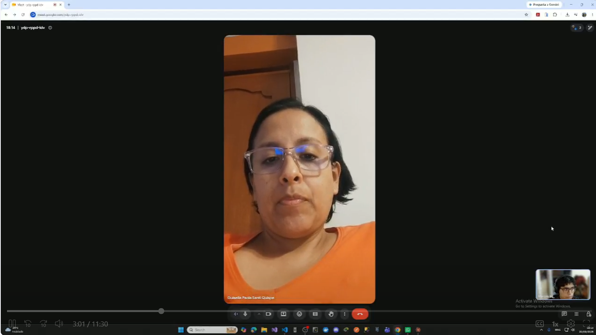

**Resumen:**

Gisela Santi, de 45 años, reside en San Miguel y utiliza el servicio de movilidad escolar dos días por semana para dos menores de 6 y 12 años. Coordinar a dos estudiantes de edades distintas en una misma jornada es lo que caracteriza su uso del servicio: depende por completo de WhatsApp para saber en qué punto del recorrido se encuentra cada uno, y es por ese canal que el conductor le envía mensajes y actualizaciones.

No ha experimentado retrasos ni complicaciones con el servicio. Su preocupación no está en la operación sino en la información: lo que más le inquieta es el nivel de privacidad sobre la ubicación de sus menores y los datos del conductor, a quien considera que debe conocer con certeza antes de confiarle el traslado. Condiciona el uso de cualquier herramienta digital al tratamiento que esta haga de esa información.

#### Entrevista 2 — Marleny Nori Padilla Aguirre

- **Edad:** 47 años.
- **Ocupación / segmento:** Padre o tutor de familia.
- **Edad del menor:** 14 años.
- **Distrito:** Cercado de Lima.
- **Frecuencia de uso:** 1 día a la semana.
- **Duración:** 15:32.           
- **Timing de inicio:** 00:00.
- **Video:** https://upcedupe-my.sharepoint.com/:v:/g/personal/u20221e646_upc_edu_pe/IQBZEYrCvz0UTYUAl1mpybc0AY7AkjTMQVY_AlCxp-8OP34?e=nc6MsX&nav=eyJyZWZlcnJhbEluZm8iOnsicmVmZXJyYWxBcHAiOiJTdHJlYW1XZWJBcHAiLCJyZWZlcnJhbFZpZXciOiJTaGFyZURpYWxvZy1MaW5rIiwicmVmZXJyYWxBcHBQbGF0Zm9ybSI6IldlYiIsInJlZmVycmFsTW9kZSI6InZpZXcifX0%3D

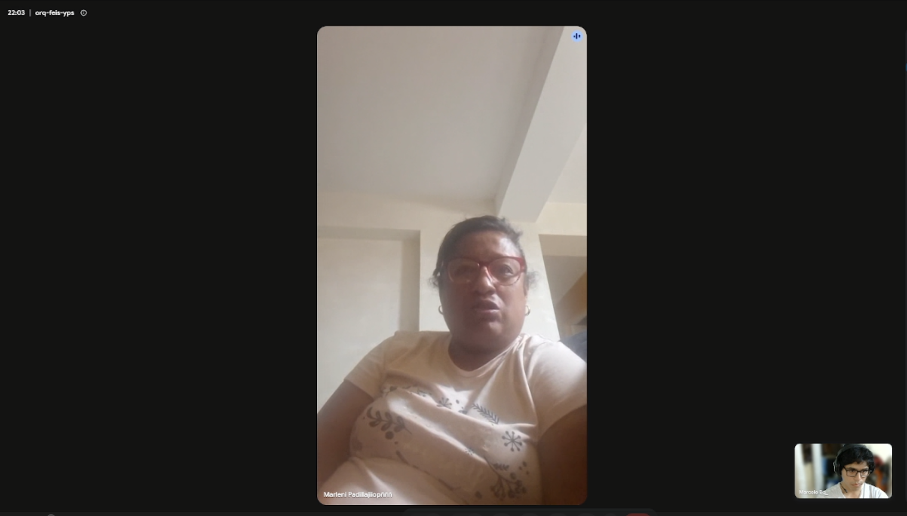

  
**Resumen:**

Marleny Padilla, de 47 años, es ama de casa y reside en Cercado de Lima. Utiliza el servicio con baja frecuencia —un día por semana— para su hija de 14 años, que cursa secundaria. Al permanecer en casa durante la jornada, su coordinación se concentra en los momentos de salida y retorno, y se apoya íntegramente en WhatsApp, por donde recibe los mensajes y las actualizaciones de ubicación del conductor.

Tampoco ha enfrentado retrasos ni incidentes con el servicio. Su reserva coincide con la de la entrevistada anterior, y la coincidencia resulta significativa: pese a tratarse de una adolescente y no de una niña pequeña, la privacidad de la ubicación y la identidad del conductor siguen siendo su principal condición para adoptar una plataforma. La edad del estudiante no reduce la exigencia de confianza.

#### Entrevista 3 — Leonel Adrián Mitma Garro

- **Edad:** 24 años.
- **Ocupación / segmento:** Padre o tutor de familia.
- **Edad del menor:** 6 años.
- **Distrito:** Callao.
- **Frecuencia de uso:** 5 días a la semana.
- **Duración:** 07:43.         
- **Timing de inicio:** 00:00.
- **Video:** https://upcedupe-my.sharepoint.com/:v:/g/personal/u202423163_upc_edu_pe/IQAiG1Qiytv5T7nH1uVETjB1AbaTGE1RMaOf4cY4BH8dFkE?e=9F3PT4

  
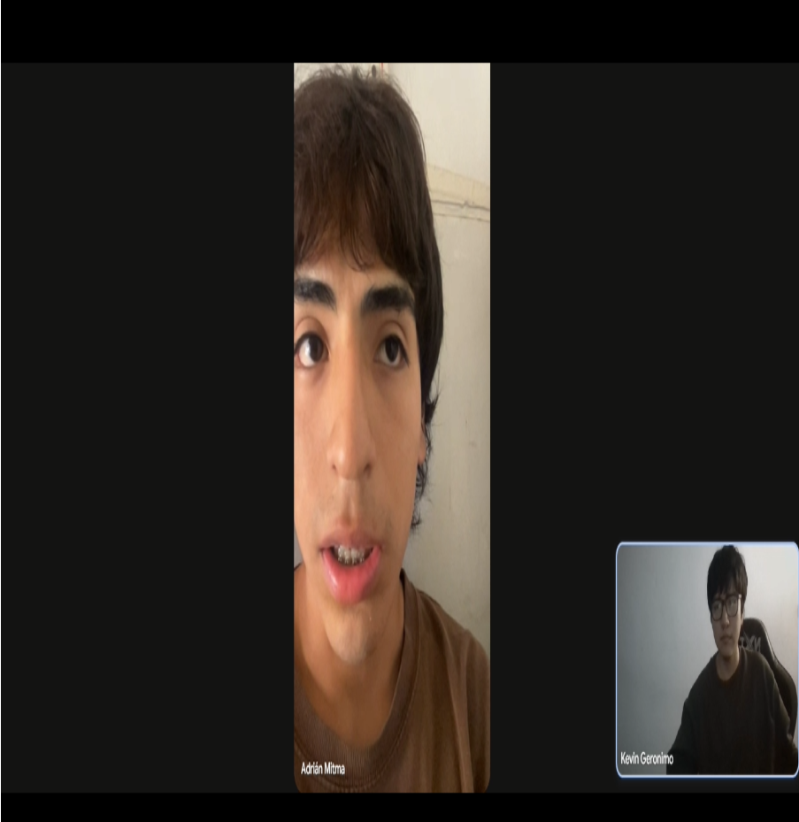

**Resumen:** Leonel Adrián es un padre de familia de 24 años que reside en el distrito del Callao. Utiliza el servicio de movilidad escolar cinco días a la semana para que su hijo de 6 años asista al nido. Para comunicarse con el conductor, emplea principalmente WhatsApp. Por este medio, el chófer envía fotografías al grupo de padres como evidencia de que los niños han llegado a su destino, lo cual le genera tranquilidad. A pesar de no haber experimentado retrasos ni complicaciones con el servicio, Adrián admite sentir cierta incertidumbre durante el trayecto de su hijo debido a la inseguridad ciudadana que hay en su distrito. Si se implementara una herramienta digital para el servicio, considera que lo más útil sería poder visualizar la ubicación exacta del vehículo en tiempo real. Además, mencionó que sería ideal contar con cámaras de seguridad, aunque es consciente de que sería difícil de implementar. Por el momento, Adrián se encuentra completamente satisfecho con el servicio, siente que todo va acorde y no realizaría ningún cambio en la forma actual de coordinación.

#### Entrevista 4 — Gabriel Alexandro Sosa Guevara

- **Edad:** 20 años.
- **Ocupación / segmento:** Conductor de movilidad escolar.
- **Experiencia en el rubro:** 2 años.
- **Distrito:** Los Olivos.
- **Duración:** 09:51.
- **Timing de inicio:** 00:00.
- **Video:** https://upcedupe-my.sharepoint.com/:v:/g/personal/u202422298_upc_edu_pe/IQC8MugJp8RuRYBv6-JB1JqxAa7zKfdSDfWOW6lMscwFzxg?nav=eyJyZWZlcnJhbEluZm8iOnsicmVmZXJyYWxBcHBQbGF0Zm9ybSI6IldlYiIsInJlZmVycmFsTW9kZSI6InZpZXciLCJyZWZlcnJhbFZpZXciOiJNeUZpbGVzTGlua0NvcHkifX0&e=MUf4ft

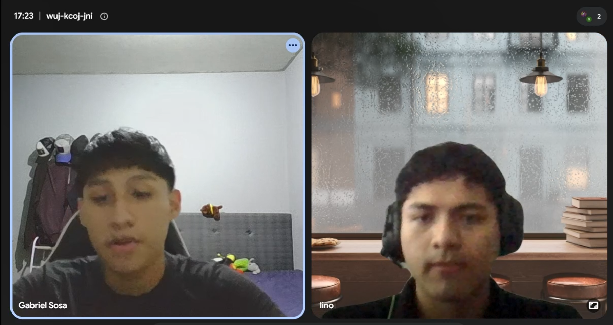

**Resumen:** Gabriel cuenta con 2 años de experiencia realizando transporte escolar. Utiliza diariamente su teléfono para trabajar y principalmente usa WhatsApp para comunicarse con las familias y Google Maps para organizar sus rutas. Comenta que uno de los problemas que presenta es tener la información fragmentada en distintos chats, lo que hace poco práctico buscar entre conversaciones para verificar si un estudiante será recogido o consultar la dirección de un punto de llegada alternativo. Además, menciona que es repetitivo responder diariamente las preguntas de los padres sobre cuánto falta para que llegue su hijo, si la movilidad se encuentra cerca o si el estudiante se encuentra bien, ya que esto puede distraerlo mientras conduce. También considera que, en caso de utilizar una aplicación, esta debería ser fácil y rápida de utilizar para no quitarle tiempo durante la conducción. Entre las funcionalidades que considera útiles se encuentran una lista de alumnos, el orden de recojo y la posibilidad de registrar rápidamente cuándo recoge o entrega a un estudiante. Asimismo, le gustaría que los padres puedan visualizar el estado de la ruta y su ubicación para mantenerse informados sin necesidad de comunicarse constantemente con él.

#### Entrevista 5 — Brayan Solorzano Pineda

- **Edad:** 25 años.
- **Ocupación / segmento:** Conductor de movilidad escolar.
- **Experiencia en el rubro:** 5 años.
- **Distrito:** Pueblo Libre.
- **Duración:** 09:05.
- **Timing de inicio:** 00:00.
- **Video:** https://upcedupe-my.sharepoint.com/:v:/g/personal/u202422298_upc_edu_pe/IQDViGOQ_7GOQYDKI1MqVAXNAacWQv3o8bRMqBJbKkhsKp8?nav=eyJyZWZlcnJhbEluZm8iOnsicmVmZXJyYWxBcHBQbGF0Zm9ybSI6IldlYiIsInJlZmVycmFsTW9kZSI6InZpZXciLCJyZWZlcnJhbFZpZXciOiJNeUZpbGVzTGlua0NvcHkifX0&e=6tRx0m

**Resumen:** Brayan cuenta con 5 años de experiencia en el rubro. Comenzó trabajando en transporte personal, pero luego se trasladó al rubro del transporte escolar. Utiliza un grupo de WhatsApp para enviar avisos a los padres; sin embargo, los tutores prefieren escribirle por privado. Además, utiliza Waze para evitar el tráfico y el calendario de su teléfono para recordar horarios especiales. Ha tenido problemas para recordar cambios en las rutas debido a modificaciones en el recojo de un alumno, especialmente porque varios padres le escriben. Diariamente, los padres también le preguntan si ya se encuentra cerca o si los niños ya llegaron a la escuela, lo cual considera repetitivo. Comenta que durante la conducción no utilizaría una aplicación. Sin embargo, le sería útil contar con un registro del inicio del recorrido, la hora de recojo de cada alumno y la hora de llegada a la escuela. También considera útil registrar cuando un alumno no será recogido. En general, considera que una aplicación debería ayudarlo a organizar los cambios y permitir que los padres puedan seguir la ruta sin necesidad de preguntarle constantemente. No utilizaría una aplicación que lo obligue a realizar muchas acciones manualmente o que tenga un costo muy elevado. Como característica adicional, le gustaría que pudiera utilizarse en zonas donde existe poca señal.

#### Entrevista 6 — Vilma Hoyos Martinez

- **Edad:** 56 años.
- **Ocupación / segmento:** Conductor de movilidad escolar.
- **Experiencia en el rubro:** 25 años.
- **Distrito:** San Miguel.
- **Duración:** 18:14.
- **Timing de inicio:** 00:06.
- **Video:** https://upcedupe-my.sharepoint.com/:v:/g/personal/u20241b451_upc_edu_pe/IQAarNiMmGEZT73ZVhSkpNMNAVFqyptTBINEQvTJU6AW7BY?nav=eyJyZWZlcnJhbEluZm8iOnsicmVmZXJyYWxBcHAiOiJTdHJlYW1XZWJBcHAiLCJyZWZlcnJhbFZpZXciOiJTaGFyZURpYWxvZy1MaW5rIiwicmVmZXJyYWxBcHBQbGF0Zm9ybSI6IldlYiIsInJlZmVycmFsTW9kZSI6InZpZXcifX0%3D&e=asjxgo

**Resumen:** Vilma cuenta con 25 años de experiencia en el rubro de la movilidad escolar. Empezó llevando a estudiantes del colegio San Toribio, en el Rímac, hace 10 años y actualmente está a cargo de 26 niños en San Miguel, a quienes lleva a los colegios Claretiano y Los Rosales. La señora Vilma cuenta con un ayudante, quien utiliza la aplicación WhatsApp para comunicarse con las familias, coordinar horarios, llamar para avisar que deben bajar, informar si el niño asistirá, si necesita esperar y compartir su ubicación en tiempo real. Ha presentado problemas con la puntualidad de los niños y con la coordinación con los padres respecto a si los niños serán recogidos o no. Comenta que tiene conocimientos casi nulos en tecnología. Los padres le han recomendado utilizar algunas aplicaciones para poder realizar un mejor seguimiento del recorrido de sus hijos, pero menciona que no sabe cómo utilizarlas y, por ese motivo, no las implementa.

### 2.2.3. Análisis de entrevistas

En esta sección se analizan las respuestas obtenidas en las entrevistas registradas, con el fin de identificar las características objetivas y subjetivas más frecuentes en cada segmento objetivo. Los resultados presentados provienen exclusivamente de las entrevistas documentadas en la sección anterior y constituyen la base para la construcción de los User Personas.

#### Segmento 1: Padres y tutores

Este grupo de análisis reúne las entrevistas 1, 2 y 3, correspondientes a Gisela Paola Santi Quispe (45, San Miguel), Marleny Nori Padilla Aguirre (47, Cercado de Lima) y Leonel Adrián Mitma Garro (24, Callao). Los tres son responsables de uno o más menores que utiliza movilidad escolar en Lima Metropolitana o el Callao y contratan el servicio de forma directa con el conductor, sin intermediación del colegio, lo que los hace comparables entre sí.

**Características demográficas y de contexto**

| Variable                                               | Resultado                               |
| ------------------------------------------------------ | --------------------------------------- |
| Edad de los entrevistados                              | 24, 45 y 47 años (promedio: 38,7 años)  |
| Distritos de residencia                                | Callao, Cercado de Lima y San Miguel    |
| Edad de los menores que utilizan el servicio           | 6, 6, 12 y 14 años (promedio: 9,5 años) |
| Entrevistados con más de un menor en el servicio       | 33,3 %                                  |
| Frecuencia de uso del servicio                         | 1, 2 y 5 días a la semana               |
| Entrevistados que utilizan el servicio de forma diaria | 33,3 %                                  |

**Herramientas y canales digitales utilizados**

| Variable                                                               | Porcentaje |
| ---------------------------------------------------------------------- | ---------: |
| Utiliza WhatsApp como canal principal con el conductor                 |      100 % |
| Recibe actualizaciones de estado o ubicación por ese canal             |      100 % |
| Recibe evidencia de llegada mediante fotografías en el grupo de padres |     33,3 % |

**Frustraciones y preocupaciones identificadas**

| Variable                                                            | Porcentaje |
| ------------------------------------------------------------------- | ---------: |
| Manifiesta preocupación por la privacidad de la ubicación del menor |     66,7 % |
| Considera fundamental la confianza en el conductor y su información |     66,7 % |
| Declara incertidumbre durante el trayecto del menor                 |     33,3 % |
| Asocia esa incertidumbre a la inseguridad ciudadana de su distrito  |     33,3 % |
| Ha experimentado retrasos o complicaciones con el servicio          |        0 % |
| Manifiesta estar conforme con la forma actual de coordinación       |     33,3 % |

**Necesidades y expectativas sobre una solución digital**

| Variable                                                                  | Porcentaje |
| ------------------------------------------------------------------------- | ---------: |
| Considera prioritaria la ubicación del vehículo en tiempo real            |     33,3 % |
| Valora recibir evidencia de que el menor llegó a su destino               |     33,3 % |
| Menciona funcionalidades de videovigilancia dentro del vehículo           |     33,3 % |
| Condiciona el uso de la herramienta al tratamiento de los datos del menor |     66,7 % |
| Declara que no modificaría su forma actual de coordinación                |     33,3 % |

#### Hallazgos del análisis

**WhatsApp es el canal universal de coordinación.** La totalidad de los entrevistados de ambos segmentos utiliza esta aplicación para coordinar el servicio, lo que confirma el supuesto de que la comunicación ocurre hoy en un canal de uso general no diseñado para este fin.

**Las consultas repetitivas afectan principalmente al conductor.** Los tres conductores señalaron responder diariamente las mismas preguntas sobre la proximidad de la movilidad, y dos de ellos indicaron que esto los distrae mientras conducen. En contraste, ningún padre entrevistado describió esa comunicación como un problema propio. Esto sugiere que la reducción de consultas es un beneficio percibido con mayor claridad por el segmento de conductores, y que la propuesta de valor hacia las familias debe sustentarse en la tranquilidad y la confianza antes que en la eficiencia.

**La privacidad es la principal preocupación de los padres y tutores.** Dos de los tres entrevistados manifestaron que su mayor inquietud es el tratamiento de la ubicación del menor y la información del conductor, y condicionaron su confianza en una herramienta digital a este aspecto. Este hallazgo valida el supuesto de que la adopción dependerá de una adecuada gestión de permisos y visibilidad, y otorga prioridad a las historias de autorización de tutores y control de acceso.

**La expectativa de ubicación en tiempo real es menor a la anticipada.** Solo uno de los tres padres entrevistados mencionó la ubicación en tiempo real como la funcionalidad más valiosa, mientras que dos expresaron reparos precisamente sobre ese tipo de información. Esto respalda la decisión de diseño de Rumbo de mostrar estados e hitos confirmados en lugar de una secuencia continua de coordenadas, y de mantener el seguimiento de ubicación fuera del alcance inicial.

**La coordinación de ausencias es un problema no anticipado en su magnitud.** Los tres conductores mencionaron dificultades para saber si un estudiante será recogido, ya sea por mensajes dispersos, cambios de último momento o falta de aviso. Este hallazgo otorga mayor prioridad a la historia de reporte de ausencias de la que se le había asignado inicialmente en el Product Backlog.

**La evidencia de llegada tiene valor para las familias.** Un entrevistado destacó que recibir fotografías de la llegada le genera tranquilidad, lo que sugiere que la confirmación de hitos cumple una función equivalente sin exponer la ubicación continua del menor ni su imagen.

**La alfabetización digital es una barrera real de adopción.** La conductora con mayor experiencia en el rubro declaró conocimientos casi nulos en tecnología y delega el uso del teléfono en un ayudante, pese a que los padres le han recomendado aplicaciones de seguimiento. Este hallazgo refuerza la necesidad de una interfaz de pocos pasos e introduce la figura del ayudante como un usuario no previsto en los segmentos objetivo.

**La satisfacción con el servicio actual puede reducir la urgencia percibida.** Ningún padre entrevistado reportó haber experimentado retrasos o complicaciones, y uno manifestó no modificaría su forma actual de coordinación. Rumbo debe, por tanto, presentarse como un complemento que aporta tranquilidad y orden, y no como la corrección de un problema que las familias perciban como crítico.

#### Segmento 2: Conductores de movilidad escolar

Este grupo de análisis reúne las entrevistas 4, 5 y 6, correspondientes a Gabriel Alexandro Sosa Guevara (20, Los Olivos), Brayan Solorzano Pineda (25, Pueblo Libre) y Vilma Hoyos Martinez (56, San Miguel). Los tres operan de forma independiente en Lima Metropolitana y gestionan su propia cartera de familias, por lo que comparten la misma estructura de trabajo pese a diferir ampliamente en edad y en años de experiencia.

**Características demográficas y de contexto**

| Variable                                            | Resultado                                                        |
| --------------------------------------------------- | ---------------------------------------------------------------- |
| Edad de los entrevistados                           | 20, 25 y 56 años (promedio: 33,7 años)                           |
| Distritos de operación                              | Los Olivos, Pueblo Libre y San Miguel (100 % Lima Metropolitana) |
| Experiencia en el rubro                             | 2, 5 y 25 años (promedio: 10,7 años)                             |
| Conductores que operan de forma independiente       | 100 %                                                            |
| Conductores que cuentan con un ayudante o asistente | 33,3 %                                                           |

**Herramientas y canales digitales utilizados**

| Variable                                                    | Porcentaje |
| ----------------------------------------------------------- | ---------: |
| Utiliza WhatsApp como canal principal con las familias      |      100 % |
| Utiliza una aplicación de navegación (Google Maps, Waze)    |     66,7 % |
| Utiliza el calendario del teléfono para horarios especiales |     33,3 % |
| Declara conocimientos casi nulos en tecnología              |     33,3 % |
| Delega el uso del teléfono en un ayudante durante la ruta   |     33,3 % |

**Frustraciones identificadas**

| Variable                                                                 | Porcentaje |
| ------------------------------------------------------------------------ | ---------: |
| Recibe consultas repetitivas de los padres sobre el avance de la ruta    |      100 % |
| Presenta dificultades para coordinar si un estudiante será recogido o no |      100 % |
| Considera que la información queda fragmentada entre conversaciones      |     66,7 % |
| Indica que responder mensajes lo distrae mientras conduce                |     66,7 % |
| Ha tenido problemas para recordar cambios comunicados por los padres     |     33,3 % |
| Ha tenido problemas de puntualidad con los estudiantes                   |     33,3 % |

**Necesidades y expectativas sobre una solución digital**

| Variable                                                           | Porcentaje |
| ------------------------------------------------------------------ | ---------: |
| Considera útil registrar los hitos de recojo y entrega             |     66,7 % |
| Requiere que la aplicación sea rápida y de pocos pasos             |     66,7 % |
| Desea que los padres puedan seguir la ruta sin contactarlo         |     66,7 % |
| Considera útil contar con la lista de alumnos y el orden de recojo |     33,3 % |
| Declara que no utilizaría la aplicación mientras conduce           |     33,3 % |
| Menciona el costo como condición para adoptar la herramienta       |     33,3 % |
| Menciona el funcionamiento en zonas con poca señal                 |     33,3 % |
| No adopta aplicaciones recomendadas por desconocimiento de su uso  |     33,3 % |

## 2.3. Needfinding

### 2.3.1. User Personas

En esta sección se presentan las User Personas correspondientes a los dos segmentos objetivo. Cada arquetipo se construyó sobre un conjunto definido de entrevistados, seleccionado por compartir estructura de uso y no por similitud demográfica.

| User Persona         | Segmento      | Conjunto de entrevistados                                           | Patrón compartido que sustenta el arquetipo                                                                                                                                                       |
| -------------------- | ------------- | ------------------------------------------------------------------- | ------------------------------------------------------------------------------------------------------------------------------------------------------------------------------------------------- |
| **Gabriela Morales** | Padre / Tutor | Entrevistas 1, 2 y 3 — Gisela Santi, Marleny Padilla y Leonel Mitma | Los tres coordinan exclusivamente por WhatsApp, no disponen de ninguna vista del estado del traslado y condicionan su confianza en una herramienta digital al tratamiento de los datos del menor. |
| **Carlos Rivas**     | Conductor     | Entrevistas 4, 5 y 6 — Gabriel Sosa, Brayan Solórzano y Vilma Hoyos | Los tres operan de forma independiente, responden a diario las mismas consultas sobre el avance de la ruta y declararon dificultades para saber con antelación si un estudiante será recogido.    |

La edad y los años de experiencia no se utilizaron como criterio de agrupación, porque dentro de cada conjunto presentan una dispersión amplia —de 24 a 47 años en el primero y de 2 a 25 años de experiencia en el segundo— mientras que el proceso de trabajo y las frustraciones se mantienen constantes. Por ello, los rasgos demográficos de cada User Persona corresponden al valor medio del conjunto y no a ninguno de los entrevistados en particular.

**Perfil no cubierto por los arquetipos.** La entrevistada 6 declaró conocimientos casi nulos en tecnología y delegar el uso del teléfono en un ayudante durante la ruta. Este rasgo no se incorporó a Carlos Rivas por no ser compartido por el conjunto, pero se conservó como restricción de diseño: la interfaz debe ser operable en pocos pasos y con el vehículo detenido, sin asumir que quien registra los eventos es necesariamente quien conduce.

#### Segmento — Padres y tutores

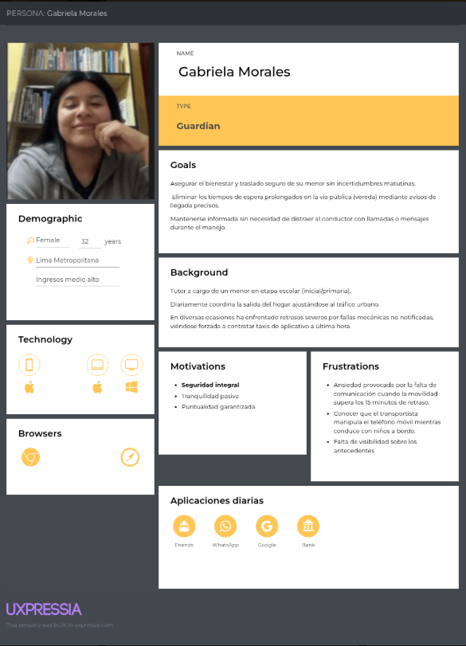

#### Segmento — Conductores

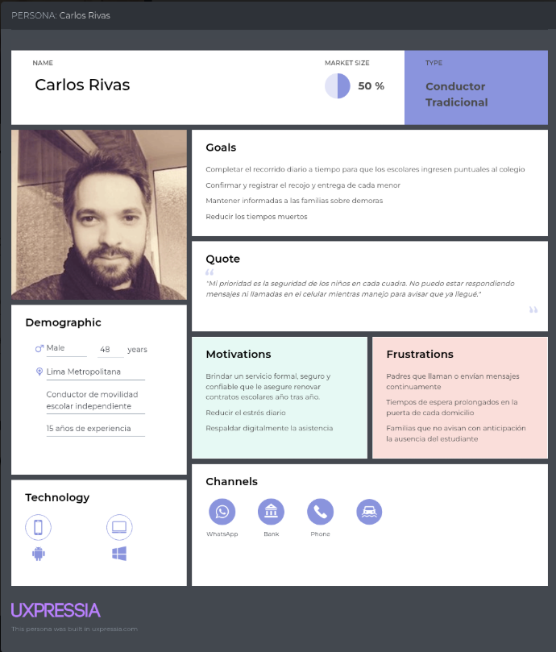

### 2.3.2. User Task Matrix

La User Task Matrix resume las tareas que realizan los dos segmentos objetivo en su rutina de movilidad escolar, independientemente de que exista Rumbo. Para mantener coherencia con los User Personas, se consideran **Gabriela Morales (Padre/Tutor)** y **Carlos Rivas (Conductor)**.

| Tarea del usuario                                 | Padre/Tutor — Frecuencia | Padre/Tutor — Importancia | Conductor — Frecuencia | Conductor — Importancia |
| ------------------------------------------------- | :----------------------: | :-----------------------: | :--------------------: | :---------------------: |
| Preparar al estudiante antes del recojo           |          Diaria          |           Alta            |       No aplica        |        No aplica        |
| Confirmar si el estudiante utilizará la movilidad |          Diaria          |           Alta            |         Diaria         |          Alta           |
| Esperar / llegar al punto de recojo acordado      |          Diaria          |           Alta            |         Diaria         |          Alta           |
| Organizar el orden de paradas del recorrido       |        No aplica         |         No aplica         |         Diaria         |          Alta           |
| Confirmar que el estudiante fue recogido          |          Diaria          |           Alta            |         Diaria         |          Alta           |
| Consultar o comunicar el avance del traslado      |          Diaria          |           Alta            |         Diaria         |          Alta           |
| Comunicar un retraso                              |        Ocasional         |           Alta            |       Ocasional        |          Alta           |
| Comunicar una incidencia                          |        Ocasional         |           Alta            |       Ocasional        |          Alta           |
| Confirmar la llegada o entrega del estudiante     |          Diaria          |           Alta            |         Diaria         |          Alta           |
| Coordinar el retorno del estudiante               |          Diaria          |           Media           |         Diaria         |          Media          |

Las tareas de **confirmar asistencia, recojo y entrega** son recurrentes y de alta importancia para ambos segmentos. La diferencia principal está en que el padre/tutor necesita mantenerse informado, mientras que el conductor debe organizar el recorrido y comunicar cambios sin distraerse durante la conducción. Esta matriz respalda la prioridad dada a los estados del traslado, hitos, retrasos, incidencias y reporte de ausencias dentro del Product Backlog.

### 2.3.3. User Journey Mapping

En esta sección se presentan los **User Journey Maps** correspondientes a los dos segmentos objetivos: **Padres/Tutores y Conductores**. Estos mapas representan el recorrido actual de cada usuario durante el servicio de movilidad escolar, desde el inicio hasta el final de su experiencia.

Se presentan las versiones **As-Is**, que permiten analizar cómo se desarrolla actualmente el proceso sin la intervención de nuestra solución. A través de las diferentes etapas, actividades, puntos de contacto y dificultades identificadas, se busca comprender la experiencia de cada User Persona y detectar oportunidades de mejora.

#### Segmento — Padres y tutores

El journey del segmento Padre/Tutor inicia con la preparación del menor y la coordinación del servicio mediante WhatsApp. Durante la espera y el traslado, la principal necesidad es contar con información suficiente para confirmar el avance y la llegada sin depender de consultas constantes al conductor. Las entrevistas realizadas también muestran que la **privacidad de la ubicación del menor** y la **confianza en el conductor** son factores determinantes para adoptar una herramienta digital. Por ello, las oportunidades de mejora se concentran en ofrecer confirmaciones claras del traslado, información visible únicamente para usuarios autorizados y una experiencia que complemente —en lugar de complicar— la coordinación actual.

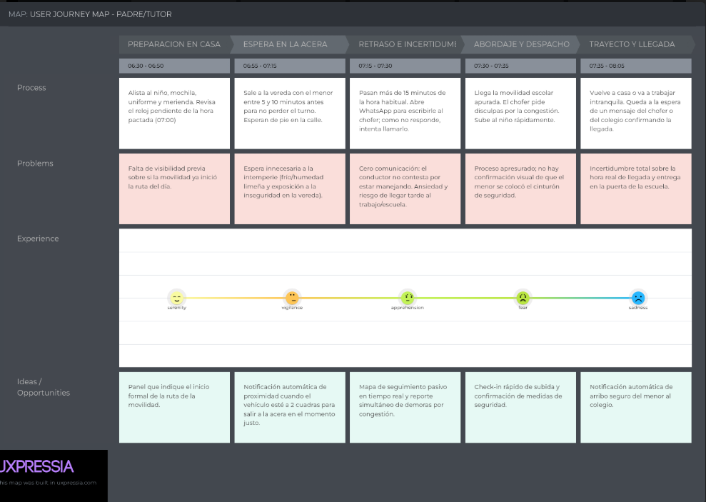

#### Segmento — Conductores

El recorrido diario del conductor inicia **antes del viaje**, en un estado neutral, revisando chats de WhatsApp para corroborar las asistencias de forma tediosa y repetitiva. **Durante el viaje de ida** la experiencia desciende hacia la molestia, debido a lo estresante y peligroso que resulta manejar mientras responde mensajes constantes y llamadas sobre demoras. Al **terminar la ida y preparar el retorno**, recupera una actitud serena y de anticipación, aunque debe informarse de los cambios a través de conversaciones fragmentadas. **En el colegio**, durante la recogida, la experiencia se mantiene en vigilancia y neutralidad mientras cuenta y verifica la asistencia de los menores lidiando con llamadas de última hora. **Durante el viaje de regreso** vuelve a un estado neutral: reparte a los estudiantes mientras responde chats y busca información de contacto ante cualquier emergencia. Finalmente, **al concluir la jornada**, la sensación es de serenidad, aunque alcanzarla le exige comunicarse individualmente con cada familia para confirmar que los niños llegaron a sus domicilios.

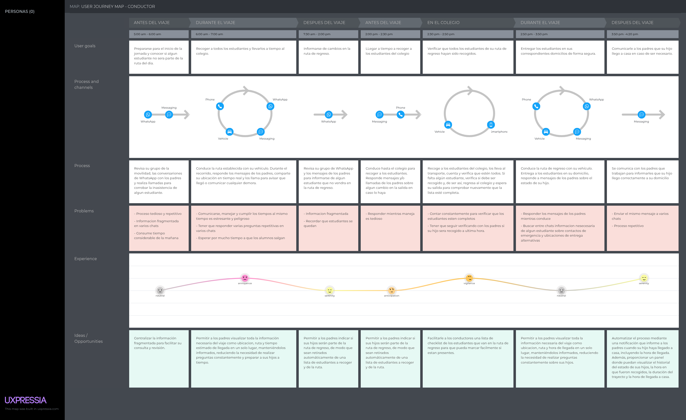

### 2.3.4. Empathy Mapping

En esta sección se presentan los **Empathy Maps** elaborados para cada uno de los User Personas: **Parent/Tutor y Driver**. Estos mapas fueron construidos a partir de las observaciones obtenidas durante las entrevistas y permiten comprender sus necesidades, comportamientos, pensamientos, emociones, Pains y Gains dentro del contexto de la movilidad escolar.

##### Segmento — Padres y tutores

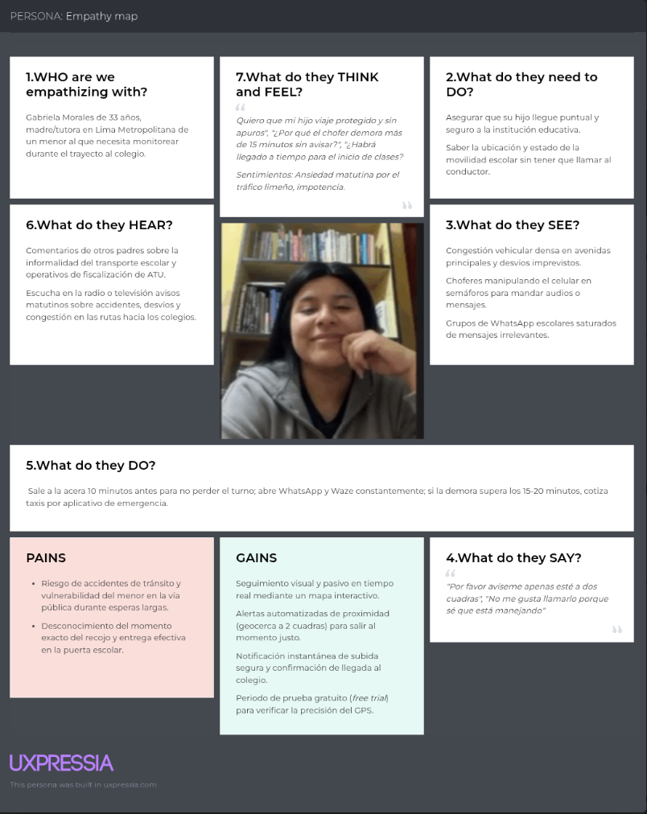

##### Segmento — Conductores

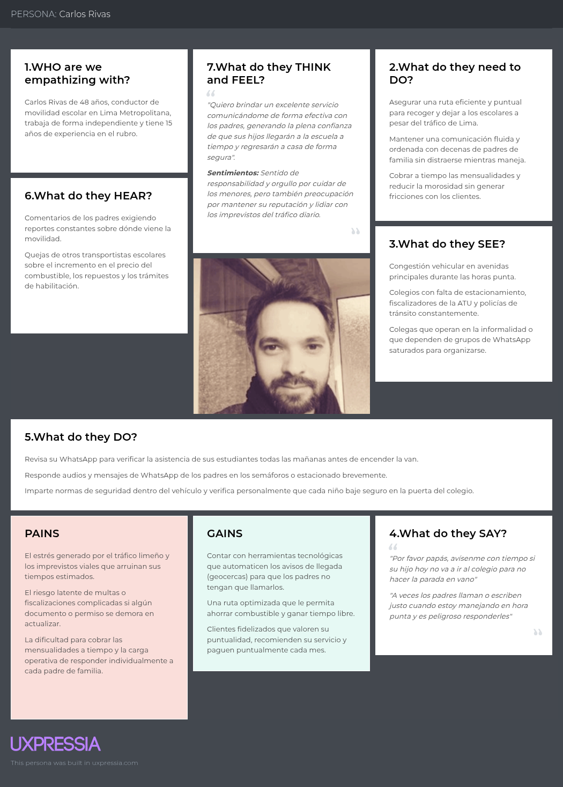

## 2.4. Big Picture Event Storming

El equipo realizó una sesión de Big Picture EventStorming para comprender el dominio de la movilidad escolar de extremo a extremo antes de definir la solución. El objetivo fue identificar los hechos relevantes del negocio, ordenarlos según su secuencia real, reconocer quién los origina, qué sistemas externos participan y qué preguntas quedan abiertas, para obtener una primera delimitación de responsabilidades que será refinada posteriormente en el diseño DDD.

**Resumen del proceso realizado**

**1. Exploración del dominio.** Se recorrieron de extremo a extremo las actividades de los dos segmentos objetivo: la habilitación del conductor y su vehículo, el registro de las familias y sus estudiantes, la planificación de rutas y paradas, la programación y ejecución del traslado, la gestión de retrasos e incidencias, la comunicación hacia los tutores autorizados y el cierre e historial del servicio.

**2. Identificación de Domain Events.** Los hechos se registraron en tiempo pasado y en inglés, para mantener consistencia con el Ubiquitous Language. Se obtuvieron treinta y siete eventos en la línea principal, entre ellos `Driver Credential Verified`, `Vehicle Registered`, `Parent Linked to Student`, `Emergency Contact Registered`, `Route Created`, `Stop Order Defined`, `Student Assigned to Route`, `Assistant Access Granted`, `Trip Scheduled`, `Trip Roster Generated`, `Stop Reached`, `Student Pickup Confirmed`, `Student Pickup Missed`, `Delay Registered`, `Incident Reported`, `School Arrival Confirmed`, `Student Drop-off Confirmed`, `Trip Timeline Generated` y `Student Data Deletion Requested`. Ninguno de ellos describe pantallas ni decisiones técnicas: todos corresponden a cambios observables del negocio.

**3. Ordenamiento temporal y Pivotal Events.** Los eventos se ordenaron siguiendo el flujo real del servicio y se identificaron cuatro **pivotal events** que marcan transiciones irreversibles del dominio. Cada uno separa una fase de la siguiente mediante una línea divisoria:

Adicionalmente se identificó un **carril paralelo** de ocho eventos que no pertenecen a la secuencia principal porque pueden ocurrir en cualquier momento del ciclo: `Notification Triggered`, `Notification Sent`, `Notification Delivery Failed`, `Notification Read`, `Trip Status Consulted`, `Trip Timeline Consulted`, `Driver Information Consulted` e `Incident Acknowledged`. Los tres eventos de consulta representan lecturas de los usuarios y no modifican el estado del dominio; `Incident Acknowledged` sí lo hace, porque deja constancia de que el tutor fue informado.

| Pivotal Event      | Qué habilita                                                                                            |
| ------------------ | ------------------------------------------------------------------------------------------------------- |
| `Driver Onboarded` | Cierra la habilitación del conductor, su vehículo y su suscripción; sin este hito no puede crear rutas. |
| `Route Published`  | Convierte una ruta en configuración vigente y habilita la programación de viajes.                       |
| `Trip Started`     | Marca el paso de la planificación a la ejecución; a partir de aquí los eventos se registran en campo.   |
| `Trip Completed`   | Cierra la ejecución y habilita la consolidación de la línea de tiempo y el historial.                   |

Adicionalmente se identificó un **carril paralelo** de siete eventos que no pertenecen a la secuencia principal porque pueden ocurrir en cualquier momento del ciclo: `Notification Triggered`, `Notification Sent`, `Notification Delivery Failed`, `Notification Read`, `Trip Status Consulted`, `Trip Timeline Consulted` e `Incident Acknowledged`. Los tres últimos representan consultas de los usuarios y no modifican el estado del dominio.

**4. Actores, sistemas externos y hot spots.** Se asignó a cada evento el actor que lo origina, distinguiendo al **Driver**, que genera los eventos de configuración de ruta y de ejecución del traslado, del **Parent/Tutor**, que genera el registro de estudiantes, el reporte de ausencias, la lectura de notificaciones y la solicitud de eliminación de datos. Se incorporaron tres sistemas externos: la **ATU API** para contrastar la habilitación del conductor y del vehículo, la **API de Mapas** para resolver direcciones de paradas y estimar el avance del recorrido, y la **API de Notificaciones** como proveedor de entrega de los avisos. Finalmente se registraron los puntos de incertidumbre que el equipo no puede resolver en esta etapa:

| Hot spot                                                                   | Evento asociado              |
| -------------------------------------------------------------------------- | ---------------------------- |
| ¿Qué ocurre si la credencial del conductor vence durante el ciclo escolar? | `Driver Credential Verified` |
| ¿Qué sucede si falla el cobro de la suscripción con un servicio en curso?  | `Subscription Activated`     |
| ¿Cómo se valida que la dirección de una parada sea localizable?            | `Stop Added to Route`        |
| ¿Qué pasa si los estudiantes asignados superan la capacidad del vehículo?  | `Student Assigned to Route`  |
| ¿Quién puede cancelar un viaje ya programado y con cuánta anticipación?    | `Trip Cancelled`             |
| ¿Qué ocurre si el conductor pierde conectividad durante el recorrido?      | `Stop Reached`               |
| ¿Quién autoriza una entrega a una persona no registrada como tutor?        | `Drop-off Rejected`          |
| ¿Cuánto tiempo se conserva el historial antes de su eliminación?           | `Trip History Archived`      |

**5. Límites emergentes del dominio.** Los pivotal events no solo ordenan la secuencia: señalan los puntos donde el dominio cambia de responsable y de naturaleza. `Driver Onboarded` cierra la habilitación del prestador y abre la configuración del servicio; `Route Published` cierra la configuración y abre la operación; `Trip Started` separa la planificación de la ejecución en campo; y `Trip Completed` separa la ejecución del cierre documental. El carril paralelo de notificaciones y consultas se comporta de forma independiente a esta secuencia, lo que sugiere una responsabilidad propia. Estos límites emergentes constituyen la entrada para el Design-Level EventStorming, donde se formalizan como Bounded Contexts y se detallan sus commands, aggregates, policies y read models (sección 4.6.1).

**Captura consolidada y resultado**

  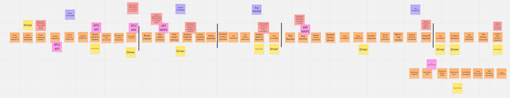

**Artefacto colaborativo:** https://miro.com/app/board/uXjVIveDKA8=/?share_link_id=909349762479

El Big Picture evidencia que el núcleo operativo de Rumbo se concentra entre `Route Published` y `Trip Completed`, es decir, en la planificación y ejecución del traslado, mientras que identidad, perfiles, vehículos, incidencias, notificaciones y suscripción aportan capacidades de soporte. Los cuatro pivotal events delimitan las fases que estructurarán los Epics del Product Backlog, y los hot spots registrados anticipan las reglas de negocio y los riesgos que deberán resolverse en el Design-Level EventStorming y en el diseño de la base de datos.

## 2.5. Ubiquitous Language

En esta sección se define el glosario de términos del dominio de Rumbo, con el fin de que todos los miembros del equipo y los stakeholders utilicen un lenguaje común y sin ambigüedades durante el ciclo de vida del producto. Los términos se expresan en inglés, acompañados de su equivalente en español, y sus definiciones corresponden exclusivamente al dominio del transporte escolar.

El glosario se mantiene centrado únicamente en términos del dominio del transporte escolar y evita términos técnicos de ingeniería de software.

##### Personas y entidades del servicio

| Término                                                      | Definición en el dominio de Rumbo                                                                                        |
| ------------------------------------------------------------ | ------------------------------------------------------------------------------------------------------------------------ |
| **Student** (Estudiante)                                     | Menor que utiliza el servicio de movilidad escolar y se encuentra asignado a una o más rutas.                            |
| **Parent / Tutor** (Padre o tutor)                           | Persona autorizada para consultar la información de un estudiante y recibir notificaciones sobre sus traslados.          |
| **Driver** (Conductor)                                       | Persona responsable de ejecutar una ruta de movilidad escolar y registrar los eventos del recorrido.                     |
| **Vehicle** (Vehículo)                                       | Unidad utilizada por un conductor para prestar el servicio de movilidad escolar.                                         |
| **Authorized User** (Usuario autorizado)                     | Persona cuya identidad y permisos le habilitan a acceder a información específica dentro de Rumbo.                       |
| **Driver Credential** (Credencial del conductor)             | Documento que acredita al conductor como habilitado para prestar el servicio de transporte de estudiantes.               |
| **Tutor Authorization** (Autorización de tutor)              | Permiso otorgado a un padre o tutor para acceder a la información de un estudiante determinado.                          |
| **School Transport Service** (Servicio de movilidad escolar) | Servicio destinado al traslado recurrente de estudiantes entre puntos de recojo, centros educativos y puntos de entrega. |
| **Emergency Contact** (Contacto de emergencia) | Persona designada por un tutor para ser contactada ante una situación imprevista durante el traslado de un estudiante. |
| **Assistant** (Asistente) | Persona habilitada por el conductor para confirmar hitos de una ruta específica, sin acceso a su configuración ni a su suscripción. |

##### Planificación de rutas

| Término                                    | Definición en el dominio de Rumbo                                                           |
| ------------------------------------------ | ------------------------------------------------------------------------------------------- |
| **Route** (Ruta)                           | Recorrido planificado que contiene un conjunto ordenado de paradas y estudiantes asignados. |
| **Stop** (Parada)                          | Punto planificado dentro de una ruta donde se realiza un recojo o una entrega.              |
| **Stop Order** (Orden de paradas)          | Secuencia en la que el conductor debe visitar las paradas de una ruta.                      |
| **Route Schedule** (Horario de la ruta)    | Días y horas en los que una ruta se ejecuta de forma recurrente.                            |
| **Assigned Student** (Estudiante asignado) | Estudiante incluido dentro de una ruta específica para una jornada o periodo determinado.   |

##### Ejecución del traslado

| Término                                          | Definición en el dominio de Rumbo                                                                         |
| ------------------------------------------------ | --------------------------------------------------------------------------------------------------------- |
| **Trip** (Viaje)                                 | Ejecución concreta de una ruta en una fecha y franja horaria determinadas.                                |
| **Trip Roster** (Lista de estudiantes del viaje) | Relación de estudiantes previstos para un viaje específico, considerando las ausencias reportadas.        |
| **Trip Status** (Estado del viaje)               | Situación general de un viaje: programado, iniciado, en recorrido, retrasado, completado o cancelado.     |
| **Student Absence** (Ausencia del estudiante)    | Comunicación anticipada de que un estudiante no utilizará el servicio en una jornada determinada.         |
| **Pickup** (Recojo)                              | Evento mediante el cual el conductor confirma que un estudiante fue recogido en el punto correspondiente. |
| **Drop-off** (Entrega)                           | Evento mediante el cual el conductor confirma que un estudiante fue entregado en el destino previsto.     |
| **School Arrival** (Llegada al colegio)          | Evento que confirma que la movilidad llegó al centro educativo correspondiente.                           |
| **Return Trip** (Viaje de retorno)               | Ejecución de la ruta en sentido inverso, desde el centro educativo hacia los puntos de entrega.           |
| **Route Completion** (Cierre de la ruta)         | Término de un viaje después de completar los recojos o entregas previstos.                                |

##### Eventos e incidencias

| Término                                                     | Definición en el dominio de Rumbo                                                                                                                 |
| ----------------------------------------------------------- | ------------------------------------------------------------------------------------------------------------------------------------------------- |
| **Route Event** (Evento de ruta)                            | Acontecimiento relevante producido durante la ejecución de un viaje.                                                                              |
| **Trip Timeline** (Línea de tiempo del viaje)               | Secuencia cronológica de los principales eventos registrados durante un viaje.                                                                    |
| **Delay** (Retraso)                                         | Diferencia significativa entre el horario previsto de una ruta y su avance real.                                                                  |
| **ETA** (Tiempo estimado de llegada) | Hora estimada en la que la movilidad arribará a una parada o destino. Rumbo no calcula ETA dinámico en el alcance actual; el término se conserva porque aparece en las expectativas de los usuarios entrevistados. |
| **Incident** (Incidencia)                                   | Situación imprevista ocurrida durante el servicio que requiere ser registrada y comunicada a los tutores autorizados.                             |
| **Incident Type** (Tipo de incidencia)                      | Categoría que clasifica una incidencia según la naturaleza del imprevisto registrado.                                                             |
| **Trip History** (Historial de viajes)                      | Registro de los viajes ejecutados y sus eventos, conservado para consulta posterior.                                                              |
| **Data Deletion Request** (Solicitud de supresión de datos) | Pedido de un tutor para que se eliminen los datos personales de un estudiante, conforme a la normativa vigente de protección de datos personales. |

##### Comunicación

| Término                                                   | Definición en el dominio de Rumbo                                                          |
| --------------------------------------------------------- | ------------------------------------------------------------------------------------------ |
| **Notification** (Notificación)                           | Aviso enviado a un usuario autorizado como consecuencia de un evento relevante de la ruta. |
| **Notification Preference** (Preferencia de notificación) | Configuración mediante la cual un padre o tutor determina qué avisos desea recibir.        |

##### Modelo de negocio

| Término                        | Definición en el dominio de Rumbo                                                                |
| ------------------------------ | ------------------------------------------------------------------------------------------------ |
| **Subscription** (Suscripción) | Plan contratado por un conductor que le habilita el uso de Rumbo durante un periodo determinado. |

---

# Capítulo III: Requirements Specification

## 3.1. User Stories

Las User Stories representan los requisitos funcionales de **Rumbo** desde la perspectiva de sus usuarios. Se consideran los dos segmentos definidos en los capítulos anteriores —**padres/tutores** y **conductores de movilidad escolar**—, además de las historias del **Landing Page** y las **Technical Stories** necesarias para el RESTful API.

Los criterios de aceptación se redactan en presente, son comprobables y utilizan la estructura **Given-When-Then**. Para el Landing Page se utiliza el rol **visitante** y para las Technical Stories el rol **Developer**. Los Epics, User Stories y Technical Stories se presentan en un único cuadro para mantener el formato solicitado en el curso de Aplicaciones Web. El conjunto actualizado comprende **7 Epics, 38 User Stories y 8 Technical Stories**.

Los criterios de aceptación se redactan en presente, son comprobables y utilizan la estructura **Given-When-Then**. Para el Landing Page se utiliza el rol **visitante** y para las Technical Stories el rol **Developer**. El conjunto comprende **7 Epics, 38 User Stories y 8 Technical Stories**.

### Epics

| Epic ID | Título | Descripción | User Stories que lo componen |
|---|---|---|---|
| **EP01** | Identidad, perfiles y autorización | Registro de conductores, padres y estudiantes, acceso según rol, control de tutores autorizados, consulta de la información declarada del conductor y del vehículo, contactos de emergencia y solicitud de supresión de datos. | US01–US08, US36, US38 |
| **EP02** | Suscripción del conductor | Activación y vigencia del plan que habilita al conductor el uso de las funcionalidades de Rumbo. | US09 |
| **EP03** | Planificación de rutas y viajes | Creación de rutas con sus paradas, orden y horario, asignación de estudiantes autorizados, publicación y programación de viajes, ausencias, cancelaciones y delegación controlada de la confirmación de hitos a un asistente. | US10–US17, US37 |
| **EP04** | Ejecución del traslado | Registro de los hitos del recorrido por parte del conductor: inicio del viaje, recojos, llegada al centro educativo, retorno, entregas y cierre del traslado. | US18–US22 |
| **EP05** | Visibilidad, incidencias y comunicación | Consulta del estado y de la línea de tiempo por parte de los tutores autorizados, y comunicación de retrasos, incidencias y notificaciones sobre los eventos relevantes de la ruta. | US23–US30 |
| **EP06** | Landing Page e información pública | Contenido público que presenta la propuesta de valor de Rumbo, los beneficios por segmento, los documentos legales y los accesos a la aplicación web. | US31–US35 |
| **EP07** | RESTful API e integraciones | Capacidades técnicas del RESTful API, incluyendo autenticación, documentación, internacionalización e integración con los servicios externos requeridos por Rumbo. | TS01–TS08 |

### User Stories y Technical Stories

| Story ID | Título | Descripción | Criterios de Aceptación | Epic ID |
|---|---|---|---|---|
| US01 | Registrar cuenta de conductor | Como conductor, deseo crear mi cuenta para iniciar la configuración de mi servicio en Rumbo. | **Escenario 1: Registro exitoso** Given que no existe una cuenta asociada al correo indicado When el conductor completa los datos obligatorios y confirma el registro Then el sistema crea la cuenta con rol de conductor y solicita la verificación del correo  **Escenario 2: Correo ya registrado** Given que existe una cuenta asociada al correo indicado When el conductor intenta registrarse con ese correo Then el sistema rechaza el registro e indica que puede iniciar sesión o recuperar su acceso  **Escenario 3: Datos obligatorios incompletos** Given una solicitud de registro con datos obligatorios faltantes When el conductor confirma el registro Then el sistema informa qué datos obligatorios debe completar y no crea la cuenta | EP01 |
| US02 | Registrar vehículo y credenciales del servicio | Como conductor, deseo registrar mi vehículo y las credenciales que acreditan mi servicio para que las familias conozcan la información declarada de mi movilidad. | **Escenario 1: Registro de vehículo y credenciales** Given un conductor con cuenta activa When registra la placa, la capacidad del vehículo y los documentos requeridos Then el sistema asocia el vehículo al conductor y deja las credenciales en estado pendiente de verificación  **Escenario 2: Placa ya registrada** Given que la placa indicada pertenece a un vehículo activo de otro conductor When el conductor intenta registrarla Then el sistema rechaza el registro e informa que la placa ya se encuentra asociada  **Escenario 3: Verificación de credenciales** Given credenciales enviadas y un servicio de verificación disponible When el sistema obtiene una respuesta del servicio Then registra el resultado junto con su fuente y fecha de consulta  **Escenario 4: Servicio de verificación no disponible** Given credenciales enviadas y el servicio de verificación fuera de operación When el sistema intenta la consulta Then mantiene las credenciales como pendientes y no las declara verificadas | EP01 |
| US03 | Registrar cuenta de padre o tutor | Como padre o tutor, deseo crear mi cuenta para acceder a la información autorizada de los traslados de mis hijos. | **Escenario 1: Registro exitoso** Given que no existe una cuenta asociada al correo indicado When el tutor completa los datos obligatorios y confirma el registro Then el sistema crea la cuenta con rol de padre o tutor y solicita la verificación del correo  **Escenario 2: Correo ya registrado** Given que existe una cuenta asociada al correo indicado When el tutor intenta registrarse con ese correo Then el sistema rechaza el registro e indica que puede iniciar sesión o recuperar su acceso | EP01 |
| US04 | Iniciar sesión según rol | Como usuario registrado, deseo iniciar sesión con mis credenciales para acceder a las funcionalidades correspondientes a mi rol. | **Escenario 1: Acceso válido** Given una cuenta activa con credenciales correctas When el usuario inicia sesión Then el sistema le otorga acceso a las funcionalidades permitidas para su rol  **Escenario 2: Credenciales inválidas** Given credenciales incorrectas When el usuario intenta iniciar sesión Then el sistema rechaza el acceso sin revelar cuál de los datos es incorrecto  **Escenario 3: Cuenta sin verificar** Given una cuenta cuyo correo no ha sido verificado When el usuario intenta iniciar sesión Then el sistema informa que debe completar la verificación antes de continuar | EP01 |
| US05 | Recuperar acceso a la cuenta | Como usuario registrado, deseo restablecer mi contraseña para recuperar el acceso en caso de olvido. | **Escenario 1: Solicitud válida** Given un correo asociado a una cuenta activa When el usuario solicita recuperar su acceso Then el sistema envía un enlace temporal para establecer una nueva contraseña  **Escenario 2: Enlace expirado o utilizado** Given un enlace de recuperación vencido o ya usado When el usuario intenta acceder con él Then el sistema lo rechaza y solicita generar una nueva petición  **Escenario 3: Correo no registrado** Given un correo que no corresponde a ninguna cuenta When se solicita la recuperación Then el sistema responde de forma uniforme sin revelar si el correo existe | EP01 |
| US06 | Registrar estudiante y vincularse como tutor | Como padre o tutor, deseo registrar a mi hijo y quedar vinculado como su tutor para poder consultar la información de sus traslados. | **Escenario 1: Registro y vinculación** Given un tutor autenticado When registra los datos obligatorios del estudiante Then el sistema crea el perfil del estudiante y establece la autorización del tutor sobre él  **Escenario 2: Actualización de datos** Given un estudiante ya registrado When el tutor modifica un dato permitido Then el sistema actualiza la información y conserva la relación con sus viajes anteriores  **Escenario 3: Datos obligatorios incompletos** Given un registro con datos faltantes When el tutor confirma la operación Then el sistema indica qué datos debe completar y no crea el perfil | EP01 |
| US07 | Autorizar o revocar a otro tutor | Como padre o tutor, deseo autorizar o retirar el acceso de otro tutor sobre mi hijo para controlar quién puede consultar su información. | **Escenario 1: Autorización de un tutor adicional** Given un tutor con autorización vigente sobre un estudiante When autoriza a otra persona registrada como tutor de ese estudiante Then el sistema crea la nueva autorización y la habilita para consultar la información del menor  **Escenario 2: Revocación** Given una autorización vigente sobre un estudiante When el tutor responsable la revoca Then el sistema retira el acceso y la persona deja de recibir notificaciones sobre ese estudiante  **Escenario 3: Persona no registrada** Given que la persona indicada no cuenta con una cuenta en Rumbo When se intenta autorizarla Then el sistema informa que debe registrarse previamente  **Escenario 4: Consulta sin autorización** Given un usuario sin autorización vigente sobre un estudiante When intenta consultar su información Then el sistema rechaza la operación | EP01 |
| US08 | Solicitar la supresión de datos del estudiante | Como padre o tutor, deseo solicitar la eliminación de los datos personales de mi hijo para ejercer el control sobre su información. | **Escenario 1: Solicitud registrada** Given un tutor con autorización vigente sobre un estudiante When envía una solicitud de supresión de datos Then el sistema registra la solicitud con su fecha y la deriva al procedimiento de atención correspondiente  **Escenario 2: Estudiante con viajes en curso** Given un estudiante asignado a un viaje que aún no finaliza When se registra la solicitud Then el sistema la conserva como pendiente hasta el cierre del viaje e informa esta condición al tutor | EP01 |
| US09 | Activar la suscripción del conductor | Como conductor, deseo activar una suscripción para habilitar las funcionalidades incluidas en mi plan. | **Escenario 1: Activación válida** Given un conductor con cuenta activa y un plan disponible When el conductor confirma la activación de la suscripción Then el sistema registra el plan y su periodo de vigencia y habilita las funcionalidades correspondientes  **Escenario 2: Suscripción ya activa** Given un conductor con una suscripción vigente al mismo plan When solicita activarla nuevamente Then el sistema conserva la suscripción vigente y evita generar una activación duplicada | EP02 |
| US10 | Crear una ruta con sus paradas | Como conductor, deseo crear una ruta con sus paradas en el orden en que las recorro para organizar mi servicio. | **Escenario 1: Creación de la ruta** Given un conductor con cuenta activa y un vehículo registrado When registra el nombre, el turno y los datos obligatorios de la ruta Then el sistema crea la ruta en estado configurable  **Escenario 2: Incorporación de paradas** Given una ruta en estado configurable When el conductor agrega una parada con una dirección válida Then el sistema la incorpora al recorrido y le asigna la siguiente posición disponible  **Escenario 3: Reordenamiento de paradas** Given una ruta con dos o más paradas When el conductor modifica el orden del recorrido Then el sistema conserva la nueva secuencia para los viajes que se generen a partir de esa ruta  **Escenario 4: Dirección no localizable** Given una dirección que el servicio de mapas no puede ubicar When el conductor intenta agregar la parada Then el sistema informa la situación y permite corregir la dirección antes de guardarla | EP03 |
| US11 | Definir el horario de la ruta | Como conductor, deseo establecer los días y horarios de una ruta para que sus viajes se programen de forma recurrente. | **Escenario 1: Horario válido** Given una ruta en estado configurable When el conductor define los días de servicio y las horas correspondientes Then el sistema guarda el horario y lo asocia a la ruta  **Escenario 2: Horario incompleto** Given una ruta con datos de horario incompletos When el conductor intenta confirmar la programación Then el sistema rechaza la operación e indica qué información obligatoria falta | EP03 |
| US12 | Asignar estudiantes a una ruta | Como conductor, deseo asignar a los estudiantes autorizados a una ruta y a su parada para incluirlos en los recorridos. | **Escenario 1: Asignación autorizada** Given un estudiante registrado, una ruta existente y una vinculación autorizada When el conductor asigna al estudiante a una parada de la ruta Then el sistema registra la asignación y lo incluye en los viajes que se generen para esa ruta  **Escenario 2: Estudiante sin autorización** Given un estudiante cuya vinculación no está autorizada When el conductor intenta asignarlo a una ruta Then el sistema rechaza la operación y no crea la asignación  **Escenario 3: Asignación duplicada** Given un estudiante ya asignado a la misma ruta y turno When el conductor intenta asignarlo nuevamente Then el sistema conserva una sola asignación | EP03 |
| US13 | Publicar una ruta | Como conductor, deseo publicar una ruta configurada para habilitar la programación de sus viajes y su visibilidad para los tutores autorizados. | **Escenario 1: Publicación exitosa** Given una ruta con al menos una parada, un horario definido y un estudiante asignado When el conductor la publica Then el sistema cambia su estado a publicada y habilita la generación de viajes  **Escenario 2: Configuración incompleta** Given una ruta sin horario definido o sin paradas When el conductor intenta publicarla Then el sistema impide la publicación e indica qué configuración falta  **Escenario 3: Visibilidad para los tutores** Given una ruta publicada When un tutor autorizado consulta el servicio de su hijo Then puede conocer la ruta, su horario y el conductor responsable | EP03 |
| US14 | Modificar una ruta publicada | Como conductor, deseo actualizar una ruta publicada para mantenerla alineada con mi operación real. | **Escenario 1: Modificación aplicada** Given una ruta publicada When el conductor modifica una parada, su orden o su horario Then el sistema guarda el cambio para los viajes que se generen posteriormente  **Escenario 2: Viaje en curso** Given un viaje activo generado a partir de la ruta When el conductor modifica la configuración de la ruta Then el viaje en curso conserva la configuración con la que fue iniciado | EP03 |
| US15 | Programar el viaje de la jornada | Como conductor, deseo contar con el viaje del día y la lista de estudiantes prevista para saber a quiénes debo recoger. | **Escenario 1: Programación del viaje** Given una ruta publicada con horario vigente When corresponde un día de servicio según su horario Then el sistema programa el viaje para esa fecha y turno  **Escenario 2: Generación de la lista** Given un viaje programado When el conductor consulta la lista antes de iniciar el recorrido Then el sistema presenta a los estudiantes asignados en el orden de sus paradas, excluyendo las ausencias registradas  **Escenario 3: Ruta sin estudiantes activos** Given una ruta publicada cuyos estudiantes reportaron ausencia para la fecha When se programa el viaje Then el sistema lo informa al conductor para que decida si realiza el recorrido | EP03 |
| US16 | Reportar la ausencia del estudiante | Como padre o tutor, deseo informar que mi hijo no usará la movilidad para evitar una parada innecesaria. | **Escenario 1: Ausencia antes del inicio** Given un viaje programado que aún no ha iniciado When el tutor reporta la ausencia del estudiante para esa jornada Then el sistema actualiza la lista del viaje y excluye su recojo  **Escenario 2: Ausencia durante el recorrido** Given un viaje iniciado cuya parada del estudiante aún no ha sido atendida When el tutor reporta la ausencia Then el sistema actualiza la lista del viaje y comunica el cambio al conductor  **Escenario 3: Parada ya atendida** Given que la parada correspondiente al estudiante ya fue completada When el tutor intenta reportar la ausencia para ese viaje Then el sistema rechaza el cambio para esa jornada | EP03 |
| US17 | Cancelar un viaje | Como conductor, deseo cancelar un viaje que no se realizará para que las familias no esperen un servicio inexistente. | **Escenario 1: Cancelación antes del inicio** Given un viaje programado que aún no ha iniciado When el conductor lo cancela indicando el motivo Then el sistema registra la cancelación e informa a los tutores de los estudiantes asignados  **Escenario 2: Cancelación con el viaje en curso** Given un viaje iniciado que no puede continuar When el conductor lo cancela indicando el motivo Then el sistema conserva los hitos ya registrados, cierra el viaje como cancelado e informa a los tutores  **Escenario 3: Viaje completado** Given un viaje que ya fue completado When se intenta cancelarlo Then el sistema rechaza la operación | EP03 |
| US18 | Iniciar el viaje | Como conductor, deseo iniciar el recorrido para que los tutores sepan que la ruta está en ejecución. | **Escenario 1: Inicio del recorrido** Given un viaje programado para la jornada When el conductor confirma el inicio Then el sistema registra la hora de inicio y cambia el estado del viaje a en ejecución  **Escenario 2: Viaje ya iniciado** Given un viaje que ya se encuentra en ejecución When se intenta iniciarlo nuevamente Then el sistema mantiene el estado vigente y no registra un segundo inicio | EP04 |
| US19 | Registrar los hitos de una parada | Como conductor, deseo confirmar los recojos de cada parada en pocos segundos para dejar constancia sin afectar mi recorrido. | **Escenario 1: Recojo confirmado** Given un viaje en ejecución y un estudiante previsto en una parada When el conductor confirma el recojo Then el sistema registra el hito con fecha y hora y actualiza el estado del estudiante  **Escenario 2: Recojo no realizado** Given un estudiante previsto que no aborda la movilidad When el conductor registra el recojo como no realizado Then el sistema conserva el resultado sin marcar al estudiante como recogido  **Escenario 3: Parada completada** Given una parada cuyos estudiantes previstos tienen un resultado registrado When el conductor confirma el cierre de la parada Then el sistema marca la parada como completada y continúa con la siguiente etapa del recorrido | EP04 |
| US20 | Confirmar la llegada al colegio e iniciar el retorno | Como conductor, deseo confirmar la llegada al centro educativo y dar inicio al retorno para diferenciar ambas etapas del servicio. | **Escenario 1: Llegada al colegio** Given un viaje de ida en ejecución When el conductor confirma la llegada al centro educativo Then el sistema registra el hito e informa a los tutores de los estudiantes a bordo  **Escenario 2: Inicio del retorno** Given una llegada al colegio confirmada y un retorno previsto When el conductor inicia el recorrido de vuelta Then el sistema registra el inicio del retorno y conserva el historial de la etapa de ida  **Escenario 3: Servicio sin retorno** Given un viaje configurado únicamente como ida When se confirma la llegada al colegio Then el sistema habilita el cierre del viaje sin requerir un retorno | EP04 |
| US21 | Confirmar la entrega del estudiante | Como conductor, deseo confirmar la entrega de cada estudiante para cerrar su traslado y avisar a su tutor. | **Escenario 1: Entrega confirmada** Given un estudiante a bordo y el vehículo detenido en su punto de entrega When el conductor confirma la entrega Then el sistema registra el hito con destino, fecha y hora e informa a los tutores autorizados  **Escenario 2: Entrega no concretada** Given un punto de entrega donde no se presenta una persona autorizada When el conductor registra la entrega como no concretada indicando el motivo Then el sistema conserva al estudiante como no entregado e informa a sus tutores de inmediato  **Escenario 3: Entrega posterior** Given una entrega registrada como no concretada When la entrega se concreta más adelante durante el mismo viaje Then el sistema registra el nuevo hito conservando el intento anterior | EP04 |
| US22 | Completar el viaje | Como conductor, deseo cerrar el viaje para consolidar su resultado y dejarlo disponible como historial. | **Escenario 1: Cierre del viaje** Given un viaje cuyos estudiantes cuentan con un resultado registrado When el conductor confirma el cierre del recorrido Then el sistema registra la hora de término, consolida la línea de tiempo y archiva el viaje en el historial  **Escenario 2: Hitos pendientes** Given un viaje con estudiantes sin resultado registrado When el conductor intenta cerrarlo Then el sistema advierte qué hitos se encuentran pendientes antes de permitir el cierre  **Escenario 3: Consulta posterior** Given un viaje archivado When un tutor autorizado consulta ese traslado Then el sistema presenta los hitos registrados conservando su orden cronológico | EP04 |
| US23 | Registrar un retraso | Como conductor, deseo registrar un retraso y su causa para informar con un solo registro a todas las familias afectadas. | **Escenario 1: Retraso registrado** Given un viaje en ejecución y el vehículo detenido When el conductor registra una demora indicando su causa y magnitud estimada Then el sistema incorpora el retraso al viaje e informa a los tutores de los estudiantes pendientes de atención  **Escenario 2: Actualización del retraso** Given un retraso previamente informado When el conductor actualiza su estimación Then el sistema conserva el registro anterior y comunica la información vigente  **Escenario 3: Estudiantes ya atendidos** Given un retraso registrado When se determinan los destinatarios del aviso Then el sistema excluye a los tutores cuyos estudiantes ya fueron entregados | EP05 |
| US24 | Registrar una incidencia | Como conductor, deseo registrar una incidencia para comunicar un imprevisto con contexto suficiente y sin repetir el mensaje a cada familia. | **Escenario 1: Incidencia registrada** Given un viaje en ejecución y el vehículo detenido When el conductor selecciona una categoría de incidencia y agrega una observación Then el sistema la incorpora al viaje con fecha y hora e informa a los tutores correspondientes  **Escenario 2: Incidencia que afecta a un estudiante** Given una incidencia asociada a un estudiante en particular When el conductor la registra Then el sistema la comunica únicamente a los tutores autorizados de ese estudiante  **Escenario 3: Categoría no indicada** Given un registro de incidencia sin categoría seleccionada When el conductor intenta guardarla Then el sistema solicita completar la categoría antes de registrarla | EP05 |
| US25 | Resolver una incidencia | Como conductor, deseo marcar una incidencia como resuelta para informar que la situación fue normalizada. | **Escenario 1: Resolución registrada** Given una incidencia abierta When el conductor registra su resolución indicando el desenlace Then el sistema actualiza su estado e informa a los tutores que fueron notificados originalmente  **Escenario 2: Resolución posterior al viaje** Given una incidencia abierta de un viaje ya completado When el conductor la resuelve Then el sistema conserva la resolución dentro del historial de ese viaje  **Escenario 3: Incidencia ya resuelta** Given una incidencia con resolución registrada When se intenta resolverla nuevamente Then el sistema mantiene la resolución original | EP05 |
| US26 | Consultar el estado actual del traslado | Como padre o tutor, deseo conocer en pocos segundos la etapa del traslado para evitar preguntarle al conductor. | **Escenario 1: Viaje en ejecución** Given un viaje activo asociado a un estudiante sobre el que el tutor tiene autorización When el tutor consulta su estado Then el sistema presenta la etapa actual del recorrido y el último hito confirmado con su hora  **Escenario 2: Viaje aún no iniciado** Given un viaje programado que no ha comenzado When el tutor lo consulta Then el sistema informa que el recorrido aún no ha iniciado y su horario previsto  **Escenario 3: Retraso vigente** Given un viaje con un retraso registrado When el tutor consulta su estado Then el sistema presenta el retraso junto con la etapa actual del recorrido  **Escenario 4: Sin viajes para la fecha** Given una fecha sin viajes programados para el estudiante When el tutor consulta su estado Then el sistema informa que no existe un traslado previsto para esa fecha | EP05 |
| US27 | Consultar la línea de tiempo del trayecto | Como padre o tutor, deseo revisar los hitos ocurridos durante el recorrido para entender qué pasó sin revisar conversaciones. | **Escenario 1: Viaje en curso** Given un viaje activo con hitos registrados When el tutor consulta su línea de tiempo Then el sistema presenta los hitos en orden cronológico con su fecha y hora  **Escenario 2: Viaje finalizado** Given un viaje completado When el tutor consulta su detalle Then el sistema presenta los hitos del traslado, incluidos los retrasos e incidencias registrados  **Escenario 3: Alcance de la información** Given un viaje con varios estudiantes a bordo When el tutor consulta la línea de tiempo Then el sistema presenta los hitos generales de la ruta y únicamente los específicos de sus propios estudiantes  **Escenario 4: Consulta del historial** Given viajes archivados de fechas anteriores When el tutor selecciona una fecha Then el sistema presenta la línea de tiempo correspondiente a ese traslado | EP05 |
| US28 | Recibir avisos de los eventos relevantes | Como padre o tutor, deseo recibir avisos solo cuando ocurre un evento relevante para mantenerme informado sin revisar la plataforma constantemente. | **Escenario 1: Aviso generado y entregado** Given un evento notificable de un viaje sobre el que el tutor tiene autorización When el sistema procesa el evento Then genera el aviso, lo envía por el canal configurado y registra su envío  **Escenario 2: Fallo de entrega** Given un aviso cuyo envío es rechazado por el proveedor de mensajería When el sistema recibe el resultado Then registra el fallo, conserva el aviso disponible en la plataforma y no lo considera entregado  **Escenario 3: Destinatarios autorizados** Given un evento asociado a un estudiante When se determinan los destinatarios Then el sistema envía el aviso únicamente a los tutores con autorización vigente sobre ese estudiante  **Escenario 4: Aviso leído** Given un aviso recibido y pendiente de revisión When el tutor lo consulta Then el sistema registra su lectura y lo distingue de los avisos no revisados | EP05 |
| US29 | Configurar las preferencias de notificación | Como padre o tutor, deseo elegir qué avisos recibir para no ser saturado con información que no necesito. | **Escenario 1: Preferencia actualizada** Given un tutor autenticado y un tipo de aviso configurable When modifica su preferencia de notificación Then el sistema guarda la configuración para los siguientes eventos aplicables  **Escenario 2: Aviso desactivado** Given un tipo de aviso desactivado por el tutor When ocurre un evento asociado a ese tipo de aviso Then el sistema respeta la preferencia guardada y no envía ese aviso al tutor | EP05 |
| US30 | Confirmar el conocimiento de una incidencia | Como padre o tutor, deseo confirmar que tomé conocimiento de una incidencia para que el conductor sepa que fui informado. | **Escenario 1: Confirmación registrada** Given una incidencia comunicada al tutor When este confirma haber tomado conocimiento Then el sistema registra la confirmación con su fecha y la pone a disposición del conductor  **Escenario 2: Incidencia sin confirmar** Given una incidencia comunicada y no confirmada When el conductor consulta su estado Then el sistema indica qué tutores aún no han confirmado su conocimiento | EP05 |
| US31 | Conocer la propuesta de valor de Rumbo | Como visitante, deseo comprender qué es Rumbo y qué problema resuelve para decidir si me resulta relevante. | **Escenario 1: Propuesta de valor visible** Given un visitante que accede al sitio público When revisa su contenido principal Then encuentra una explicación del producto y del beneficio que ofrece  **Escenario 2: Funcionamiento del servicio** Given un visitante interesado When continúa revisando el contenido Then encuentra una explicación resumida de cómo opera Rumbo durante un traslado  **Escenario 3: Consulta desde un dispositivo móvil** Given un visitante que accede desde un navegador móvil When revisa el contenido Then este se presenta de forma legible y navegable sin desplazamiento horizontal | EP06 |
| US32 | Identificar los beneficios de mi segmento e ingresar a Rumbo | Como visitante, deseo conocer los beneficios correspondientes a mi perfil e ingresar a la experiencia que me corresponde. | **Escenario 1: Beneficios para padres y tutores** Given un visitante del segmento de padres o tutores When revisa el contenido dirigido a su perfil Then encuentra beneficios relacionados con la visibilidad del traslado y los avisos  **Escenario 2: Beneficios para conductores** Given un visitante del segmento de conductores When revisa el contenido dirigido a su perfil Then encuentra beneficios relacionados con la organización de su ruta y la reducción de mensajes repetitivos  **Escenario 3: Ingreso a la experiencia correspondiente** Given un visitante que se identifica con uno de los dos segmentos When selecciona la acción principal de ese segmento Then es dirigido al acceso o registro correspondiente a ese perfil | EP06 |
| US33 | Consultar el contenido en inglés o español | Como visitante, deseo consultar el contenido en un idioma disponible para comprenderlo con facilidad. | **Escenario 1: Idioma predeterminado** Given un visitante que ingresa por primera vez When se presenta el contenido público Then este se muestra en inglés como idioma predeterminado  **Escenario 2: Cambio de idioma** Given un visitante que selecciona español latinoamericano When continúa navegando Then el contenido se presenta en es_419 y la preferencia se conserva durante la sesión  **Escenario 3: Contenido sin traducción disponible** Given un contenido sin traducción en el idioma seleccionado When el visitante accede a él Then se presenta en el idioma predeterminado sin interrumpir la navegación | EP06 |
| US34 | Consultar los documentos legales del servicio | Como visitante, deseo conocer los términos de servicio y la política de privacidad para entender cómo se trata la información. | **Escenario 1: Documentos accesibles** Given un visitante en cualquier sección del sitio público When busca la información legal Then encuentra los términos de servicio y la política de privacidad  **Escenario 2: Tratamiento de datos de menores** Given un visitante que consulta la política de privacidad When revisa su contenido Then encuentra la descripción del tratamiento de los datos de los estudiantes y los derechos que puede ejercer  **Escenario 3: Acceso desde la aplicación** Given un usuario autenticado When busca la información legal Then accede a los mismos documentos publicados en el sitio público | EP06 |
| US35 | Resolver dudas antes de usar Rumbo | Como visitante, deseo resolver mis dudas o comunicarme con el equipo para decidir si utilizo el servicio. | **Escenario 1: Consulta enviada** Given un visitante que completa los datos obligatorios con información válida When envía su consulta Then el sistema confirma que la solicitud fue registrada  **Escenario 2: Datos incompletos** Given una solicitud de registro con datos obligatorios faltantes When el visitante intenta enviarlo Then el sistema indica qué información debe completar  **Escenario 3: Preguntas frecuentes por segmento** Given un visitante con dudas sobre el servicio When revisa las preguntas frecuentes de su segmento Then encuentra respuestas sobre privacidad, funcionamiento y requisitos de uso | EP06 |
| US36 | Consultar la información declarada del conductor | Como padre o tutor, deseo consultar la información declarada del conductor y del vehículo para confiar en el servicio que traslada a mi hijo. | **Escenario 1: Información disponible** Given un tutor con una vinculación autorizada sobre un estudiante asignado a la ruta del conductor When consulta la información del servicio Then el sistema presenta el vehículo asociado y el estado registrado de cada credencial declarada  **Escenario 2: Credencial vencida según la fecha registrada** Given una credencial cuya fecha de vigencia es anterior a la fecha actual When el tutor consulta la información del servicio Then el sistema la presenta como vencida sin afirmar una validación oficial externa  **Escenario 3: Verificación pendiente** Given una credencial cuyo resultado de verificación aún no ha sido obtenido When el tutor consulta la información del servicio Then el sistema la presenta como pendiente y no la declara verificada  **Escenario 4: Sin vinculación autorizada** Given un usuario sin vinculación vigente con ese conductor When intenta consultar la información del servicio Then el sistema rechaza la operación | EP01 |
| US37 | Habilitar el acceso de un asistente | Como conductor, deseo habilitar el acceso de un asistente para delegar la confirmación de hitos sin compartir mi cuenta. | **Escenario 1: Asistente habilitado** Given un conductor con al menos una ruta publicada When registra a un asistente y le asigna el rol correspondiente Then el sistema crea el acceso del asistente limitado a las rutas que el conductor le indique  **Escenario 2: Alcance de las acciones permitidas** Given un asistente con acceso habilitado sobre una ruta When intenta modificar la configuración de la ruta, el vehículo o la suscripción Then el sistema rechaza la operación y conserva su acceso únicamente para la confirmación de hitos  **Escenario 3: Trazabilidad del responsable** Given un asistente que confirma un hito durante un viaje When el sistema registra el evento Then conserva al asistente como responsable del registro y al conductor como titular de la ruta  **Escenario 4: Acceso revocado** Given un asistente con acceso vigente When el conductor revoca su acceso Then el asistente deja de registrar hitos y se conservan los eventos que registró previamente | EP03 |
| US38 | Registrar contactos de emergencia del estudiante | Como padre o tutor, deseo registrar contactos de emergencia para que el conductor sepa a quién acudir ante una situación imprevista. | **Escenario 1: Contacto registrado** Given un tutor con autorización vigente sobre un estudiante When registra un contacto con nombre, teléfono y relación con el menor Then el sistema lo asocia al estudiante y lo deja disponible para el conductor de su ruta  **Escenario 2: Orden de prioridad** Given un estudiante con más de un contacto de emergencia When el tutor define el orden de prioridad Then el sistema conserva ese orden al presentar los contactos  **Escenario 3: Visibilidad limitada** Given un contacto de emergencia registrado When un conductor que no tiene a ese estudiante asignado intenta consultarlo Then el sistema rechaza el acceso  **Escenario 4: Datos obligatorios incompletos** Given un registro de contacto sin número de teléfono When el tutor confirma la operación Then el sistema indica qué datos debe completar y no crea el contacto | EP01 |
| TS01 | Endpoints del RESTful API para viajes y hitos | Como Developer, deseo exponer endpoints REST para la gestión de viajes y sus hitos, de modo que la aplicación web pueda registrar y consultar el estado del traslado. | **Escenario 1: Registro de un hito** Given una solicitud autenticada con un payload válido When se invoca POST sobre el recurso de hitos del viaje Then el servicio persiste el evento y responde con 201 y la representación del recurso creado  **Escenario 2: Payload inválido** Given una solicitud con datos que no cumplen el esquema When se invoca el endpoint Then el servicio responde con 400 y el detalle de los campos rechazados  **Escenario 3: Consulta del estado** Given un viaje existente y una solicitud autorizada When se invoca GET sobre el recurso del viaje Then el servicio responde con 200 y el estado vigente con su último hito  **Escenario 4: Recurso inexistente** Given un identificador de viaje que no existe When se invoca el endpoint Then el servicio responde con 404 | EP07 |
| TS02 | Autenticación y autorización con JWT y RBAC | Como Developer, deseo proteger el RESTful API mediante tokens y control de acceso por rol para que cada usuario acceda únicamente a los recursos autorizados. | **Escenario 1: Emisión del token** Given credenciales válidas When se invoca el endpoint de autenticación Then el servicio responde con 200 y un token que contiene el rol del usuario  **Escenario 2: Solicitud sin token** Given una solicitud a un recurso protegido sin credenciales When el servicio la procesa Then responde con 401  **Escenario 3: Rol sin permisos suficientes** Given un token válido cuyo rol no permite la operación When se invoca el recurso Then el servicio responde con 403  **Escenario 4: Token expirado** Given un token vencido When se invoca un recurso protegido Then el servicio responde con 401 e indica que la sesión debe renovarse | EP07 |
| TS03 | Integración con el servicio de notificaciones | Como Developer, deseo integrar un proveedor de mensajería para distribuir los avisos generados por los eventos del viaje. | **Escenario 1: Envío exitoso** Given un aviso pendiente y un destinatario con canal válido When el backend delega el envío al proveedor Then registra el resultado exitoso junto con su identificador de seguimiento  **Escenario 2: Error del proveedor** Given un proveedor que devuelve un error de entrega When el backend procesa la respuesta Then registra el fallo y mantiene el aviso disponible para consulta  **Escenario 3: Reintento controlado** Given un fallo temporal de entrega When el backend reintenta el envío dentro del límite configurado Then evita duplicar el aviso para el mismo destinatario y evento | EP07 |
| TS04 | Integración con servicio de mapas para direcciones de paradas | Como Developer, deseo integrar un servicio externo de mapas para validar y normalizar las direcciones de las paradas de una ruta. | **Escenario 1: Dirección válida** Given una dirección proporcionada por el conductor When el backend consulta el servicio externo Then obtiene la ubicación normalizada y la asocia a la parada  **Escenario 2: Dirección no localizable** Given una dirección que el servicio no puede resolver When el backend procesa la respuesta Then devuelve un resultado que permite al usuario corregir la dirección  **Escenario 3: Servicio no disponible** Given una falla del proveedor externo When el backend realiza la consulta Then responde indicando que la validación no está disponible sin bloquear el registro de la ruta | EP07 |
| TS05 | Integración con el servicio de verificación de credenciales | Como Developer, deseo integrar el servicio público de consulta de habilitación para respaldar la verificación de credenciales del conductor. | **Escenario 1: Consulta exitosa** Given una solicitud con los datos requeridos When el backend consulta el servicio externo Then registra la respuesta obtenida junto con su fuente y fecha de consulta  **Escenario 2: Servicio no disponible** Given un servicio externo fuera de operación When el backend intenta la consulta Then conserva el estado pendiente y no declara la credencial como verificada  **Escenario 3: Resultado negativo** Given una consulta cuyo resultado indica que la credencial no se encuentra habilitada When el backend registra la respuesta Then el estado de la credencial refleja ese resultado sin inferir información adicional | EP07 |
| TS06 | Documentación del RESTful API con OpenAPI | Como Developer, deseo documentar los endpoints mediante OpenAPI para facilitar su comprensión y prueba por parte del equipo. | **Escenario 1: Documentación disponible** Given el backend en ejecución When se accede a la documentación publicada Then se presentan los endpoints, sus parámetros y los esquemas de datos  **Escenario 2: Detalle de un endpoint** Given un endpoint documentado When se revisa su definición Then se presentan sus códigos de respuesta y ejemplos de request y response  **Escenario 3: Sincronía con la implementación** Given un endpoint modificado When se genera la documentación Then esta refleja la definición vigente del servicio | EP07 |
| TS07 | Internacionalización del RESTful API | Como Developer, deseo localizar los mensajes del API para en_US y es_419 manteniendo el inglés como idioma predeterminado. | **Escenario 1: Sin preferencia de idioma** Given una solicitud que no declara un idioma When el servicio genera un mensaje de validación o error Then lo devuelve en en_US  **Escenario 2: Preferencia soportada** Given una solicitud que declara es_419 When existe traducción disponible Then el servicio devuelve el mensaje en español latinoamericano conservando la estructura del response  **Escenario 3: Preferencia no soportada** Given una solicitud que declara un idioma no contemplado When el servicio genera el mensaje Then utiliza en_US sin rechazar la solicitud | EP07 |
| TS08 | Persistencia consistente del estado y eventos del viaje | Como Developer, deseo persistir el estado del viaje y sus eventos de forma consistente para evitar información parcial durante las operaciones del RESTful API. | **Escenario 1: Operación confirmada** Given una solicitud válida que modifica el estado de un viaje When el servicio completa la operación Then persiste el estado y el evento asociado dentro de la misma transacción y responde con un resultado exitoso  **Escenario 2: Operación fallida** Given una operación que falla durante la persistencia When la transacción se revierte Then el servicio no conserva información parcial y responde con el error correspondiente  **Escenario 3: Consulta del historial** Given un viaje existente y una solicitud autorizada When se consulta su historial de eventos Then el servicio responde con la secuencia registrada y sus fechas | EP07 |

## 3.2. Impact Mapping

El **Impact Mapping de Rumbo** vincula los **Business Goals** del producto con los dos User Personas construidos en el Needfinding —**Gabriela Morales**, representante de padres/tutores, y **Carlos Rivas**, representante de conductores—, los cambios de comportamiento esperados en cada uno, los Deliverables que los habilitan y las User Stories que permiten materializarlos.

Los Business Goals considerados son los siguientes:

| # | Business Goal |
|---|---|
| BG1 | Reducir en 60 % las consultas al conductor sobre el estado de la ruta |
| BG2 | Lograr que al menos el 80 % de los recojos y entregas quede confirmado en Rumbo |
| BG3 | Lograr que al menos el 70 % de los padres y tutores activos consulte Rumbo 3 o más días de clases por semana |
| BG4 | Lograr que al menos el 60 % de los conductores del piloto siga usando Rumbo después del primer mes |
| BG5 | Lograr que al menos el 90 % de los retrasos e incidencias sea comunicado mediante Rumbo |
| BG6 | Mantener por debajo del 20 % la proporción de padres y tutores que desactiva las notificaciones durante el primer mes |

Cada Business Goal corresponde a una de las seis hipótesis formuladas en la sección 1.2.2.3, lo que permite verificar que el mapa no introduce objetivos ajenos al Lean UX Process.

Para el segmento **Padre/Tutor**, los impactos se concentran en reducir la necesidad de contactar constantemente al conductor, consultar información confiable del servicio y del traslado, recibir avisos relevantes y disponer de información necesaria ante una emergencia. En este frente, las historias **US36** y **US38** refuerzan respectivamente la confianza sobre la información declarada del conductor y del vehículo, y la disponibilidad controlada de contactos de emergencia.

Para el segmento **Conductor**, los impactos se enfocan en organizar la operación diaria, registrar los principales hitos del viaje, comunicar retrasos e incidencias de forma estructurada y delegar tareas operativas sin compartir credenciales. La historia **US37** complementa este último impacto mediante un acceso limitado para asistentes y la trazabilidad del responsable de cada registro.

El Impact Mapping opera a nivel estratégico: vincula cada Business Goal con el cambio de comportamiento que lo hace posible y con los Deliverables que lo habilitan. Las User Stories que aparecen en el mapa son aquellas que materializan directamente un Deliverable; el conjunto completo del alcance se presenta en el Product Backlog de la sección 3.3.

  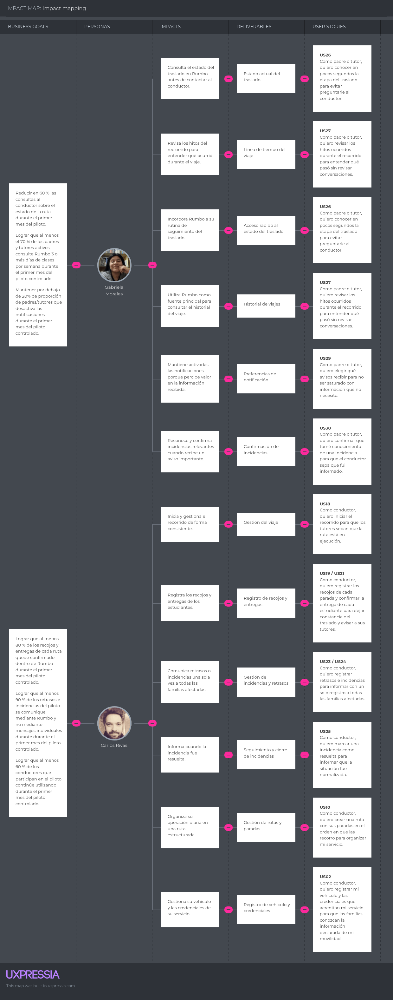

**Figura.** Impact Mapping consolidado de Rumbo, reutilizado y adaptado al alcance del curso de Aplicaciones Web.  
**Impact Mapping URL (UXPressia):** https://uxpressia.com/w/npnzh/i/yG8Dn?tagId=RwNGd

## 3.3. Product Backlog

El **Product Backlog de Rumbo** se prioriza de acuerdo con el valor para el negocio. Las historias del **Landing Page** permanecen al inicio porque corresponden al primer incremento público del producto. A continuación se ubican las capacidades centrales del servicio —vehículos, estudiantes, rutas, viajes, hitos, incidencias y comunicación—. Las historias de creación de cuenta, inicio de sesión y autorización se colocan después de las capacidades principales, de modo que el orden exprese prioridad de valor y no secuencia de construcción; las dependencias técnicas entre historias se resuelven al conformar cada Sprint Backlog.

Las historias **US36**, **US37** y **US38** se incorporan al backlog con una estimación por complejidad relativa de 3, 5 y 5 Story Points respectivamente. El Epic **EP02 · Suscripción del conductor** se mantiene deliberadamente acotado a la activación del plan: la administración ampliada de la suscripción —renovación, cambio de plan y comprobantes— corresponde a la evolución del producto y no al alcance del Trabajo Final, tal como se declara en las restricciones del proyecto de la sección 1.2.1.

Las estimaciones se expresan en Story Points siguiendo la escala de Fibonacci (1, 2, 3, 5, 8) y se asignaron por complejidad relativa, tomando como referencia las historias del Landing Page por ser las de alcance mejor conocido por el equipo.

| # Orden | User Story Id | Título | Descripción | Story Points |
|---:|---|---|---|:---:|
| 1 | US31 | Conocer la propuesta de valor de Rumbo | Como visitante, deseo comprender qué es Rumbo y qué problema resuelve para decidir si me resulta relevante. | 2 |
| 2 | US32 | Identificar los beneficios de mi segmento e ingresar a Rumbo | Como visitante, deseo conocer los beneficios correspondientes a mi perfil e ingresar a la experiencia que me corresponde. | 2 |
| 3 | US33 | Consultar el contenido en inglés o español | Como visitante, deseo consultar el contenido en un idioma disponible para comprenderlo con facilidad. | 1 |
| 4 | US34 | Consultar los documentos legales del servicio | Como visitante, deseo conocer los términos de servicio y la política de privacidad para entender cómo se trata la información. | 1 |
| 5 | US35 | Resolver dudas antes de usar Rumbo | Como visitante, deseo resolver mis dudas o comunicarme con el equipo para decidir si utilizo el servicio. | 2 |
| 6 | US02 | Registrar vehículo y credenciales del servicio | Como conductor, deseo registrar mi vehículo y las credenciales que acreditan mi servicio para que las familias conozcan la información declarada de mi movilidad. | 5 |
| 7 | US36 | Consultar la información declarada del conductor | Como padre o tutor, deseo consultar la información declarada del conductor y del vehículo para confiar en el servicio que traslada a mi hijo. | 3 |
| 8 | US06 | Registrar estudiante y vincularse como tutor | Como padre o tutor, deseo registrar a mi hijo y quedar vinculado como su tutor para poder consultar la información de sus traslados. | 5 |
| 9 | US38 | Registrar contactos de emergencia del estudiante | Como padre o tutor, deseo registrar contactos de emergencia para que el conductor sepa a quién acudir ante una situación imprevista. | 5 |
| 10 | US10 | Crear una ruta con sus paradas | Como conductor, deseo crear una ruta con sus paradas en el orden en que las recorro para organizar mi servicio. | 8 |
| 11 | US11 | Definir el horario de la ruta | Como conductor, deseo establecer los días y horarios de una ruta para que sus viajes se programen de forma recurrente. | 3 |
| 12 | US12 | Asignar estudiantes a una ruta | Como conductor, deseo asignar a los estudiantes autorizados a una ruta y a su parada para incluirlos en los recorridos. | 5 |
| 13 | US13 | Publicar una ruta | Como conductor, deseo publicar una ruta configurada para habilitar la programación de sus viajes y su visibilidad para los tutores autorizados. | 3 |
| 14 | US14 | Modificar una ruta publicada | Como conductor, deseo actualizar una ruta publicada para mantenerla alineada con mi operación real. | 5 |
| 15 | US15 | Programar el viaje de la jornada | Como conductor, deseo contar con el viaje del día y la lista de estudiantes prevista para saber a quiénes debo recoger. | 5 |
| 16 | US16 | Reportar la ausencia del estudiante | Como padre o tutor, deseo informar que mi hijo no usará la movilidad para evitar una parada innecesaria. | 5 |
| 17 | US17 | Cancelar un viaje | Como conductor, deseo cancelar un viaje que no se realizará para que las familias no esperen un servicio inexistente. | 3 |
| 18 | US37 | Habilitar el acceso de un asistente | Como conductor, deseo habilitar el acceso de un asistente para delegar la confirmación de hitos sin compartir mi cuenta. | 5 |
| 19 | US18 | Iniciar el viaje | Como conductor, deseo iniciar el recorrido para que los tutores sepan que la ruta está en ejecución. | 3 |
| 20 | US19 | Registrar los hitos de una parada | Como conductor, deseo confirmar los recojos de cada parada en pocos segundos para dejar constancia sin afectar mi recorrido. | 8 |
| 21 | US20 | Confirmar la llegada al colegio e iniciar el retorno | Como conductor, deseo confirmar la llegada al centro educativo y dar inicio al retorno para diferenciar ambas etapas del servicio. | 3 |
| 22 | US21 | Confirmar la entrega del estudiante | Como conductor, deseo confirmar la entrega de cada estudiante para cerrar su traslado y avisar a su tutor. | 5 |
| 23 | US22 | Completar el viaje | Como conductor, deseo cerrar el viaje para consolidar su resultado y dejarlo disponible como historial. | 3 |
| 24 | US23 | Registrar un retraso | Como conductor, deseo registrar un retraso y su causa para informar con un solo registro a todas las familias afectadas. | 5 |
| 25 | US24 | Registrar una incidencia | Como conductor, deseo registrar una incidencia para comunicar un imprevisto con contexto suficiente y sin repetir el mensaje a cada familia. | 5 |
| 26 | US25 | Resolver una incidencia | Como conductor, deseo marcar una incidencia como resuelta para informar que la situación fue normalizada. | 3 |
| 27 | US26 | Consultar el estado actual del traslado | Como padre o tutor, deseo conocer en pocos segundos la etapa del traslado para evitar preguntarle al conductor. | 5 |
| 28 | US27 | Consultar la línea de tiempo del trayecto | Como padre o tutor, deseo revisar los hitos ocurridos durante el recorrido para entender qué pasó sin revisar conversaciones. | 5 |
| 29 | US28 | Recibir avisos de los eventos relevantes | Como padre o tutor, deseo recibir avisos solo cuando ocurre un evento relevante para mantenerme informado sin revisar la plataforma constantemente. | 8 |
| 30 | US29 | Configurar las preferencias de notificación | Como padre o tutor, deseo elegir qué avisos recibir para no ser saturado con información que no necesito. | 3 |
| 31 | US30 | Confirmar el conocimiento de una incidencia | Como padre o tutor, deseo confirmar que tomé conocimiento de una incidencia para que el conductor sepa que fui informado. | 2 |
| 32 | US09 | Activar la suscripción del conductor | Como conductor, deseo activar una suscripción para habilitar las funcionalidades incluidas en mi plan. | 8 |
| 33 | US01 | Registrar cuenta de conductor | Como conductor, deseo crear mi cuenta para iniciar la configuración de mi servicio en Rumbo. | 3 |
| 34 | US03 | Registrar cuenta de padre o tutor | Como padre o tutor, deseo crear mi cuenta para acceder a la información autorizada de los traslados de mis hijos. | 3 |
| 35 | US04 | Iniciar sesión según rol | Como usuario registrado, deseo iniciar sesión con mis credenciales para acceder a las funcionalidades correspondientes a mi rol. | 3 |
| 36 | US05 | Recuperar acceso a la cuenta | Como usuario registrado, deseo restablecer mi contraseña para recuperar el acceso en caso de olvido. | 3 |
| 37 | US07 | Autorizar o revocar a otro tutor | Como padre o tutor, deseo autorizar o retirar el acceso de otro tutor sobre mi hijo para controlar quién puede consultar su información. | 5 |
| 38 | US08 | Solicitar la supresión de datos del estudiante | Como padre o tutor, deseo solicitar la eliminación de los datos personales de mi hijo para ejercer el control sobre su información. | 5 |
| 39 | TS01 | Endpoints del RESTful API para viajes y hitos | Como Developer, deseo exponer endpoints REST para la gestión de viajes y sus hitos, de modo que la aplicación web pueda registrar y consultar el estado del traslado. | 8 |
| 40 | TS02 | Autenticación y autorización con JWT y RBAC | Como Developer, deseo proteger el RESTful API mediante tokens y control de acceso por rol para que cada usuario acceda únicamente a los recursos autorizados. | 5 |
| 41 | TS03 | Integración con el servicio de notificaciones | Como Developer, deseo integrar un proveedor de mensajería para distribuir los avisos generados por los eventos del viaje. | 5 |
| 42 | TS04 | Integración con servicio de mapas para direcciones de paradas | Como Developer, deseo integrar un servicio externo de mapas para validar y normalizar las direcciones de las paradas de una ruta. | 5 |
| 43 | TS05 | Integración con el servicio de verificación de credenciales | Como Developer, deseo integrar el servicio público de consulta de habilitación para respaldar la verificación de credenciales del conductor. | 5 |
| 44 | TS06 | Documentación del RESTful API con OpenAPI | Como Developer, deseo documentar los endpoints mediante OpenAPI para facilitar su comprensión y prueba por parte del equipo. | 2 |
| 45 | TS07 | Internacionalización del RESTful API | Como Developer, deseo localizar los mensajes del API para en_US y es_419 manteniendo el inglés como idioma predeterminado. | 3 |
| 46 | TS08 | Persistencia consistente del estado y eventos del viaje | Como Developer, deseo persistir el estado del viaje y sus eventos de forma consistente para evitar información parcial durante las operaciones del RESTful API. | 5 |

El Product Backlog fue actualizado en Trello con la priorización vigente, incluyendo **US36, US37 y US38** y conservando las Technical Stories al final del backlog.

  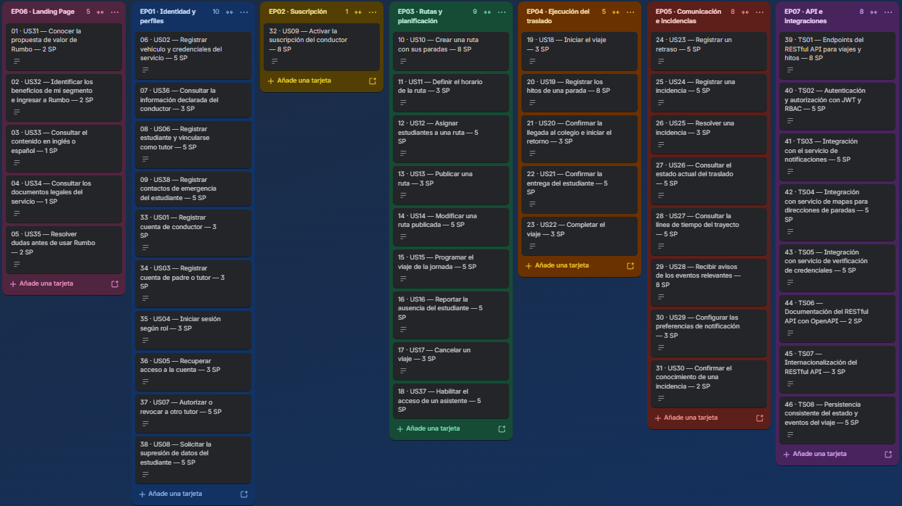

**Figura.** Product Backlog actualizado de Rumbo organizado por Epics y prioridad global.  
**Product Backlog URL:** https://trello.com/b/dd4dejIV/product-backlog

# Capítulo IV: Product Design

## 4.1. Style Guidelines

Las **Style Guidelines de Rumbo** constituyen la referencia visual común para el Landing Page y la Web Application. Su objetivo es mantener consistencia entre los productos digitales mediante un conjunto compartido de decisiones de branding, tipografía, color, espaciado, tono de comunicación, componentes, responsive design, accesibilidad e internacionalización.

La propuesta toma como referencia principios de **Material Design** y los adapta a la identidad de Rumbo. Las decisiones se orientan a transmitir tranquilidad, confianza y claridad, considerando que el producto acompaña actividades relacionadas con el traslado escolar y debe ser comprensible tanto para padres/tutores como para conductores.

### 4.1.1. General Style Guidelines

#### Branding

La identidad visual de **Rumbo** busca proyectar una imagen cercana, segura y confiable. Se evita una apariencia excesivamente tecnológica o alarmista y se priorizan superficies claras, jerarquías simples y una paleta basada en verdes, tonos crema y colores de apoyo suaves.

  
  
<em>Logotipo principal de Rumbo.</em>

El logotipo se utiliza como identificador principal de la marca y debe conservar proporciones, legibilidad y espacio libre alrededor de su contorno. No debe deformarse, rotarse ni colocarse sobre fondos que reduzcan su contraste.

#### Color Palette

La paleta de colores de Rumbo organiza los tonos principales, secundarios y neutros que se utilizarán de manera consistente en el Landing Page y la Web Application. Los verdes refuerzan la identidad visual y las acciones relevantes; los tonos crema y arena ayudan a reducir la carga visual y aportar calidez; y el azul oscuro se reserva para texto, contraste y elementos de alta legibilidad.

  
  
<em>Paleta de colores de Rumbo.</em>

#### Typography

Rumbo emplea las familias tipográficas **Outfit** y **Roboto**. La combinación permite diferenciar los contenidos de alta jerarquía de los elementos funcionales y textos de lectura continua.

| Typeface | Aplicación |
|---|---|
| **Outfit** | Títulos principales, encabezados de sección y mensajes de alto impacto. |
| **Roboto** | Párrafos, navegación, botones, etiquetas, formularios y contenido complementario. |

**Outfit** refuerza la personalidad visual en mensajes destacados, mientras que **Roboto** favorece la lectura rápida en componentes funcionales. La jerarquía debe apoyarse también en tamaño, peso y espaciado, evitando depender únicamente del color.

#### Spacing and Shapes

El sistema de espaciado utiliza una escala basada en múltiplos de **4 px**, lo que permite mantener alineación y ritmo visual entre componentes.

| Token | Tamaño | Uso |
|---|---:|---|
| spacing-xs | 4 px | Separación mínima entre elementos estrechamente relacionados. |
| spacing-s | 8 px | Iconos, etiquetas y espacios internos pequeños. |
| spacing-m | 12 px | Padding de controles compactos. |
| spacing-l | 16 px | Separación estándar y margen lateral base en mobile. |
| spacing-xl | 24 px | Padding de tarjetas y agrupaciones principales. |
| spacing-xxl | 32 px | Separación entre bloques importantes en desktop. |
| spacing-3xl | 48 px | Separación estructural entre secciones. |

Las superficies, tarjetas y controles utilizan bordes redondeados de forma consistente con los mock-ups del producto. La forma nunca debe reducir la claridad de los estados interactivos o de los límites entre elementos.

#### Tone of Voice

El tono de Rumbo debe transmitir confianza y tranquilidad, especialmente porque el producto trabaja con información asociada al traslado de menores.

| Dimensión | Posicionamiento | Justificación |
|---|---|---|
| Divertido – Serio | **Serio con cercanía** | La información operativa requiere claridad y responsabilidad. |
| Formal – Casual | **Moderadamente casual** | Se utiliza lenguaje directo y comprensible, evitando tecnicismos innecesarios. |
| Respetuoso – Irreverente | **Respetuoso** | Las comunicaciones deben preservar la confianza entre familias y conductores. |
| Entusiasta – Sereno | **Sereno y positivo** | El producto busca reducir incertidumbre, no generar alarma. |

Los mensajes deben ser breves, accionables y consistentes. En retrasos o incidencias se prioriza información factual y clara; en contenido comercial se comunica el beneficio sin exagerar capacidades que no formen parte del alcance real del producto.

### 4.1.2. Web Style Guidelines

Las interfaces web de Rumbo trasladan las decisiones anteriores a experiencias responsive para Desktop y Mobile Web Browser. La organización visual utiliza contenedores claros, jerarquía tipográfica, tarjetas, botones y estados interactivos consistentes con Material Design y con la identidad establecida.

#### Responsive Layout

En Desktop se aprovecha el espacio horizontal para agrupar información relacionada y facilitar la comparación visual. En tamaños menores, los contenidos se reorganizan en una sola columna o en grupos verticales, conservando el orden de lectura y las acciones principales.

El layout evita anchos rígidos que provoquen desplazamiento horizontal. Los márgenes y separaciones emplean la escala de spacing definida en la sección anterior.

**Breakpoints**

| Rango | Dispositivo objetivo | Comportamiento del layout |
|---|---|---|
| < 640 px | Móvil | Columna única. Navegación colapsada en menú. Tarjetas a ancho completo. Márgenes laterales de 16 px. |
| 640 – 1023 px | Tablet | Dos columnas en secciones de beneficios y listados. Navegación visible. |
| 1024 – 1439 px | Escritorio | Distribución horizontal completa. Dashboard con panel lateral fijo. |
| ≥ 1440 px | Escritorio amplio | Contenido centrado con ancho máximo para conservar la longitud de línea legible. |

Los valores se eligieron para coincidir con los breakpoints por defecto de PrimeVue, de modo que la implementación no requiera redefinir el sistema de rejilla.

#### Visual Hierarchy

La jerarquía se establece mediante tamaño tipográfico, peso, contraste y espaciado. Los títulos principales utilizan **Outfit**, mientras que contenidos funcionales y de lectura continua utilizan **Roboto**. Las acciones principales se diferencian mediante el verde **#3EA98A**, y el texto se mantiene principalmente sobre superficies claras para preservar legibilidad.

#### Buttons and Call-to-Action

| Tipo | Uso |
|---|---|
| **Primary Button** | Acción principal de una vista o bloque. |
| **Secondary Button** | Acción complementaria que no debe competir visualmente con la principal. |
| **Text Action** | Navegación contextual o acciones de menor prioridad. |

Las etiquetas utilizan verbos o expresiones breves y deben describir el resultado esperado de la acción. Los estados **default, hover, focus, active y disabled** deben distinguirse visualmente; el estado no puede depender exclusivamente del color.

#### Cards and Content Containers

Las tarjetas agrupan información relacionada como beneficios, pasos, estado del traslado, estudiantes o notificaciones. Mantienen superficies claras, padding consistente y una jerarquía interna predecible entre título, contenido, estado y acción.

#### Accessibility and Inclusive Design

Rumbo adopta un enfoque de diseño inclusivo mediante:

- contraste suficiente entre texto y fondo;
- indicadores visibles de focus;
- navegación mediante teclado;
- uso de HTML semántico;
- texto alternativo para imágenes informativas;
- áreas de interacción suficientemente amplias;
- mensajes comprensibles que no dependan solo del color;
- atributos **ARIA** cuando la semántica nativa no sea suficiente.

#### Internationalization

La experiencia contempla **English (en_US)** y **Latin American Spanish (es_419)**, con **English como idioma predeterminado**, de acuerdo con los lineamientos del proyecto. La estructura de los componentes debe tolerar variaciones de longitud entre traducciones sin romper el layout.

  
  
<em>Aplicación de las Web Style Guidelines en el Landing Page para Desktop Web Browser.</em>

### 4.1.3. Mobile Style Guidelines

La versión para **Mobile Web Browser** conserva el mismo Design System y prioriza legibilidad, interacción táctil y navegación sencilla. No se define una identidad distinta para mobile; se adapta la misma jerarquía visual a un espacio reducido.

Las principales decisiones son:

- disposición predominantemente vertical;
- margen lateral base de **16 px**;
- reducción de columnas y agrupación de contenido en tarjetas apiladas;
- acciones principales visibles sin competir con acciones secundarias;
- controles táctiles con áreas de interacción amplias;
- textos y estados legibles sin depender de zoom;
- navegación simplificada y orden de lectura consistente;
- conservación de a11y e i18n en los mismos términos que la experiencia Desktop.

Cuando un componente cambia de disposición entre Desktop y Mobile, debe conservar la misma función, etiqueta y prioridad. La adaptación responsive no debe introducir una ruta de navegación diferente para realizar la misma tarea.

  
  
<em>Aplicación de las Mobile Style Guidelines en el Landing Page para Mobile Web Browser.</em>

## 4.2. Information Architecture

La arquitectura de información de Rumbo define cómo se organizan, etiquetan y conectan los contenidos del Landing Page y de la Web Application. Las decisiones se basan en los User Personas, User Stories e Impact Mapping previamente definidos.

En el Landing Page se utiliza una estructura informativa progresiva: primero se comunica la propuesta de valor, después se presentan beneficios y funcionamiento y, finalmente, se ofrecen acciones de acceso o contacto. En la Web Application la organización cambia según la audiencia: los padres/tutores consultan información del traslado y los conductores administran y registran elementos operativos de su servicio.

### 4.2.1. Organization Systems

Rumbo combina sistemas de organización jerárquicos, secuenciales, cronológicos y por audiencia de acuerdo con la naturaleza de cada contenido.

| Producto / contenido | Sistema | Aplicación |
|---|---|---|
| Landing Page | Jerárquico | Propuesta de valor → beneficios → funcionamiento → funcionalidades → recursos → acción final. |
| How it works | Secuencial | Explica el servicio siguiendo el orden lógico de sus principales etapas. |
| Web Application | Por audiencia | Se diferencian las tareas de Parent/Guardian y Driver. |
| Parent/Guardian Dashboard | Jerárquico | Se prioriza el estado actual del traslado y luego la información complementaria autorizada. |
| Trip Timeline | Cronológico | Los eventos se presentan según su momento de ocurrencia. |
| Driver route management | Jerárquico y orientado a tareas | La ruta, estudiantes y acciones operativas relevantes se presentan según prioridad. |
| Notifications | Cronológico | Los avisos se ordenan por fecha y hora. |

La organización evita duplicar una misma responsabilidad en diferentes áreas. Por ejemplo, los datos de estudiantes y tutores pertenecen a sus funciones de perfil, mientras que rutas, ejecución, incidencias y notificaciones mantienen estructuras diferenciadas.

### 4.2.2. Labeling Systems

El sistema de etiquetado utiliza palabras breves y consistentes con el Ubiquitous Language del proyecto. Debido a que el idioma predeterminado es **en_US**, las etiquetas principales se definen en inglés y cuentan con equivalente **es_419**.

| English (en_US) | Spanish (es_419) | Asociación |
|---|---|---|
| Benefits | Beneficios | Landing Page |
| How it works | Cómo funciona | Landing Page |
| Features | Funcionalidades | Landing Page |
| Resources | Recursos | Landing Page |
| Sign in | Iniciar sesión | Acceso |
| Sign up | Registrarse | Registro |
| Dashboard | Panel principal | Parent/Guardian |
| Trip Status | Estado del traslado | Consulta de viaje |
| Trip Detail | Detalle del traslado | Consulta ampliada |
| Timeline | Línea de tiempo | Eventos del viaje |
| Notifications | Notificaciones | Avisos relevantes |
| Routes | Rutas | Gestión del conductor |
| Students | Estudiantes | Gestión y asignación |
| Confirm Pickup | Confirmar recojo | Ejecución del viaje |
| Confirm Drop-off | Confirmar entrega | Ejecución del viaje |
| Report Delay | Reportar retraso | Gestión de retrasos |
| Report Incident | Reportar incidencia | Gestión de incidencias |
| Terms of Service | Términos del servicio | Información legal |
| Privacy | Privacidad | Tratamiento de datos |

La misma etiqueta debe representar la misma acción en navegación, botones, formularios, mensajes y documentación, evitando sinónimos que puedan confundir al usuario.

### 4.2.3. SEO Tags and Meta Tags

Las principales páginas incluyen como mínimo **Title, Description, Keywords y Author**. Los valores se redactan en inglés debido a que **en_US** es el idioma predeterminado.

#### Landing Page

| Elemento | Valor |
|---|---|
| **Title** | Rumbo - School Transport Coordination and Trip Information |
| **Meta Description** | Rumbo helps families and school transport drivers coordinate routes, trip events, delays and notifications in one place. |
| **Meta Keywords** | school transport, school routes, trip status, parents, drivers, incidents, notifications |
| **Meta Author** | AIpaca OS |

#### Web Application – Sign In

| Elemento | Valor |
|---|---|
| **Title** | Sign In - Rumbo |
| **Meta Description** | Access Rumbo to manage or consult authorized school transport information. |
| **Meta Keywords** | Rumbo sign in, school transport, parents, drivers |
| **Meta Author** | AIpaca OS |

#### Web Application – Parent/Guardian Dashboard

| Elemento | Valor |
|---|---|
| **Title** | Parent Dashboard - Rumbo |
| **Meta Description** | Consult the current trip status, timeline and notifications associated with an authorized student. |
| **Meta Keywords** | school trip status, parent dashboard, trip timeline, school transport notifications |
| **Meta Author** | AIpaca OS |

#### Web Application – Driver Routes

| Elemento | Valor |
|---|---|
| **Title** | Routes - Rumbo |
| **Meta Description** | Manage school transport routes, students, trip events, delays and incidents in Rumbo. |
| **Meta Keywords** | school route, driver, students, pickup, drop-off, delay, incident |
| **Meta Author** | AIpaca OS |

### 4.2.4. Searching Systems

El alcance actual no incorpora un buscador global porque los User Stories priorizados presentan información contextual y acotada para cada usuario. Incluir búsqueda sin un requerimiento que la sustente agregaría complejidad sin valor validado.

| Vista / contenido | Búsqueda o filtro actual | Presentación |
|---|---|---|
| Landing Page | No requiere búsqueda | Navegación directa mediante secciones y enlaces. |
| Parent/Guardian Dashboard | No requiere búsqueda global | Muestra información directamente asociada al usuario autorizado. |
| Trip Timeline | Orden cronológico | Los eventos se muestran dentro del viaje consultado. |
| Driver Routes | Acceso contextual a las rutas del conductor | Las rutas disponibles se presentan como lista o tarjetas. |
| Student List | Listado asociado a una ruta | Los estudiantes se muestran dentro del contexto de la ruta seleccionada. |
| Notifications | Orden cronológico | Los avisos se presentan desde el más reciente al más antiguo. |

Si en una iteración posterior el volumen de rutas, estudiantes, viajes históricos o notificaciones justifica mecanismos de búsqueda o filtrado, éstos deberán incorporarse mediante User Stories específicas antes de agregarse al producto.

### 4.2.5. Navigation Systems

Rumbo utiliza navegación global y contextual en el Landing Page y navegación orientada a tareas en la Web Application. La estructura busca que cada persona llegue a su objetivo mediante rutas cortas y predecibles.

#### Landing Page Navigation

El header permite recorrer las principales secciones del contenido:

**Home → Benefits → How it works → Features → Resources**

Las acciones de acceso se presentan de forma independiente: **Sign in** y **Sign up**.

El footer complementa la navegación con información de la startup, contacto y documentos legales.

#### Parent/Guardian Navigation

Después de autenticarse, el usuario accede a su panel principal y desde allí consulta el traslado y las notificaciones correspondientes a los estudiantes sobre los que mantiene autorización.

Ruta principal: **Sign In → Dashboard → Trip Detail → Trip Timeline**

Ruta complementaria: **Dashboard → Notifications**

La navegación prioriza primero el estado actual y después el detalle histórico o complementario.

#### Driver Navigation

El conductor accede a las funciones operativas del servicio de acuerdo con el contexto de la ruta y el viaje.

Ruta de planificación: **Sign In → Routes → Route Detail → Students / Schedule**

Ruta de ejecución: **Active Trip → Student List → Pickup / Drop-off**

Rutas de excepción: **Active Trip → Report Delay** y **Active Trip → Report Incident**.

Después de registrar un evento, la navegación retorna al contexto del viaje activo para evitar recorridos innecesarios.

La estructura anterior resume la arquitectura de navegación, pero no sustituye los Wireflows y User Flows exigidos en la sección 4.4, los cuales deben elaborarse posteriormente con las herramientas indicadas.

## 4.3. Landing Page UI Design

La propuesta de UI del Landing Page traduce las decisiones de Style Guidelines e Information Architecture a una experiencia responsive para visitantes. La jerarquía visual conduce desde la propuesta de valor hacia beneficios, funcionamiento, funcionalidades y acciones finales, conservando la identidad de Rumbo y diferenciando claramente contenido informativo de elementos interactivos.

La adaptación Desktop/Mobile mantiene el mismo orden semántico, las mismas etiquetas y el mismo Design System. En pantallas pequeñas los bloques se apilan y la navegación se simplifica sin alterar la prioridad del contenido. El diseño considera legibilidad, contraste, navegación por teclado, textos alternativos y áreas de interacción adecuadas como parte del enfoque inclusivo.

### 4.3.1. Landing Page Wireframe

Los wireframes fueron elaborados para **Desktop Web Browser** y **Mobile Web Browser** con el objetivo de validar estructura, jerarquía y organización antes de aplicar estilos finales.

En Desktop, la distribución aprovecha el ancho disponible para organizar contenidos relacionados y facilitar la exploración progresiva. En Mobile, los mismos bloques se reorganizan verticalmente y preservan el orden lógico de lectura. En ambos casos, la ubicación de las acciones principales responde a la arquitectura de información descrita previamente.

  
  
<em>Wireframe del Landing Page para Desktop Web Browser.</em>

  
  
<em>Wireframe del Landing Page para Mobile Web Browser.</em>

Los wireframes priorizan una lectura clara, agrupaciones comprensibles y navegación predecible. El enfoque inclusivo se refleja en la ausencia de dependencias exclusivas del color, la estructura lineal de contenido en mobile y la reserva de espacios suficientemente amplios para controles interactivos.

### 4.3.2. Landing Page Mock-up

Los mock-ups aplican el Design System definido en 4.1 sobre la estructura validada en los wireframes. Se utiliza la paleta verde, crema y arena de Rumbo, junto con **Outfit** para títulos y **Roboto** para contenidos funcionales y de lectura continua.

El Desktop Mock-up conserva una jerarquía amplia y permite presentar agrupaciones de contenido en más de una columna cuando existe espacio suficiente. El Mobile Mock-up transforma esas agrupaciones en bloques verticales, manteniendo las mismas asociaciones, etiquetas y prioridad de acciones.

  
  
<em>Mock-up del Landing Page para Desktop Web Browser.</em>

  
  
<em>Mock-up del Landing Page para Mobile Web Browser.</em>

La propuesta conserva consistencia con la arquitectura de información y con los principios de diseño inclusivo: contraste suficiente, jerarquía tipográfica, textos comprensibles, acciones claramente diferenciadas y adaptación responsive sin pérdida de contenido o funcionalidad.

## 4.4. Web Applications UX/UI Design

El diseño de la Web Application considera dos experiencias principales: **padres/tutores** y **conductores**. En ambos casos se prioriza la información del trayecto, pero las acciones disponibles cambian según el rol. Los padres consultan; los conductores registran eventos de la ruta con la menor cantidad posible de pasos.

### 4.4.1. Web Applications Wireframes

Los wireframes se definieron a partir de las tareas centrales de cada segmento.

| Rol | Vista | Contenido principal |
|---|---|---|
| Padre/Tutor | Sign In | Correo, contraseña y recuperación de acceso. |
| Padre/Tutor | Dashboard | Estado actual, estudiante, conductor, vehículo y ETA. |
| Padre/Tutor | Trip Detail | Mapa o progreso de ruta y datos del trayecto. |
| Padre/Tutor | Trip Timeline | Recojo, retrasos, incidencias y llegada en orden cronológico. |
| Padre/Tutor | Notifications | Avisos relevantes asociados al estudiante. |
| Conductor | Sign In | Acceso seguro al panel de ruta. |
| Conductor | Assigned Route | Ruta activa, horario, paradas y estudiantes asignados. |
| Conductor | Student List | Estado de recojo o entrega de cada estudiante. |
| Conductor | Register Event | Confirmación rápida de recojo, llegada o entrega. |
| Conductor | Report Incident | Tipo de incidencia, descripción breve y registro del evento. |

La prioridad del wireframe es que la vista principal responda rápidamente a dos preguntas: **“¿qué está pasando en el trayecto?”** para la familia y **“¿qué debo registrar ahora?”** para el conductor.

### 4.4.2. Web Applications Wireflow Diagrams

Los Wireflow Diagrams de Rumbo representan los principales recorridos de interacción de la Web Application a partir de los **User Goals** de los segmentos **Parent** y **Driver**. Cada flujo conecta estados de interfaz consecutivos para evidenciar cómo una persona avanza desde una vista inicial hasta completar una meta concreta.

Los wireflows mantienen trazabilidad con los User Stories, la Information Architecture y los mock-ups definidos para la aplicación. Para evitar diagramas redundantes, se agrupan las acciones relacionadas bajo siete User Goals representativos del alcance funcional.

#### User Goal 1 — Access parent dashboard

**User Persona:** Parent  
**User Goal:** Acceder al panel principal y visualizar la información del traslado escolar actual.  
**Explicación del flujo:** El Parent selecciona su experiencia en la pantalla de acceso, ingresa sus credenciales y, después de autenticarse correctamente, accede al Panel principal con la información más reciente del viaje activo.

  

#### User Goal 2 — Consult current trip status

**User Persona:** Parent  
**User Goal:** Consultar el estado actual del traslado y revisar la secuencia de eventos del viaje.  
**Explicación del flujo:** Desde el Panel principal, el Parent abre el detalle del viaje activo y puede profundizar en la línea de tiempo para comprender los eventos registrados durante el recorrido.

  

#### User Goal 3 — Review important notifications

**User Persona:** Parent  
**User Goal:** Revisar avisos relevantes asociados al traslado escolar.  
**Explicación del flujo:** El Parent accede desde el Panel principal al centro de notificaciones, revisa las actualizaciones recientes y abre el detalle de un aviso relevante para conocer su contexto y estado.

  

#### User Goal 4 — Start and execute a route

**User Persona:** Driver  
**User Goal:** Iniciar la ruta asignada y continuar con la ejecución del recorrido.  
**Explicación del flujo:** El Driver abre su ruta asignada, inicia el recorrido y accede a la lista de estudiantes para continuar registrando los hitos operativos de recojo y entrega.

  

#### User Goal 5 — Configure route and stops

**User Persona:** Driver  
**User Goal:** Configurar la ruta, el orden de las paradas y las vinculaciones necesarias para el servicio.  
**Explicación del flujo:** El Driver parte de la ruta asignada, ingresa a la configuración, ajusta el orden de paradas y guarda los cambios para que la planificación quede disponible en los siguientes recorridos.

  

#### User Goal 6 — Monitor operational notifications

**User Persona:** Driver  
**User Goal:** Revisar notificaciones operativas relacionadas con la ruta.  
**Explicación del flujo:** Desde la ruta asignada, el Driver accede al centro de notificaciones, consulta las actualizaciones recientes y marca los avisos revisados para mantener control sobre los eventos informados.

  

#### User Goal 7 — Manage account and billing

**User Persona:** Driver  
**User Goal:** Consultar la configuración de la cuenta y el estado de la suscripción.  
**Explicación del flujo:** El Driver accede a Configuración para revisar su información de perfil y vehículo y, desde las opciones de cuenta, consulta el resumen de Plan y facturación correspondiente al servicio.

  

### 4.4.3. Web Applications Mock-ups

Los mock-ups de la Web Application de **Rumbo** aplican el Design System definido previamente y muestran cómo se materializan las principales funcionalidades para los segmentos **Parent** y **Driver**. Las vistas mantienen una estructura consistente de navegación lateral, tarjetas, estados, acciones principales, tipografía y paleta visual. A continuación se presenta cada pantalla junto con una breve descripción de su propósito dentro de la experiencia.

#### Sign In

La pantalla de inicio de sesión funciona como punto de acceso común a la Web Application. Permite seleccionar la experiencia correspondiente, ingresar las credenciales y acceder a las funcionalidades asociadas al rol del usuario.

  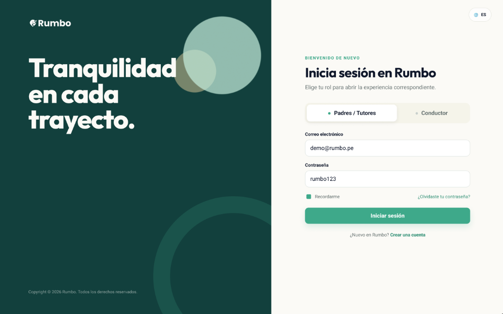

#### Driver — Assigned Route

La vista **Ruta asignada** concentra la información operativa principal del Driver. Presenta el estado del recorrido, los estudiantes asociados y accesos rápidos para reportar retrasos, incidencias o continuar con las acciones de la ruta.

  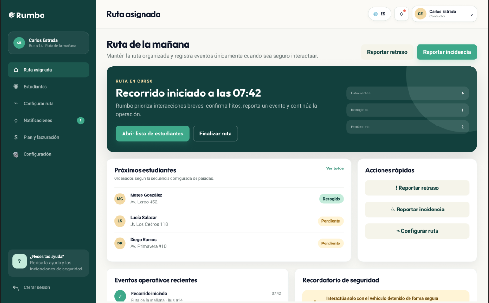

#### Driver — Student List

La **Lista de estudiantes** permite al Driver revisar los estudiantes asociados a la ruta y registrar acciones breves como confirmar recojo o entrega. Los estados visuales permiten distinguir rápidamente estudiantes recogidos, pendientes o ausentes.

  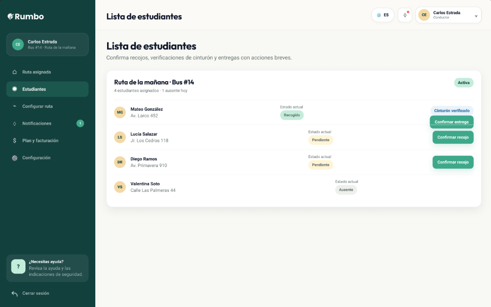

#### Driver — Route Configuration

La pantalla **Configurar ruta** permite administrar el orden de las paradas y las vinculaciones relacionadas con el servicio. La organización en bloques mantiene separadas las tareas de planificación de las acciones propias de la ejecución del viaje.

  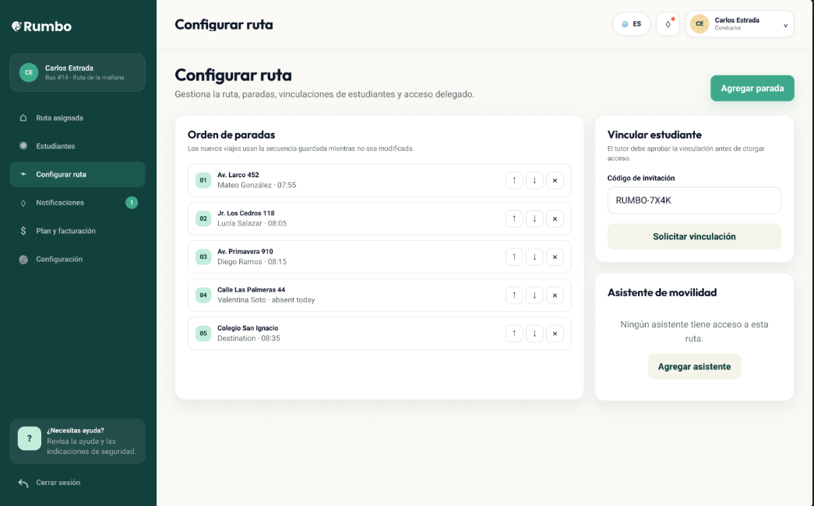

#### Driver — Notifications

El centro de **Notificaciones** reúne los principales eventos operativos asociados a la ruta. La vista prioriza retrasos, confirmaciones y actualizaciones recientes para que el Driver pueda revisar información relevante sin depender de mensajes dispersos.

  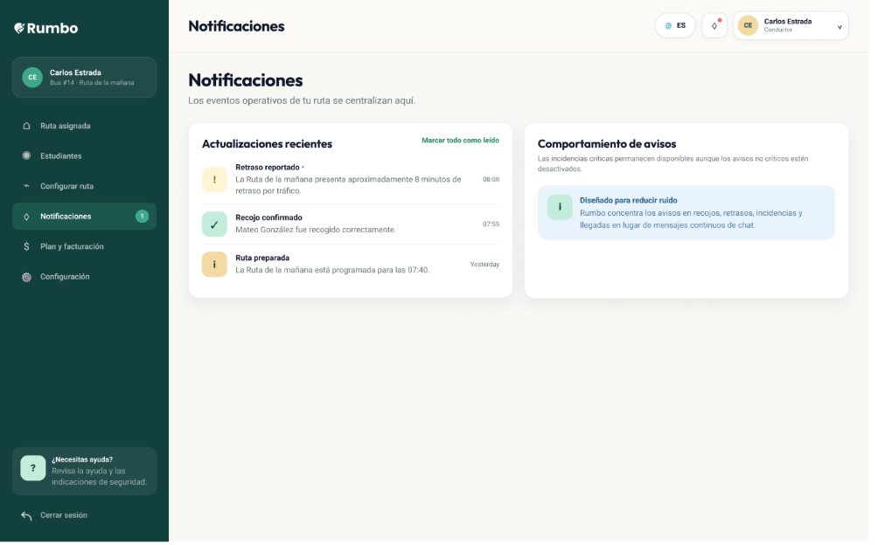

#### Driver — Plan and Billing

La vista **Plan y facturación** presenta el estado de la suscripción, el periodo actual, los comprobantes disponibles y las acciones relacionadas con la gestión del plan. Esta pantalla concentra la información comercial sin mezclarla con las tareas operativas de la ruta.

  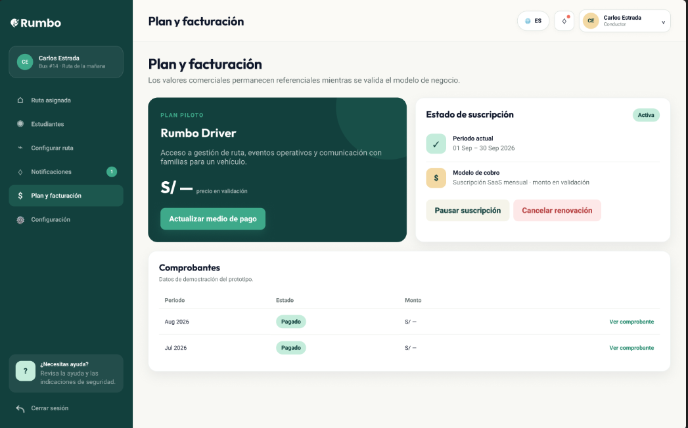

#### Driver — Settings

La sección **Configuración** permite al Driver revisar su información personal, los datos del vehículo y las preferencias de idioma. La vista utiliza la misma jerarquía de tarjetas que el resto de la aplicación para mantener consistencia visual.

  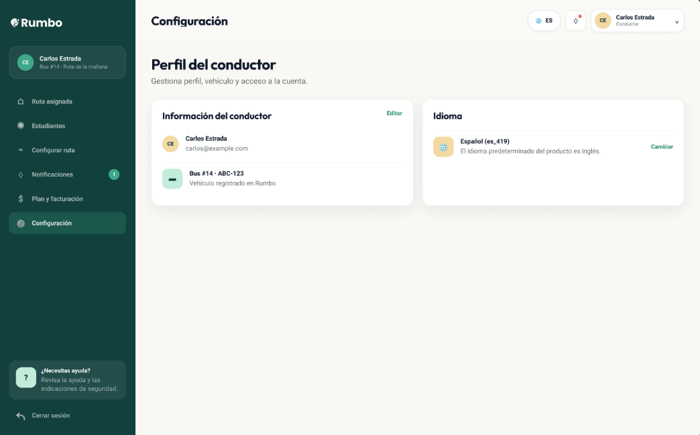

#### Parent — Dashboard

El **Panel principal** del Parent resume la información más reciente del traslado escolar. Presenta el estado del viaje activo, los últimos eventos registrados, el Driver asociado y accesos directos al detalle del viaje y a las notificaciones.

  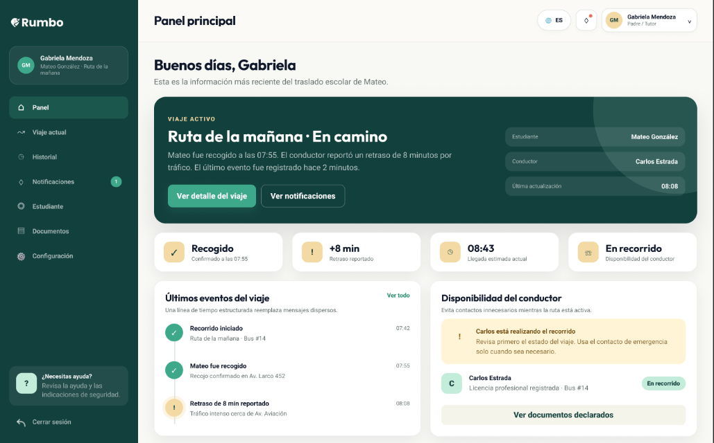

#### Parent — Current Trip

La vista **Viaje actual** amplía el estado del recorrido y organiza los principales eventos en una línea de tiempo. Su objetivo es permitir que el Parent comprenda rápidamente qué ha ocurrido durante el viaje y cuál es el estado registrado más reciente.

  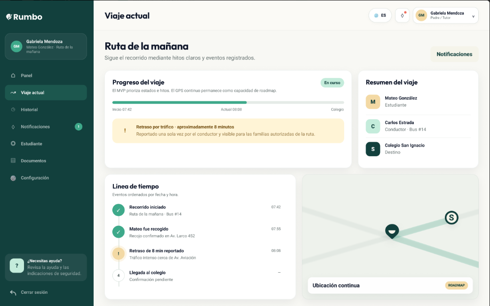

#### Parent — Trip History

El **Historial de viajes** permite consultar recorridos anteriores y revisar información resumida como fecha, conductor, número de eventos y estado del viaje. La presentación tabular facilita comparar registros sin sobrecargar la vista principal.

  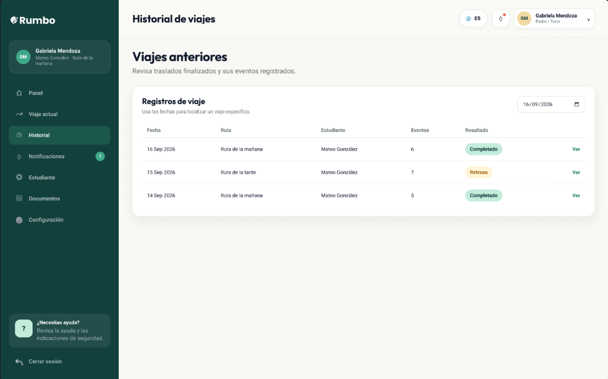

#### Parent — Notifications

La sección **Notificaciones** centraliza los avisos relacionados con el traslado del estudiante. Los eventos recientes se presentan de forma cronológica y con indicadores visuales para diferenciar confirmaciones, retrasos y actualizaciones operativas.

  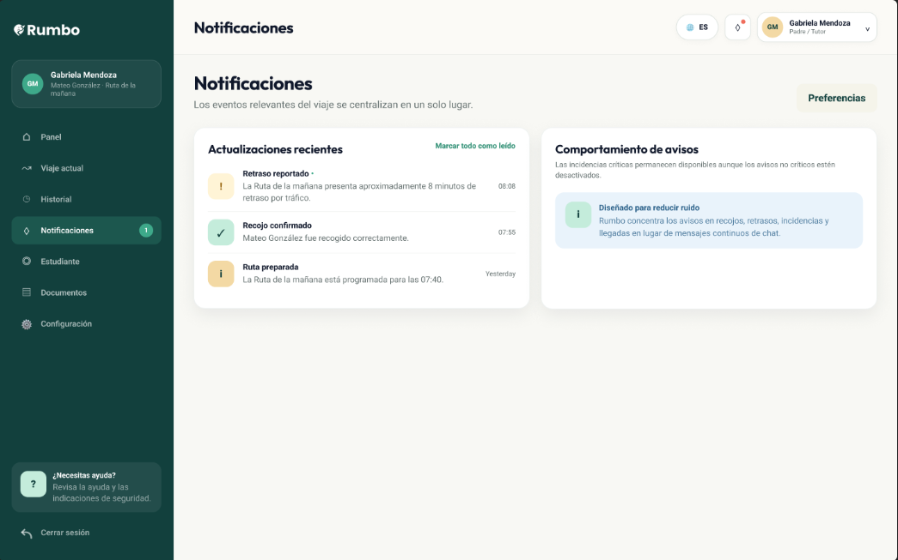

#### Parent — Student Profile

El **Perfil del estudiante** presenta los datos principales del estudiante y la información necesaria para comprender su asociación con el servicio. La vista también permite acceder a información complementaria relacionada con el traslado.

  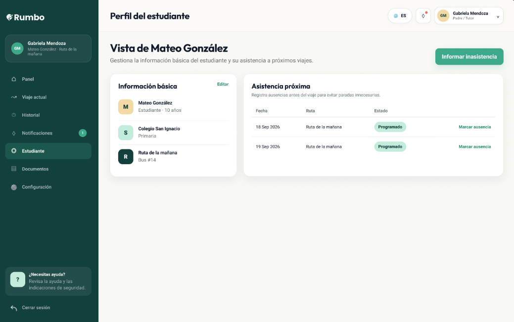

#### Parent — Driver and Vehicle Documents

La vista **Documentos del conductor y vehículo** permite al Parent consultar la información declarada del servicio, como licencia, registro del vehículo y seguro. Esta información se presenta como referencia dentro de la experiencia y evita mezclar documentos con el seguimiento operativo del viaje.

  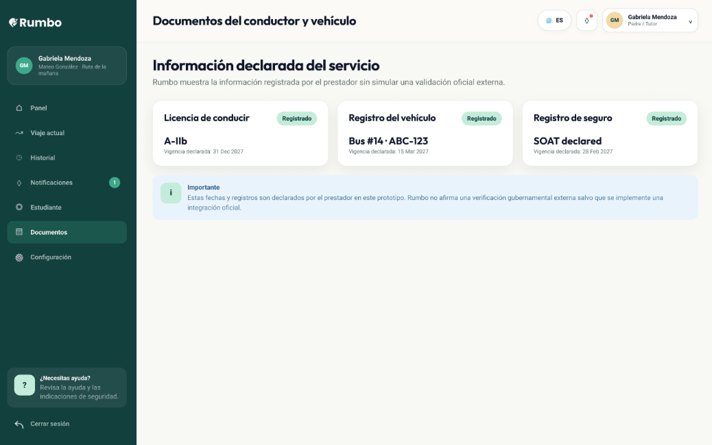

#### Parent — Settings

La sección **Configuración** del Parent reúne preferencias de notificaciones e información de la cuenta. Los controles permiten activar o desactivar avisos sin alterar el resto de la experiencia y mantienen visible la configuración de idioma del producto.

  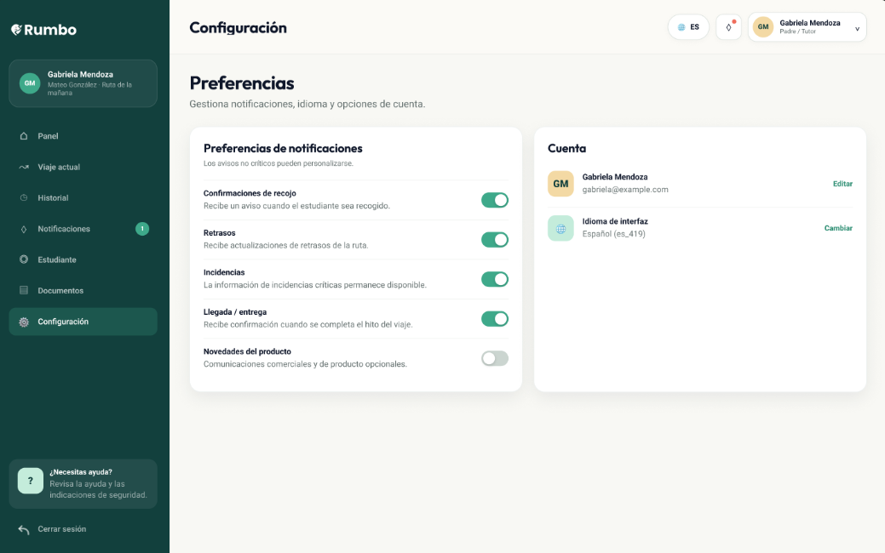

### 4.4.4. Web Applications User Flow Diagrams

Los **User Flow Diagrams** de Rumbo representan las rutas esperadas para completar los principales objetivos de los segmentos **Parent** y **Driver**. A diferencia de los Wireflows, estos diagramas incorporan los mock-ups finales de las vistas y muestran tanto el **happy path** como rutas alternativas relevantes, manteniendo consistencia con los User Goals definidos previamente.

#### Vista general de navegación por segmento

Antes del detalle por User Goal, se presenta la vista consolidada de cada segmento, que evidencia cómo se articulan entre sí los distintos objetivos a partir del Panel principal y qué rutas de navegación conectan unos con otros.

**Segmento Conductor**

  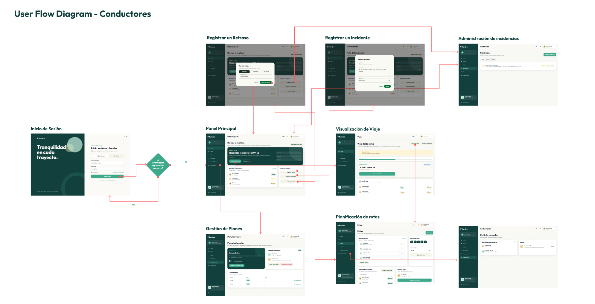

**Segmento Padre/Tutor**

  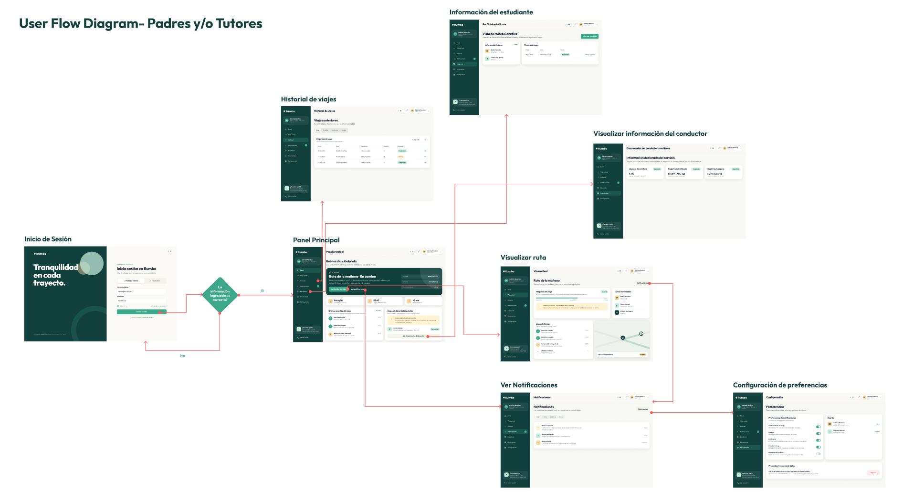

A continuación se detalla cada User Goal con su ruta esperada y sus rutas alternativas.

#### User Flow 1 — Access Parent Dashboard

**User Persona:** Parent  
**User Goal:** Access the main dashboard and review the latest school trip information.  
**Flow Description:** The Parent selects the Parent experience, signs in successfully, and reaches the main dashboard with the active trip overview. If the credentials are invalid, the system shows an error and allows a new attempt.

  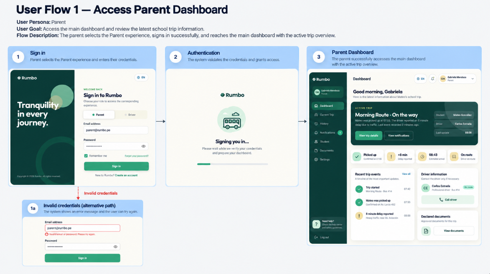

#### User Flow 2 — Consult Current Trip Status

**User Persona:** Parent  
**User Goal:** Consult the current trip status and review the trip timeline.  
**Flow Description:** The Parent opens the dashboard, accesses the current trip detail, and reviews the chronological sequence of route events. The alternative path represents the case in which the trip has already been completed.

  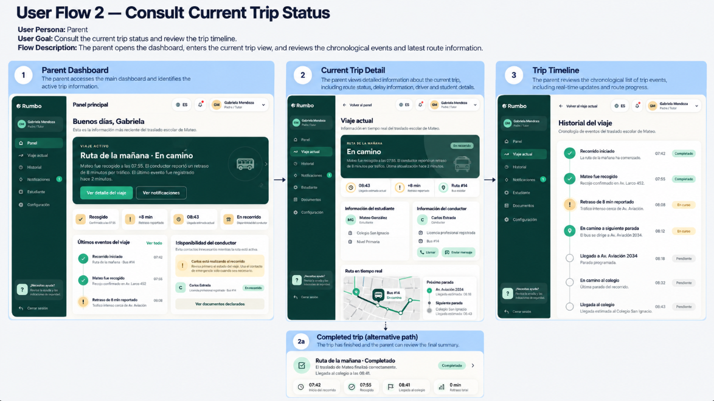

#### User Flow 3 — Review Important Notifications

**User Persona:** Parent  
**User Goal:** Review relevant notifications related to the school trip.  
**Flow Description:** The Parent accesses the notification center, reviews recent alerts, and opens the detail of a relevant event. When there are no unread notifications, the interface displays an informative empty state.

  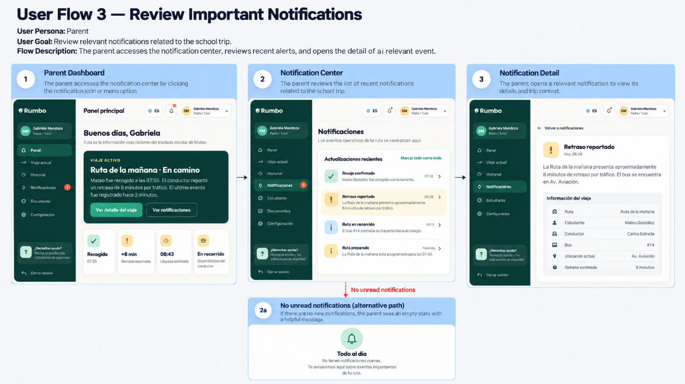

#### User Flow 4 — Start and Execute a Route

**User Persona:** Driver  
**User Goal:** Start the assigned route and continue the execution of the trip.  
**Flow Description:** The Driver opens the assigned route, starts the trip, and continues the route through the student list to register operational milestones. The alternative path covers the reporting of a delay while the route remains active.

  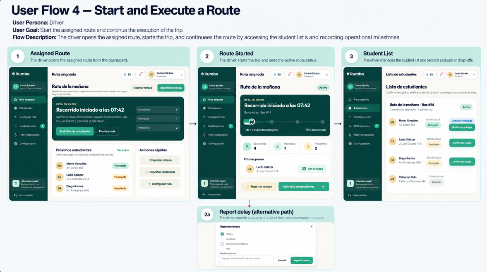

#### User Flow 5 — Configure Route and Stops

**User Persona:** Driver  
**User Goal:** Configure the assigned route, its stops, and the main service settings.  
**Flow Description:** The Driver accesses the route configuration, adjusts the stop order and student links, and saves the updated configuration. If required information is missing or invalid, the system shows a validation error before allowing the operation to continue.

  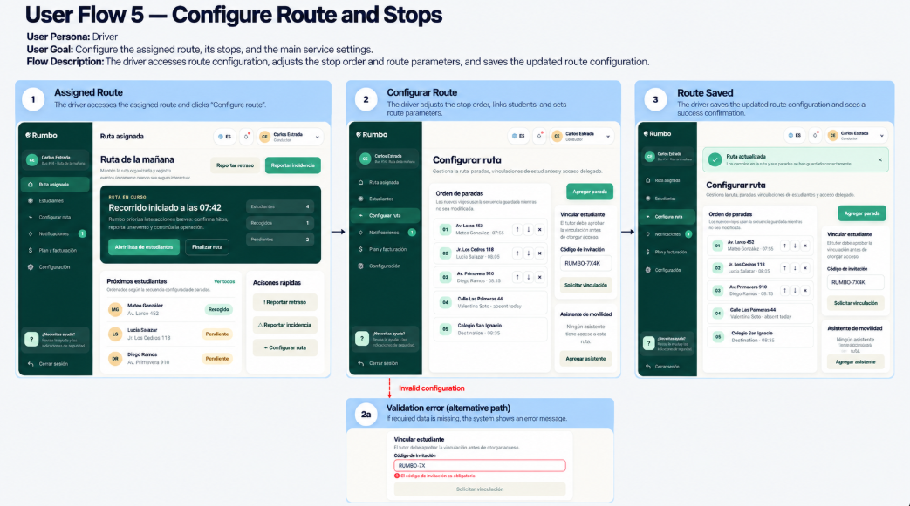

#### User Flow 6 — Monitor Operational Notifications

**User Persona:** Driver  
**User Goal:** Review operational notifications associated with the route.  
**Flow Description:** The Driver opens the notification center, reviews the latest operational updates, opens an alert and marks it as reviewed when appropriate. If there are no recent updates, the system presents an empty state instead of an unnecessary list.

  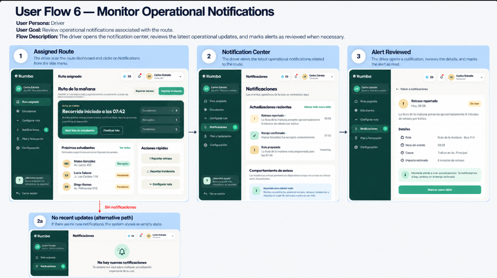

#### User Flow 7 — Manage Account and Billing

**User Persona:** Driver  
**User Goal:** Review profile settings and subscription information.  
**Flow Description:** The Driver accesses the account settings, reviews profile and vehicle information, and then checks the subscription and billing overview. The alternative path illustrates a paused subscription state that can later be reactivated.

  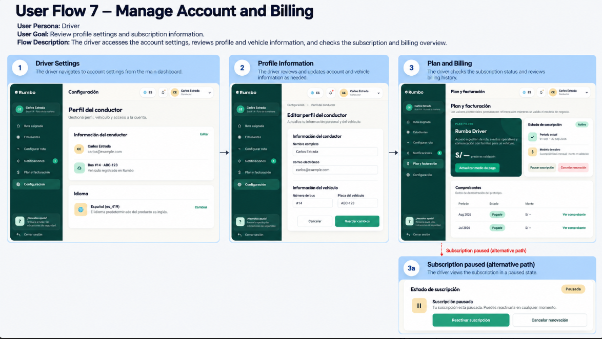

## 4.5. Web Applications Prototyping

El prototipo de la Web Application de **Rumbo** integra los principales mock-ups de los segmentos **Parent** y **Driver** en una navegación coherente con los Wireflows y User Flow Diagrams definidos previamente. La propuesta permite validar la continuidad entre pantallas, la ubicación de las acciones principales y la consistencia del sistema de navegación antes de la implementación final.

  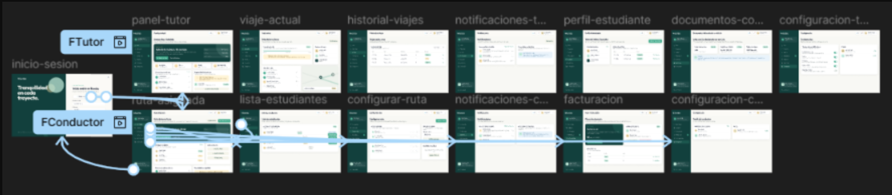

## 4.6. Domain-Driven Software Architecture

### 4.6.1. Design-Level Event Storming

El **Design-Level Event Storming** de Rumbo refina el Big Picture Event Storming desarrollado previamente y organiza el dominio con mayor nivel de detalle. En esta etapa se identifican **Actors, Commands, Aggregates, Domain Events, Business Policies, Read Models y Hotspots**, manteniendo trazabilidad con los User Stories y con el Ubiquitous Language del proyecto.

El artefacto colaborativo de **Design-Level Event Storming** se mantiene en **Miro**, donde el equipo organiza visualmente los elementos del dominio y su relación por Bounded Context. Como respaldo dentro del Project Report se incorporan las exportaciones de los **ocho Bounded Contexts** definidos para Rumbo.

**Miro — Design-Level Event Storming:** https://miro.com/app/board/uXjVEd2_XFE=/?share_link_id=545994946915

| Bounded Context | Responsabilidad principal |
|---|---|
| **Identity & Access Management** | Gestionar cuentas, autenticación, verificación de correo y recuperación de acceso. |
| **Profiles & Relationship Management** | Gestionar perfiles de Parent, Driver y Student, además de las relaciones de autorización sobre cada estudiante. |
| **Vehicle & Credential Management** | Gestionar vehículos, credenciales declaradas y el estado registrado de su verificación. |
| **Route & Trip Planning** | Gestionar rutas, paradas, horarios, asignaciones, ausencias, publicación y programación de viajes. |
| **Trip Execution & Monitoring** | Registrar el inicio y desarrollo del viaje, recojos, entregas, etapas, estado y línea de tiempo. |
| **Incident & Delay Management** | Gestionar retrasos, incidencias, actualizaciones, resolución y confirmación de conocimiento. |
| **Notification Management** | Gestionar generación, distribución, lectura, fallos de entrega y preferencias de notificación. |
| **Subscriptions & Billing** | Gestionar la activación y el estado de la suscripción del Driver y la información del plan asociada. |

#### Evidencia visual del Design-Level Event Storming

La siguiente vista general presenta los ocho Bounded Contexts y sus relaciones dentro de un mismo tablero.

  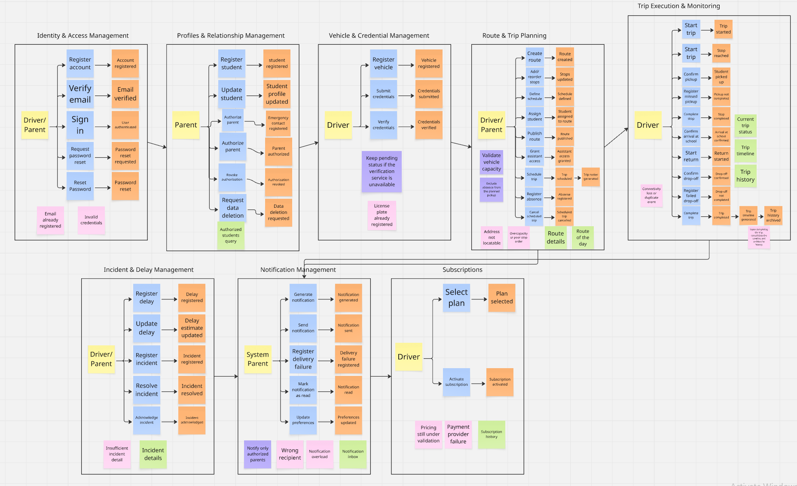

A continuación se presenta la exportación individual de cada Bounded Context, donde se distinguen sus Actors, Commands, Domain Events, Business Policies, Read Models y Hotspots.

**Identity & Access Management**

  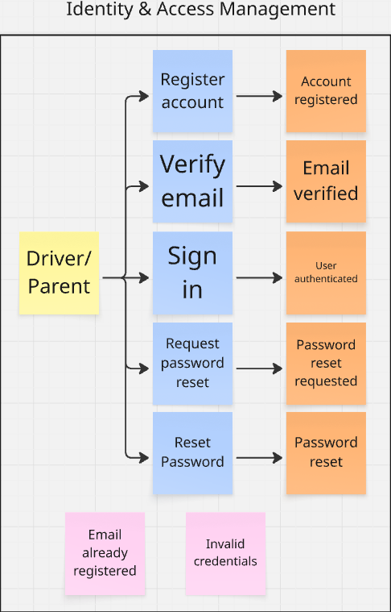

**Profiles & Relationship Management**

  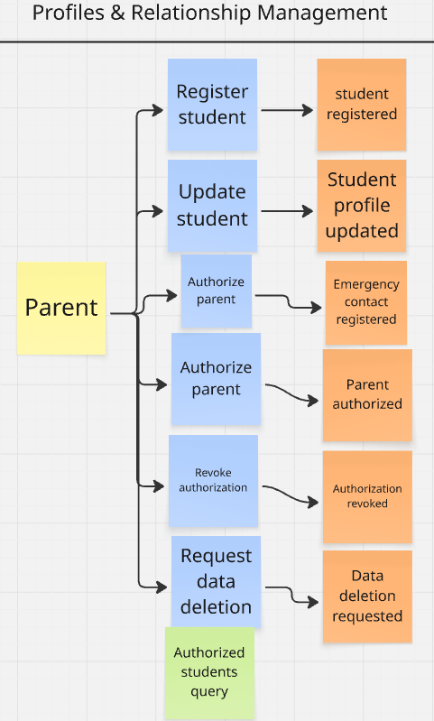

**Vehicle & Credential Management**

  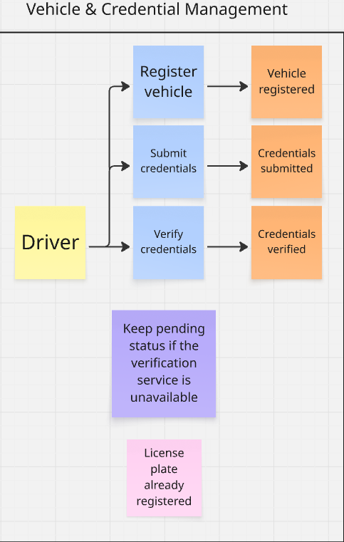

**Route & Trip Planning**

  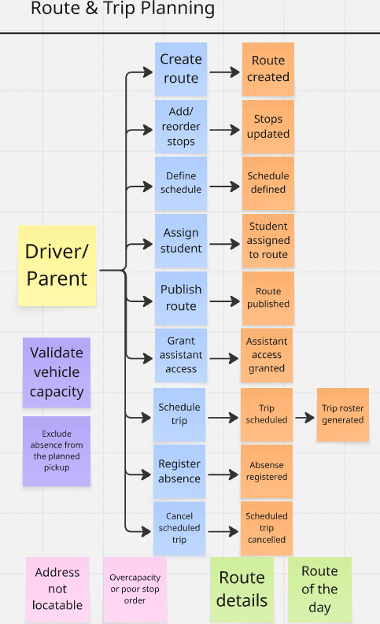

**Trip Execution & Monitoring**

  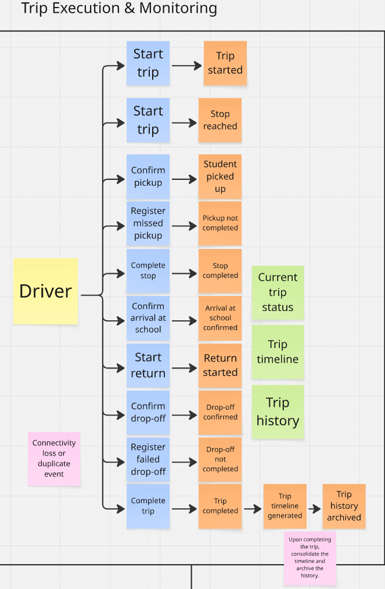

**Incident & Delay Management**

  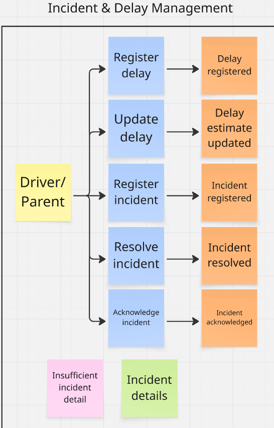

**Notification Management**

  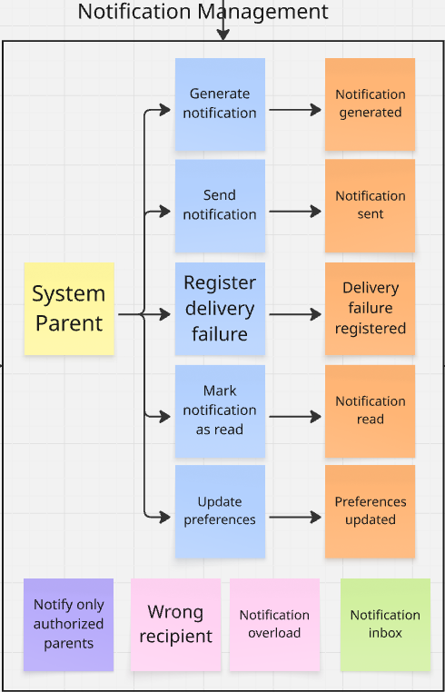

**Subscriptions**

  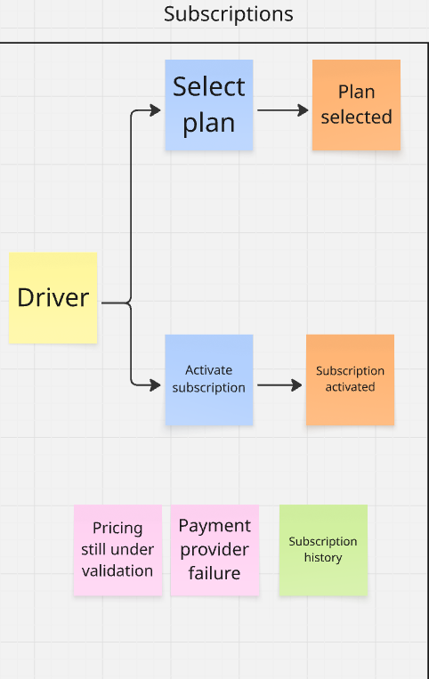

### 4.6.2. Software Architecture Context Diagram

El **Software Architecture Context Diagram** presenta a Rumbo como un único sistema de software y resume sus relaciones principales con las personas y servicios externos que participan en la solución. Esta vista permite comprender el límite general de la plataforma antes de detallar sus unidades de despliegue e implementación.

  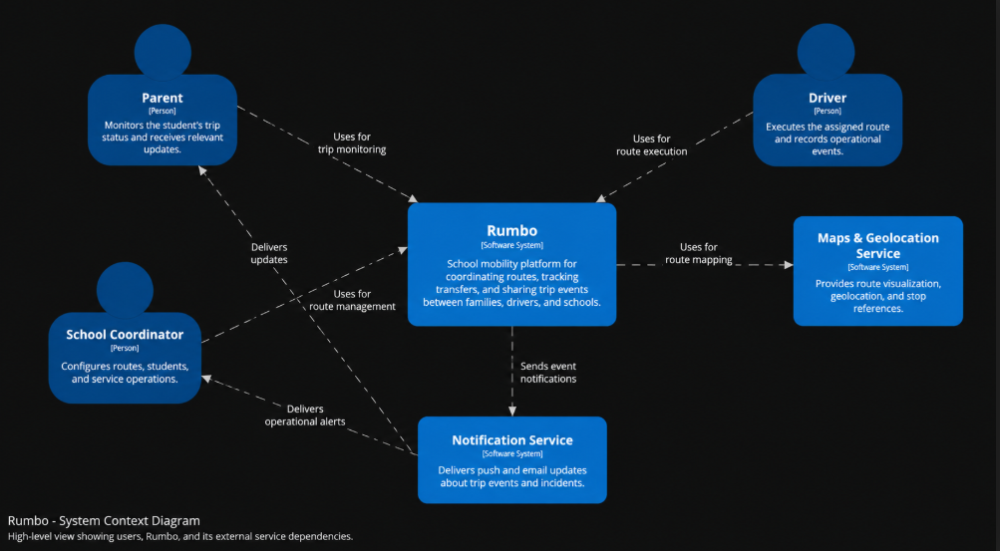

### 4.6.3. Software Architecture Container Diagrams

El **Container Diagram** describe la arquitectura objetivo de Rumbo a nivel de unidades de despliegue. Se distinguen el Landing Page, la Web Application desarrollada con Angular, el RESTful API previsto en Spring Boot y la capa de persistencia, además de las dependencias externas requeridas por la solución. Para Sprint 2, el Frontend Web Application trabaja con Angular y una fuente de datos simulada; la integración completa con el backend corresponde a los siguientes Sprints.

  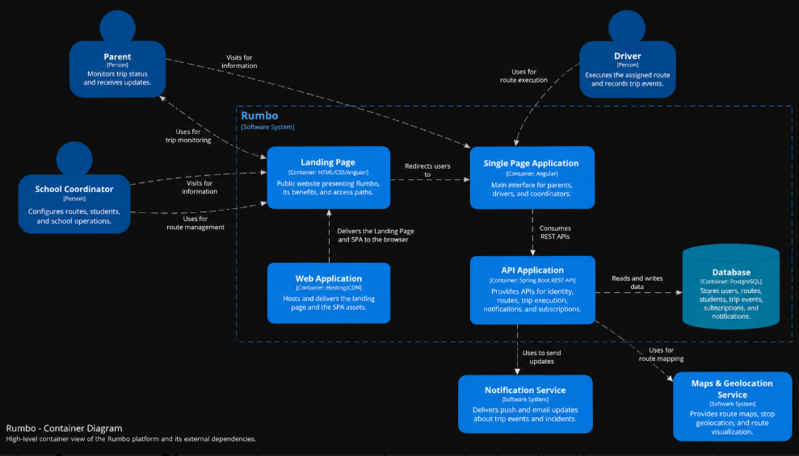

### 4.6.4. Software Architecture Components Diagrams

Los **Component Diagrams** descomponen el contenedor de aplicación en componentes asociados a los Bounded Contexts identificados para Rumbo. Cada diagrama muestra responsabilidades, servicios, controladores, repositorios y dependencias necesarias para mantener separadas las capacidades del dominio.

#### Identity & Access Management

Este diagrama representa los componentes responsables de cuentas, autenticación, autorización y recuperación de acceso. El contexto mantiene separadas las responsabilidades de identidad respecto de perfiles, vehículos y operaciones del servicio.

  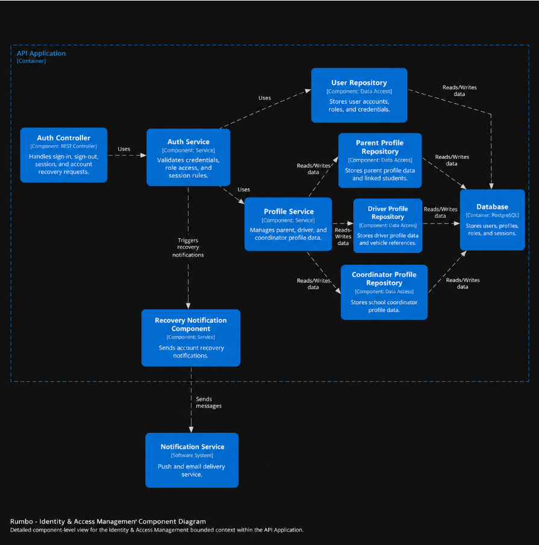

#### Profiles & Relationship Management

Este contexto concentra la gestión de perfiles de Parent, Driver y Student, junto con las relaciones de autorización que determinan quién puede consultar la información de cada estudiante.

  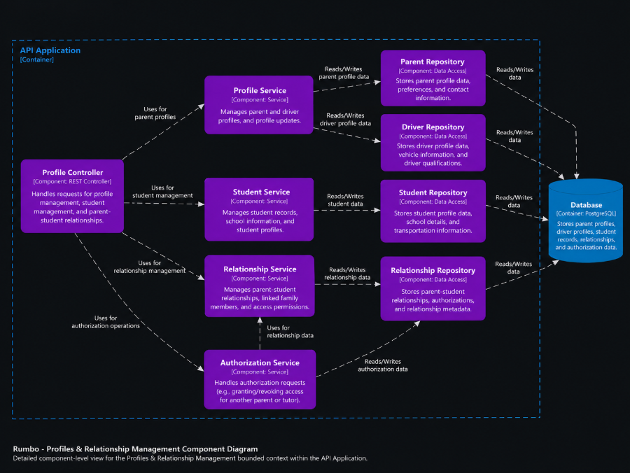

#### Vehicle & Credential Management

El diagrama separa el registro y mantenimiento del vehículo de la gestión de credenciales declaradas por el Driver. Los componentes permiten conservar la información del vehículo y el estado de los documentos asociados sin mezclarla con la planificación de rutas.

  

#### Route & Trip Planning

Este diagrama representa los componentes encargados de rutas, paradas, secuencia de recorrido, asignaciones de estudiantes y planificación de viajes. El contexto prepara la información que posteriormente utiliza la ejecución del traslado.

  

#### Trip Execution & Monitoring

El contexto de ejecución coordina el inicio y desarrollo de un viaje, los eventos operativos y los estados de recojo y entrega. La información registrada alimenta la vista del viaje y su línea de tiempo.

  

#### Incident & Delay Management

Este diagrama concentra el registro y actualización de retrasos e incidencias ocurridos durante el servicio. Sus componentes mantienen el estado de cada evento y permiten comunicar los cambios relevantes al contexto de notificaciones.

  

#### Notification Management

El contexto de notificaciones administra la generación, persistencia, preferencias y distribución de avisos relacionados con eventos relevantes del traslado. Se mantiene separado de Incident & Delay Management para evitar mezclar el evento de negocio con su mecanismo de comunicación.

  

#### Subscriptions & Billing

Este diagrama representa la gestión del plan y de la suscripción del Driver dentro de la arquitectura objetivo. El contexto encapsula la información comercial para que no interfiera con las responsabilidades operativas de rutas y viajes.

  

## 4.7. Software Object-Oriented Design

Esta sección presenta el diseño orientado a objetos de **Rumbo** a partir de los Bounded Contexts refinados en la sección 4.6. El objetivo es describir con mayor detalle las clases principales, sus atributos y operaciones, así como las relaciones y multiplicidades que permiten representar las responsabilidades de cada parte del dominio.

Los diagramas UML se organizan según los **ocho Bounded Contexts** definidos para la arquitectura objetivo. Cuando una clase perteneciente a otro contexto aparece dentro de un diagrama, se utiliza únicamente como **referencia para expresar una asociación** y no implica que el contexto que la consume sea propietario de dicha entidad.

### 4.7.1. Class Diagrams

Los Class Diagrams incluyen clases y enumeraciones relevantes, atributos, métodos, visibilidad, asociaciones y multiplicidades. Esta separación mantiene trazabilidad con el Design-Level Event Storming y con los Component Diagrams de la sección 4.6.4.

#### Identity & Access Management

El diagrama modela las responsabilidades relacionadas con cuentas, sesiones, tokens, recuperación de acceso, roles y permisos. De esta forma, la autenticación y autorización permanecen separadas de los datos operativos de perfiles, rutas y viajes.

  

#### Profiles & Relationship Management

Este contexto representa los perfiles utilizados por Rumbo y las relaciones de autorización vinculadas al estudiante. Su responsabilidad principal es mantener la información de Parent, Driver y Student y determinar qué relaciones permiten consultar la información del estudiante. Las referencias a credenciales o vehículos se interpretan como vínculos hacia sus contextos propietarios.

  

#### Vehicle & Credential Management

El diagrama representa la información del vehículo y los registros asociados a su operación y documentación. Este contexto concentra la responsabilidad de los datos del vehículo y de las credenciales declaradas por el Driver, evitando que Route & Trip Planning administre directamente dicha información.

  

#### Route & Trip Planning

Este contexto modela rutas, paradas, horarios y asignaciones necesarias antes de iniciar un traslado. Las asociaciones con Student y Driver permiten expresar qué participantes intervienen en la planificación, mientras que sus perfiles completos continúan perteneciendo a sus respectivos Bounded Contexts.

  

#### Trip Execution & Monitoring

El diagrama describe el viaje en ejecución y los registros que permiten conocer su evolución: eventos, hitos, recojos, entregas y línea de tiempo. La arquitectura de Rumbo prioriza el seguimiento mediante estados y eventos del recorrido; cualquier dato de ubicación representado se considera complementario y no modifica la separación de responsabilidades definida para el dominio.

  

#### Incident & Delay Management

Este contexto concentra el registro y seguimiento de retrasos e incidencias vinculados a un viaje. Las clases relacionadas con evidencias, notas o elementos afectados permiten conservar el contexto del evento y su evolución hasta su resolución sin mezclar esta responsabilidad con la distribución de notificaciones.

  

#### Notification Management

El diagrama representa la creación y entrega de avisos, las preferencias del usuario y los canales utilizados para distribuirlos. Los eventos de retraso, incidencia, recojo o entrega funcionan como información de entrada, mientras que este contexto se responsabiliza únicamente de convertirlos en comunicaciones hacia los destinatarios correspondientes.

  

#### Subscriptions & Billing

Este contexto representa la relación entre el Driver, el plan y el estado de su suscripción. Los elementos comerciales incluidos en el modelo se consideran parte de la arquitectura objetivo; para el alcance actual, la funcionalidad prioritaria continúa siendo la activación y consulta del estado de la suscripción definida en los requisitos.

  

En conjunto, los ocho Class Diagrams mantienen la separación establecida en el diseño de dominio y sirven como referencia para los Database Diagrams de la siguiente sección. El modelado se utiliza como diseño de la arquitectura objetivo y no implica que todos los componentes de backend se encuentren implementados durante Sprint 2.

## 4.8. Database Design

El diseño de persistencia de **Rumbo** mantiene la misma separación establecida en el modelado DDD y en los Class Diagrams. Cada Database Diagram representa las principales tablas, columnas, claves primarias, claves foráneas y relaciones necesarias para persistir la información administrada por su Bounded Context.

Los diagramas corresponden a la **arquitectura objetivo** del producto. Por ello, algunas tablas representan capacidades previstas para etapas posteriores y no implican que todo el backend se encuentre implementado durante Sprint 2.

### 4.8.1. Database Diagrams

#### Identity & Access Management

El esquema almacena las cuentas de acceso de padres, tutores y conductores, junto con su rol, el estado de verificación y la aceptación de los términos del 
servicio. También guarda los tokens temporales de verificación de correo, recuperación de contraseña y renovación de sesión, conservando únicamente su hash. 
Las restricciones de unicidad sobre el correo y el hash del token impiden registrar dos cuentas con la misma dirección y garantizan que cada enlace temporal 
identifique una sola solicitud.

  

#### Profiles & Relationship Management

El esquema almacena los vehículos registrados por cada conductor, junto con la licencia de conducir y los documentos declarados del vehículo. Cada documento 
conserva su vigencia y su estado de verificación, sin darlo por verificado mientras no exista una consulta a la fuente oficial. La placa es única y se guarda 
normalizada en mayúsculas para impedir que un mismo vehículo se registre dos veces con distinta escritura, y la capacidad debe ser mayor que cero.

  

#### Vehicle & Credential Management

El esquema almacena los vehículos registrados por cada conductor, junto con la licencia de conducir y los documentos declarados del vehículo. Cada documento
conserva su vigencia y su estado de verificación, sin darlo por verificado mientras no exista una consulta a la fuente oficial.

  

#### Route & Trip Planning

El esquema almacena la configuración reutilizable de cada ruta: sus paradas ordenadas con hora prevista, los días y horarios de operación y los estudiantes 
asignados a su parada. La asignación usa una clave foránea compuesta (route_id, route_stop_id) hacia route_stops (route_id, id), que impide asignar a un 
estudiante una parada perteneciente a otra ruta. Un índice único parcial evita que el mismo estudiante tenga dos asignaciones activas en una ruta, y una 
restricción de verificación exige que las paradas de tipo SCHOOL identifiquen a su colegio.

  

#### Trip Execution & Monitoring

El esquema almacena cada viaje desde su programación hasta su cierre, junto con una copia de las paradas y la nómina del día, de modo que los cambios 
posteriores en la ruta no alteren el historial. Registra los hitos del recorrido, el estado de recojo y entrega de cada pasajero y las ausencias reportadas, 
que en conjunto forman la línea de tiempo que consultan los tutores. Las claves foráneas compuestas que incluyen trip_id garantizan que todos los elementos 
pertenezcan al mismo viaje. La unicidad de la ruta por fecha impide crear dos veces el mismo viaje, y el identificador generado en el dispositivo evita 
duplicar un hito cuando se reenvía con poca señal.

  

#### Incident & Delay Management

El esquema almacena las incidencias y los retrasos ocurridos durante un viaje, con su categoría, su estado y su resolución, y registra qué tutores 
confirmaron haber tomado conocimiento de cada incidencia. Los retrasos usan una relación recursiva compuesta (trip_id, replaces_delay_id) hacia delays 
(trip_id, id), que conserva el historial de estimaciones y garantiza que una actualización solo reemplace a un retraso del mismo viaje.

  

#### Notification Management

El esquema almacena los avisos dirigidos a cada destinatario, junto con su origen, su estado de entrega y su lectura, y las preferencias de notificación 
de cada tutor. No contiene claves foráneas internas, porque todas sus referencias apuntan a entidades administradas por otros servicios. La unicidad del 
par (source_event_id, recipient_profile_id) garantiza que un mismo evento no genere avisos duplicados aunque el mensaje llegue más de una vez. 
Las tablas de réplica guardan copias locales de las autorizaciones y los datos de contacto, actualizadas mediante eventos de los servicios que las administran.

  

#### Subscriptions & Billing

El esquema almacena los planes disponibles, la suscripción de cada conductor con su periodo vigente y su renovación, y los cobros realizados por periodo. 
Cada cobro conserva el monto y la moneda aplicados en su momento, aunque el precio del plan cambie después. Un índice único parcial permite una sola suscripción 
activa o pausada por conductor, lo que evita activaciones duplicadas, y la unicidad por suscripción y periodo impide registrar dos cobros para el mismo periodo.

  

En conjunto, los ocho Database Diagrams mantienen correspondencia con los Bounded Contexts definidos en 4.6 y con los Class Diagrams de 4.7, conservando la separación de responsabilidades entre identidad, perfiles, vehículos, planificación, ejecución, incidencias, notificaciones y suscripciones.

---

# Capítulo V: Product Implementation, Validation & Deployment

## 5.1. Software Configuration Management

### 5.1.1. Software Development Environment Configuration

### 5.1.2. Source Code Management

### 5.1.3. Source Code Style Guide & Conventions

### 5.1.4. Software Deployment Configuration

## 5.2. Landing Page, Services & Applications Implementation

### 5.2.X. Sprint n

#### 5.2.X.1. Sprint Planning n

#### 5.2.X.2. Aspect Leaders and Collaborators

#### 5.2.X.3. Sprint Backlog n

#### 5.2.X.4. Development Evidence for Sprint Review

#### 5.2.X.5. Execution Evidence for Sprint Review

#### 5.2.X.6. Services Documentation Evidence for Sprint Review

#### 5.2.X.7. Software Deployment Evidence for Sprint Review

#### 5.2.X.8. Team Collaboration Insights during Sprint

## 5.3. Validation Interviews

### 5.3.1. Diseño de Entrevistas

### 5.3.2. Registro de Entrevistas

### 5.3.3. Evaluaciones según heurísticas

## 5.4. Video About-the-Product

---

# Conclusiones

## Conclusiones y recomendaciones

## Video About-The-Team

---

# Bibliografía

---

# Anexos
