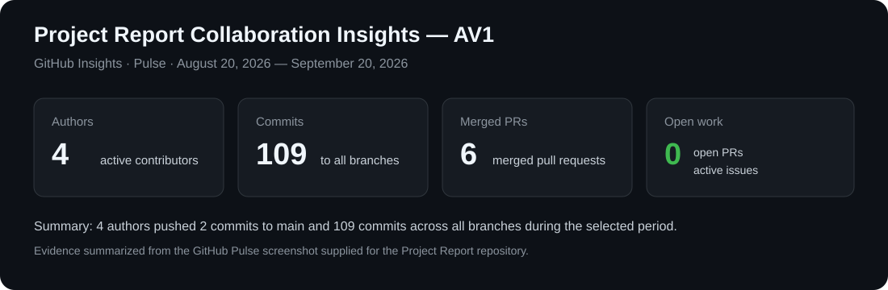
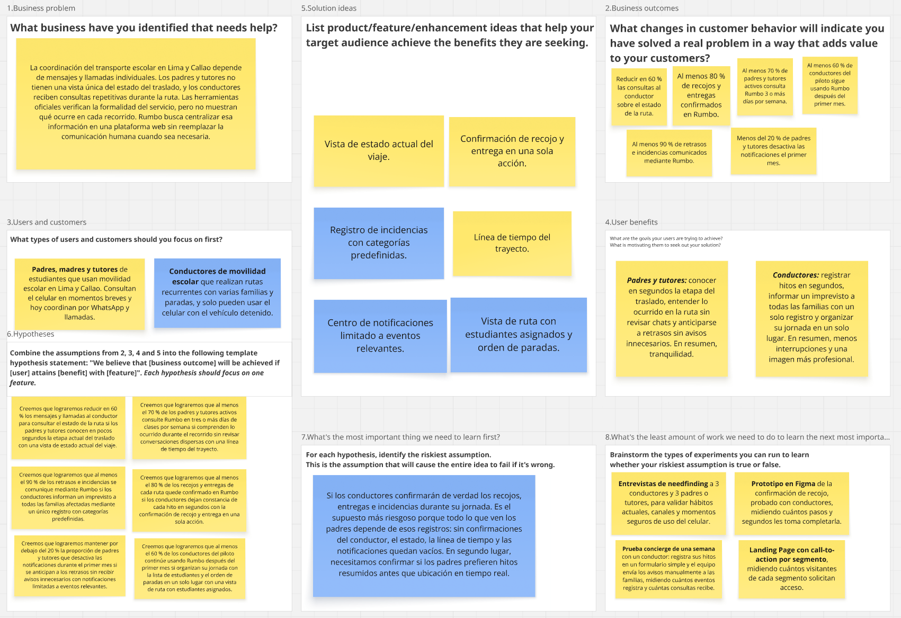

# UNIVERSIDAD PERUANA DE CIENCIAS APLICADAS

### Ingeniería de Software

### Ciclo Académico: 2026-20

### Código: 1ASI0730

### Curso: Aplicaciones Web

### NRC: 8137

### Docente: Hugo Allan Mori Paiva

# Informe de Trabajo Final

### Startup: AIpaca

### Producto: Rumbo

### Integrantes

| Apellidos y Nombres | Código de Alumno |
|---|---|
| Barrientos Quispe, Marcelo | U20221E646 |
| Díaz Ramírez, Alejandro | U202423084 |
| Geronimo Puma, Kevin Joel | U202423163 |
| Lino Quispe, Leonardo Miguel | U202422298 |
| Meza Soza, Alexandra Yamile | U20241b451 |

### SEPTIEMBRE - 2026

---

## Registro de Versiones del Informe

| Versión | Fecha | Autor(es) | Descripción de cambios |
|---|---|---|---|
| 0.1 | 07/09/2026 | Lino Quispe, Leonardo Miguel | Creación de la estructura base del informe de Rumbo. |
| 0.2 | 11/09/2026 | Equipo Rumbo | Actualización de integrantes y refinamiento del Capítulo I para AV1. |
| 0.3 | 20/09/2026 | Equipo Rumbo | Integración de Collaboration Insights, Student Outcome, artefactos de Product Design y avance de Sprint 1. |

---

## Project Report Collaboration Insights

**Organización:** https://github.com/AIpaca-UPC  
**Project Report:** https://github.com/AIpaca-UPC/web-applications-project-report  
**Landing Page:** https://github.com/AIpaca-UPC/landing-page  
**Frontend Web Application:** https://github.com/AIpaca-UPC/web-applications-web-app  
**Web Service:** https://github.com/AIpaca-UPC/web-applications-web-service

### AV1

  

Durante el periodo mostrado por GitHub Insights (20 de agosto al 20 de septiembre de 2026), el Project Report registra **4 autores activos**, **109 commits en todas las ramas** y **6 pull requests fusionados**. La captura también muestra **0 pull requests abiertos** y **0 issues activos** al cierre del periodo.

Como evidencia complementaria de colaboración se utilizan los recursos nativos del repositorio:

- **Commits:** https://github.com/AIpaca-UPC/web-applications-project-report/commits
- **Network:** https://github.com/AIpaca-UPC/web-applications-project-report/network
- **Contributors:** https://github.com/AIpaca-UPC/web-applications-project-report/graphs/contributors
- **Pull Requests:** https://github.com/AIpaca-UPC/web-applications-project-report/pulls

---

# Contenido

## Tabla de Contenidos

- [Student Outcome](#student-outcome)
- [Capítulo I: Introducción](#capítulo-i-introducción)
  - [1.1. Startup Profile](#11-startup-profile)
    - [1.1.1. Descripción de la Startup](#111-descripción-de-la-startup)
    - [1.1.2. Perfiles de integrantes del equipo](#112-perfiles-de-integrantes-del-equipo)
  - [1.2. Solution Profile](#12-solution-profile)
    - [1.2.1. Antecedentes y problemática](#121-antecedentes-y-problemática)
    - [1.2.2. Lean UX Process](#122-lean-ux-process)
      - [1.2.2.1. Lean UX Problem Statement](#1221-lean-ux-problem-statement)
      - [1.2.2.2. Lean UX Assumptions](#1222-lean-ux-assumptions)
      - [1.2.2.3. Lean UX Hypothesis Statements](#1223-lean-ux-hypothesis-statements)
      - [1.2.2.4. Lean UX Canvas](#1224-lean-ux-canvas)
  - [1.3. Segmentos objetivo](#13-segmentos-objetivo)

---

# Student Outcome

El curso contribuye al cumplimiento del **ABET – EAC – Student Outcome 5**: la capacidad de funcionar efectivamente en un equipo cuyos miembros proporcionan liderazgo de manera conjunta, crean un entorno colaborativo e inclusivo, establecen objetivos, planifican tareas y cumplen objetivos.

| Criterio específico | Acciones realizadas | Conclusiones |
|---|---|---|
| Trabaja en equipo para proporcionar liderazgo en forma conjunta. | **Barrientos Quispe, Marcelo — AV1:** liderazgo del Capítulo I.   **Meza Soza, Alexandra Yamile — AV1:** liderazgo del Capítulo II.   **Lino Quispe, Leonardo Miguel — AV1:** liderazgo de los Capítulos III y V e integración de evidencias.   **Geronimo Puma, Kevin Joel — AV1:** desarrollo conjunto del Capítulo IV.   **Díaz Ramírez, Alejandro — AV1:** desarrollo conjunto del Capítulo IV. | El equipo distribuyó el liderazgo por capítulos y coordinó la integración de los entregables para mantener una versión común del Project Report. |
| Crea un entorno colaborativo e inclusivo, establece metas, planifica tareas y cumple objetivos. | **Marcelo, Alexandra, Leonardo, Kevin y Alejandro — AV1:** organizaron el trabajo mediante ramas feature en GitHub, revisión de cambios, Product/Sprint Backlog en Trello y artefactos colaborativos en las herramientas definidas para el proyecto. | La planificación por responsabilidades y el uso de herramientas compartidas permitió organizar el avance, revisar el trabajo de otros integrantes y mantener trazabilidad del Sprint 1. |

---

# Capítulo I: Introducción

## 1.1. Startup Profile

### 1.1.1. Descripción de la Startup

**AIpaca** es una startup tecnológica peruana enfocada en el desarrollo de soluciones digitales que simplifican la coordinación de servicios cotidianos, con especial atención en el transporte escolar. Nuestro propósito es aprovechar la tecnología para brindar tranquilidad a las familias y eficiencia a quienes prestan el servicio, mediante herramientas accesibles, seguras y fáciles de usar que permitan una comunicación clara, oportuna y ordenada entre padres, tutores y conductores de movilidad escolar.

Nuestra solución es **Rumbo**, una plataforma web responsive orientada al uso móvil que centraliza la información del traslado escolar. **Rumbo** permite a los padres y tutores conocer el estado actual de la ruta, revisar una línea de tiempo con los principales hitos del recorrido y recibir notificaciones ante eventos relevantes como recojos, llegadas, retrasos o incidencias. A su vez, permite a los conductores consultar su ruta y los estudiantes asignados, confirmar recojos y entregas mediante interacciones breves y registrar incidencias una sola vez para comunicarlas a todas las familias correspondientes.

La propuesta de **AIpaca** se centra en construir un ecosistema de coordinación del transporte escolar que sea confiable, escalable y respetuoso de la privacidad, donde la información de cada traslado esté disponible únicamente para los usuarios autorizados. Rumbo no busca reemplazar las obligaciones de seguridad, autorización y operación que corresponden a los prestadores del servicio, ni la comunicación humana cuando esta sea necesaria. Su objetivo es complementarlas con información estructurada que reduzca la incertidumbre de las familias y la carga operativa de los conductores en una ciudad con alta congestión y tiempos de viaje variables.

**Misión:** Desarrollar herramientas digitales accesibles y confiables que permitan a padres, tutores y conductores de movilidad escolar coordinar los traslados de los estudiantes de forma clara y oportuna, brindando tranquilidad a las familias y eficiencia a quienes prestan el servicio.

**Visión:** En los próximos 5 años, consolidar a AIpaca como una empresa referente en soluciones digitales para la coordinación del transporte escolar en el Perú y Latinoamérica, reconocida por generar confianza entre familias y prestadores del servicio mediante tecnología accesible, segura y escalable.

Alcance del proyecto: El alcance inicial de Rumbo está orientado a padres o tutores y conductores de movilidad escolar en Lima y Callao. Ofrece una plataforma web responsive que integra la consulta del estado del traslado, la línea de tiempo del trayecto, la confirmación de recojos y entregas, el registro de incidencias y un centro de notificaciones. A mediano plazo, buscamos ampliar la solución hacia centros educativos y empresas de transporte escolar, incorporando la gestión de múltiples rutas y unidades, para consolidar un modelo de coordinación que transforme la manera en que se organiza la movilidad escolar en otras ciudades del país y de la región.

### 1.1.2. Perfiles de integrantes del equipo

<table>
  <thead>
    <tr>
      <th>Foto</th>
      <th>Apellidos y nombres</th>
      <th>Código</th>
      <th>Carrera</th>
      <th>Habilidades</th>
    </tr>
  </thead>
  <tbody>
    <tr>
      <td align="center"></td>
      <td>Barrientos Quispe, Marcelo</td>
      <td>U20221E646</td>
      <td>Ingeniería de Software</td>
      <td>Estudiante de Ingeniería de Software con capacidad de adaptación, aprendizaje rápido y trabajo colaborativo. Cuenta con conocimientos técnicos en tecnologías basadas en JavaScript y aporta al equipo en tareas de desarrollo frontend y organización del trabajo.</td>
    </tr>
    <tr>
      <td align="center"></td>
      <td>Díaz Ramírez, Alejandro</td>
      <td>U202423084</td>
      <td>Ingeniería de Software</td>
      <td>Estudiante de Ingeniería de Software con conocimientos en Python y C++, experiencia en prototipado con React Native y trabajo colaborativo con metodologías ágiles. Aporta principalmente en lógica del sistema, estructuración del código y desarrollo técnico.</td>
    </tr>
    <tr>
      <td align="center"></td>
      <td>Geronimo Puma, Kevin Joel</td>
      <td>U202423163</td>
      <td>Ingeniería de Software</td>
      <td>Estudiante de Ingeniería de Software con conocimientos en Python y C++. Se desempeña especialmente en arquitectura de software, diseño de bases de datos, lógica del sistema y organización técnica del desarrollo.</td>
    </tr>
    <tr>
      <td align="center"></td>
      <td>Lino Quispe, Leonardo Miguel</td>
      <td>U202422298</td>
      <td>Ingeniería de Software</td>
      <td>Soy estudiante de Ingeniería de Software del 5.º ciclo en la UPC. Tengo conocimientos en programación en C++ y Python, y experiencia desarrollando proyectos académicos donde analizo y organizo soluciones tecnológicas. Me gusta enfocarme en aprender de forma práctica y en construir soluciones que sean claras, funcionales y aplicadas a problemas reales.</td>
    </tr>
    <tr>
      <td align="center"></td>
      <td>Meza Soza, Alexandra Yamile</td>
      <td>U20241b451</td>
      <td>Ingeniería de Software</td>
      <td>Estudiante de Ingeniería de Software con conocimientos en Python y C++. Se caracteriza por el aprendizaje rápido, el criterio para seleccionar información relevante y el trabajo colaborativo. En el equipo aporta investigación aplicada, análisis y documentación del producto.</td>
    </tr>
  </tbody>
</table>

## 1.2. Solution Profile

El **Solution Profile** presenta una descripción general de la solución propuesta por **AIpaca** y de su producto **Rumbo**. Aborda el contexto en el que opera el transporte escolar en Lima y Callao, los problemas detectados en la coordinación entre familias y conductores y las suposiciones estratégicas que guían el desarrollo del producto. Esta sección conecta los hallazgos de la fase de descubrimiento con una propuesta de valor clara y sienta las bases para el diseño, la validación y el desarrollo posterior de la solución.

Para el curso de **Aplicaciones Web**, Rumbo se plantea como una experiencia compuesta por un **Landing Page**, una **Web Application responsive** y, en las etapas de implementación correspondientes, una **RESTful API de elaboración interna** integrada con la aplicación web y con al menos un servicio externo de terceros. Esta delimitación tecnológica corresponde al alcance específico del curso y no debe confundirse con la implementación realizada en otros cursos del proyecto.

### 1.2.1. Antecedentes y problemática

El transporte escolar constituye un servicio formal y regulado en Lima y Callao. En enero de 2026, la Autoridad de Transporte Urbano para Lima y Callao (ATU) informó que **3758 vehículos se encontraban habilitados para prestar el servicio de transporte de estudiantes** y recordó que los padres pueden verificar digitalmente si el vehículo y el conductor están autorizados (Infobae, 2026a). Esta cifra confirma que existe un ecosistema amplio de familias, conductores y operadores que realizan traslados escolares de manera recurrente.

En esta sección se analiza el contexto en el que surge la problemática principal, considerando sus factores sociales, tecnológicos y operativos. Se utiliza la técnica de las 5 W y 2 H para responder de forma estructurada qué ocurre, quiénes están involucrados, cuándo y dónde sucede, por qué ocurre, cómo se abordará y cuánto costará implementar la solución.

#### Técnica de las 5 W's + 2 H's

**What (¿Qué?) — ¿Cuál es el problema?**  

El transporte escolar en Lima y Callao es un servicio formal y regulado. Sin embargo, la coordinación diaria entre padres y conductores sigue dependiendo de mensajes y llamadas individuales. Según la Autoridad de Transporte Urbano para Lima y Callao (ATU), 3758 vehículos cuentan con habilitación para prestar este servicio durante 2026, tras un proceso de verificación y autorización realizado en 2025 (Infobae, 2026a). Además, la ATU habilitó un enlace público para que los padres verifiquen si el vehículo y el conductor contratados están autorizados (Exitosa Noticias, 2026).

Estos mecanismos resuelven la pregunta de si el servicio es formal antes de contratarlo, pero no la de qué está pasando durante la ruta. Los padres no cuentan con una vista única donde consultar si el menor ya fue recogido, si la movilidad está retrasada, si llegó al colegio o si ocurrió un imprevisto. Esa información se transmite de forma dispersa, y buena parte de ella recae sobre el conductor, que debe responder las mismas consultas a varias familias mientras cumple su ruta.

**When (¿Cuándo?) — ¿Cuándo ocurre?**  

El problema ocurre todos los días de clases, en tres momentos: antes del recojo, durante el traslado y al momento de la llegada o entrega. El Ministerio de Educación fijó el inicio del año escolar 2026 para el lunes 16 de marzo y su término para el viernes 18 de diciembre, con 36 semanas de clases (Infobae, 2026a). Durante todo ese periodo, cada familia depende de uno o dos trayectos diarios.

La incertidumbre se intensifica porque los horarios escolares coinciden con las horas de mayor congestión. En Lima el tráfico se concentra entre las 6 a. m. y las 9 a. m., y nuevamente en las horas punta de la tarde (El Comercio, 2026). En esas franjas un retraso de pocos minutos puede convertirse en una espera prolongada, y es cuando los padres más necesitan información oportuna.

**Where (¿Dónde?) — ¿Dónde surge?**  

El problema se presenta principalmente en Lima Metropolitana y el Callao, en las rutas que conectan hogares, puntos de recojo y centros educativos. Se trata de una de las ciudades con mayor congestión del mundo: el TomTom Traffic Index 2025 ubicó a Lima como la novena ciudad más congestionada del mundo, con un nivel de tráfico de 69,3 %, y con 195 horas anuales perdidas por conductor en embotellamientos (El Popular, 2026).

La situación se mantiene en 2026. Con datos de TomTom consolidados hasta el 3 de agosto de 2026, en la hora punta matinal de los días laborables la velocidad promedio en Lima fue de 14,74 km/h, la más baja frente a Ciudad de México, Bogotá y Santiago de Chile (Energiminas, 2026). En este entorno, los tiempos de llegada son difíciles de anticipar para las familias.

**Who (¿Quiénes?) — ¿Quiénes son los afectados?**  

- **Padres y tutores**, que necesitan saber en qué etapa se encuentra el traslado de sus hijos y hoy dependen de preguntarle directamente al conductor.

- **Conductores de movilidad escolar**, que deben cumplir su ruta en medio del tráfico y, al mismo tiempo, comunicar recojos, retrasos o incidencias a varias familias de forma individual. Su trabajo está sujeto a exigencias formales: la ATU verifica que los vehículos cuenten con SOAT y CITV vigentes y que los conductores tengan licencia de categoría AIIB (Infobae, 2026a).

**Why (¿Por qué?) — ¿Por qué ocurre y por qué importa?**  

- **Comunicación fragmentada en canales generales:** La coordinación se realiza principalmente por mensajería instantánea. Según la Encuesta Residencial de Servicios de Telecomunicaciones (ERESTEL) 2025 de Osiptel, el 68,6 % de los peruanos usó plataformas de comunicación instantánea durante el último año, y entre ellos WhatsApp alcanza el 98,6 % de usuarios (Expreso, 2026). Estos canales son útiles, pero no fueron diseñados para registrar hitos de una ruta: la información queda mezclada con otros mensajes y cada familia recibe actualizaciones distintas.

- **Alta variabilidad de los tiempos de viaje:** La congestión de Lima hace que la hora estimada de llegada cambie constantemente, lo que multiplica las consultas de los padres.

- **Carga operativa del conductor:** El conductor es la única fuente de información en tiempo real, pero su prioridad debe ser conducir con seguridad. Responder mensajes durante la ruta compite con esa prioridad.

- **Ausencia de un registro estructurado:** Los recojos, entregas e incidencias no suelen quedar documentados de forma ordenada, lo que dificulta resolver dudas posteriores sobre lo ocurrido en un trayecto.

- **Verificación sin visibilidad en ruta:** Las herramientas oficiales permiten comprobar la formalidad del servicio, pero no ofrecen seguimiento del estado de cada traslado.

**How (¿Cómo?) — ¿Cómo se abordará?**  

Para responder a esta necesidad, AIpaca propone Rumbo, una plataforma web responsive orientada al uso móvil que centraliza el estado de cada traslado. La elección del canal responde al contexto local: según el INEI, en el cuarto trimestre de 2025 el 98,4 % de los hogares de Lima Metropolitana contó con telefonía móvil, y en ese mismo periodo el uso de Internet en Lima Metropolitana alcanzó el 90,3 % de la población de 6 años a más (Instituto Nacional de Estadística e Informática [INEI], 2026). Además, el 89,2 % de los usuarios de Internet accedió a la red mediante un teléfono celular (Altavoz, 2026).

Para los padres y tutores: Podrán ver de un vistazo el estado actual del viaje, revisar una línea de tiempo con los hitos del recorrido y recibir notificaciones solo ante eventos relevantes, como recojo, llegada, retraso o incidencia.

Para los conductores: Podrán consultar su ruta y los estudiantes asignados, confirmar recojos y entregas mediante interacciones breves y registrar una incidencia una sola vez para que llegue a todas las familias correspondientes.

La información de cada menor será visible únicamente para los usuarios autorizados. Esto es coherente con el marco peruano de protección de datos: el Decreto Supremo N.º 016-2024-JUS, publicado el 30 de noviembre de 2024, aprobó el nuevo reglamento de la Ley N.º 29733, Ley de Protección de Datos Personales (Escobedo, 2024), y entró en vigor el 31 de marzo de 2025, reforzando las medidas de seguridad y exigiendo notificar los incidentes de seguridad a la Autoridad Nacional de Protección de Datos Personales (LP Derecho, s. f.).

Rumbo no reemplaza las obligaciones de seguridad, autorización y operación de los prestadores del servicio, ni la comunicación humana cuando sea necesaria. Su objetivo es complementarlas con información estructurada que reduzca la incertidumbre de las familias y la carga del conductor.

**How much (¿Cuánto?)**  

La implementación de Rumbo requiere una inversión inicial orientada al desarrollo de software, la infraestructura en la nube, la adecuación a la normativa de datos personales y un piloto con familias y conductores. Al ser una solución exclusivamente de software, no requiere fabricar hardware, lo que reduce la inversión inicial y facilita escalar el modelo SaaS.

Como referencia del mercado, el precio mensual por estudiante de una movilidad escolar varía aproximadamente entre S/ 150 y S/ 300, según la distancia y los servicios adicionales (Comparabien, 2025). Esto sugiere que una suscripción de bajo costo podría presentarse como un valor agregado del servicio.

Presupuesto estimado (estimación referencial elaborada por el equipo):

Desarrollo de software
Diseño UX/UI y prototipado: S/ 2,000 – S/ 3,000
Frontend web responsive (Vue + PrimeVue): S/ 4,000 – S/ 6,000
Backend, RESTful API y base de datos (ASP.NET Core + C#): S/ 4,500 – S/ 6,500
Integración de servicios de ubicación y notificaciones: S/ 1,500 – S/ 2,500

Infraestructura (anual)
Dominio, hosting en la nube y base de datos gestionada: S/ 1,500 – S/ 2,500
Servicio de notificaciones (push, correo o SMS): S/ 800 – S/ 1,500

Seguridad y cumplimiento
Adecuación a la Ley N.º 29733 (políticas de privacidad, consentimiento y asesoría legal): S/ 1,500 – S/ 2,500
Pruebas de seguridad: S/ 1,000 – S/ 1,500

Marketing y lanzamiento
Landing page, estrategia digital y materiales: S/ 2,000 – S/ 3,000
Piloto con conductores y familias (capacitación e incentivos): S/ 1,500 – S/ 2,500

Mantenimiento y soporte (anual)
Actualizaciones de software y soporte técnico: S/ 3,000 – S/ 5,000

Total estimado: S/ 23,300 – S/ 36,500

### 1.2.2. Lean UX Process

El proceso Lean UX que adoptamos en AIpaca busca maximizar la eficiencia en el desarrollo de Rumbo mediante la validación continua, el pensamiento crítico y la acción rápida. Siguiendo esta filosofía, estructuramos nuestro enfoque en cuatro componentes: la definición del problema, la formulación de suposiciones, la creación de hipótesis y el desarrollo de un lienzo estratégico. Este proceso nos permite aprender de padres, tutores y conductores antes de invertir esfuerzo en funcionalidades que no aporten valor real.

#### 1.2.2.1. Lean UX Problem Statement

El estado actual de la coordinación del transporte escolar en Lima y Callao se ha centrado principalmente en verificar la formalidad del servicio y en la comunicación directa entre padres o tutores y conductores mediante mensajería instantánea y llamadas. Esto genera incertidumbre sobre recojos, llegadas y retrasos, y consultas repetitivas que interrumpen al conductor durante la ruta.

Lo que los productos y servicios existentes no resuelven es una vista única y estructurada, restringida por permisos, donde se registren los hitos de cada traslado (recojos, entregas, retrasos e incidencias) y se notifique solo a los tutores autorizados.

Rumbo abordará esta brecha mediante una plataforma web responsive en la que los conductores confirman hitos con interacciones breves, y los padres consultan el estado actual y la línea de tiempo del viaje y reciben notificaciones relevantes.

Nuestro enfoque inicial serán los conductores de movilidad escolar autorizados por la ATU en Lima y Callao y los padres o tutores que contratan sus servicios.

Sabremos que tenemos éxito cuando los padres consulten Rumbo en lugar de escribir al conductor, reduciendo en 60 % las consultas sobre el estado de la ruta, y cuando los conductores confirmen al menos el 80 % de los recojos y entregas dentro de la plataforma.

- **Domain:** Transporte escolar, movilidad urbana y coordinación digital entre familias y prestadores de servicio.

- **Customer Segments:**

Padres, madres y tutores de estudiantes que usan movilidad escolar.

Conductores de movilidad escolar que realizan rutas recurrentes.

- **Pain Points:** 

**Padres y Tutores**

- Incertidumbre sobre si el menor ya fue recogido, si la movilidad está en camino o si llegó al destino.

- Falta de avisos oportunos ante retrasos o imprevistos.

- Información dispersa entre chats, llamadas y mensajes de otros temas.

**Conductores**

- Consultas repetitivas de varias familias sobre lo mismo durante la ruta.

- Necesidad de comunicar un retraso o incidencia a cada familia por separado.

- Ausencia de un registro ordenado de recojos, entregas e incidencias para resolver dudas posteriores.

- **Gap:** Creemos que no existe una solución de uso extendido en Lima y Callao que combine, en una sola plataforma, el estado del traslado, la confirmación de recojos y entregas, el registro de incidencias y notificaciones dirigidas solo a los tutores autorizados. Este supuesto será contrastado en el análisis competitivo. 

- **Vision/Strategy:** Consolidar a AIpaca como una empresa referente en soluciones digitales para la coordinación del transporte escolar en el Perú y Latinoamérica, reconocida por generar confianza entre familias y conductores mediante tecnología accesible, segura y escalable.

- **Initial Segment:** Conductores de movilidad escolar autorizados por la ATU en Lima y Callao, y los padres o tutores que contratan sus servicios y usan un teléfono celular con acceso a Internet.

#### 1.2.2.2. Lean UX Assumptions

Los siguientes supuestos representan las creencias iniciales del equipo sobre el modelo de negocio, los usuarios y la viabilidad de Rumbo. Serán validados mediante entrevistas, prototipos y pruebas durante las iteraciones del proceso Lean UX.

##### Business Assumptions

Estas Business Assumptions servirán como base para formular los Feature Assumptions y los Hypothesis Statements, y permitirán validar los elementos críticos del modelo.

1. Creemos que los padres y tutores necesitan conocer el estado del traslado escolar de sus hijos para reducir su incertidumbre durante la ruta.

2. Creemos que una plataforma web responsive con estados, hitos, notificaciones e incidencias puede satisfacer esta necesidad mejor que la mensajería de uso general.

3. Creemos que nuestros clientes iniciales serán conductores independientes de 
movilidad escolar en Lima y Callao, junto con las familias que contratan sus servicios.

4. Creemos que el valor más importante para los padres es la tranquilidad de saber qué ocurre en la ruta sin tener que preguntar y, para los conductores, la reducción de mensajes repetitivos.

5. Creemos que un modelo SaaS con acceso gratuito para padres y tutores y suscripción mensual para conductores nos permitirá crecer, porque el conductor puede presentar Rumbo como un valor agregado de su servicio.

6. Creemos que nuestra ventaja competitiva será una experiencia enfocada en hitos resumidos, y no en un seguimiento continuo de coordenadas, lo que la hace más clara y menos invasiva.

7. Creemos que los conductores adoptarán la plataforma solo si registrar un evento toma pocos segundos y no interfiere con la conducción.

8. Creemos que los mayores riesgos son la desconfianza sobre el manejo de datos de menores y la resistencia de los conductores a cambiar sus hábitos, y que podremos mitigarlos con permisos estrictos por rol, cumplimiento de la Ley N.º 29733 y pilotos gratuitos con conductores reales.

9. Creemos que el costo de la suscripción será bajo en relación con lo que las familias pagan mensualmente por el servicio de movilidad escolar.

##### Business Outcome Assumptions

1. Reducir en 60 % los mensajes y llamadas de padres y tutores al conductor para consultar el estado de la ruta.

2. Lograr que al menos el 70 % de los padres y tutores activos consulte Rumbo en tres o más días de clases por semana.

3. Lograr que al menos el 80 % de los recojos y entregas de cada ruta quede confirmado dentro de Rumbo.

4. Lograr que al menos el 90 % de los retrasos e incidencias se comunique a las familias mediante Rumbo y no mediante mensajes individuales.

5. Mantener por debajo del 20 % la proporción de padres y tutores que desactiva las notificaciones durante el primer mes de uso.

6. Lograr que al menos el 60 % de los conductores que participen en el piloto continúe usando Rumbo después del primer mes.

##### User Assumptions

En esta etapa se identificaron los principales supuestos sobre los usuarios, sus necesidades y el contexto de uso, antes de realizar las entrevistas de validación.

**¿Quién es el usuario?**

- **Padres, madres y tutores:** 

1. Creemos que los padres y tutores trabajan o realizan otras actividades durante el horario de traslado y consultan el celular solo en momentos breves.

2. Creemos que hoy coordinan con el conductor principalmente mediante WhatsApp y llamadas telefónicas.

3. Creemos que sus momentos de mayor incertidumbre son antes del recojo, durante los retrasos por tráfico y al esperar la confirmación de llegada.

4. Creemos que prefieren recibir información resumida en estados e hitos antes que seguir una ubicación en tiempo real.

5. Creemos que solo confiarán en una plataforma si la información de su hijo es visible únicamente para los tutores autorizados.

- **Conductores de movilidad escolar:** 

6. Creemos que los conductores realizan rutas recurrentes en las que atienden a varias familias y paradas por jornada.

7. Creemos que reciben consultas repetidas de distintas familias sobre un mismo evento de la ruta.

8. Creemos que organizan su lista de estudiantes y paradas de manera informal, de memoria, en papel o en chats.

9. Creemos que solo pueden interactuar con el celular de forma segura cuando el vehículo está detenido.

10. Creemos que valoran ofrecer una imagen más profesional y ordenada ante las familias.

##### Feature Assumptions

En esta sección se detallan los supuestos sobre las funcionalidades del producto. Cada Feature Assumption conecta una necesidad del usuario con una posible solución de diseño y anticipa su impacto en la experiencia.

1. Creemos que una vista de estado actual del viaje permitirá a los padres y tutores entender en pocos segundos en qué etapa está el traslado.

2. Creemos que una línea de tiempo del trayecto dará más claridad sobre lo ocurrido durante el recorrido que una secuencia de mensajes de chat.

3. Creemos que la confirmación de recojo y entrega con una sola acción permitirá a los conductores registrar los hitos sin afectar su flujo de trabajo.

4. Creemos que un registro de incidencias con categorías predefinidas permitirá comunicar imprevistos con suficiente contexto y en poco tiempo.

5. Creemos que las notificaciones limitadas a eventos relevantes mantendrán informados a los padres sin saturarlos.

6. Creemos que una vista de ruta con los estudiantes asignados y el orden de paradas facilitará la organización diaria del conductor.

##### User Outcome and Benefit Assumptions

1. Los padres y tutores conocerán en pocos segundos la etapa actual del traslado sin contactar al conductor.

2. Los padres y tutores comprenderán lo ocurrido durante el recorrido sin revisar conversaciones dispersas.

3. Los conductores dejarán constancia de cada recojo y entrega en segundos, con el vehículo detenido.

4. Los conductores informarán un imprevisto a todas las familias afectadas mediante un único registro.

5. Los padres y tutores podrán anticiparse a retrasos sin recibir avisos innecesarios.

6. Los conductores organizarán su jornada con la lista de estudiantes y el orden de paradas en un solo lugar.

#### 1.2.2.3. Lean UX Hypothesis Statements

Se formula un Hypothesis Statement por cada Feature Assumption, siguiendo la estructura: *Creemos que lograremos [resultado de negocio] si [persona] obtiene [beneficio] con [funcionalidad].*

**Hipótesis 1 — Estado actual del viaje**  

Creemos que lograremos reducir en 60 % los mensajes y llamadas al conductor para consultar el estado de la ruta si los padres y tutores conocen en pocos segundos la etapa actual del traslado con una vista de estado actual del viaje.

**Hipótesis 2 — Línea de tiempo del trayecto**  

Creemos que lograremos que al menos el 70 % de los padres y tutores activos consulte Rumbo en tres o más días de clases por semana si comprenden lo ocurrido durante el recorrido sin revisar conversaciones dispersas con una línea de tiempo del trayecto.

**Hipótesis 3 — Confirmación de recojo y entrega**  

Creemos que lograremos que al menos el 80 % de los recojos y entregas de cada ruta quede confirmado en Rumbo si los conductores dejan constancia de cada hito en segundos con la confirmación de recojo y entrega en una sola acción.

**Hipótesis 4 — Registro de incidencias**  

Creemos que lograremos que al menos el 90 % de los retrasos e incidencias se comunique mediante Rumbo si los conductores informan un imprevisto a todas las familias afectadas mediante un único registro con categorías predefinidas.

**Hipótesis 5 — Centro de notificaciones**  

Creemos que lograremos mantener por debajo del 20 % la proporción de padres y tutores que desactiva las notificaciones durante el primer mes si se anticipan a los retrasos sin recibir avisos innecesarios con notificaciones limitadas a eventos relevantes.

**Hipótesis 6 — Vista de ruta del conductor**  

Creemos que lograremos que al menos el 60 % de los conductores del piloto continúe usando Rumbo después del primer mes si organizan su jornada con la lista de estudiantes y el orden de paradas en un solo lugar con una vista de ruta con estudiantes asignados.

#### 1.2.2.4. Lean UX Canvas

El **Lean UX Canvas** resume en un solo artefacto los elementos trabajados en el Lean UX Process: el problema de negocio, los resultados esperados, los segmentos objetivo, sus beneficios, las soluciones propuestas y las hipótesis que las conectan. Además, identifica el supuesto más riesgoso para Rumbo y los experimentos de menor esfuerzo que permitirán validarlo.

## 1.3. Segmentos objetivo

En esta sección se identifican y describen los **segmentos de usuarios** hacia los cuales se dirige Rumbo. Estos segmentos servirán como referencia para el diseño de funcionalidades, la experiencia de usuario, las entrevistas de Needfinding y la comunicación del producto.

### Padres y tutores

**Descripción:**  
Padres, madres o tutores responsables de menores que utilizan servicios de movilidad escolar en Lima y Callao. Este segmento busca disminuir la incertidumbre durante los recorridos y acceder a información clara sobre recojo, traslado, retrasos, llegada e incidencias.

**Características demográficas y comportamiento:**
- Adultos responsables de menores en edad escolar que contratan o utilizan servicios de movilidad escolar.
- Utilizan principalmente el teléfono móvil para comunicarse y consultar información cotidiana.
- Valoran la inmediatez, claridad y facilidad de uso por encima de interfaces complejas.
- Requieren información relevante, pero no necesariamente una secuencia continua de mensajes.
- La confianza en la plataforma depende de la privacidad y del control sobre quién puede consultar información del menor.

**Sustento estadístico:**
- La ATU reportó **3758 vehículos habilitados para transporte escolar en Lima y Callao** en enero de 2026, evidenciando un mercado formal y recurrente de familias usuarias del servicio (Infobae, 2026a).
- El INEI informó que **98,4 % de los hogares de Lima Metropolitana contaba con telefonía móvil** y que **90,3 % de la población de 6 años a más utilizaba Internet** durante el cuarto trimestre de 2025. Además, una fuente secundaria citada por el equipo reporta que **89,2 % de los usuarios de Internet accedía mediante teléfono celular** (Altavoz, 2026). Esto respalda una experiencia web orientada principalmente al uso móvil.

### Conductores de movilidad escolar

**Descripción:**  
Conductores que realizan rutas programadas para el traslado de estudiantes entre hogares, puntos de recojo y centros educativos. Este segmento necesita organizar el recorrido y comunicar a las familias los principales eventos de la ruta de forma rápida y consistente.

**Características demográficas y comportamiento:**
- Prestadores de un servicio regulado que operan vehículos autorizados para transporte de estudiantes.
- Trabajan con rutas, horarios, puntos de recojo y varios estudiantes durante una misma jornada.
- Necesitan reducir acciones digitales mientras conducen, por lo que las interacciones deben ser breves y ejecutarse únicamente cuando sea seguro hacerlo.
- Requieren comunicar retrasos, incidencias, recojos y entregas sin repetir la misma información individualmente.
- Valoran herramientas que simplifiquen la coordinación sin reemplazar sus responsabilidades operativas y de seguridad.

**Sustento estadístico:**
- La ATU reportó **3758 vehículos escolares habilitados en Lima y Callao** (Infobae, 2026a), lo que permite identificar un grupo concreto de operadores y conductores dentro del mercado formal.
- Lima registró **69,3 % de congestión promedio durante 2025**, con recorridos de 10 km de hasta **51 min 17 s en la hora punta de la tarde** y aproximadamente **195 horas anuales perdidas en tráfico de hora punta** (El Popular, 2026). Este contexto sustenta la necesidad de gestionar retrasos y comunicar variaciones de tiempo de manera ordenada.

---
